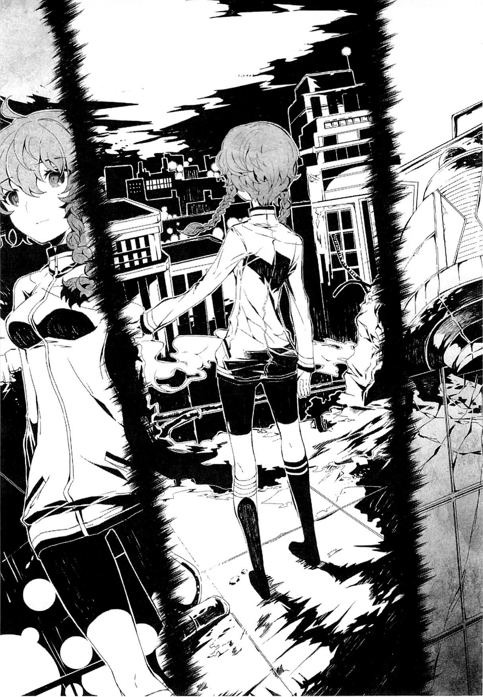
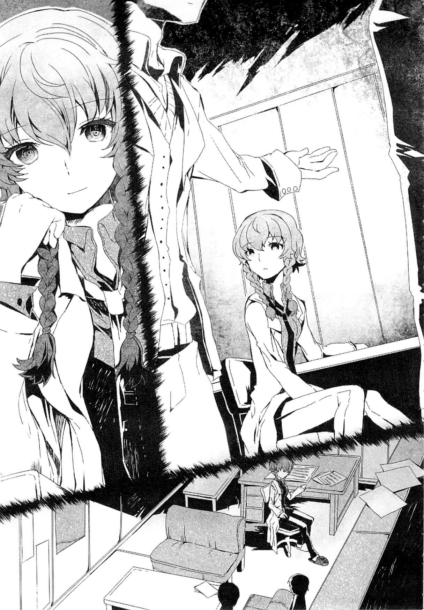
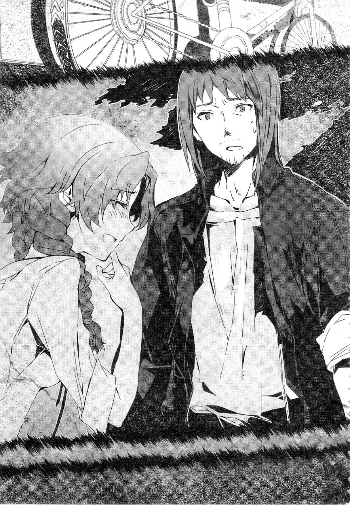
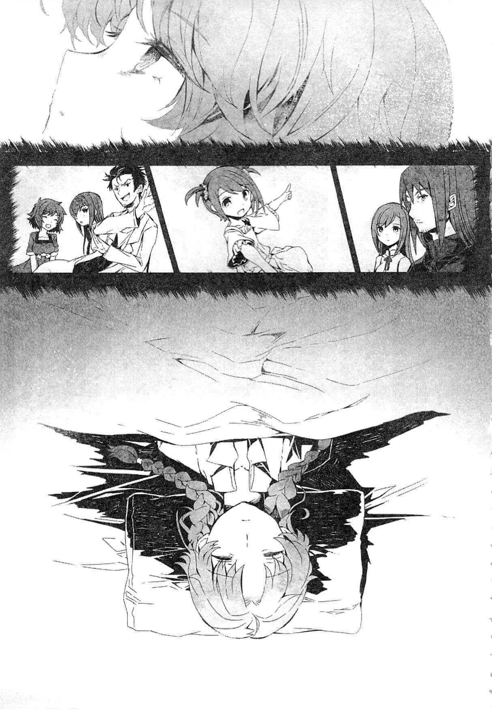

## 玲羽篇——渊源时流的悲怆

### 1

「……那么，」
我明明不需要这样做，却故意低声自语。
这是执念。执念在我心中挥之不去。
不由得，我的视线从黑暗的室内转向透过墙上大洞所见的明亮的秋叶原街道。
在这个漆黑的租赁会议室里，有一面墙上有个大洞。直径大约有四米左右。但这不是一个规则的洞，就像被卡车撞开了一样，边缘歪歪扭扭的。
周围布满了裂痕，让人感觉这栋旧楼随时可能倒塌。脚下也散落着许多瓦砾。
至于为什么会有这样一个洞……嗯，洞的直接原因很简单，但更深层的原因我还不太明白。
「为什么会变成这样呢？」
我看着那个“原因”，轻轻地歪着头。
洞的前方，或者说洞所在的位置，有一个从这个时间轴来看显得十分奇怪的物体。
嗯，不对，哪怕是在 2036 年，这物体也同样显得奇怪。
整体造型圆圆的，是一台银色的机器。在这个时间轴——2010 年的电视新闻里，人们频频报道它是人造卫星。确实，从图鉴上看，这东西确实有点像我见过的人造卫星的形状。
——不过，我从未见过真正的人造卫星，实话说我也不是很了解。
这台银色的人造卫星——圆形物体，其实是台时光机。
没错，这正是我——阿万音铃羽从 2036 年来到 2010 年所乘坐的，能够跨越时间的机器。
这也是在眼前的墙上打出洞的“原因”。
「为什么会出现这样的洞呢？」
我看着时光机旁边的洞，思考似的将手指放在嘴唇上。
是的，这仅仅是装作在思考。
无论怎么想，以我所掌握的知识和技术，也得不出答案。我知道的。
其实，这个时光机周围的洞，是因为我在这个时间轴出现时，时光机没有在预定的坐标出现造成的。
本来，时光机应该出现在这座大厦的屋顶。但不知为何，时光机没有出现在大厦的屋顶，而是出现在这栋大厦的最顶层的会议室——我想应该是会议室的边缘，靠墙的位置。
时光机到达的坐标偏移了，导致在大厦外墙上出现了一个洞。
那次的碎片没有造成伤亡，算是不幸中的万幸了。
「可能是可变重力锁系统的故障吧……？」
不行，这样下去可不好。
某种程度上，我不想离开这个时代。因此，即便在决定之后，我还是想拖延在这个时代停留的时间……明明已经决定了，却无法坚持到底。
「果然，我做不到像父亲和母亲那样。……啊，真是丢脸。」
从嘴里泄露出来的是对自己无能的反省和自责。然而，无论是声音还是心情，并没有那么低落。
毕竟，我对现状是认可的。
虽然现在的自己确实有许多没做到位的地方，但我尽了全力，这是我对自己父母可以坦然交代的地方。
只是，尽管如此，心中还是难以放下执念。就是这样。
正常来说，没有必要的话，人不可能从未来来到这里。
如果在这个时间轴上能像去国外旅行那样轻松地回到过去……
嗯，2036 年的时间旅行并没有那么便宜。果然，2036 年还只有这种一旦出发就无法回头的单程时光机。

### 2

首先，我为什么要来到这个 2010 年呢？
作为生活在 2036 年时间轴上的我，对于这个时间轴而言，我是来自未来的人。
正常情况下，未来的人不可能无缘无故地来到这里。即使在我所在的世界，穿越过去如同 2010 年时间轴上的海外旅行一样轻松，要毫无目的地去旅行也还是有些门槛的。
更何况，2036 年的时间旅行并没有那么简单。实际上，2036 年只有一种单程的时光机，一旦去往过去，就无法回到未来。
比起海外旅行，甚至月球或火星之旅都没有这么艰难。
但我有不得不这样做的理由。
在 2036 年，我所生活的世界，是被一个名为 SERN 的组织所支配的反乌托邦。人在那里，甚至连思想都被控制，完全被管理的社会迫使人们只能成为社会的齿轮。自由是虚幻的，人权几乎成了过时的词汇。
其实，我对那些旧有的价值观并没有深刻理解。在 2036 年还好说，但来到 2010 年后，我深刻意识到自己对真正的自由和人权一无所知。
2010 年的人们，对我来说简直自由得令人嫉妒。
在公共场所批评政府或权力者，不会因此被定罪逮捕或当场射杀。
缴税和劳动虽然是规定的义务，但也有一些豁免方式，不像 SERN 的统治那样，不服从就面临死亡或酷刑。
在没有限制的地方，可以随意去任何地方，甚至无需申报就能离开住所区域——当然，出国需要护照。
从高处俯瞰城市拍照也不违法，三人以上的聚会也不会因为人数而被监禁。
食物种类丰富，没有掺杂抑制反抗心的药物。
信息获取自由，努力学习还能自由选择学科。在 2010 年，有人可以出于自由意志成为运动员。
他们并不是被要求为抑制民众不满而提供娱乐服务的 SERN 机器。
娱乐项目丰富多彩。
歌曲不只是颂扬劳动的快乐或社会服务的内容，计算机软件也不仅仅用于战斗训练。
我惊讶地发现，在 2010 年，人们不会将那些剥夺未来希望、只让人苟延残喘的文学称为娱乐。
我生活的 2036 年，没有这样的自由。
所以我加入了一个致力于恢复这种自由的解放组织——瓦尔基里。
不过，尽管我接受并认同了这件事，但这并不是我的自由意志。只是因为我父亲是瓦尔基里创始成员之一，我从出生起就注定要成为瓦尔基里的一员。
为了推翻 2036 年的现状，恢复自由，瓦尔基里策划了一场圣战，称之为“布伦希尔德行动”。
计划是利用时光机回到过去，在 SERN 的全球统治野心确定之前阻止它。

### 3

通过时光机，粉碎 SERN 的阴谋。
具体而言，这意味着回到 SERN 的时光机开发技术还不成熟的年代，阻止他们在研究开发过程中关键的转折点，从而避免 SERN 垄断时光机开发的局面。
具体来说，就是阻止 2010 年的某些信息进入 SERN 的手中。
为此，我们需要获取能够侵入 SERN 的计算机网络并修改其内部信息的计算机——IBN5100。
这两点是“布伦希尔德行动”的基本要素。
一旦获得 IBN5100，并将其交给 2010 年已存在的解放组织瓦尔基里（即未来的“未来道具研究所”），任务就几乎成功了。
因为在未来道具研究所里，有他——冈部伦太郎。
在 2036 年的解放组织中，他是唯一无二的、绝对至上的英雄。瓦尔基里的创始人、初代领导者，是对抗 SERN 的希望。
虽然他在 2025 年被 SERN 暗杀，但他的意志被他的朋友——也就是我的父亲和同志们继承了。他们的愿望和想法促使我站在 2010 年的秋叶原。
然而，2010 年的冈部伦太郎，还不是那个英雄。
未来道具研究所也没有任何与解放组织瓦尔基里有关的迹象……。
尽管如此，那里已经聚集了很多人，或许从他们中间会诞生出解放组织。
特别是负责技术的桥田至，他的才能令人瞩目。我相信只要有 IBN5100，他一定能够成功黑入 SERN。
……是的，只要有 IBN5100。
没错。
为了执行“布伦希尔德行动”，必要的条件还没有一个满足。因为我没有按照原计划，在获得 IBN5100 后再与未来道具研究所接触。
事实上，我现在出现在 2010 年的秋叶原，是不正常的。
按照计划，我首先应该去的是 1975 年。
那是 IBN5100 首次发布的年份。

### 4

IBN5100。
这是一台由 IBN 公司在 1975 年发布的世界上第一台个人电脑。现在我们称之为“个人电脑”。
在当时，世界上几乎没有人会想到电脑可以用于个人，这一举动在某种意义上可以说是冒险的。其价格相当于当时的 600 万日元。
然而，尽管价格极其昂贵，IBN5100 却被研究人员和银行等视为救世主，销量相当可观。
但由于其特性，这台最古老的个人电脑很快就停止了销售。
其特性在于，IBN5100 具备了与之前开发的<ruby><rb>大型机</rb><rp>(</rp><rt>Mainframe</rt><rp>)</rp></ruby>计算机的兼容性。
作为最早期的个人电脑，这在某种程度上是理所当然的，它考虑到了与之前计算机的兼容性。
因此，IBN5100 可以利用这些功能，解析甚至修改那些已经不再使用的老旧计算机程序。
换句话说，IBN5100 与之前就开始使用计算机的 SERN 的计算机也有兼容性，可以读取 SERN 计算机上构建的程序。
在那之前，计算机主要用于企业、大学或政府机构。绝对数量很少。
因此，SERN 能够密切监视这些计算机，确保它们不会进行任何反抗行为。然而，个人用的计算机被大量生产，每一台都进行监视几乎是不可能的。
结论是，即使不是完全不可能，也是非常困难的。
当 SERN 意识到 IBN5100 的危险性时，便慌忙开始回收它们。他们不希望任何可能粉碎其阴谋的因素流入社会。
结果，在 2036 年，IBN5100 成了传说中的稀有物品。即使在 2036 年知道拥有 IBN5100 可以进行有效反击，但 IBN5100 已经不存在了。
大概是 SERN 全部回收了。
然而，在 SERN 察觉到危险之前，比如在 1975 年刚发布时，他们还未意识到这一威胁，防备松懈。在这种情况下，获得 IBN5100 并非不可能。
因此我——布伦希尔德行动——决定首先前往 1975 年。但我违背了这个计划。
原因只有一个。
……因为我害怕。

### 5

“是的……我害怕了。”
我望着从广播会馆墙上的洞口看出去的秋叶原夜景，心中充满了不安。
从有记忆起，我就从未见过父亲。
从未见过他的脸，从未与他相会。
我一直，始终不安。
父亲真的存在吗？
或许根本没有父亲？
这种恐惧感一直萦绕在我心中。
我的父亲被称为“巴雷尔·提托”，这是他的代号。
他的真名，我从未得知。
母亲直到去世也没有告诉我。当然，这在受到 SERN 威胁的未来是理所当然的，如果真名泄露，危险会大大增加。
——如果通过名字提取 DNA，再基于这些 DNA 进行检测，我肯定早已不在人世。
但即便如此，我还是想知道更多关于父亲的事情。
一切都模糊不清，只有我的身体和母亲告诉我的故事，证明了我的存在。但这远远不够。在 SERN 统治的反乌托邦中，我一直渴望心灵的支撑。
我需要自我认同。
我需要确认自己是父亲的女儿。
因此，我来到了父亲确实存在过的 2010 年夏天的秋叶原。
母亲出于信息泄露的恐惧，几乎没告诉我任何关于父亲的事情。
关于父亲的为数不多的信息之一，就是他将在今天——2010 年 8 月 9 日参加秋叶原的时光机爱好者聚会。
据我所知，这是父亲唯一明确出现过的时间和地点。除此之外，我对父亲的名字、年龄、所作所为、性格等一无所知。
寻找父亲的机会，只有这次，这个地点。
因此，我没有直接去 1975 年，而是绕道来到 2010 年。
为了这一天，我花了十天时间在秋叶原准备和等待。
今天，我原以为可以见到他。
见面就会知道的。
只要拼命寻找就行了……。
然而，尽管我努力获得参加资格，设法混入了时光机爱好者聚会，却没有找到父亲的身影。
确切地说，我根本无法辨认出谁是我的父亲。
他到底有没有来到会场，还是因为某些原因没能来，我一无所知。
唯一确定的是，我已经失去了与父亲相见的机会。
我失去了最后的机会。

### 6

父亲无法见面。
当我意识到这一点时，我感受到了一种从膝盖崩溃般的冲击。
没想到，竟然到这一步还是见不到他……
「……」
我望着秋叶原的夜景，紧闭双唇。
「……其实我有预感，可能会见不到他」
设想最坏的情况，对于受过重事训练的人来说是理所当然的。
当然，我也一直心里想着“可能见不到父亲”。尽管如此，意外的是，虽然受到了一些冲击，但比预想的要轻得多。
说实话，我原本以为自己会更加失态，无法控制情绪，以至于无法继续执行接下来的任务。
我甚至在那时做了心理准备，进行了自我暗示，让自己在无法控制情绪时自动行动。
但结果证明这并不需要。
虽然没见到父亲让我失望，但也仅此而已。
看来我的内心比想象中坚强。
「这也是……多亏了你吧？冈部伦太郎」
来到 2010 年后，我首先做的事情是去看看那位英雄——冈部伦太郎。
当然，我知道这个时间点的他还不是英雄。
但我还是想看看，那个被父亲托付生命、成为全体解放组织成员心中救世主的冈部伦太郎到底是怎样的人。
——另外，我还希望在他身边能找到父亲的线索。
……结果，没什么用。
坦白说，我有先入为主的看法。
不管怎么说，他是为了世界坚定不移地走在自己信仰之路上的希望。
怎么可能不以特殊的眼光看待他呢？
「不过……」
果然和预想的完全不同啊……
来到秋叶原后，我很快找到了解放组织前身未来道具研究所的位置。幸运的是，我大概知道地理位置，找到那个地方很容易。
巧的是，研究所正下方有一家叫“布朗管工房”的店铺，所以我混进去了，成为那里的兼职员工。面试刚结束就遇见了他，这真是有点幸运。
「你是谁？」
当我问道时，回答的不是冈部伦太郎，而是店长——天王寺裕吾。
「哦，你是说冈部伦太郎？就是那个在楼上租房的蠢货」
店长不客气地说，冈部伦太郎立刻反驳。
「不是冈部！我的名字是凤凰院……」
「闭嘴！房租涨一千日元」
「……我是冈部伦太郎」
店长一说完，他立刻站好回答，从他们的对话中，我立刻明白了他们的关系。接着，他开始说一些妄想般的话——当时我差点当真了——然后大笑着离开了。
还给了我一根玉米棒……
接下来的十天……
……真的很开心。
虽然只有短短十天，但那些日子毫无疑问比我过去的 18 年都更有意义。
不过，现在时间到了。
今天的时光机爱好者聚会是我最有可能见到父亲的机会。
既然在这里没见到他，再找他也可能性不大了。
这是我人生中第一次，也是最后一次的十天假期。
它现在，快结束了。

### 7

不舍。是的，就是不舍……。
我明白。
俯视秋叶原的街景，我低声自语。
「该走了……」
故意说出口，是因为我不想离开。
因为我想一直留在这个城市。
我还想继续寻找父亲的踪迹。
我想和在这个时代遇到的那些温暖的人们在一起。
「店长……，绹酱……」
最终，我将会在没有告知店长的情况下，离开这座城市，离开这个时间。
我既有想道歉的心情，也有想告别的心情，但如果被问到离开的理由，我怕自己会控制不住脱口而出。
店长——天王寺裕吾，是个虽然粗犷但很温柔的人。所以，如果被他问到原因，我恐怕无法隐瞒。毕竟，他不仅外表看起来厉害，实际上也很会打听消息。
还有绹酱。
店长的女儿。她应该只有十岁。是个非常可爱的女孩。
我曾想，为什么那样的店长会有这么可爱的女儿，至今仍觉得有点不可思议。
回想起来，在我兼职的这段时间，大部分的工作是和绹酱一起看店。
这么说来，她或许是我在 2010 年花最多时间相处的人。
「冈部伦太郎……，椎名真由理……，桥田至……」
接着，我想起了未来道具研究所的所有人。
不仅是冈部伦太郎。
他的青梅竹马椎名真由理，还有总是泡在女仆咖啡店的桥田至，也在很多方面帮助了我。特别是椎名真由理，她对我没有任何偏见，真诚相待。
特别是昨天的事让我难以忘怀。
为了更了解冈部伦太郎，我昨天带他去骑自行车。看来他平时缺乏运动，骑得很辛苦，但他还是坚持到底。
当我向他讲述父亲的事时，他突然说道：
「从今天起你就是实验成员编号 008！你将成为我们的实验对象！」
听到“实验对象”这个词，我不由得紧张起来。当我慌张地问“怎么做”时，他回答道：
「你要改变你的过去！即使觉得残酷也好，但你已经是我掌控的小羊，绝对逃不掉！你要给你父亲发 D-Mail，告诉他‘不要离开女儿’。哈哈哈！」
虽然他说得夸张，但他是在关心我。
听到这番话，我意识到了一点。
哦，冈部伦太郎确实是个英雄。
正因为他如此关心别人，才能勇敢地对抗可怕的 SERN。
我想，就是在那个时候。
正是因为有了冈部伦太郎的话，我才能下定决心，即使见不到父亲也要离开这个城市。
这番话让我感到慰藉。
让我重新有了献身于使命的决心。
「记住！无论明天能否见到你父亲，都一定要来实验室，我会利用你的伤心进行 D-Mail 实验！」
「啊哈哈……。不愧是疯狂科学家，真是恶毒啊～」
那天我们就是这样道别的……但是今天，我没能见到父亲。
不过，我没有按照冈部伦太郎的话去他的实验室。否则，我肯定会选择留在这个时代。
我会不断拖延去 1975 年的计划。
因为冈部伦太郎和他周围的世界实在太令人舒适了。
「然而……，不行了。时间到了。」

### 8

「可是……不行，时间到了。」
我说着，转身背对着眼下的秋叶原街景。
是的，时间到了。
不能再享受假期了。如果继续留在秋叶原，导致无法完成使命，我将只能面对绝望。
如果那样，我不仅无法拯救 2036 年，也无法回应解放组织对我的信任，无法为未来的冈部伦太郎、父亲和母亲报仇雪恨。
这绝不能发生。
为了将这个 2010 年美好的世界留给未来，
为了不让未来再有像我这样的孩子，
我必须去 1975 年。
这是只有我能完成的使命，不能放弃，也无法放弃。
即使别人原谅，我自己也无法原谅自己。
「……没关系。」
我背对着秋叶原的街道说。
「没关系。有这些回忆，就足够了。」
我将要前往的是 35 年前的世界。从我的时间轴算起，已经是 61 年前。
那里没有一个我认识的人，也没有一处熟悉的风景。
正如我最初所说，这条时间的旅程是单程的。无法返回，只能向过去旅行。
要想再次回到 2010 年，只能等 35 年。
但有这十天的回忆，还有和母亲在一起的 18 年，我能忍受。因为！
我不再看秋叶原的街景。
闭上眼睛，切断一切留恋，毅然踏上了时光机。
为了离开 2010 年，前往 1975 年。
时光机的各部件像是恢复了生命般发出嗡鸣声。那是它终于能履行职责的喜悦咆哮？还是替我哭泣？因为此刻的我无法哭泣？
随着“噗”的一声，空气被隔断，我感觉到舱门正在关闭，我拿出手机，快速打字，给冈部发了一封邮件。
标题是“对不起”，正文只有一句“再见”。
同时，我口中也轻声说着告别的话。
「再见……谢谢你，冈部伦太郎。」

### 9

虹色的光芒在时光机内飞舞。
磷光和萤火般的景象太过梦幻，让人一瞬间忘记这其实是高度科学的产物。
不过……。
「再美的景象，看一小时就够了啊～」
从 2036 年到 2010 年的时间旅行中，时光机内大约经过了六小时的主观时间。虽然不清楚主观时间的流逝与实际时间旅行有多大关系，但这次的时间旅行估计会比上次更长。
「虽然有预料到……但是，好无聊啊」
如果是在执行任务中，等待敌人的袭击时间会紧张起来，但说实话，对于这种不知道何时结束的时间旅行，没办法一直保持紧张。
这样下去体力会耗尽，而在接近到达时，仪器会提醒我，不需要一直保持紧张。
在这种情况下，即使是历经战斗的战士也会感到无聊吧。
「早知道这样，就带点消遣的东西了」
已经做完了所有的无聊消遣——比如肌肉训练、冥想以及到达 1975 年后的想象训练。
不能随便带私人物品，以免对过去的世界产生不必要的干扰。所以除了从未来带来的最低限度的活动资金，还有不可或缺的自行车、时间旅行中的食物以及紧急情况用的急救包。
最初我还通过阅读带来的食物和药品的注意事项和成分表来打发时间，但很快就厌倦了。
仅仅是按照规定时间吃饭来打发时间，这种日子实在不好受。
「……差不多该到了吧」
我看着那台大约在 30 小时主观时间前从包里拿出来的测量仪器，那看起来像是排列着一排真空管。
「好像叫做辉光管……」
据说辉光管是很久以前，在没有液晶显示装置的时候开发出来的小型霓虹气体显示装置。它在开发后的相当长一段时间里被用作显示电算器等数字的机制。
制造这台测量仪器的人，怀旧地选择了采用类似辉光管的显示机制。
没错，是冈部伦太郎。
……虽然细节不太清楚，但冈部伦太郎制作这台测量仪器是在 2021 年。这意味着，和我刚刚度过相同时间的他相比，是十一年后的冈部伦太郎制作的。
「世界线变动率探测仪啊……」

### 10

世界线变动率探测仪。
这就是这个与辉光管非常相似的测量仪器的名字。
要解释这个仪器的功能，首先需要谈谈我所在时代对世界的认知。
在 2036 年，人们认为这个世界的时间流逝是由多条世界线的收束和切换构成的。这就是所谓的世界线收束范围理论。
这个理论是为了回答一个问题而提出的，即如果因时间机器等对过去的干涉而导致未来发生重大变化，如何解决由此产生的矛盾。
『祖父悖论』是其中最著名的例子之一。
如果一个时间旅行者回到过去，在自己父亲出生前杀死了祖父，那么这个时间旅行者就不会在未来出生，并且会消失。然而，如果他消失了，那么就没有人会杀死祖父，这样时间旅行者又会出生并回到过去杀死祖父。
这种循环逻辑悖论使得许多科学家认为，“既然这样的矛盾不可能科学地发生，那么时间机器也是不可能制造出来的。”
然而，时间机器的存在正是因为世界按照世界线收束范围理论运作。
也就是说，世界就像一条河流，从源头分成多个支流，但最终这些支流都会汇入大海这个终点，多个世界线最终会收束到某一个世界线的范围内。
这就是世界线收束范围理论。
根据这个理论，如果发生了杀死祖父这样的重大悖论，世界线会发生变化，未来会被改变。然而，未来的变化程度有限，受制于这个重大悖论的程度。
除非是极为重大的事件并且世界线大幅度改变，否则世界的变动会被限制在一定范围内——即世界线收束范围。
例如，如果试图改变某人死亡的未来，除非极大地改变可能性的因素，否则这个人的死亡结果不会改变。大多数情况下，未来会收束到这个人的死亡结果上。
——至于导致这个人死亡的具体原因，可能千差万别，无法一概而论。也许只是简单地避免外出就能避开，或者即使尽了一切努力，也可能会因心脏病发作而死。想看透一切是不可能的。
我选择前往 1975 年并获取 IBN5100 这一看似迂回的手段，也是基于这个世界线收束范围理论。
虽然有了时间机器，似乎可以预见所有过去的事件——实际上是掌握过去的记录——并据此行动，但实际情况并非如此简单。世界线收束范围理论会排斥这种行为。
例如，曾经有提议通过时间机器回到过去，暗杀 SERN 的重要干部，摧毁其主要资金来源，使其活动受挫，或者逐个破坏其研究设施。
然而，这些行为最终都无法对 SERN 造成重大打击，世界依然会收束到 2036 年的反乌托邦。因此，必须根据世界线收束范围理论，制定一个能够颠覆 SERN 阴谋的计划。
要击败 SERN，必须引发超出一定范围的大规模世界线变动。这个计划就是“布伦希尔德行动”。
世界线变动率探测仪测量的世界线变动率，是通过世界线变动产生的世界线之间的差异，用数值表示出来的。也就是说，如果世界发生变化，这个测量仪器上显示的数值也会随之改变。
我的使命就是改变这里记录的数字 0.409420。
这无疑是一个值得我阿万音铃羽用生命去赌的崇高而神圣的使命。

### 11

在时光机内小睡了几次后，仪器突然发出了警报声。
「终于到了啊～」
我眨了眨眼，伸了个懒腰，看向仪器。仪器上显示的数值无误，表明时光机即将抵达 1975 年。
「希望这次能顺利……」
上次从 2036 年到 2010 年的时间旅行中，如前所述，可能是因为可变重力锁系统的故障，时光机未能准确出现在指定坐标，导致在广播会馆外墙上打了一个洞。
但这次不同，我仔细计算了时间旅行中的坐标偏差、地球重力中心的微小变化、自转轴的岁差运动等细节。
与 2036 年不同，2010 年可以通过互联网和图书馆轻松获取大量信息。这次能够进行这些计算，是因为在 2010 年的意外停留。
——事实上，还有许多信息也是在 2010 年收集到的，现在回想起来，如果没有这些信息就来到 1975 年，情况可能会很糟。尽管最初是为了寻找父亲而绕道，但这些收获无可否认。
当我即将抵达 1975 年时，我原以为会像到达 2010 年那样受到冲击，但实际上完全没有预想中的震动。
相反，我只是感觉到时光机的运作声音停止了，才意识到已经到达了。
「到了。应该是吧？」
我小心翼翼地环顾四周，确认环境。看来周围没有人，也没有人靠近的迹象。
「……看来我的调查是有成效的。」
1975 年 6 月某日。
如果在 2010 年的调查记录无误，这一天因为空调工程，广播会馆整体关闭。
而且天气是雨天。根据当时的工程惯例，涉及户外作业的工程在雨天通常会休工。正好这一天，主要的作业在屋顶和外墙部位，因此工程休工。
我根据这些记录，设置了时光机在 1975 年到达的时间和地点——这一天的广播会馆屋顶。显然，这个选择很成功。
周围没有一个人，广播会馆静悄悄的。
「太好了，这样就省去很多麻烦……」
我松了一口气，打开时光机的舱门，迎面而来的空气让我瞬间愣住了。
「……这，这是什么？」
泥土般的气味刺鼻地穿过喉咙，我本能地咳嗽起来。
「这……是雾霾？」
听说过 1975 年的环境破坏比未来更严重，特别是东京满是雾霾，但没想到会这么严重。
显然，我不习惯这种空气污染的环境，这个时代的雾霾对我产生了强烈的影响。
虽然下雨时情况会稍微好些，但依然如此严重，这实在出乎意料。
在这个时代，日本刚刚结束了高度经济成长期，开始反思过去的无视一切的前进方式。这是一个开始变好的时期。
「……但如果放任 SERN，这些好转的成果也会全部被抹杀。」
接下来，我会看到这个时代变好的景象。为了不让 SERN 断绝这些成果，并将其延续到未来，我必须完成布伦希尔德行动。
我站在广播会馆的屋顶，仰望头顶灰色的天空。
那颜色就像 SERN 所创造的未来反乌托邦。
「绝对……绝对不能让他们得逞。」
我重新在 1975 年的天空下，立下了粉碎 SERN 阴谋的誓言。

### 12

我到达 1975 年后做的第一件事就是拆解时光机。
原本这就是一趟无法返回的单程旅程，况且时光机几乎没有足够的燃料再进行时间旅行。
为了消除时间旅行的痕迹，以及防止 SERN 夺取已经完成的时光机，拆解时光机是最合适的选择。
此外，为了在 1975 年的活动中获取资金，拆解时光机也是必不可少的。在 2010 年也是如此，要在社会中隐秘地活动需要一定的资金。
虽然在 2010 年，我可以穿着随便的衣物，在公园寻找食物，睡在公园的游乐设施中，但在 1975 年，我必须购买并保存 IBN5100，因此需要相当的资金。
——从 2036 年带来的钱大部分在 2010 年买自行车时花掉了。
而获取这些资金的方法，就隐藏在拆解时光机的过程中。
时光机的结构材料主要是铂、钛、钯、铱等稀有金属。这些稀有金属可以直接卖给加工厂或金属商人，能卖个好价钱。
幸运的是，当时在秋叶原附近有不少经营这种生意的店铺。而且 1975 年，越南战争刚刚结束，柬埔寨和黎巴嫩仍在内战，战争的阴云四处弥漫。不情愿地说，这种情况下金属价格高涨。
我乘坐的时光机因此变成了一笔高额财产，而这个预想也得到了验证。
在到达的第一天，我就把能携带的废料带到加工厂，仅这些就足够购买一台 IBN5100 了。
但这些钱还不能马上用来买 IBN5100。
……准确地说，是因为在到达 1975 年的当天，我还有必须要做的事情，这些事情需要用到这些钱。
「接下来去上野……」
我继续向北走，前往上野车站。
当时这一带有多个犯罪团伙进行非法活动。我接触了其中一个。
正如解放组织瓦尔基里教导的那样，当地的犯罪组织有时在增强战斗力和活动能力方面能提供很大帮助。我遵循了这个原则。
起初，因为我是个年轻女性，他们并不怎么搭理我。但由于我手头的钱和似乎有战争经验的人物的胆识，最终我成功谈妥了。
没错，我需要这个时代的户籍。
无论做什么，都需要一个合法身份。潜伏在地下活动或许不需要户籍，但我必须守护 IBN5100。
考虑到这一点，获取户籍是最方便的选择。
——事实上，这一点后来确实帮了大忙。
「要什么名字？」
当我请求伪造户籍时，那犯罪组织的伪造专家——他们称他为“人名师”——问道。
「名字？」
「是的，现在正是好时机。你可以用喜欢的名字获得户籍，而不是买别人的户籍。怎么选？」
我不明白为什么这是个好时机，但既然专家说可以，那就是可以。然而，突然让我选个名字，我一时还想不出来。
一瞬间，我想到用自己的本名“阿万音铃羽”，但如果追兵用时光机追踪我，这无疑是自找麻烦。
这太愚蠢了。
接下来我考虑借用 2010 年朋友的名字。
只用姓氏的话，应该不会引起复杂的情况。
起初我打算用“冈部”这个名字，但这个名字不仅属于朋友，对我来说也是解放组织英雄的名字。我感到不能轻易使用。
椎名和漆原也不太合适。
至于“喵喵”，就算我对 2010 年和这个时代的世情不了解，也知道这个名字不适合。
「嗯……那就‘桥田……铃’？」
我想起了未来道具研究所那个体型宽大、制作各种工具的男人，虽然我们交谈不多，但他的手工和技术非常值得赞赏。
「好吧，就叫‘桥田铃’。」
说出口后，我发现这个名字竟然毫无违和感。
为了安全起见，我选择了一个发音尽量接近但又完全不同的名字。这样在不经意被叫到时，不至于没有反应。
那个“人名师”很好地满足了我的需求。
身份证很快就制作好了，户籍也将在一两天内办好。
在 1975 年的第一步就这样顺利完成了。

### 13

在上野获得户籍后，我下一步去找了一家与广播会馆管理公司关系密切的公司的高管。
虽然拆解工作已经进行了一部分，但半天时间能完成的拆解工作是有限的。为了完全拆解时光机，我还需要更多的时间。因此，我必须想办法在拆解期间租用广播会馆的屋顶。
通过 2010 年的调查，我知道广播会馆的管理公司是一家非常正规的企业。
很可能，如果一个突然出现的未成年人即使拿着一大笔钱，要求“租用屋顶”，他们也不会答应。
所以，我首先联系了一家与广播会馆管理公司有关系的公司。这也是解放组织瓦尔基里教导的，为了抵抗活动寻求支持者和筹集资金的策略。
没有政治力和经济力，就无法对抗权力。这是古今中外的历史书籍都明示的道理。
为了租用广播会馆的屋顶，我做了很多努力，但交涉可以用一个词来形容：“艰难”。
毕竟，管理一家公司的高管们都有他们的职业自豪感。对我这种完全非法的要求，出于信用问题，他们不可能轻易接受。
我这边也无法向他们透露全部理由，因为谈判对象有可能是 SERN 的眼线。即使他们本人不是，也有可能在不经意间泄露秘密。所以，绝对不能说出真相。
谈判因此陷入僵局。
我不想无谓地使用暴力，所以也不能诉诸武力，这让我很为难。
但我也不能退缩，最后变成了拼耐心的对峙，整晚在公司的会客室里对峙。因为之前没有好好休息，只是在时光机内坐着打盹，说实话，这对我来说很辛苦。
尽管如此，由于有不能退缩的理由，我一直直视那位高管的眼睛。在此期间，他多次向我提问，我能回答的都一一作答，但他的态度并没有因此软化。
终于，夜幕降临，当窗外的天空开始泛白时，那位一直面露苦涩的高管表情稍微有了变化。虽然仍然显得严肃，但脸色稍微放松了一些。
「……明白了。……我会尽力争取。」
突然的一句话。
这是他相信了我——一个普通情况下绝不会被信任的人的那一刻。是什么触动了他的心弦，我不知道。
我只知道，他愿意帮助我，这一点毋庸置疑。
无论拥有多少政治力和经济力，最终人类无法在没有他人帮助的情况下生存。这一点，在 2010 年和 1975 年，我都感受到了。我靠着别人的帮助才能生存，这是我在那一刻再次意识到的。

### 14

租下了广播会馆的屋顶后，我便可以从容地继续拆解时光机了。
说是幸运，其实要感谢那位高管的帮助，我得以将拆解中的时光机隐藏在用于空调工程的蓝色遮蔽布下，这样就不必担心侦察机或监视卫星的监视。
把拆解的时光机废料分成小份带到各处去卖，换回来的钱多得惊人。说实话，完全超出了我的预期，几乎让我失去了对金钱的概念。
如果我想买一个岛，估计立刻就能付全款。
当然，我首先用这些钱购买了几台 IBN5100 作为备份。
话虽如此，钱还是剩下了很多。
起初我想奢侈一番，但几分钟后我意识到这根本不现实。因为我根本不知道怎样才能算是奢侈。
这让我挺困扰的，最后我决定去找那位高管咨询。
他一开口就说：「那就买股票或土地吧。」
仔细想想，这位高管原来是房地产专家，所以他这么建议也是有道理的。而对我来说，这话再合适不过了。
日本在高度经济成长期结束后，地价和工资会逐渐上涨。
这一趋势会持续到泡沫经济时期，尤其是东京都中心的地价将高到可以买下好几个小国。
在 2010 年做了充分调查的我，对秋叶原周边即将升值的土地有了相当准确的预判。即便在其他地方，我也记得高速公路、铁路和机场的选址。
虽然说没有犹豫是假的，但我意识到拥有财力并不会让我吃亏。在确保最低限度的资产后，进行一些投资并非坏事。
——最终，这些投资大部分都取得了不错的收益。尽管机场建在了与我记忆中不同的地方，未能带来太大收益。
在这些不动产交易中，最让我感慨的无疑是买下了秋叶原妻恋坂十字路口附近的大槻山大楼。
这栋杂居大楼正是冈部伦太郎领导的未来道具研究所所在的大楼，也是 2010 年我打工的布朗管工房所在的大楼。
我从未想过自己会成为这栋楼的主人。将来某天，当我怀念那些在这里度过的时光时，这栋楼将成为我宝贵的回忆。
就这样，我成了秋叶原周边的地主之一。
但成为地主后，我发现自己没有什么事情可做，反而变得无聊了。
——当然，如果真正投入，地主的工作也会非常繁忙。但我把这些工作都交给了那位高管和他的下属来管理，因此我有了大把闲暇时间。

### 15

「怎么办呢？」
当我度过了满是骑自行车的夏天和秋天，进入冬天的时候，我喃喃自语。
“布伦希尔德行动”的第一阶段，即穿越到 1975 年并确保 IBN5100 的任务已经完成。接下来是确保它到 2010 年，并将其交给未来道具研究所的第二阶段。
换句话说，在这个阶段，我的任务就是等待从 1975 年到 2010 年的 35 年。
然而，什么都不做地等待……。
显然，人类不可能忍受这种生活。
即使是无所事事地度过每一天，也需要一定的意志。而我，完全没有过这种生活的经验或想法。
「我真没用啊……」
我看着街上的行人，茫然地说。
我一直怀有使命，为某个目标而活着。在 2010 年，我有寻找父亲的目标，还有想了解冈部伦太郎和未来道具研究所的愿望。
但像这样无所事事地度过每一天，还是第一次经历。所以，我完全不知道该怎么办。
「真是难办啊」
就在这时，我的视线捕捉到了一群穿着校服的少年少女。他们人数不少，虽然看起来不像是一起的，但都朝同一个方向走。
「咦，那是什么？有什么活动吗？」
我突然想到，并在脑海中搜索地图。然后我想起了他们前进方向上的一个设施。
「对了，前面是东京电机大学。是去参观还是去拿申请表呢？」
这时我突然意识到：
未来漫长的时间里，仅仅等待是很痛苦的。
那为什么不自己去见他们呢？
我自己制造时光机！
「是啊……对啊！我要学习。学习，然后自己制造时光机！」
我并不是说这是一件简单的事情。即使是 SERN 都没有做到的事情，如果独自尝试，会有多困难，即使是小孩也能明白。但同时，在这个时代，对时光机最了解的就是我。
虽然我不擅长细致的设备设计和实际操作，但我理解基础理论。至少，比起从零开始的研究者，我的条件要好得多。
在这一刻，我已经下定决心。
自己学习，研究，制造时光机。
为了去见 2010 年的朋友。为了通过自己的努力，将命运的时刻拉近！

### 16

1977 年春。
来到这个时代约一年半后，我终于获得了东京电机大学的学籍。
最初，我没有高中毕业证书，学的知识也不适应这个时代的考试，所以费了不少劲。然而，我在几乎一年的时间里坚持不懈地努力，最终成功入学，这实属幸运。
然而，学生生活如我预料的一样，充满了挑战。
在未来的反乌托邦社会中长大的我，和这个时代的学生们的感受不可能一致。这是理所当然的事，我也明白这一点。
但是，周围的人却无法接受这一点。
他们无法理解我和他们是不同的，似乎是这个时代特有的无意识情感在作祟。我最初没有意识到这一点，但后来发现这确实是这个时代特有的。
这是东西方冷战的时代。
世界分为共产主义阵营和资本主义阵营，由两个超级大国——美利坚合众国和苏维埃社会主义共和国联盟——主导。
就在几年前，世界还面临着再次爆发世界大战的危机，地球上的每个人都在恐惧着全面核战争的威胁。
也许正是因为这个原因。
每个人似乎都有些理性麻痹，只想着现在，只关心眼前的事，对明天的事毫不在意。
如我之前所说，日本不久前还处于高度经济增长期，人们只顾埋头向前冲。
当他们稍微冷静下来，开始环顾四周时，发现无法认真思考未来。
对世界毁灭的恐惧。
他们不断用各种方式掩饰这种恐惧，希望眼前的人与自己相同——即是朋友，从而感到安心。这种情感蔓延在周围的人们中。
对了。
这和 SERN 所制造的反乌托邦社会是一样的。
梦想和希望被压垮，所有的自由被剥夺，在这种管理社会中，随时可能被杀的恐惧让人们活着。
在反乌托邦社会中，为了逃避这种恐惧，人们扼杀自己的心灵，甘愿成为奴隶。而这个时代的人们为了逃避恐惧，不是扼杀自己的心灵，而是扼杀自己的价值观。
从这个意义上说，这个时代和我所生活的时代没有什么不同。
不，甚至可以说，正是因为这个时代的人们试图逃避恐惧，SERN 才试图制造反乌托邦社会。这么一想，这个时代的人们的确充满了恐惧。
对世界……对可能破坏现有平静的异类——也就是我……
——当然，这只是我在大学里的感受，之前遇到的大人和孩子们则有所不同。
结果，我没能交到多少朋友。
虽然表面上有一些朋友，但不论是 2010 年的那些人，还是 2036 年的同志，我在这个时代没有一个可以与他们相提并论的朋友。
我想起有人说过，朋友是价值观相近的人，或者即使价值观不同，也能相互尊重的人。
虽然不记得是谁说的了，但好像是解放组织的某位前辈。
从这个意义上说，我在这个时代确实没有交到朋友的可能……

### 17

就这样，我终于进入了大学，虽然心里感到孤独，但我还是拼命地学习。
从某种意义上说，没有朋友也挺好的吧？毕竟没人打扰我学习，也没有不必要的干涉。虽然在大学的活动和办事程序上，没人可以问问情况或者寻求建议让我很辛苦，但最终大部分事情都能搞定。
不过，有一个问题不能仅仅靠表面上的努力解决，这个问题极其严重。
那就是，这个时代的科学发展水平。
进入 20 世纪以来，人类的科学以飞跃的速度进步。
集聚智慧，验证和发展，建立下一步改进的基础，通过竞争相互促进，每个领域的研究都深入得很快。
但即便如此，和我所在的未来相比，这个时代的科学依然显得非常幼稚。
比如，物理学领域的霍金辐射——这是开发时间机器所需理解的黑洞特性的重要概念——在 1974 年才刚刚提出。
更不用说“黑洞”这个词诞生也只有十年。
虽然科学发展速度异常之快，但要让这些知识普及到学习者那里还需要时间。
说实话，我不知多少次后悔没有在未来学得更多。
但即便科学未成熟，我在这个时代也只能学习。尽管我理解时间机器的基础理论，但看不到技术上的解决方案，要达到目标只能通过学习相关技术和学问。
我拼命努力。
不顾一切地学习，为了追上国外的最前沿研究，还学了很多外语。感谢这些努力，我顺利进入了研究生院。
虽然我和教授们没有深入交往，但他们显然注意到了我的努力。
努力和善意最终会回报给自己，我再次深刻体会到了这一点。

### 18

1986 年。
自从我来到这个时代，已经过去了十一年。
在教授们的厚意下，我顺利进入了研究生院，并选择了成为助手，获得了助教授的职位。现在，我开设了“桥田研究室”，在学术界有了一定的名气，过着充实的日子。
「这种日常也不坏。」
虽然这样想，但我依然无法放弃时间机器的研究，只因为我迫切想见到 2010 年的朋友。
在家中研究时，我常常会拿起桌上的世界线变动率探测仪量器，凝视着它。上面的数值会随着世界线的移动而变化。问题是，当世界线变动后，我无法保留记忆，因此无法观察到这种变化。
是的。
无论我多么想改变未来，“现在的我”也无法确定是否真的改变了未来。
按照世界线收束范围理论，当世界发生变化——即世界线发生变动时，世界会被重写。
当过去的干涉引发时间悖论时，世界会回溯到必要的过去进行重写。通过这种重写，消除矛盾，重新整理到“现在”的状况。
因此，在重写过程中，所有的记录和记忆都会根据新的状况重新构建。作为世界的一部分，我的记忆也会被重新构建。
无法保留重写前的记忆。
结果是，由于没有世界改变前的记忆，我无法记住世界线变动率探测仪量器数值变化前的情况。
也就是说，即使数值发生了变化，我也无法察觉。
「这个数值……变了吗？还是没变？」
我是否成功改变了这个数值？还是没有？
「不知道……」
我对现在的研究生活没有不满，但总觉得有些安逸了。这种安逸反而让不安感油然而生。
「也许我该换个心情？」
也许正因为这种感觉，我的警惕性有所松懈。
有一次，我的研究笔记被学生们偷看了。即使在这个时代，我也不知道 SERN 的眼线藏在哪里，所以一直保持警惕，没想到还是发生了这样的事情。
而当我得知偷看笔记的两位学生的名字时，我震惊了。
其中一位名叫“秋叶幸高”，这没什么问题。问题出在另一位学生身上。
他自称牧濑章一。
我对这个名字有印象。
在未来——被 SERN 统治的反乌托邦社会中，为巩固统治而努力的“时间机器之母”牧濑红莉栖。
牧濑章一，这个名字在记录中是牧濑红莉栖的父亲。
虽然可能只是同名同姓，但年龄上也不算对不上。也许他真的是牧濑红莉栖的父亲。
如果真是这样，他或许与 SERN 有关。
虽然不知道牧濑红莉栖何时成为 SERN 的手下，但她的父亲与 SERN 有关系也不足为奇。
——SERN 在 1973 年启动了以时间机器开发为目标的“Z 计划”，在这期间他们确实在各处收集与时间机器研究相关的信息。
尽管我对这两个人保持警惕，但牧濑章一和秋叶幸高对时间机器研究表现出了极大的热情，不断提出各种问题。从他们的表情来看，没有任何演技或掩饰的痕迹。
我虽然敷衍了事，但开始更加注意他们的动向……

### 19

自从牧濑章一和秋叶幸高偷看了我的时间机器研究笔记后，他们就开始频繁地接近我。
起初，我怀疑他们是 SERN 的手下，因此保持警惕，但他们的行为始终表现得非常天真。他们认真地相信时间机器可以实现，并且热烈讨论方法……。
他们的热情和执着，逐渐让我想起了以前的朋友。
特别是牧濑章一，他无缘无故地大笑，那种夸张的表演和戏剧化的举止，都让我想起了在 2010 年一起度过十天的那位朋友。
虽然我并没有完全被他们打动，但渐渐地，我觉得对他们保持警惕似乎有些可笑。
如果这真的是演技，那么我们的抵抗运动早就应该失败了。牧濑章一的言行如此坦率，充满了对时间机器的热情，简直就是一幅不顾一切的拼命三郎的样子。
所以……也许吧。
我逐渐开始接受他们。
这感觉就像我仍然留在 2010 年，作为未来道具研究所的一员在活动一样。
不知不觉中，我承认他们是时间机器研究的同伴。将他们卷入到更深入的时间机器研究中是顺理成章的事。
最终，他们加入了我的研究室。在课堂上，我们进行常规的研究，而在课外，我们全力投入时间机器的研究。渐渐地，这个研究扩大到了普通课程，第二年，参与的学生不仅仅是他们两个。
当然，为了警惕 SERN，我慎重挑选了可以加入时间机器研究的学生，但毫无疑问，我有了新的同伴。

### 20

1989 年冬。
我在电视上观看了德国“柏林墙”倒塌的直播。
这是东西冷战结束的重要事件，作为来自未来的我，知道这件事会引发一系列的连锁反应。
尤其是现在，我亲身感受到冷战结构及其带来的社会氛围，显然这次事件会成为 SERN 扩大势力的契机。
——直到那时，世界的科学发展一直掌握在美苏两大冷战主导国手中，但冷战的结束导致了许多人才和技术的流失。SERN 可能正是吸收了这些人才，才取得了进一步的发展。
然而，当我回顾自己的生活时，可以用一个词来形容，那就是“赞歌”。如果说我生命中有一段时间能与 2010 年的那十天相比，那无疑是过去的这几年。我在这些年中度过了充实而幸福的日子。
来到这个时代已经十四年。
我的十几岁在任务中度过，二十几岁几乎全部用于时间机器的研究。而在二十几岁的末尾，终于因为这些同伴，我获得了这些幸福的日子。
三年前的那天以来，牧濑章一和秋叶幸高已经成为我不可或缺的研究伙伴。
他们毕业了，但仍然继续研究。牧濑章一作为研究者，继续进行研究；秋叶幸高作为实业家，提供资金支持。
在他们毕业后，我们的团队由牧濑章一提议，命名为“相对论超越委员会”——不过，大多数时候我们都称之为“秘密会议”或“那个研究”。
时代正处于泡沫经济的高潮。
空前的经济繁荣使研究资金充足。对秋叶幸高来说，这种投资反而是为了税务筹划。
——顺便说一句，在这次经济繁荣中，我不断受到建议出售现有土地并购买更有利的土地的邀请。但如果没有从未来带来的信息，我的商业才能不多，最终我选择了不参与这种交易。
热情的研究人员和充足的资金。
这是任何研究开发取得一定成果的必要因素。能够拥有这些，我真的很幸运。
事实上，牧濑章一在工程方面比我更有天赋，技术能力也更强。在理论研究之外的许多方面，他比我更出色。如果继续这样下去，实际的时间机器开发可以交由他主导。
无论怎么说，单靠基础理论无法制造出真正可用的时间机器。

### 21

1992 年夏。
某种意义上，这一年是命运的转折点。
是的，那天，牧濑章一突然打来电话，兴奋不已。
不，不能说是“兴奋不已”，应该说他是彻底的感激与喜悦。
他的声音不仅是充满激情，几乎像是胜利的呜咽，完全在用全身表达喜悦——虽然我没亲眼见到，但就是那样的感觉。
电话中的具体台词由于他满溢的喜悦和随后内容的震撼，我已经记不清了。但是，内容本身我却记得清清楚楚，甚至可以说根本无法忘记。
他告诉我，他有了一个女儿，名叫牧濑红莉栖。
是的，牧濑章一果然是那个被称为“时间机器之母”的女人的父亲。这个消息给了我极大的冲击，我甚至无法继续和他通话，不得不结束了这通电话。
我从未想过，在这段人生中，我会再次与牧濑红莉栖产生关联。
是的，虽然我努力不去刻意回忆，但我确实见过牧濑红莉栖。
在 2010 年，她与未来道具研究所有所接触。
当时，她是否已经与 SERN 有联系并不确定，但牧濑红莉栖这样一个人物与解放组织瓦尔基里的前身——未来道具研究所接触，除了这个原因，没有其他合理的解释。
这种看法在我 2010 年那十天的经历中没有改变，现在也没有改变。
毕竟，在那个时候，她应该是维克多·康多利亚脑科学研究所的脑科学家。本应在美国活动的她，为什么会出现在日本的秋叶原，为什么会与未来道具研究所有关？
牧濑红莉栖说这是偶然的巧合，但这种不自然的情况不可能是某人的意图。
这么想的话，牧濑红莉栖是 SERN 手下的推测很容易成立。与其说不自然，倒不如说不这样认为就很奇怪。
所以……我无法不去想。
牧濑章一本人会是怎样呢？
虽然看不出他与 SERN 有任何联系，但他将来也会与 SERN 合作吗？
还是说，只有他的女儿牧濑红莉栖与 SERN 有联系？
至少目前，无法给这些疑问一个确切的答案。
预测未来的手段有限，而且大多数手段都无法对这种情况给出决定性的答案。无论是模糊的解答，还是只是臆想程度的答案，都不能令人满意。
无论如何挣扎，我都不希望牧濑章一与 SERN 有任何接触。这只是一种愿望，无法逾越。
但是，他的女儿牧濑红莉栖与 SERN 有联系几乎是可以肯定的。
除非有某种命运的干预，或者有人引导她前往秋叶原，并与冈部伦太郎建立联系，否则她与 SERN 无缘的可能性几乎为零。
在愿望和冷静的分析之间，我希望倾向于愿望。虽然作为一个战士，这种态度并不值得称赞，但这是我现在内心最真实的想法。

### 22

然后在这种情况下，我还抱有另外一个担忧。
这个担忧是，今年开始，原本被认为不会下跌的土地价格终于开始下跌了。
当然，不论什么，事物的价值和状况都不可能永远不变。
更何况，我知道泡沫经济崩溃的历史事实。
但实际上感受到这一点时，还是觉得很难以置信，这是我的第一印象。
因为整个世界都相信这种繁荣会一直持续下去。
无论是经济、政治、军事、法律、事业，甚至个人的人生规划、创作活动、科学研究，一切都基于这种好景气会一直持续、所有业绩都会稳步上升的前提。
身处其中、在这种环境中生活的我自己，也在某种程度上相信了这种空想。
但情况发展到这一步，毫无疑问，即便是在与经济界无关的大学校园内，也开始传出不景气的预兆。特别是在我们的大学里，大量培养出工程技术人员和研究人员，因此这种状况是无法回避的。
因为在这种情况下，最先被削减的必然是设备投资和对外资金援助，而依赖这些企业援助来筹措研究经费的教授们有很多。
幸运的是，我在大学内的研究不太需要钱，秋叶幸高在时间机器研究方面也很给力，所以暂时没有问题，但有些人确实陷入了相当困境。
此外，我自己也知道这次土地价格下跌并非暂时的，所以除了觉得重要或有感情的房地产外，我决定卖掉其他的不动产。
虽然在这个时机出售会亏损，房地产商也很不情愿，但我还是坚持要卖掉。如果不在此时确保资金，等到以后时间机器研究开发费不足时，研究就无法继续。
这就是我的想法。

### 23

1994 年夏。
牧濑章一为中心的时间机器研究在我看来以惊人的速度进行着。
虽然没有合适的粒子加速器，为了避免 SERN 的干预也不能借用公共机构的研究设施，但他仍然推进到了进行黑洞生成实验的阶段。
而且不仅是普通的黑洞，而是对时间机器的运行至关重要的 Kerr 黑洞的生成。
如果正常考虑的话，牧濑章一绝对是一个天才。
但他的热情和创意不适合这个时代。
如果研究资金充足，技术更发达，牧濑章一的名字肯定会像他的女儿牧濑红莉栖一样载入史册。
但遗憾的是，他所处的这个时代正处于经济衰退中，规模较小的研究没有确立起取得重大成果的经验。
如果他拥有未来发明研究所那样的设备和设施，结果可能会完全不同。
——技术发展是可怕的，如果在 2010 年，学生们用零花钱就能买到的设备，在这个时代需要企业规模的高额资金。尽管我和秋叶幸高尽了最大努力提供支持。
2010 年的朋友们用微波炉意外制造出 Kerr 黑洞的设备，但这并不意味着牧濑章一比他们差。
只是他真的生错了时代。
“以现在的技术……他的才能无法完全发挥。”
同样遗憾的是，到 2010 年世界技术赶上来时，牧濑章一也无法保持这份年轻的激情和自由的思维。
某些天才的才能只能维持到一定的年龄。
像牧濑章一这样，由灵感和热情驱动的研究，真正发挥天才性的时间非常短。如果在这段时间内没有建立起业绩和基础，研究生涯将难以为继。
反过来说，只有那些在这段时间后，即使不再是天才，仍能留下研究成果和地位的人，才能作为职业研究者名留青史。
作为研究者的我，逐渐理解了这一点。
同时，我也意识到自己对牧濑章一有多残忍。
如果按理来说，他在大学毕业后的八年时间里，应该用于打下基础，以便被社会接受。
但他为我的时间机器研究付出了一切，把其他研究都变成了踏板。他的研究只是为了时间机器的资金、业绩，或者赢得信用的暂时手段。
牧濑章一将一切都献给了时间机器。
比我这个想制造时间机器的人还要多。
因此，或许他有时间会取得更伟大的成果，但在他成功生成 Kerr 黑洞之前，时间已经到了。
泡沫经济崩溃带来的经济不景气，即便是知道历史的我也未曾料到。物价持续下跌，一切价值都在流失。
几年前还高价的物品现在无人问津，世道变得愈发灰暗。
这种灰暗自然也波及到我们的时间机器研究。
这一年，秋叶幸高告诉牧濑章一和我，“无法再继续投资研究了”。

### 24

秋叶幸高的警告已经有好几次了。
作为企业的负责人，他的工作的一部分就是投资时间机器研究，因此需要定期取得一些成果。
然而，虽然研究一开始进展顺利，但到了涉及 Kerr 黑洞生成时，成果报告几乎没有。
这很自然。
这样的困难项目，即使是国力支持也很难成功。
即使是 SERN 在这个阶段，也还没有完全掌握生成黑洞的技术。
牧濑章一尽力推进到实验阶段，但那已经是他的极限。
好几年过去了，他没能提交令人满意的成果报告……
再加上，之前的顺利成果是在泡沫经济时期，当时对研究投资没有任何阻碍。因此，预算审查部门断言那些时期的成果报告没有什么意义。
在更加严峻的情况下，如果没有持续的成果，他们认为未来也不可能取得进展。秋叶幸高说这是他们的立场。
“最近，由于不景气，我的公司也变得越来越艰难。虽然我尽量继续提供资金，但……”
秋叶幸高在我们面前抱歉地说道，牧濑章一则一直在坚持。
既然人类的社会生存是由经济活动决定的，那么无视经济状况来推动一切是不可能的。
这是我在解放组织瓦尔基里接受革命教育时学到的。
无论社会多么残酷，只要生存权不受到威胁，人们就不会反抗。只有当社会经济疲惫到威胁生存权时，革命的迹象才会显现。
反过来说，经济疲惫或不景气，即使以前再成功，也会成为否定和推翻旧有方式的原因。无论时间机器研究多么顺利，在长期的不景气面前也是无力的。
“……可能是时候了。”
在与牧濑章一和秋叶幸高的会议上，我低声说道。
他们都屏住了呼吸，反应各不相同，但他们都没想到我会这么说。
秋叶幸高低下了头，而牧濑章一则提出了抗议。但是，我的想法没有改变，我们已经到了极限。
“研究的极限已经到了……对不起。”
并不是想要放弃。
如果可以，我希望一直继续下去。
但看着牧濑章一每月提交的研究报告和收支报告，再对比秋叶幸高带来的资料，很明显已经超出了极限。虽然不想结束，但已经无法再勉强继续了。
“教授，我不想放弃！我们正在进行的研究，是全人类的梦想。请再考虑一下！”
牧濑章一恳求的话语，也是我内心的呐喊。
但正因为如此，我不能再把他们卷入其中。至少在这次不景气结束之前，这是不应该做的事情。
同时我也知道，这次不景气不会结束。
准确地说，人们不会再回到狂热的泡沫经济时代。
虽然理论上，不需要回到那种疯狂的好景气，研究开发预算也能正常拨款，但一旦经历过那种狂热的人们，不可能满足于“还不错”的经济状况。
最终，他们会找各种理由，无法为不盈利的研究提供资金。
对于像时间机器这样某种程度上被视为“奢侈”的领域，尤其如此。

### 25

结果是，1994 年 10 月 3 日，我们的研究迎来了终结。秋叶幸高因当年发生的墨西哥货币危机引发的经济不安，不得不完全撤出时间机器研究。他尽力了，但他的公司并非他一个人的。继续投资于没有利润的领域会危及他的社会生存。他不得不为保护他的公司和新组建的家庭，停止研究投资。
这种情况，牧濑章一和我都理解，我们无法责怪他。实际上，我们非常清楚秋叶幸高已经尽了最大的努力。
——牧濑章一曾经陪着沮丧的秋叶幸高喝了一夜酒。
但另一方面，牧濑章一没有放弃。
即便在我已经放弃的情况下，他依然选择继续他对时间机器的研究。之前他断言，其他所有的研究都只是为了时间机器的铺垫，而这次事件之后，他的热情似乎更加强烈。
但这是不该做的事。
牧濑章一有妻子和孩子。一个有家庭的人，放弃一切去追求某个执念，是极其危险的。这么下去，他必然会以某种形式使家人不幸。出于这种考虑，我多次告诫他。
“教授，您太担心了。我没问题的，为了这个，我甚至参加了那些无聊的电视节目。”
但对于我的忠告，牧濑章一并不怎么认真对待。幸运的是，最近他确实以“中钵博士”的名义在电视上露面，至少那笔报酬可以保障家人的生活。
然而，他的时间机器研究仍然是自转模式。他将从其他研究中获得的资金全部投入到时间机器研究中，而研究费用带来的赤字则由其他研究的收益填补。虽然有秋叶幸高的建议，他勉强维持着这种状况，但这种状态显然不健康。
如果他能稳扎稳打地进行研究，我也不介意投入一些私财。但他对研究的热情实在是超出常规。
我从没想到会变成这样。当年他还是大学生的时候，我完全没预料到这一点，现在我已经无法对他说什么了。
“对不起，牧濑章一。我不该把你卷进来。研究，真是个魔物啊。我终于明白了这一点。”
人们常说，研究是魔物。
一旦被它附身，不仅会献上自己的一生，还会把身边的所有人都献祭给这个魔物，毫无痛痒，甚至会为此感到喜悦。
我开始研究，是为了去 2010 年……不，准确说，是为了“回去”。所以我没有被那个魔物附身，反而因此完全不相信它的存在。
但魔物确实存在。
看着牧濑章一，我终于意识到这一点。
现在的他，已经被时间机器研究这个魔物附身。
很可能不久之后，任何与时间机器有关的事情，只要有人试图阻碍或否定，他都会勃然大怒。对于他来说，时间机器的存在证明了自己的存在，并且成为了他的身份认同。
或许，牧濑章一对时间机器的热情，以及牧濑红莉栖在幼年时近距离目睹的这一切，成为了她将来被称为“时间机器之母”的原动力。
我不禁这样想。
如果是这样，我必须向她道歉。
如果基于这个假设，歪曲牧濑章一和牧濑红莉栖人生的，毫无疑问就是我自己。而知道了这一点，我也无能为力。
只希望，他们不会遭遇不幸。

### 26

1997 年。
虽然我失去了制造时间机器的目标，但在这一时期，我的日子相对平静。
作为教授，我指导学生们，作为地主，我参与秋叶原的开发。即使暂停了时间机器的研究，我也有足够的事情可做，这点还是让我感到幸运。
——顺便提一下，秋叶原的开发主要是与秋叶幸高合作。我将自己大部分的土地交给他管理，此外我还希望从他身上学习未来的商业手腕。
最意外的是，在这一年，我遇到了一个非常怀念的老朋友。
那个人是天王寺裕吾。
他就是我在 2010 年工作过的布朗管工房的店主。
因为大学的工作很忙，我一段时间没回家，结果他就在这段时间搬到了我家隔壁。当我终于有空回家时，他来拜访我，正式介绍自己作为新邻居。
在 2010 年，他是个秃头的严肃老人，但在这个时候，他还没有秃头，虽然看起来依然严肃，但非常有礼貌。
老实说，当我第一次看到他时，我忍不住笑了。
我笑得太厉害了，以至于他用非常怀疑的眼神看着我。嗯，笑成那样，被人怀疑是正常的。
但是，我真的只能笑了。
因为，我终于在这里找到了与 2010 年的联系。
这是我第一次确认，这个时代确实与那个 2010 年相连。
是的。直到现在，我才意识到自己一直在担心什么。
如果……这个时代与那个 2010 年没有连接怎么办？
如果这个时代没有连接到那个 2010 年，我过去的生活就是徒劳无功。我收集的那些 IBN5100 将毫无价值，世界也将无法得救。
我之所以想制造时间机器回到 2010 年，也是因为没有确凿的证据证明这个时代会连接到“那个时间”。所以，我一直在努力通过自己的力量回到那个美好的 2010 年。
经过 22 年，我终于通过天王寺裕吾的脸意识到了这一点。这真是太迟了。
当然，仅仅因为他在这个时代并不意味着现在的时间一定会连接到 2010 年。
即便如此，他的存在还是让我感到安心。
对于一个没有组建家庭，只是为了完成使命而等待的人来说，这是一种巨大的安慰。
在眼泪几乎要涌出的时候，我强行把他拉到一个酒吧，强迫他一起喝酒。事后想想，我做了很过分的事情，但在那个时候，我真的没有心思考虑这些。
在酒吧里，我得知他是一个从欧洲回来的归国子女，来到秋叶原后不知道该怎么办。他非常喜欢布朗管，想在东洋最大的电器街从事相关工作，但他没有亲人，也不太了解日本的法律，感觉一切都不知所措。
“嗯，那这样吧，就当是我初次见面时大笑的赔罪，我帮你安排一下？”
我这样说时，他再次用怀疑的眼神看着我。
这很正常，因为好事总是带有某种代价。但我还是强行推动，帮助他开始了自己的生意。

### 27

尽管天王寺裕吾一直拒绝了我的好意，觉得作为邻居不应该接受这么多帮助，但情况在我们一次喝酒回来后发生了变化，不，应该说是不得不发生变化。
你不会相信，当我们回到家时，我家隔壁竟然着火了。
看到他张大嘴巴，呆呆地看着燃烧的房子，我说不出那是一种什么样的感觉。
事后我得知，几天前的一场雨导致漏电引发了火灾。如果不是我强行把他带出去，他可能也会被火困住。
虽然是万幸，但由于他刚搬过来，还没有购置太多的家财，所以损失并不大。然而，他只买了最低限度的保险，因此在这方面很麻烦。
看着他困惑的表情，我忍不住说：
“好吧，虽然这是场灾难，但你可以暂时住在我家。这也方便我帮你处理开店的事。”
这时天王寺裕吾也别无选择，只能接受我的提议。
接下来的一切进展得还算顺利。
我为他提供了布朗管工房所在的“大桥山大楼”的一楼，并帮助他办理经营许可、开拓客户，甚至教他秋叶原的各种细节，以确保他能顺利经营。
——我还把他介绍给了我在这个时代认识的黑社会人士，以便在遇到问题时能得到帮助。当然，由于业务规模的原因，我没有介绍给秋叶幸高。
之后，他一边经营布朗管工房，一边帮我做一些助手的工作。这使得我摆脱了许多不必要的事务性工作，也让我有了几年后再次骑车出游的时间。
有一次，当我在擦自行车时，他问我：
“为什么你会对一个毫无关系的人这么好？”
对我来说，这是个突然的问题，但显然天王寺裕吾一直把这个疑问埋在心里。经过一段时间，他终于鼓起勇气问了出来。
我忍不住在擦车时笑出声来。
他的细心和礼貌，确实让我看到了 2010 年那个店长的影子。作为那个店长年轻时的言行，这种表现既意外又非常符合他的性格。
于是我故意不回头，背对着他说：
“人生就是这样，人们互相帮助才能生存。我也受到了很多人的帮助。”
是的，比如 2010 年的你。
不仅如此。
还有冈部伦太郎、椎名真由理、桥田至、漆原琉华。或许还有牧濑红莉栖。
在这个时代遇到的，还有假名师傅和重役先生。牧濑章一和秋叶幸高。
最重要的是，解放组织“女武神”的同志们。我的父亲和母亲……
正是他们的帮助，我才能走到今天。
“……所以，将来也要去帮助别人。”
天王寺裕吾没有回答，但他的沉默对我来说，比任何言语都更能表达他的感激之情。

### 28

也许，和天王寺裕吾的第二次相遇是我人生中的又一个转折点。从那时起，我的生活开始发生各种变化。
其中最让我惊讶的是，他竟然在不知不觉中和我的一个学生今宫缀交往了。
天王寺裕吾在我这里寄宿，担任类似助手的工作，同时今宫缀也是在大学里担任我助手的学生，他们在工作中变得亲密起来。当我听到这个消息时，他们的关系已经发展得相当深入了。
“说实话，我没想到你动作这么快。”
我突然这么说了一句，天王寺裕吾立刻把正在喝的茶喷了出来。实际上，他自己也没有意识到会变成这样，但事情就是这样发生了。
年轻时的激情，不管是研究、使命感还是爱情，都是很难控制的。没办法，这是正常的。
——当然，当我这么说的时候，他显得有些慌乱。
不过，如果要交往的话，就应该把该做的事情做好。尤其是当我听说他们已经有了孩子时，我差点就想揍天王寺裕吾一顿。
如果不是今宫缀拦着，我可能真会让他受重伤。
不知道是什么原因，天王寺裕吾似乎放弃了计划和责任，原本他不是一个这么不负责任的人，可能是发生了什么事，但我实在没有时间去考虑这些。
“我会负责，和她结婚，并且搬出这里。”
他低下头说道，看得出来，他已经做好了心理准备。但同时，他的这句话也让我火冒三丈。
“你啊，责任是要负的，结婚也是应该的……但你们搬出去真的能过得下去吗？”
我对他的布朗管工房的财务状况和他个人的经济情况都非常了解。按理说，他们根本不可能在搬出去后还能生活下去。
更何况，他已经有一个怀孕的妻子，这种情况下，事情更复杂了。他的财产不足以养活两个人，即使是夫妻共同工作，日子也会非常艰难，这是显而易见的。
面对我的质问，他沉默了。我叹了口气，对他说：
“你应该问我的是，‘再多两个寄宿生可以吗？’或者‘能不能帮帮我们？’”
我满脸不悦地说道，天王寺裕吾又一次呆住了。而在他旁边，今宫缀几乎要哭了。
或许，我早已把自己当成了这两人的父母。
本来，这些话我没有必要说，他们也没有义务听。但不知为何，我们之间自然地形成了这样的关系。
最终，天王寺裕吾向我低头请求，“拜托了。”于是，天王寺裕吾和今宫缀——不，应该说是天王寺缀，夫妇俩开始住在我家里。
我为有这样一个家庭而感到高兴，他们也似乎很享受这种关系。
……至少在那时是这样。

### 29

我在那段时间，身体开始逐渐出现问题。
原因不明，只是感觉疲劳越来越难以消除，代谢也明显出现了异常。起初我以为只是年纪大了，身体状况不如年轻时，但事实似乎并非如此。
医生拍了大量的 X 光片，并问我是否接受过放射治疗。因为我的症状类似放射治疗后的反应。
我从未接受过这种治疗，但同时也想到了一件事。
是的，可能是因为时间机器。
毫无疑问，关于时间旅行对人体的影响，SERN 也没有掌握太多数据。父亲制造的时间机器几乎没有进行过实际操作的实验。
——当然，我想他至少进行了一些模拟实验，但据我所知，我应该是第一个进行实际操作的人。
说到底，进行时间旅行对人体的中长期影响是未知的。因此，时间机器是否采取了防护措施也不得而知。
——例如，黑洞应该会释放大量的放射线，但不清楚是否进行了屏蔽。当然，如果没有屏蔽，人应该立即死亡，电子设备也会出问题，所以我认为应该是进行了屏蔽。
至少在这个世界线中，我是经历过时间旅行的最高龄的人。而且我进行了两次时间旅行，从 2036 年到 2010 年，再从 2010 年到 1975 年。
出现任何影响都是不奇怪的。
最终，医生得出的结论是，我的症状无法从现有病例中找到，属于原因不明的进行性多器官衰竭。而且医生希望能够将我的病例发表到学术界，以帮助未来遇到同样症状的人进行治疗。
我表示歉意，并拒绝了他的请求。
因为如果因此引起 SERN 的注意，那么我之前的一切努力都将付诸东流。
幸运的是，SERN 目前还没有完全掌握我的行踪。不，应该说他们虽然有怀疑，但还没有警觉到要优先除掉我的程度。
最近发展起来的计算机网络，终于让我能够发挥当年在解放组织时期学到的黑客技术。
几年前，无论我怎么努力，都无法从日本国内黑进 SERN 的系统，但最近通过 IBN5100，终于能勉强探查他们的动向。
我通过监视他们，设法在 2010 年前避开他们的追踪。但我的身体状况似乎已经不允许我继续这样下去了。
我开始考虑将 IBN5100 托付给其他人。本来为了应对突发情况，我已经确保了多台 IBN5100。如果其中一台能送到冈部伦太郎手中，我的使命就能完成。
因此，与其由我一个人持有，不如将这些机器分散保管，这样成功的几率会更高。
然后到了 2010 年，让某人散布“秋叶原有 IBN5100”的谣言。虽然这会吸引 SERN 的注意，但也会让未来道具研究所开始行动。就像我曾经历的那样……
——至于散布谣言的人选，考虑再三，最终决定拜托曾经帮助过我的重役和上野的犯罪组织的人。这或许是我最后一次拜托他们了。
我请求秋叶幸高等几位信得过的人保管 IBN5100，并附上一句话：
“如果将来有年轻人需要这台机器，请将它交给他们。”

### 30

1999 年。
从这一年开始，我的身体彻底垮了。
讽刺的是，这正是被世人称为“恐怖大王”降临的时刻。实际上，如果将世界的终结定义为个人世界的终结，那么从这时候起，我的世界确实开始崩溃。
但这样的定义，我无论如何也无法接受。
如果真是这样，父亲在临终前也不会将时间机器托付给我和同志们。未来的冈部伦太郎大概也不会组织起瓦尔基里解放组织。
我自己之所以要把 IBN5100 留给未来，是因为我相信这个世界在我死后依然会继续。我相信，我所深爱的人们会有一个幸福的未来。
而在这一年即将结束时，一件让我更加坚定这个信念的事件发生在我面前。
这件事，是我自母亲去世后，再也不想经历的——家人的死亡。
我记得很清楚。这个日子，可能是我死前也无法忘记的一天。
11 月 9 日。
出产在即，因阵痛住院的天王寺缀再也没能活着回到家。
在 20 世纪末，医学已经相当发达，生产本不应该是需要冒死亡风险的事情。但即便如此，每十万人中还是会有几人因生产而失去生命。
谁能预料到这样的不幸会降临到自己家人身上呢？
她微笑着走进产房，但我再次见到她时，她已经在重症监护室里插满了管子。据医生说，生产时的出血量远超预期，加上她身体本就不是很健壮，这些都对她造成了致命的影响。
大出血导致的缺血状态和低氧症，对她的脑部及多个器官造成了严重的损害。医生解释说，由于出血过多，导致了多器官衰竭，从而带来了巨大的伤害。喜悦的分娩瞬间转变为悲痛的死亡。
天王寺缀在她短暂的一生中，留下了一个女儿作为她的生命印记，然后离开了这个世界。她才活了我一半的时间……
天王寺裕吾如同野兽般咆哮时，我无法上前安慰他。失去家人的痛苦对任何人来说都是无法用言语形容的，尤其是失去自己深爱的伴侣。
我抱着刚出生的婴儿，替天王寺裕吾安排了天王寺缀的葬礼。
在这期间，秋叶幸高派了公司的年轻人来帮忙，这让我感激不已。如果没有他们，以我当时的身体状况，根本无法应对这一切。
——秋叶幸高对他的管家黑木因事务不在日本感到非常抱歉。他说，如果那个管家在，几乎所有的手续和安排都可以交给他处理。虽然我对这种情况并没有什么特别的要求，但他还是为此感到歉意。
由于各种原因，天王寺缀的葬礼在我家里举行，我们带着她的遗体回到家里。接下来的几天，由于经历了太多强烈的情感，我对那段时间的记忆非常模糊。
我记得和天王寺缀的亲属谈了很多事情，也记得讨论了新生女儿的未来，但这些记忆都不太清晰。
可以确定的是，天王寺裕吾决定亲自抚养他们刚出生的女儿。我见证了他为女儿办理出生登记，并含泪将她命名为“绹”的那一刻，这对我来说也意义重大。

### 31

天王寺缀去世后，我的身体状况急速恶化。
尽管之前我经常卧病在床，但在她葬礼后的各种安排处理完之后，我几乎再也无法起身。
由于病假太频繁，我决定辞去东京电机大学的职务。虽然大学事务局希望我恢复健康后能回来工作，甚至一度拒绝接受我的辞呈，但当我说“飞鸟走后，不留痕迹”的时候，他们也就不再说什么了，收下了辞呈。
一直以来，我以为自己已经做好了面对死亡的准备。
然而，当真正面临死亡时，我心中充满的却只有恐惧。
即使卧病在床，我也让人将世界线变动率探测仪放在我随时可以看到的地方。也许正因为如此，我一直在意着一件事。
那就是我用一生赌上的使命。
改变过去，拯救未来的任务。
将世界从 SERN 支配的反乌托邦中拯救出来的崇高使命。
“那个数字，是在变化之前，还是之后……我真的能改变它吗……”
我看着世界线变动率探测仪，几乎像在说梦话一样喃喃自语。几乎每天，我都会问自己这个问题。尽管我知道这个问题永远不会有答案，我自己也无法得知答案，但我仍忍不住一问再问。
“又来了，铃女士？”
天王寺裕吾关心地问道。
最终，自从绹出生后，他一直留在这栋房子里，照顾我。他不仅要照顾婴儿，还要照顾病人，实在是太辛苦了……
“……呵呵，是‘又’来了。”
我轻轻笑了笑，尽量不让他为我操心。虽然他大概能看穿我的假装，但这并不意味着这样做没有意义。
……是的。我想和他以一个好家庭的身份结束。
作为最重要的家人。
即使我们都意识到了彼此的“真相”，但选择装作不知道，只是个“假面家庭”。
“喂，天王寺裕吾……我打算把这栋房子和大桧山大楼转让给你。”
我躺在床上说道。他的脸上露出惊讶的表情。
“铃女士……？”
“你现在有绹，将来会很辛苦吧？我还会送你几处房产……请接受吧。”
——因为对我来说，这些东西已经不再需要了。
我吞下了没说出口的话，微笑着看着天王寺裕吾。
“铃女士……我……”
“没关系的，这是命运吧。大概我没有自己的家庭，你成为我的邻居，这一切都是命运。”
天王寺裕吾肩膀微微颤抖。
“‘人活在世上，总会被他人帮助’是这样吗？”
“是的。所以我只是想将我所受的恩惠传递给下一代。”
是的，我相信。
即使我离开这个世界，也会有人继承我的愿望。
就像父亲去世后，他的愿望传给了我。
就像“英雄”冈部伦太郎去世后，他的志向传给了瓦尔基里解放组织。
就像天王寺缀留下了天王寺绹这个女儿。
愿望永不消逝。
它像一个描绘着圆环的螺旋，一定会被继承下去。
“所以，将来你也要去帮助别人……如果你觉得曾经受到过我的帮助的话。”
我说着，微笑了。
……大概是这样。坦白说，我对这种感觉没有信心。
在事情变成这样之前，能完成将房产转让给天王寺裕吾的手续，真是太好了。
这些手续一旦等到死后再处理，会非常麻烦。
该做的事情，我都已经尽力在有生之年完成了。
2010 年，随着我安排的传言扩散，秋叶原中藏匿的某台 IBN5100 将会送到冈部伦太郎的手中。不知道那是否是托付给秋叶幸高的那台，还是其他的。
但我相信，我托付愿望的人们。
就像那些信任我并托付愿望给我的人们一样。
“希望一切顺利……”
“什么？”
听到我的低语，天王寺裕吾回应道。
毕竟这是自言自语，他不明白我在说什么。
“没什么……只是觉得……我的人生并非毫无意义。”
我无法看到改变后的世界。
也不知道未来会怎样。
使命究竟是成功还是失败。所有的未来，都是不可预见的。
但是，这样也好。
因为我能选择相信。
因为我已经尽了最大的努力，所以可以选择相信。
这让我的人生有了意义。
就是这样。

### 32

2000 年夏。
一个身材高大的男人身着丧服，注视着升入天空的一缕白烟。
“无论什么样的人，死后都一样啊。”
他的怀里抱着一个尚在哺乳期的婴儿。婴儿安详地睡着，发出轻微的呼吸声。
“没想到，在这么短的时间里，我竟然要来两次火葬场……”
男人用一种充满无奈的口吻喃喃道，声音里充满了悲伤、悔恨和心痛。
“铃女士，你早就知道了吧……其实你真的知道的，对吧。”
男人将这个永远不会得到回答的问题向虚空发出。
这种行为很像他现在对话的对象生前的习惯。她也常常对着虚空提出得不到答案的问题。
严格来说，那可能不是真正的问题。与其说是问题，不如说是对自己的一种确认。
死者问自己是否相信自己，而生者则问自己是否对自己的生活没有遗憾。两者都知道，答案只能是让自己满意的。
“放心吧……我不会忘记你的。你的恩情，你的心愿……还有你的愿望。我一定会把你给予我的恩情，传递给下一代。”
他说完，转身离去。
那是一种誓言。誓言自己也将成为这连绵不绝的情感链条中的一环，将这份情感和愿望传递给下一代。
这个誓言一旦许下，他绝不会违背。
十年后，这个誓言将成为新的故事的基石。
成为她最渴望回到的“那段时光”的基石。

## 红莉栖篇——虚数定理的阿勒忒娅

### 1

究竟是从什么时候开始，我——牧濑红莉栖，开始在意冈部伦太郎的呢？明明相识的时间并不长，这到底是怎么回事？
8 月 9 日夜晚。我们未来道具研究所的成员为了一位叫阿万音铃羽的姑娘举办了一场安慰会。她为了寻找失散多年的父亲来到了秋叶原。原本她的父亲打算参加在秋叶原某地举办的时间机器聚会，她把这次聚会视为最后的机会，但最终还是没能见到父亲。
于是，心地善良的冈部伦太郎为了安慰失望的阿万音铃羽，把她带到了研究所，并半强迫地让她参加了这场安慰会。——顺便提一下，冈部把这场安慰会称为“埃尔德里姆尼尔魔法大釜”计划。
安慰会本身乱七八糟，我和对我抱有敌意的阿万音铃羽发生了一些争执，漆原也让未来道具四号机暴走了。但在这过程中，我意识到了自己内心中一种意想不到的感情。
那就是，尽管我和冈部伦太郎相识不过一周左右，我似乎已经喜欢上他了……
一开始我很困惑和混乱，觉得承认这一点太难为情了。然而，当我顺从自己的感情时，确实觉得一切都有了合理的解释。无可争辩的事实是，我喜欢冈部。这一点我没花太多时间去接受，但当我想到他时，心情就会愉快起来，这却是无法否认的事实。尽管不断否认，但种种迹象都表明，我确实喜欢上了他。
“真是个麻烦的性格啊……我。”
稍微反省了一下自己。我总是喜欢从理性和科学的角度去分析和理解一切。没想到这习惯竟然也应用到了自己的爱情上。虽然有点尴尬，但也有点轻松。
至少，我这个性格意味着在恋爱中不容易失去理智。我原本担心如果恋爱会不会因为头脑发热而惹出麻烦，但现在看来，这完全不是问题。反而，我觉得自己有些胆小，这倒是令我感到惊讶。
是的，现在的我很懦弱。尽管意识到自己喜欢冈部，但还是不敢告白。有很多原因，但最大的问题是，我害怕破坏现在这个舒适的实验室环境。
很奇怪的是，冈部身边似乎有不少女孩。幼驯染的真由理自不必说，还有菲莉丝、桐生和阿万音。有时候甚至连漆原也让人感觉有点暧昧。——虽然在美国这种情况不奇怪，但我内心仍然有一种“这里是日本”的强烈意识。
在这种情况下，如果向冈部告白，实验室的氛围肯定会发生很大变化。这种变化究竟是好是坏难以预料，但很可能会导致现在的实验室结构崩塌。我不想引发这样的局面。
所以，我不敢轻易向冈部告白。无论如何，这份恋情让我迟迟无法迈出第一步。这就是现在的我。
接下来要讲述的，是这样一个日常中的片段。一个夏日里发生的小小事件……

### 2

在我意识到自己的恋心之后不久的某个早晨。为了D-Mail实验，我们像往常一样在实验室集合。
“嗯……我觉得很难实现。”阿万音皱着眉说。
“所以我才征求意见，看有没有什么方法。”冈部无奈地回答道。
“但是呢，冈伦，真由理也觉得有点难呢。”真由理低声支持着阿万音的观点。
之所以变成这样，是因为D-Mail实验，即利用“电话微波炉（暂定）”发送时间穿越邮件的实验，总是伴随着巨大的震动、放电和强烈的闪光，不仅对实验室，甚至对整栋建筑物都造成了巨大的影响。这种震动，不仅会给邻居带来极大的困扰，还会对钢筋混凝土结构的建筑造成损伤，骨架和外墙也可能会受到破坏。
对于楼下的店主天王寺裕吾来说，这已经是足够让他冲上来怒吼的理由了。事实上，我们已经不止两三次被他训斥过，“再这样下去房租就要涨一万了！”这种话也不是没听过。
我也希望能在不引起震动和扰民的情况下进行实验。然而，由于目前尚不清楚D-Mail现象的具体成因，也不确定能否在实验室以外的环境中重现这一时间穿越现象，所以尽管问题重重，我们也只能在这里继续实验。
因此，我们一直在趁店主外出送货时进行实验。但……
“今天店主好像一直在店里呢。”漆原苦着脸说。今天他穿了一件深色的上衣和一条红色的裤子，领口的白色领结显得格外可爱。不知为何，他总是散发着隐隐的魅力。
——这人真的是男的啊。
“是啊……如果布朗先生一直待在店里，我们的计划就要大大偏离了。这么下去，我们无法在X日之前获得对抗组织的力量！”冈部像往常一样夸张地抓着头，仰望天空。
这时，他白大褂口袋里的手机铃声响了起来。看向发短信的桐生，她正在无表情地快速打字，看来发信人就是她。
——她打字的速度总是快得让人看不见她的手指，我甚至怀疑手机的输入识别能不能跟得上她的速度。
手机铃声连续响起，冈部一开始还在无视，最后不得不确认信息。
“唉，‘放弃吧’是什么鬼！哪有那么容易放弃的！”
看来桐生的建议并不建设性，冈部夸张地挥动着白大褂的下摆，喊叫着。
“呜呜呜……菲莉丝有工作，桶子又不见了。真是没办法，没办法啊！”
冈部摆出罗丹《思想者》的姿势，痛苦地思索着。突然，他用手指着我。
“克里斯蒂娜！你作为助手，也该提出点建议吧！”
“啊？”
我被冈部突如其来的动作吓了一跳，不禁发出一声间接的尖叫。
“从刚才起你就一直在看着我，为什么不发表意见！即使你沉迷于我的魅力，也要好好做助手的工作！”
“谁会沉迷于你这种笨蛋，白痴！”
我不甘示弱地回击。实际上，我确实被他吸引了，所以被戳到痛处而感到害羞，这让我的声音更加洪亮。
——这也没办法！承认喜欢他后，我开始觉得他的每个举动都格外有魅力……天啊，我怎么会变成这样？虽然说是因为脑内荷尔蒙，但还是让我感到不情愿。
“而且，我不是助手，也不是克里斯蒂娜，你什么时候能明白！”
“那就叫你赛蕾丝！无论如何，快点提出点子！”
“别叫我那个名字！”
看来，即使我承认了对他的喜欢，我们的争吵还是没有改变。

### 3

「……」
「……」
我和冈部互相喊叫，直到我们都气喘吁吁，喉咙也开始疼了，于是决定暂时停战。
“来吧，冈伦，渴了吧？这是Dr. Pepper。红莉栖，你也喝吧。”真由理察觉到我们因八月的炎热和争吵而干渴的喉咙，递给我们饮料。冈部接过饮料，连声音都发不出来，我勉强说了一声“谢谢”，情况差不多。
“……总之，时间不多了。助手，你也不可能永远留在日本吧？”喝了一口饮料，稍微平静下来后，冈部用较为冷静的语调问我。让我有点意外的是，他居然注意到了我的日程。
“呃……嗯，确实不能一直待在这里。不过，现在还没有那么急。”我有点撒谎了。实际上，实验进度有点落后，我本该重新规划时间表，但现在贸然行事也无济于事。而且，老实说，我想多和他待一段时间。把D-Mail实验当作借口，虽然不符合我一贯的原则，但我想坦诚对待自己的感情。
“……谢谢你关心我的日程，但如果因此感到焦虑，反而不会有好结果。再说一次，我不是你的助手。”我双手叉腰，叹了口气说道。
“嗯，如果你这么说，我不会太焦虑时间问题……不过，即便如此……”冈部接过我的话，正要继续说下去，突然传来了敲门声。大家都转头看向门口。
桐生迅速走向门口，接待了来访者。原来是刚才提到的布朗先生——天王寺裕吾。
“哦，打扰了……咦，你在这里啊。”天王寺慢慢走进实验室，看到在这里的阿万音铃羽，脸上露出一丝无奈。阿万音铃羽尴尬地挠了挠脸颊。
“啊，布朗先生，最近的震动是因为……高尚的……”冈部想解释，但显然D-Mail实验引起的震动让他感到很内疚——也许我该想办法减少这些震动。
然而，天王寺似乎并不是来抗议的。
“嗯？哦，今天不是为了这个。绹？”他说着向门口喊了一声。随后，他的女儿天王寺绹有些不安地走了进来。今天她穿得比平时稍微时尚一些，似乎是出门的装扮。
“欢迎，绹酱。”真由理笑着打招呼。
“今天拜托你了，真由理姐姐。”绹酱回应道，终于露出了笑容。这让冈部感到困惑。
“怎么了，真由理？‘今天拜托你了’是什么意思？”
“嗯，其实是……”真由理开始解释。原来，今天她和绹酱约好去秋叶原车站前的UPX参加一个雷NET·翔的卡牌游戏活动。天王寺有重要的工作安排，所以把绹酱托付给真由理，还特地来道谢。
“真由理，这件事我可没听说过啊？”冈部质问道。但回应他的不是真由理，而是阿万音铃羽。
“哎？你在场的时候提过啊。”
“什么？”
冈部惊讶地瞪大了眼睛。
“上次店长和真由理说话时，你也在场，听得不耐烦的样子。”阿万音铃羽歪着头，仿佛对冈部不记得这件事感到不可思议。
“完全不记得有这回事！”
“你肯定是像往常一样，听而不闻吧。”我插了一句，和冈部拌嘴已经成了日常。
“嗯嗯嗯嗯……”冈部悻悻地哼了一声。而天王寺则继续对阿万音铃羽说道。
“嗯，所以啊……不过，真由理一个人可能照顾不过来，你也一起去吧。”
“我也要去？”阿万音铃羽指着自己，有些惊讶。
“真由理一个人也可以吧？”
“……照顾孩子可是很麻烦的事情啊。”天王寺耐心解释。他并不是认为真由理不可靠，也不是觉得绹酱不听话，而是认为看孩子的确需要更多人手。确实，当需要暂时离开孩子视线时，可能会发生一些意外，尤其是小孩子。
他具体提到上厕所的时候，确实需要多一个人分担，才能减少风险。
“你反正最近也没什么事，算你上班时间，给你工资。”这样说了，阿万音铃羽也无话可说，只能有气无力地回答：“好吧。”
“那就拜托了。”天王寺从钱包里拿出几张钞票递给真由理，显然是给她的零花钱。嘱咐大家注意补水后，他摸了摸绹酱的头，然后下楼去了。

### 4

“这样看来，今天的实验恐怕是进行不了了。”我一边目送天王寺先生离开，一边说道。从刚才的对话来看，他今天肯定会在店里待上一整天。
“……嗯，真是令人郁闷。”冈部回应，脸上带着咬牙切齿的表情。这时，手机再次响起，是桐生发来的消息。她真是个奇怪的人，不过在其他方面倒是个好人。
“‘雷NET的活动是什么？’她问……直接问真由理不就好了。”冈部瞟了一眼短信内容，显得有些不耐烦，然后沉重地坐在了谈话室的沙发上。紧接着，真由理的手机也响了起来。
“看来桐生真的按照冈部说的去问了。”我心想。
“嗯，这是一个和雷NET动漫相关的活动……”真由理细心地回答桐生的问题。
雷NET·翔是一款当前非常流行的卡牌游戏，已经掀起了一股热潮，真由理所说的这个活动也使它的热度进一步提升——其实不只是今天，几天后UPX还会有一次官方活动，能在短时间内举办多次活动，足以证明这款游戏的受欢迎程度。通常，即使是最受欢迎的作品也很难做到这一点。
桥田和真由理是雷NET的大粉丝，我也跟着玩过几次，发现它确实是一款战术性很高、深度十足的游戏。
绹酱今天想参加这个活动，是因为有机会抽到限量版的纪念卡片。虽然我不太懂这些，但她显然对此非常期待。
真由理解释到这里，冈部突然大喊一声打断了她。
“等一下，纪念卡片？”
“嗯，是啊……怎么了，冈伦？”真由理疑惑地问。
只见冈部不知什么时候站了起来，摆出他那典型的中二病姿势，仿佛沉浸在自己的世界里。
——我真不明白，为什么真由理总是要在这种时候问他“怎么了”，因为他接下来说的肯定没什么好话……不对，也许真由理的提问已经成了定番。
“哈哈哈……我想到了一个好主意。一个能改善我们实验室财政状况的神来之笔！”冈部得意洋洋地宣布。
我无奈地叹了口气，真由理充满期待，桐生依旧面无表情，桶子露出了干巴巴的笑容，阿万音和绹酱则是一脸茫然地看着冈部。
在众人的注视下，冈部继续说道：“那个活动的限量纪念卡片……如果转卖，应该能卖个好价钱。而既然是抽奖，人数越多中奖的几率就越大！”
冈部滔滔不绝地讲述他的计划。大致内容是这样的：限量纪念卡片只能在活动中抽奖获得，如果转卖，应该能赚不少钱。他打算用这笔钱来缓解实验室因为持续实验而陷入的财政危机。
而且，如果是抽奖活动，参与人数越多，中奖的几率就越大。于是冈部打算带着实验室的全体成员一起去参加活动，以增加抽中纪念卡片的几率。
“这就是拯救我们实验室困境的王牌，作战名‘自己分身的黄金臂环’！”自称“疯狂科学家”的冈部高声宣称。
“总之，冈部是想说，如果今天不能继续D-Mail实验，他就必须找点其他事情来做。”这种心情我还是能理解的……

### 5

“这就是拯救我们实验室困境的王牌，作战名——‘自己分身的黄金臂环’！”冈部高声宣布他的作战计划。
然而，宣告之后，实验室里陷入了一片沉默。真由理显得有些困惑，漆原露出僵硬的笑容，桐生依然面无表情。我和阿万音难得意见一致，都露出无奈的表情，而绹酱则显得手足无措。
“那个，冈伦，今天是绹酱想要纪念卡片才去参加活动的，不是为了转卖的。”真由理的指摘很准确，毕竟她和冈部相处了这么久。
正如真由理所说，虽然冈部想通过转卖卡片来获得实验室的运营资金，但首先应该优先考虑绹酱的需求。如果不是因为绹酱想去参加活动，冈部可能根本不知道有这张纪念卡片的存在。
“嗯……？”冈部本来得意的表情在真由理的提醒下变得惊讶。他看向真由理身边的绹酱，发现她的表情已经变得快要哭出来了。虽然还没有泪水流下，但似乎再过几分钟就会忍不住。
就在我打算安慰绹酱的时候，冈部从口袋里掏出手机，大声说道：“……是我。……什么！我明白了。拿到纪念卡片后，首先要交给小动物吗？这是命运石之门的选择……哈哈哈哈，好吧，那么，El Psy Congroo……”
冈部故意夸张地看向绹酱，一边说一边偷看她的反应。绹酱开始还带着害怕和疑惑的眼神，但到冈部戏剧化地说完最后一句话时，她的脸上已经露出了笑容。
“布朗先生，看来你接到了给小动物纪念卡片的任务。放心吧，‘自己分身的黄金臂环’计划会在确保你的纪念卡片后再进行。”
冈部接着说：“为了确保绹酱能拿到纪念卡片，我们实验室的成员必须全部出动，参加活动。”
这番话彻底让绹酱开心起来，她和真由理互相对视，开心地喊着“太好了！”然后手拉手跳了起来。我看到这情景，终于松了一口气。
冈部在这种时候，能察觉到别人的情绪变化，真是厉害……不过，如果他能从一开始就注意到这些就好了。
“那么，大家一起去UPX的活动场地吧。还要通知桶子和菲莉丝。”冈部重新振作起来，做出宣告。这时，有人犹豫着举起了手。
“那个……冈部先生……”漆原犹豫地说。原来他今天下午要回家帮忙照看神社，时间也快到了。
“对不起，我很想参加，但今天实在是抽不出时间……”漆原露出深深的歉意，低下了头。
“嗯，既然有神社的工作，那也是没办法的事……不过，既然不能参加实验室的神圣任务，那就把家里的帮忙当成修行吧！”冈部皱着眉头说。
“是，明白了！”漆原深深鞠了一躬，露出可爱的笑容后，匆忙离开了。
——真是可爱得让人难以相信他是个男孩子啊。
“虽然少了漆原有点遗憾……不过没办法。其他人呢？”
“真由理没问题。”
“我得听店长的话，也没问题。”阿万音回应。
冈部满意地点了点头，随后手机响了，看了看应该是桐生。她一直站在原地，几乎一动不动地在打着短信。
“嗯……‘闪光的指压师’也没问题。助手，你呢？”
“我？”冈部问我，我才意识到自己根本没决定好要不要去。虽然我可以选择留下继续研究，但说实话，我很自然地就想跟着冈部一起去。或许是因为被冈部的强势带着走，导致我习惯了和他一起行动。
“怎么了，冈部，你居然问我这种问题？你没发烧吧？”
“别废话，到底去不去？”
虽然我有选择的权利，但心底里，我还是想和冈部多待在一起。既然他要去，那我也没有理由不去。
“嗯，你说得对，人多抽中的几率更高，所以我也去。”我回答道。冈部嘴角微微上扬，露出笑容。
“很好，那我们就出发，执行‘自己分身的黄金臂环’计划！”

### 6

我们离开实验室约四小时后，正在享受完《雷NET·翔》的活动，准备离开会场。
活动结束后，冈部联系了菲莉丝，但她因为工作无法到场。而我们在会场碰巧遇到了桥田，他竟然在那里做工作人员。冈部还想让桥田帮忙弄到纪念卡，但桥田很正直，拒绝了这个请求。
其实，我们根本不需要这样做。因为这个活动的限量纪念卡几乎每个参与者都能抽到，即便没有抽中，只要玩几次雷NET游戏也能作为奖品得到。纪念卡上有着鲜艳漂亮的插画和金箔装饰，内容是动画版的热门角色，难怪绹酱那么想要。
“我，我们实验室的救命稻草，自己分身的黄金臂环啊啊啊啊啊！”只有冈部一个人在那里抱头苦恼。
尽管如此，这次活动还是非常有趣的。主要是为了推广卡牌游戏的趣味，并不是以淘汰赛或锦标赛为主。活动中不仅有参观者之间的卡牌对战，还有工作人员根据参观者的水平进行战术指导的区域，动画版的剧情介绍环节……最让真由理她们开心的，是现场还有动画歌曲的歌手举行了迷你音乐会。虽然时间不长，但大家都非常尽兴。
“绹酱，今天也得到了气球，真好啊。”真由理说道。
“嗯！”绹酱高兴地点头，手里握着一个银色的气球，上面印着雷NET对战的角色。她开心地拿着气球蹦蹦跳跳地走着，而冈部则显得有些郁闷。
“……”
看到冈部情绪低落，我有些担心，于是开口问道：“怎么了，冈部？虽然纪念卡片转卖没用，但也不至于这么沮丧吧。”
“……嗯？”冈部慢慢转过头来，看了看我，轻轻地歪了歪头，答道：“不，我知道……可能是比预想的更受打击，或者是身体不舒服，脑子不太灵光。”
仔细一看，冈部确实显得有些无精打采，看来不是心理上的打击，而是身体状况的问题。
“你可能是累了吧？在没有空调的实验室里一直忙碌，这么热的天气，身体不适也不奇怪。”我有点担心地说。
“嗯……以前我可从没因为这点事就倒下过啊……”冈部自言自语，似乎在反省自己。
假设冈部真的因为疲劳而身体不适，那么他的面容确实显得有些疲惫。不过，走路的姿态还算正常。正当我们下UPX的台阶时，阿万音带着几分戏谑地说道：“是不是老了呀，冈部伦太郎。大概是运动不足吧，上次骑自行车还没骑多久就喘不过气来了。”
“你啊，那次是你搞了双人骑行，谁骑都得累，我可是拼命骑的！”冈部愤愤地反驳。
看来这是冈部和阿万音最近一起骑自行车的故事。听说那次冈部累得精疲力尽，我还以为他们骑了很长的距离……
“我倒是没问题啊。”阿万音轻松地说道。
“别和你比！”冈部大声反驳。
阿万音显然体力充沛，和她比确实不公平。她的体能恐怕比我们所有人都强。不知道她究竟经历了什么样的训练？
这时，冈部的手机响了，我回头一看，是桐生在打短信。她一直面无表情地站在那里，专注地打字。
“是指压师……‘下次一起跑步锻炼吗？’不，我不喜欢健身狂的疯狂科学家，我有最低限度的体力。”冈部看完短信叹息道。
“最低限度？那也得能背 20 公斤的装备爬山才行！”阿万音讥笑道。
“那哪是最低限度！”冈部忍不住叫道。
尽管冈部平时很傲慢，但在这样奇怪的人面前，他也不得不充当吐槽的角色。冈部还想继续和阿万音争论，但这时绹酱的惊呼打断了我们。

### 7

惊讶与失意
当听到绹酱惊讶且失落的声音时，我们正从UPX二楼的步行平台走下楼梯，前往一楼的广场。而真由理和绹酱因为兴奋，已经提前下了楼。当我们听到绹酱的大喊时，立刻飞奔下楼，走向她们。
“到底怎么了？”冈部喊道。
我们看到真由理和绹酱站在一楼广场的喷泉前，一脸茫然。
“冈伦，气球……”真由理指着喷泉说。顺着她的手指看过去，我们看到气球被卡在喷泉中设置的一个标志牌上。看那气球的图案，应该是绹酱之前拿着的那个。
“嗯……”冈部说道。
气球被喷泉的水流和标志牌卡住，保持着微妙的平衡。水流将气球推向标志牌，摩擦力阻止了气球飞走。
“真是巧妙啊。”我看着这一幕，不由得感叹。要是有意为之，这样的情况并不难实现，但在这种偶然情况下，确实少见。
桐生默默地拍下了这一幕。
“刚才刮风时，气球被吹飞，正好喷泉喷出水流，把气球卡在那里。”真由理解释道。
UPX周围高楼林立，经常会突然刮起强风。看来这次也是这样的强风让绹酱松了手，气球才飞走的。按理说，气球应该飞向天空，但因为风向和喷泉喷射时机的奇妙一致，气球才被卡在了离地面一百多厘米的地方。
尽管如此，对于失去气球的绹酱来说，无论气球飞得再高还是卡在眼前，都没有区别。她只能伤心地看着被喷泉戏弄的气球。
看到绹酱的表情，冈部低声叹了口气，然后脱下白大褂递给我。
“帮我拿着。”
“啊？”我感到措手不及，真由理和阿万音也露出惊讶的表情。
我还在感受冈部白大褂上的温度和气息，冈部已经小心翼翼地跳上喷泉的边缘。
“喂，冈林，你在干什么？太危险了！”真由理喊道。
“没事的，这个位置我够得着。”冈部回答道，他尽量保持平衡，伸手去够气球。冈部确实是我们当中最高的，他的手也最长，确实可能够到气球。
“冈部，别冒险！可以找UPX的管理人员或保安来帮忙。”我说。
“不行，等他们来的时候，喷泉可能已经停了，气球就飞走了。必须现在拿。”冈部一边努力伸手，一边反驳我的提议。
他的反驳很有道理，现在去叫人确实来不及了。我不知道UPX的喷泉是多长时间一个周期，但显然不会太长。
“没办法……冈部伦太郎，我来支撑你。”阿万音说着，伸手扶住冈部的脚。虽然不能完全支撑他的体重，但至少能起到些作用。
“谢谢……就差一点了。”冈部继续努力，额头上渗出汗水，而桐生则面无表情地拍照。
——这个人到底是来干什么的？
就在冈部费尽全力伸手去够气球时，喷泉的水流开始减弱了。
“豁出去了！”冈部下定决心，猛地一伸手，终于抓住了气球。
“太好了！”冈部的声音在UPX一楼的广场上回荡。

### 8

那一瞬间
毫无疑问，冈部抓住了绹酱的气球。然而，他的身体也随之失去了平衡。在抓住气球的那一瞬间，冈部整个人腾空了。如果他有高超的身体素质——比如像阿万音那样的身手——他可能会稳住身形。然而，冈部的运动能力显然不足以应对这样的情况……
“啊啊啊！”
在确认抓住气球的得意声音之后，随即传来的是冈部焦急的喊叫声。然后，他扑通一声，带起了一大片水花，跌进了喷泉里！
“哇啊，哈啊！”
冈部在水中挣扎着。幸好UPX前的喷泉水深不深，他没被淹着。
“啊啊啊！”
“冈伦！”
“哎呀，搞砸了。”
叮咔，咔嚓。叮咔，咔嚓。叮咔，咔嚓。
随着三种不同的惊呼声响起，手机拍照的声音也接连不断。看来有人连续拍摄了好几张照片。
“冈部，你还好吗？”我赶紧跑到浑身湿透的他身边，与阿万音一起伸手扶他。
“还好吧……”冈部虽然浑身湿透，但口齿清晰，看起来没有撞到头或者受严重的伤。我们扶着他从喷泉里爬出来，他手里还紧紧抓着绹酱的气球。
“给你，小布朗。”冈部把气球递给绹酱，她小心翼翼地接过。
“谢谢……”绹酱虽然有点惊慌，但从她的态度来看，她对冈部充满了感激。
然而，我对浑身湿透的冈部有些担忧。喷泉的水温比预想的要低，在八月的盛夏，这水温确实有些异常。我抬头看了看天空，今天是阴天，气温比连续的高温天气稍低一些。
“冈伦，你会感冒的。”真由理显然也察觉到了这一点，关切地递给冈部一条毛巾。
“没事，这点小事而已。”冈部一边用毛巾擦脸一边说道。但他的嘴唇已经开始失去红润，这表明他的体温在下降。
阿万音看出了这一点，迅速跑向附近的超市。我们需要尽快处理他的湿衣服，估计她是去买额外的毛巾或者换洗衣物。
“你们太夸张了，这区区病魔不足为惧。”冈部仍然豪言壮语。
即使在这种情况下，他的中二病依然健在。然而，此时他的自信和自大可能带来严重后果。过度自信和大意往往会导致无法挽回的局面……
“别大意，笨蛋！”我斥责冈部，同时帮他脱下湿衣服。
正如预料的那样，他的皮肤已经很冷了。这情况很棘手。我一边想着，一边开始计划接下来要做的事情。

### 9

UPX的骚动之后约一小时
我们带着冈伦回到了实验室。最终，冈伦在那之后迅速病倒，需要去医院就医。医生的诊断是因为身体受凉引发的感冒。
一开始，我建议他直接回家休息，但冈伦表示：“现在这种情况，我坐不了电车，身上也没有足够的打车钱回池袋的家。”因此，我们决定让他在实验室里休息。
——另外，当我们告诉布朗先生冈伦为了取回绹酱的气球掉进喷泉时，布朗先生还提出用自己的车送他回家。但那个时候，冈伦已经意识模糊，只能勉强回到实验室。
现在冈伦的身体像炭火一样发烫，明显是开始发烧了。
“反过来说，发烧说明身体在努力恢复。”我把冈伦安置在沙发上，给他盖上毛毯。测量体温，发现他烧到了 38 度，这对于感冒来说已经算是高烧了。
“真由理，有冰袋或者冰枕吗？”我问关切地看着冈伦的真由理，她摇摇头。
“上次弄破了，所以没有了。”
“那就得去买了。发烧是身体的自我修复机制，但如果过度消耗会更糟。”我一边说，一边将需要购买的物品列在纸上。医生已经开了药，但我们还需要其他一些东西，至少要去一趟药店。
“那个，红莉栖酱……”真由理一边担心地看着冈伦，一边对我说道。她必须去打工了。
“最初我还想着请假留下来……”
“没事的，真由理。有我在，还有桐生和阿万音在这里。”我用鼓励的语气对她说。
“嗯，谢谢……那，冈伦，我走了。”真由理依依不舍地看着病中的冈伦，然后毅然起身，带着些许忧虑的微笑对我们说道。
“拜托你们照顾冈伦，我下班后就回来。”
“放心吧，这里交给我们。”我安慰道，然后转身看向桐生和阿万音。
“对不起，我要去买些东西。能不能麻烦你们照顾一下冈伦？”
桐生点了点头，但阿万音却爽快地拒绝了。
“既然有桐生萌郁在，那我就去找些营养丰富的东西。”阿万音说，她认为短时间内一个人也没问题。
我心想，确实我不会花太长时间，但阿万音的话让我有些在意。
“嗯，短时间内确实没问题。但你说的营养丰富的东西是指什么？”
“我觉得应该给他吃些有营养的东西。那我去了。”说完，她像风一样迅速离开了，连阻止的机会都没有。
“真是认真起来就这样啊。”我带着些许感叹和疑惑看着她离开的方向。阿万音究竟是什么人？
正在我胡思乱想时，忽然感觉到有人碰了碰我的手臂。我转头看，是桐生。
“啊，桐生？”她是那种典型的冷美人，除了通过手机短信几乎不怎么开口说话。可以说她很有个性，也可以说她是个怪人。不过，话说回来，别人眼中的我也不见得正常。年纪轻轻就成为研究员，本来就不太寻常。
桐生示意我关注冈伦，而不是阿万音。
我顿时意识到自己的失态。
“对不起，你说得对，现在不是想这些的时候。”我低头认错，桐生深深点头，显然她想说，她会看顾好冈伦。
“谢谢你，我很快就回来。拜托你照顾冈伦了。”我说，桐生再次深深点头。

### 10

「我真是没用……」
从便利店和药店买完东西回实验室的路上，我不禁反思了一下自己。看来，冈伦生病对我的影响比我预想的要大得多。想起他在掉进喷泉之前就已经显得有些疲惫，如今的病情或许不仅仅是因为那次掉进喷泉，更可能是长期疲劳和过度劳累的结果。
虽然我半察觉到了这些，却没有及时指出并让他休息，这是我的失误。甚至可能，他的过度劳累是因为我。自从发现“电话微波炉（暂定）”的奇妙功能可能是一种时间机器以来，冈伦几乎每天都在进行实验。尽管他有自己的好奇心和动机，但他也可能是为了在我离开日本之前尽快破解这个原理。
回想起来，我曾多次催促他，有时甚至超越了合理的限度。如果这些压力导致他现在的病情，那我真是无以为报。
——不过，即便我向他道歉，他可能还是会用他那中二病的方式打哈哈过去……
“我不能这样消沉下去！”我对自己说。
当有人虚弱时，不仅是患者自己，周围的人也会受到影响，陷入忧郁之中。虽然我意识到了这一点，但似乎无法完全避免。不过，现在真正需要帮助的是冈伦，而不是我。作为照顾他的人，我不能在这个时候沮丧，这样对他没有任何好处。
我强迫自己振作起来，抬起头。实验室已经近在眼前了。然后……
“咦？”我突然闻到一股味道。“这是什么酒精味……？”
微微带有甜味的独特气味，明显是乙醇的气味。虽然不算浓烈，但相当明显，仿佛附近突然开了一家酒馆。
“怎么回事？”
这味道虽然不至于呛鼻，但确实很强烈。靠近实验室时，这种味道更浓了。
“难道……！”我意识到某种可能性，立刻加快脚步跑起来。
冲上楼梯，猛地推开实验室的门，迎面扑来的强烈酒精味证实了我的猜测。显然，这股浓烈的乙醇味正是从实验室传来的。
一看，桐生正在厨房里煮什么东西，而这正是酒精味的来源。
“桐生，这到底是怎么回事？”我问道。
她用茫然的表情看着我，然后不慌不忙地拿出手机，开始打字。很快，我的手机响了。我迅速拿出手机，打开邮件。
邮件的标题是：“怎么了？”正文写道：“我在煮蛋酒，出什么事了吗？”
我简直不敢相信自己的眼睛。蛋酒？
虽然我没喝过，但听说过这种日本传统的民间疗法。据我所知，蛋酒类似于欧洲的热红酒，通过温暖身体来抵御疾病，里面的蛋白质还含有溶菌酶，具有杀菌效果。
——但眼前这个东西，看起来完全不像我在网上看到的蛋酒。

### 11

卵酒作为一种民间疗法，有多种不同的制作方法。但基本步骤都是将加热后的日本酒中的酒精挥发掉，然后加入糖和搅拌过的鸡蛋，让鸡蛋在余热中凝固，形成一种类似液体茶碗蒸的饮品。制作时需要注意的是，鸡蛋中的溶菌酶会在高温下失活，因此鸡蛋只能用余热处理，而不能直接加热。某些配方还会像热红酒一样加入生姜等香料。
——不过，也有人会根据个人喜好，选择不完全挥发酒精，而是让它保持温热的状态。
然而，我面前的大锅里却漂浮着许多未搅拌的生鸡蛋——清晰可见的蛋黄静静地悬浮在蛋白中。她只是把这些生鸡蛋扔进了加热中的日本酒中，而且火还开得很小。这怎么看都不像是卵酒。
——更糟糕的是，锅里还有一些不明的黑色细条状物体和类似春雨的硬透明面条。我搞不清这些东西是什么材料，以及她是从哪里弄来的。
“桐生，这完全不对劲吧？”我一边开窗通风，一边指出。还好，冈伦的病情没有因这股浓烈的酒精味而恶化。但如果任由酒精味在房间内蔓延，光是闻到这些味道都可能让人醉倒。毕竟，挥发的酒精气体被吸收后也会让人产生醉意。
桐生听了我的话，开始打字，几秒钟后，我的手机响了起来。她打字的速度几乎和说话一样快，甚至可能比我想象的更快。
“哎？卵酒不是这样的吗？”我看着她发来的邮件，无力地叹了口气。她显然对卵酒的正确做法一无所知，只是根据“卵酒”这个名字猜测着怎么做。她的心意我能理解，但这绝对不能让冈伦喝下去。
——而且事后我才知道，她用的不是日本酒，而是度数更高的烧酒。难怪整个房间充满了酒精味。
“桐生，这肯定不是卵酒。”我一边继续通风，一边说。话音刚落，手机又响了。
“哦……不过，不能喝也没关系吧？”等一下！
我震惊地回头，看到桐生正拿着锅和勺子，站在沙发旁，准备给冈伦喂她自制的“卵酒”。
——而且她居然打算直接用勺子把那不明液体灌进冈伦的嘴里！
“等、等一下！”我赶紧冲上去，抓住了她的手臂，几乎是在最后一刻才阻止了她。
“你在干什么？！这样做会让他呛到的！”我的话有点语无伦次……但当时情况紧急，我根本来不及组织语言。
“哦，对哦，这样不行呢。”桐生放下锅，开始打字，发送的邮件内容竟然和我刚刚说的话一样无关紧要。
问题根本不在这里……然而，接下来的邮件才是更大的问题。
“那要不然，用嘴对嘴喂呢？”我看到邮件内容，不禁爆发出绝望的怒吼：“怎么可能啊——！”
“真的不行吗？”
“当然不行！”我一边回应，一边意识到自己已经习惯了用邮件和桐生沟通。虽然看起来我们像在流畅地交流，但实际上她从头到尾都是面无表情地打字。
接下来，桐生反复提议：“反正也不能浪费嘛♪”、“只喂一点点可以吗……？”而我只能不断大声拒绝。这个循环持续了几分钟，直到我终于制止了她的胡闹，才终于让事态平息下来。但此时我已经筋疲力尽了。
真是太累了。想想看，今天上午我还和冈伦争吵得筋疲力尽，没想到一天之内竟然两次陷入这种状况。我差点就要认为今天是个倒霉日，这种非科学的想法差点在我脑海中占据上风。

### 12

“哟嗬！”
就在我终于让桐生放弃了那个“卵酒”计划，并且几乎筋疲力尽的时候，阿万音突然回到了实验室。
“喂！你回来了。”我有气无力地打了个招呼。
阿万音看着我，困惑地问道：“哎？牧濑红莉栖，你看起来怎么这么累？”
“哦，阿万音……欢迎回来……有点累。”其实不仅仅是“有点”，但我实在不想再向她解释刚才发生的那些事，那只会让我更累。瞥了一眼旁边的桐生，她正在打字，我猜她会替我解释。
“哦，原来如此，所以这里还残留着酒精味啊。”阿万音闻了闻空气，若有所悟。
“是啊，我已经尽量把味道散掉了。”我回答。
“哇，还能闻到……算了，我带了点补充体力的东西回来，给冈部伦太郎吃吧。我去准备一下。”阿万音一边说着，一边示意她手中的塑料袋，然后走向厨房。
等一下……塑料袋？
“等、等一下！”我突然意识到什么，大声叫住她。阿万音被我吓了一跳，转身看向我。
“怎么了，牧濑红莉栖？你吓到我了。”
“那是什么东西？”我指着她手中的塑料袋，袋子里似乎有什么东西在蠕动。
“哦，这个啊？刚在公园里捉的，活力很足呢。”阿万音笑着说。我瞬间僵住了。
从袋子的蠕动来看，里面显然不是鸽子或是被视为野生害兽的浣熊之类的小动物，而是更小的东西，数量可能还不少。
桐生好奇地探头看了看袋子，然后她——那个平时不动声色的桐生——居然吓得后退了几步！
到底是什么东西在袋子里？
紧接着，桐生飞快地打字，一条新邮件发到了我的手机上。
“小、小东西，满满的……好恶心……”看到这条信息，我只觉得一阵冷汗直冒。
“好了，我赶紧去做饭吧，现在吃生的可能有点困难。”阿万音依然毫不在意，提着袋子就要往厨房走。
“等等！停下！”我赶紧阻止她。
“到底怎么了嘛？”她一脸无辜地问。
“你打算把这种东西喂给冈部？！”
阿万音看起来有些困惑，歪着头问：“为什么不呢？体力不足的时候，吸收效率高的蛋白质最重要啊。”
“虽然你说得没错，但也要有个限度吧！”看来阿万音是打算真的用袋子里的东西给冈部做饭。也许她是在某个恶劣环境下生活过，掌握了类似军队生存技巧的技能，但对于习惯了现代美国和日本文化的人来说，这简直是难以接受的。
虽然我觉得每个人有权选择自己的食物，但在这种情况下，我坚决认为不能让冈部吃这些东西。
“哎——你做过那么失败的苹果派，还好意思说我！”阿万音抱怨道。
“这完全是两回事！”我大声反驳。
阿万音提到的苹果派，是我在意识到自己对冈部的感情时做的那道失败的甜点。当时我一心想做一道复杂的料理，却忽视了味道，结果弄得一塌糊涂。虽然我现在对此深感抱歉，但显然她因为那次的失败，误认为我根本不会做饭。

### 13

“喂，我进来了啊。”
就在我和阿万音的争论陷入僵局时，实验室的门突然被推开了，随即有个人毫不犹豫地走了进来。
“喂，你们忙啥呢？”这声音属于楼下的布朗管工房店长——天王寺先生。他看见阿万音后，虽然压低了声音，但依然带着明显的不满。“喂，你怎么在这儿偷懒？我可只给你看护绹的时候发工资！”
听起来，他还挺顾虑正在休息的冈伦，故意压低了音量。
“啊，店长！我不是偷懒啦，我只是来探望一下冈伦而已。”阿万音被天王寺的责骂吓了一跳，虽然她对别人通常强硬，但面对店长显然气势上弱了许多。也许她自己也意识到，的确有些离岗不当。
“探望够了吧？别耽误人家照顾病人，赶紧回去干活！”
“……好吧~”阿万音没有争辩，乖乖地下楼去了。临走时，她还不忘带走那装着“精的补充品”的塑料袋。
“真是的，那丫头……”天王寺看着阿万音离开，叹了口气，然后转向我，“冈部怎么样了？”
他显然对自己让阿万音照顾绹导致冈伦病倒有些责任感。我把医生的诊断告诉他，他短促地叹了口气。
“……都是绹的错，真抱歉。这是给他的点心。”说着，他把一罐桃子罐头放在了桌子上。
“冷藏一下再给他吃，发烧的时候会想吃这种东西……不过，这刚买的，还没凉透。”他说。
“非常感谢，真是不好意思。”我低头道谢，这似乎让天王寺有些不自在。
“别客气，不用这么客套。你照顾绹我还没谢你呢……我也不打扰了，赶紧回去工作。照顾好那小子。”他叮嘱了一句，然后像早上来实验室时一样，很快就离开了。随后，我听到从窗外传来的声音，他在楼下又开始责骂阿万音了。
说实话，我对天王寺店长并不完全了解，还有些敬畏。但他显然是个好人……毕竟，如果不是他的话，估计也不会允许像冈伦这样随时惹事的人做他的租户。
无论如何，店长把阿万音带走帮了我大忙。不然，我可能真的会被她的气势压倒。想到这里，我松了一口气。
就在这时，我的手机又响了，是桐生发来的消息。她的表情一直没有变化，仿佛完全没有注意到阿万音和天王寺的来访。我瞥了她一眼，然后看了看手机上的信息。
“对不起，我得回去上班了，刚刚收到了紧急通知。真的抱歉。”
我抬头看向桐生，她点了点头。接着，手机再次响起。
“对不起，帮我跟冈伦道个歉，结束后我再来看他。”
“明白了，桐生。你尽管去吧，冈伦的事我会照顾好的。”我回应道。

### 14

桐生接到打工的召唤离开后，实验室瞬间安静了下来。除了偶尔传来的冈伦的睡息，一切都显得格外宁静。
“好了……是时候做一些我还没来得及做的事情了。”
事实上，我刚刚出去买东西就是为了冈伦。然而，因为桐生自制的“卵酒”和阿万音带来的“精的补充品”，我几乎忘记了我原本的任务还没完成。
我轻轻地把手放在冈伦的额头上，测量他的体温。似乎比我刚回来时要好一些，但热度依然很高。
“幸好我买了冷却贴。”我从购物袋中取出一片市售的冷却贴，小心翼翼地撕开包装，将它贴在冈伦的额头上。理论上，这种冷却贴比用冰块降温更有效率。
接着，我将买回来的各种东西摆放在桌子上，思索着接下来的步骤。看了看钟，时间已经接近傍晚。
“……差不多该让他吃药了。”
现在时间快到傍晚了。因为参加活动，中午只是随便吃了点东西，所以也差不多该给冈伦准备点食物了。而且，要让他吃药的话，必须先给他吃点东西。
——严格来说，很多感冒药都会刺激胃肠道，因此最好避免空腹服用。这次医生开的药也属于这种可能伤胃的类型。
“好，开始吧……”我自言自语着，走向厨房，打开储物柜。柜子深处还放着一些上次残念会时用过的氨基酸减肥食品。我从中挑出了一个最大的包装。
没错，正是这个。我记得上次做饭的时候，我检查了实验室里的所有储备食品，发现这些减肥食品虽然都是高质量的，但并没有被使用过。大概是桶子为了控制体型买的，但可能因为不合适或者其他原因，最后被搁置了。
尽管有些已经开封了，但大部分还是未开封的。当时，我用了这些食材做菜，但结果非常不受欢迎。
“那次是我过于追求复杂，味道也没搭配好……”我自嘲地笑了笑。
不过，这次情况不同了。我已经从上次的失败中吸取了教训，并且为这种情况做了足够的准备。虽然没想到会在这种情况下施展，但这也是一次绝好的复仇机会。
“首先，把买来的木瓜、猕猴桃和菠萝切碎……”
生病时，消化容易的食物最为重要。将消化酶引入饮食中，可以减轻身体负担，让营养更容易被吸收。我把水果切得非常细碎，几乎看不出原来的形状。
“呼……也许该买个搅拌机，不过那玩意儿挺贵的。”
接着，为了增强免疫力，我用干香菇和一些蘑菇熬制高汤。这种高汤有助于提高身体的免疫力。
然后，我用这高汤煮起了粥。摄取有效的卡路里，碳水化合物是不可或缺的。通过与其他食材一起摄入碳水化合物，可以促进消化。
趁着煮粥的间隙，我打开了那包氨基酸减肥食品，一股香草味瞬间弥漫开来。这类食品往往会加入一些风味剂，以掩盖原料的味道。这款则是加了香草味。
“接下来，只需要把它和牛奶一起煮就好了♪”

### 15

“嗯……唔。”
当我正在慢火熬煮粥时，冈伦在沙发上翻了个身，随后揉了揉眼睛，似乎醒了过来。
“感觉怎么样？”我调低了炉灶的火，转身看向冈伦，手里拿着运动饮料，向他走去。
“是你啊，助手。嗯，好像好了一点……其他人呢？”冈伦沙哑地问道。
“大家都出去了，大多是去打工了，他们说稍后会过来……来，肯定口渴了吧？”我一边递上运动饮料，一边回答他的疑问。
“现在身体不好，可不要因为这不是Dr.Pepper而抱怨哦。”
“就算是我，这种时候也会乖乖喝运动饮料的。”冈伦接过瓶子说道。随后，他微微皱起眉头。
“怎么了，冈伦？”
“没什么……只是这房间里怎么有股特别甜的味道，像是冰淇淋还是蛋糕？有种香草的味道。”
即使生病时人的嗅觉通常会变得迟钝，但冈伦显然没有这个问题。确实，实验室里现在弥漫着一股浓浓的香草味。
“哦，那是粥的味道。”我随口答道。然而，听到我的回答后，冈伦那因为病痛而有些模糊的表情顿时变得严肃起来。
“粥？这个像冰淇淋一样的甜味是粥的味道？”
“是啊，生病时得吃点容易消化的东西嘛……你该吃点东西了，之后还得吃药呢。”我解释道。
听到这话，冈伦的行为突然变得有些奇怪。他开始不安地四处张望，然后目光落在桌子上那些我用来做饭的剩余水果——木瓜、猕猴桃和菠萝，满脸疑惑。
“喂……这些不会也是你做饭的材料吧？”
“眼神不错，就是这些。”我得意地笑了笑，“我仔细考虑了生病时需要的碳水化合物、蛋白质、维生素C、矿物质和消化酶的平衡，特意挑选的。”
我对自己的配方充满信心，觉得这次一定会大获成功。于是，我高高兴兴地回答了他的问题，甚至没注意到自己语气中的得意。
“好了，我来盛粥吧。”我打开锅盖，结果发现粥的颜色有点偏深了，应该是熬制时加入的蘑菇类食材让粥变成了深棕色。
虽然颜色有点意外，但味道应该没问题。我将粥盛入碗中，随着粥的热气，香甜的香草味在空气中更浓烈了。我端着粥和勺子走到沙发前的桌子上。
“来，吃吧。”我把碗放在桌子上，然后看了看冈伦，他看着我，又看了看碗里的粥。
“怎么了？”我问道。
“啊，呃……其实，我还没什么食欲，而且……我手上还没多少力气，可能吃起来有点困难。”
看来冈伦的状态比我预想的还要糟糕。但如果不吃点东西，身体恢复的速度会减慢，连药也没法顺利吃下去。最糟糕的情况，我可能得让他空腹吃药，但那会伤胃。
“原来如此……”我理解地点点头。
“是的，就是这样，所以我想……”
“那好吧，我喂你吃。”说完，我拿起勺子，舀了一勺粥，轻轻吹了吹以免烫到他。
“啊……这……”冈伦明显有些意外，可能因为还没完全恢复，他只是愣愣地看着我准备喂他。
“来，张嘴。”我把勺子递到他嘴边。
“啊，那个……克里斯蒂娜？”他有些结巴地说。
“不要叫我蒂娜，快点吃吧……很尴尬的。”
说实话，我确实感到有些尴尬。虽然我是为了照顾他的身体，但这种行为还是让我有点不自在。
“呃，嗯……不过……”冈伦似乎还在犹豫，目光在我和勺子之间游移。虽然他可能觉得被人喂食有点不自在，但我也觉得尴尬，所以快点吃啊！
经过几次犹豫之后，冈伦终于下定了决心，慢慢地把嘴凑到勺子前。当粥入口的那一刻，他紧紧闭上了眼睛。
他缓慢地咀嚼着口中的粥，接着，突然瞪大了眼睛。
“好、好吃！”

### 16

“这、这是什么味道？虽然有点甜，但并不怪异。可是为什么会出现在粥里呢？”
冈部睁大眼睛，满脸惊讶。看到他这样，我忍不住歪了歪头。
“咦，冈部没吃过牛奶粥吗？在北欧那边，甜牛奶粥可是很常见的呀……”
我一直以为他对北欧神话很了解，顺便也会了解这些食物，看来是我想错了。
“牛奶粥？那么，这股香草味是……”
“这是乳清蛋白的香料味。厨房柜子里有一些氨基酸减肥食品，我用了那个。”
说实话，我不想再重复上次的失败。上次因为混合了太多材料，导致味道变得奇怪，所以这次我特别注意了香料的搭配。幸好，牛奶和香草的组合可以很好地包裹住其他味道，不像上次那样不合口味。
“哈哈……原来如此。只是因为闻起来像冰淇淋的味道，我还以为你又做了什么奇怪的料理呢……”
听到冈部的话，我感觉自己的眼睛不自觉地眯了起来。
“……也就是说，你不愿意吃粥并不是因为身体不好或者觉得害羞？”
我能感觉到自己的语气里带着绝对零度的寒意。实际上，冈部听到这话后立刻沉默了下来，面露恐惧地看着我。
“啊……不是……那个……”
冈部想要辩解，但话还没说出口就卡住了。我能感受到脑海中曾经制定的数万种冈部惩罚计划在飞速盘旋。
“……看来你是不想活了吧？”
冈部听到这话，似乎屏住了呼吸。我在心里想着，要怎么教训他？一瞬间，我甚至想把他大卸八块。然而，看到他像是被施了定身术一样呆立不动，我又觉得这已经够了。
最重要的是，冈部现在是病人。就算要惩罚，也可以等他身体好些再说。
我深吸了一口气。
“算了，这次就……”
“啊？”
冈部显然没想到我会这样反应，发出了有点傻气的声音。
“我可没有虐待病人的癖好……来吧。”
我说着，再次将盛满粥的勺子递到冈部面前。
“第二口。不好好吃饭，病可是好不了的。”
冈部犹豫了一会儿，还是乖乖地接受了我递过来的粥，开始吃起来。
……这不就像恋人一样吗？想到这里，我心里不禁泛起了淡淡的幸福感。
仔细想想，现在的我正和喜欢的人独处……还亲手喂他吃饭。这样想着，心情一下子变得愉快起来。
对啊，就算说不出“喜欢”，能这样照顾他也是挺好的吧。
那一刻，我的确感到了一丝——虽然只是一丝，但是真的——幸福。

### 17

喂完了牛奶粥，又喂了作为甜点的水果——细细切碎并制成果酱状的木瓜、猕猴桃、菠萝等——之后，冈部的体温又开始上升了。
“果然，吃了东西后，体温还是会升高啊。”
“……嗯，有点晕。”
冈部按着头说道。看起来，即便到了现在，他还是难以回家。
“我来照顾你，还是在这里再睡一会儿吧。”
“嗯，对不起……总是给你添麻烦。”
或许是因为发烧，冈部脸上泛着红晕，显得有些虚弱，他说着道歉的话。大概是因为生病导致心情变得脆弱了吧。
“放心吧，反正我的酒店离这儿很近，实在不行我就留宿在这里照顾你。”
“拜托了……无论是研究还是生病，我总是被你帮忙。”
说完，冈部躺回了沙发上，没过多久，他的呼吸就又变得平稳起来。为了补充营养而起身吃饭，可能消耗了不少体力吧。
看着他沉睡的脸庞，我不禁想到。
“‘总是被帮忙’吗……原来这家伙自己也有这个自觉啊。”
我自言自语，回想起我们相遇以来发生的一切。
确实，我自认为在知识和思维上帮助了他不少。自从我来到这里，D-Mail实验也进展得更高效了，我对此感到自豪。
从这个角度来说，我的确如他所说，一直在帮他，而我也并非没有这种意识。
“但是……比起我帮他……他帮助我的更多啊。”
是的。
比起我帮他的次数，冈部帮我的次数更多，或许正因为如此，我也有点像是在报恩的感觉。
无论是关于爸爸的事，还是在前所未有的轻松环境中进行研究，自从我来到日本，冈部一次又一次地拯救了我。
现在，我如此投入地参与D-Mail实验，也在某种意义上是一种救赎。我的人生中，有几次像这样度过如此充实的时光呢？
或许以前没有，以后也不会再有。
这段时间对我来说，绝对是人生中难得的时光。
而为我创造这段时光、允许我留在这里的，毫无疑问就是冈部。而现在，他已经成为了我生命中最重要的人。
说实话，我并不认为这段感情有多大希望能开花结果，但即便如此，这份感情仍然让我感到幸福，这是毫无疑问的。
“我很感激你，冈部。”
我轻声说道，注视着他熟睡的脸庞。
这或许是我渴望已久、难以得到的幸福时光……也是无比珍贵的瞬间。

### 18

夕阳的光线逐渐倾斜，洒入窗内，把整个实验室染成一片金黄色。影子也随着时间的流逝而拉长。日本的夏天，傍晚的太阳散发着黏腻的热量，空气中弥漫着炙热的气息，仿佛要将所有身处其中的人紧紧裹住。在没有空调的实验室里，这种酷热显得尤为明显。
因为太热，冈伦几次把盖在身上的毛毯踢开。我一遍遍地把毛毯重新盖好，以确保他的身体核心温度不会过度下降或上升。即便如此，他依然因热感而不停地把毛毯踢掉。
“这也难怪，现在的天气甚至还得小心中暑呢。”我喃喃自语，时刻留意着他的状况，以确保他的体温不过高也不过低。
在我的细心照料下，冈伦的呼吸似乎平稳了不少，但他额头上仍然布满了汗珠，清楚地显示出他的身体正在努力与病痛作斗争。
“也许该帮他擦擦汗，不然可能会让感冒加重。”我想着，犹豫了一下，决定检查一下他衣物的状况。他的衣服已经被汗水浸透了，显得有些黏腻。
“……没办法了。”我决定动手帮他稍作整理。
我走到淋浴室，打来热水，准备好几条毛巾，然后开始轻轻地为冈伦整理衣物，以便更好地帮助他降温。
“冈伦……我要帮你稍微整理一下衣物。”我轻声确认道。
“嗯……对不起……”他模糊地回应，显然还没有完全清醒，可能是因为发烧的缘故，意识模糊不清，只是喃喃地道歉，不时提到“对不起”、“给你添麻烦了”、“谢谢你”之类的话，显然并没有完全意识到我的动作。
虽然冈伦的体型并不算特别强壮，但要为一个意识不清、比我体型还大的人整理衣物，还是非常费力的。
也正因为如此，我直到快要完成时才意识到自己正在做的事情。
当我轻轻地为他整理好衣物，擦拭他背上的汗水时，我的手不经意间感受到了他胸前的肌肉。
“……没想到他看起来瘦弱，实际上肌肉还挺结实的。”我一边用毛巾擦拭他的汗水，一边惊讶地感受到那坚实的肌肉。就在这时，我突然意识到自己在做什么。
“呃……等等……我在干什么？”
我心里一阵惊慌。刚刚只想着要帮他降温，防止感冒加重，却没注意到自己正在进行的动作，导致他现在的状态有些过于随意。
“啊，等、等一下……这……”
我的脸顿时变得通红，感觉到自己的体温也在上升。通过毛巾感受到冈伦的肌肤，我的心脏开始狂跳不止。
天啊……天啊……天啊……我到底在做什么？我现在可不能再说冈伦是个麻烦了！这、这可怎么办？
“……怎么了？”冈伦带着些许热病的口吻，疑惑地问道，显然对我突然停下动作感到不解。
“没、没什么！真的，什么都没有！”我努力保持冷静，强装镇定地回答。
“……是吗。”
尽管外表上我尽力表现得平静，继续以看护的名义帮他处理，但我的内心早已混乱不堪，满脑子都是“怎么办”的声音。当我终于整理完冈伦的上身时，迎来了一个决定性的时刻。

### 19

那本该是从一开始就预料到的时刻。
按照顺序进行下去，自然会走到那一步。我早该意识到这一点。
人体自然是由多个部分组成的。
有手臂、肩膀、头部、脖子、胸部，还有腹部。当然，还有背部。
按照这样的顺序整理身体各个部分，未整理的地方自然会越来越少。理所当然，当现有部位整理完毕后，毛巾就会移向那些尚未清理的部位，将那些未知的部分也清理干净。
对，这都是显而易见的道理。
但是，我一直没有注意到这一点。刚开始整理时，我甚至不知道自己到底在做什么，而当意识到后，这个念头就充斥了我的整个脑海。
——不，不对。我注意到了冈部的锁骨、脖子和背部肌肉的连接处、大胸肌，是的，我近距离观察了这些部位。
然而，即便到了现在，我依然没意识到这其中的某些重要性。
没错，当上身整理完毕后，接下来该擦的就是余下的部分。
这简直是理所当然的逻辑。
问题是，难道……我真的要做这件事吗？难道真的是我？除了我以外还能有谁？
冷静点。要冷静。
现在，冈部发烧，意识模糊不清。他甚至可能对眼下发生的事情毫无察觉。若是他清醒的话，以他的性格，恐怕早就不会乖乖地半裸着了。
因此，他自己是无法整理身上的汗水的。
这就是前提。明白吗？这是前提，牧濑红莉栖。
正如之前所说，上身已经整理完毕，剩下的就是余下的部分。
那么谁来整理呢？正常思路的话，应该是之前一直在做这件事的人吧。
……也就是我？真的是我？牧濑红莉栖？牧濑红莉栖要擦拭冈部伦太郎的汗？还要继续擦？
冷静点。冷静点。可这在我脑海里一遍又一遍地重复，却完全没有冷静下来。
当我还在为这个意外出现的问题而苦恼时，发烧的冈部似乎也感受到了我手上的停滞，迷糊着发出疑问：「嗯……怎么了，助手？」
「没，没事！什么事也没有。而且我不是助手！」
「哦……，是吗？」
冈部迷迷糊糊地回答，显然他没有意识到眼下的情形。
怎么办？
怎么办？
到底该怎么办！？
我到底该怎么做？
我的脑袋已经开始过热，差不多也到了快要崩溃的边缘。此时的我和冈部一样都差不多到了无以复加的境地。然而，我必须保持冷静。我不断告诫自己，要冷静，要冷静。但结果还是没能冷静下来！真是笨蛋啊！
「啊，啊，啊……，呜呜呜呜」
意识到自己的嘴里发出了怪声，我试图吞咽几次，努力保持冷静，但似乎并没有太大效果。
是的，我别无选择，必须做下去。因为这里只有我和冈部，除了我，谁也做不了这件事！
我强迫自己理顺逻辑，深吸了一口气，注视着冈部裤子上的钩扣……。如果不是在这种情况下，我绝对不会这么认真地盯着那东西看。
我宁愿这一生都没有这么做过。
羞耻或不羞耻，这些微不足道的情感与此无关。这更像是某种可怕的东西。
主观上我感觉这段时间似乎过了好几十个小时。
终于，我下定决心，伸出手去触碰冈部裤子的钩扣。我的呼吸如此急促，仿佛整个脑海都被自己的呼吸声填满。
就在我打算施力的那一刻，实验室的门突然开了。
“真由氏刚给我打电话说，冈伦发烧了是吗？”
随之传来的是桥田至——冈伦的得力助手、LabMem No.003 号——的声音。

### 20

当桥田回来的时候，我可能展现了我这辈子最快的反应速度。我瞬间从冈部身边跳开，装作一直在浴室忙碌的样子。
但遗憾的是，这几乎是出于本能的反应……。已经半裸的冈部还是没有来得及处理好。
结果，冈部在桥田的帮助下，勉强自己进了浴室，现在正在洗澡。我则在用桥田买来的绿茶儿茶素消毒喷雾对冈部刚刚躺过的沙发进行消毒——毕竟人在生病时，床上会滋生细菌，影响康复。为了防止这种情况发生，要么把床晒一晒，要么像这样进行消毒。
桥田正在拆开他买给冈部的新睡衣包装。两人都默不作声地忙着手头的事情，最终桥田似乎忍不住这尴尬的沉默，眼神飘忽地嘟囔道：“我是不是打扰了什么重要的内容？”
我忍不住狠狠瞪了他一眼，桥田顿时缩起了脖子，重新陷入沉默。
不过，的确是这样。我也很清楚刚才那种僵硬的、非自愿的局面很难处理。他的到来解救了我，让情况有所改变。等我冷静下来后，我打算好好谢谢他。
“抱歉……我出来了，给我衣服吧。”这时，冈部从浴室里叫了出来。桥田把刚买的睡衣递给他，我则在沙发上铺好毛毯和浴巾。冈部还需要继续在这里休息，所以这样做是必要的。
冈部擦干了头发上的水珠，随后倒在了沙发上。不久，他的呼吸声再次平稳下来。
“幸好情况不算太糟。”我看着他这样，轻声说。桥田也点了点头表示同意。确认了冈部的情况后，桥田对我说道：“抱歉，牧濑，我得去处理活动的收尾工作。”
“哦，是白天的那个活动吗？还在进行中啊……”桥田解释说，活动本来就分为早上和下午两场，他同时参与了两场的工作人员工作，刚才是特意抽空赶过来的。如果不是他，我可能根本没办法给冈部买到睡衣。
“谢谢你，真是帮了大忙了……刚才的事，对不起。”
“没事的，别在意。那么，冈部就拜托你了。”桥田说着，把买好的果冻饮料和额外的冷却贴递给我，然后迅速离开了。冈部称他为“值得信赖的右臂”，很大程度上也是因为他在关键时刻的这种机智和周到。

### 21

桥田为了去处理活动的撤收工作，再次离开实验室后不久，冈伦的呼吸声逐渐从之前的急促转变为平稳而安详的节奏。或许他的身体状况终于开始好转，体温也逐渐恢复到接近正常的水平。我看着体温计，终于松了一口气。
“这样就可以放心了……”
随着心情的放松，我感到一股疲惫突然涌上心头。从早上到现在，我一直在紧绷神经，几乎没有停下来休息，难怪会感觉到疲劳。
“其实最担心的，还是病倒的当事人吧。”
我一边自言自语，一边看向冈伦。之前因为身体不适而紧皱的眉头，现在已经舒展开来，他的表情变得十分宁静。这让我感到由衷的欣慰。
“不过啊，就算生活再无聊，也不希望用这种方式来打发时间。要是可以的话，我宁愿过着那种无聊得让人发疯的日子，也不想再经历这种担惊受怕了。”
虽然，跟你在一起，生活每天都充满了刺激，无聊什么的根本不会发生……
我默默地看着冈伦的脸，心中涌起这样的想法。
“……说起来，冈伦的额头还真是宽啊，难道他以后会变得秃顶吗？”
我近距离地观察着冈伦的脸，突然冒出了这个想法。
仔细想想，这么近距离地看着他的脸，还是第一次。毕竟，除非像现在这样他生病了，否则我也不会有这样的机会。
“这么说来，这次的‘事件’也算是我赚到的一个福利吧？平时他醒着的时候，肯定不会让我这么仔细地盯着看。”
虽然喜欢的人在身边，我当然想一直看着他，可是现实并不会总是那么如意。出于各种原因，这样的机会是很有限的。
从这个角度来看，这次还真是千载难逢的好机会。
“虽然有点对不起真由理和漆原，不过……再让我多看一会儿吧。”
在夕阳的金色光芒中，我轻声呢喃，继续凝视着他。
无论多长时间，我都愿意这样看下去……

### 22

“嗯……嗯……”
我突然意识到自己刚刚睡着了。大概是照顾冈伦的疲劳突然袭来，再加上看到他的病情终于稳定下来，我心里松了一口气，才不知不觉地睡着了吧。刚才……我一直看着冈伦的睡脸，那是梦吗？虽然即使是梦，这也很合理，但如果真是梦的话，我也许还可以再大胆一点，干脆再多看一会儿。
迷迷糊糊的脑袋里，我试着回想起入睡前的事情。然而，不知道为什么，我并不太记得自己是什么时候睡着的。
“……算了，也许无所谓吧，这里挺暖和的，我可以再待一会儿……”
……
……
等一下。
暖和？
为什么会觉得暖和？
这是个奇怪的感觉。现在并不是冬天，我也没有用暖水袋这种东西——而且，我记得实验室里也没有什么暖水袋之类的东西。
如果说这是因为我自己的体温让被褥变暖了，那倒还说得过去。但现在这种暖意，明显比普通的体温更高，而且这触感也不是被褥的那种柔软感觉。
这种温暖的硬度……好像在哪儿碰到过？
在现实和梦境的边缘，我努力回忆着自己所感受到的这种温暖的来源。它特有的“硬度”让我觉得很熟悉，好像我确实碰到过这种感觉，而且时间不久，就在今天。
对了，今天早些时候，我在用毛巾给冈伦擦汗的时候，感受过他身体的肌肉硬度。
“……啊，原来是冈伦啊。”
想到这一点，话语不由自主地从我的嘴里冒了出来。
下一秒，我猛然意识到一个事实。
为什么我现在还能感受到冈伦的肌肉硬度？
意识到这一点的瞬间，我的意识立刻清醒了过来！
刚才还朦胧的睡意一下子消失得无影无踪，我猛地睁开了眼睛。
然后——我的目光正好对上了冈伦的目光。
距离很近，不足 20 厘米的距离，几乎可以感受到彼此的呼吸。
不，准确地说，应该是我趴在冈伦的胸口上睡着了！
意识到这一点的瞬间，我的脸立刻开始发烫。而且冈伦的脸也像镜子一样，随着我的视线，逐渐变得通红。
“啊……那个……”
“呃，不，不是……就是，那个……”
在彼此都没法整理好情绪的情况下，我们俩的喉咙里同时发出了慌乱的尖叫声！
“对，对不起！我醒来的时候，你已经趴在我身上睡着了！”
“对，对不起！我也不知道为什么，我就这样趴在你身上睡着了！”

### 23

意识到彼此的状况后，我和冈伦开始互相解释道歉，话里带着些许莫名其妙的言辞。由于双方都已经慌乱得不知所措，根本听不进对方的话。即使继续解释下去，也无济于事，但我们连考虑这些的余裕都已经失去了。
这种无意义的解释越发离谱，直到我们说出了这些话为止。
“那、那、那、那什么的。既然你这么照顾我，我得给你些奖励吧！”
“啊，啊，那个，不用啦。如果非要说什么的话……摸摸我的头就好了！”
在极度混乱的状态下，我不小心说出了心底深处的愿望。意识到这一点后，更大的慌乱随之而来。
“我在说什么呀……我这是在干什么！”
然而，虽然冈伦也同样在乱作一团，但他依然因为发烧和病后虚弱，思考能力下降得很厉害。否则他绝不会说出接下来的话。
“什么？这样就行了吗？那我就摸摸你的头吧。”
毫无疑问，那时的冈伦还不太清醒。因为在他说出这句话的下一秒，他已经把手放在我的头上，开始轻轻地抚摸起来……
“啊……啊啊……啊啊啊——！”
我只能张着嘴，发出含糊的声音。我的脑袋已经不只是沸腾了，而是瞬间蒸发，思考回路完全短路了。
在此之前，我什么时候遇到过这种让人如此慌乱的情况？至少在我的记忆里，从未有过。
我已经完全不知道该怎么办了，只能在脑海的角落里感受到——原来被人摸头的感觉还挺舒服的。
到底冈伦摸了我的头多久，我已经完全失去了时间的概念。即使平时我有随时看表的习惯，但在这种情况下，时间已经完全失去了意义。
突然间开始的“奖励时间”，也突然结束了，毫无征兆。
“冈伦叔叔，醒着吗？”
伴随着实验室大门打开的声音，一个稚嫩的声音传了进来。那是刚刚离开不久的小女孩——绹的声音。
听到这个声音的瞬间，我猛地从冈伦身上弹了起来。而冈伦则似乎还没从昏沉的状态中清醒过来，即使我离开了，他还在虚空中继续摸着。
“爸爸让我给你带点东西……咦？”
绹走进实验室的休息室，看见了还在心跳加速的我和在空中摸索的冈伦，一脸困惑。
“啊，欢迎回来，绹酱。”
“红莉栖姐姐……冈伦叔叔在干什么呢？”
她的问题显然是出于对冈伦的担心。虽然她听说冈伦生病了，但没有听到具体情况，所以对他的行为感到困惑。
——不过，就算是我，在不了解前因后果的情况下看到冈伦的样子，也会做出同样的反应吧。
“嗯……他大概还在头晕，没完全清醒吧？虽然他的烧已经退了，这倒是件好事。”
“原来如此～”
听到我的解释，小女孩的脸上瞬间绽放出笑容。看来她一直觉得冈伦的生病是她的责任。
终于，冈伦似乎也逐渐清醒过来了。他停止了在空中摸索的手，频频摇头，眨着眼睛。
“嗯……啊，你来了啊，小布朗。”
虽然他看起来还有些迷糊，但他的思考和感知似乎已经恢复正常。
“对不起，冈伦叔叔……”
“嗯……啊，没什么好道歉的。掉进喷泉是我自己的选择……还有，我已经说过了，不要叫我叔叔。”
他的语气和他生病前完全一样。虽然他还没完全恢复，但至少病情已经度过了危险期。
反倒是我，问题可能更大。心脏的跳动还没平复，看到冈伦，我甚至觉得情绪更加激动。
就在我不知该如何是好的时候，小女孩注意到了这一点。
“啊？红莉栖姐姐，你的脸好红啊。你也感冒了吗？”
“咚——”心脏猛地一跳，像是要停止了一样。我勉强挤出干巴巴的笑容，想对绹否认。
“没，没事……我没事……”
“哎——？红莉栖姐姐你真的生病了吗？”
但我还没来得及把话说完，又一个熟悉的声音打断了我。转过头去，我看见了那带着关切目光的真由理。

### 24

见到房间里不仅有真由理，还有阿万音、桐生、漆原和桥田。我解释道：“啊，不是感冒，只是有点脸红而已。”
“原来如此……不是感冒的话那就太好了呢。”真由理听到我的回答，露出了放心的表情。于是我反问她：“真由理，你的兼职已经结束了吗？”
“嗯♪ 是的，我结束后回来时，正好遇到了萌郁和漆原，他们也一起过来了。”真由理一边说着，一边走到休息室，把手里的东西放下。
“哦，冈伦的烧好像退了呢。”真由理把手放在冈伦的额头上，露出了那种温暖人心的微笑。
“嗯……多亏了大家。”冈伦回答道。
“哇，冈伦居然说出这种谦虚的话？”桥田对冈伦的话感到意外，睁大了眼睛。
“达鲁，你到底觉得我有多傲慢无礼？”冈伦回敬道。
“毕竟，冈伦就是那样的人嘛。”桥田笑着说道。
刚才还安静的实验室，现在一下子变得热闹了起来。虽然刚才的二人独处的时光也不错，但果然这种热闹的氛围才更像未来道具研究所的样子。
……是啊，也许现在还不是二人独处的时候。我感受着依然快速跳动的心脏，这样想着。不论未来我和冈伦，以及这个实验室的成员们会怎样发展，现在这一刻，都是无可替代的宝贵时光。这段记忆，无论何时何地，都会成为我们坚强的支柱。
“……不过，如果再多让我享受一会儿被摸头的感觉，也许也不错呢。”我不禁想着。毕竟，已经很久没有人摸过我的头了。
……以后，还能再被摸头吗？
带着这样的念头，我走进了这几天已经变得如此亲密的朋友们的圈子里。

### 后记

初次见面的读者朋友们，你们好。
而已经认识我的读者朋友们，好久不见。
在下是三轮清宗。
首先，衷心感谢各位购买本书《命运石之门 4 六分仪的习语：前编》。这是我个人创作的第五部小说，也是以文库本形式出版的第十四部作品。
本书是以动画版《命运石之门》为基础，融入 5pb.发行的原作游戏等元素改编而成的系列小说的衍生作品。
其中一篇讲述了既刊系列世界观下的某个小插曲。另一篇则描绘了在设定上此前未曾存在的另一条世界线中，某人与另一位重要之人之间一段平凡而特别的日常生活片段。
尤其是第二篇，也包含着对正篇故事中总觉得意犹未尽的“面对某件事时的牧濑红莉栖“这一形象进行补充的意味，是我着重刻画的作品。
恳请大家能够喜欢。
在本次创作过程中，同样得到了众多人士的大力协助。
感谢给予我诸多宝贵指教的责任编辑大辉先生、前川原先生，以及角川Sneaker文库编辑部的各位同仁。还有前任责编长谷川先生和木内先生。
此外，对于提供设定支持的 5pb.以及动画版的所有工作人员，无论说多少感谢的话都不足以表达我的心情。真的非常感谢你们。
同时，也要向赐予了精美封面与卷首插画的huke老师，以及负责设计的Fruits Punch老师，致以诚挚的谢意。
最后，我要向在物质与精神两方面都给予我支持的好搭档M氏，表示最深切的谢意，并就此搁笔。
那么，期待在下卷《命运石之门 5 六分仪的习语：后篇》中与各位再会。
2012 年 3 月 三轮清宗

## 菲莉丝篇——歪曲虚像的复合体：Reverse

在哭……。在这个漆黑的地方，有个女孩在孤单地哭着。大概八岁左右。在女孩的面前有一个大电视，电视中正在播放新闻。这个新闻报道的是一起飞机着陆失败的事故……、新闻中一遍又一遍地说着死亡人员的资料。随后，字幕上显示出了这次事故中唯一一个死亡人员的名字。将从乘客名单中抽出的片假名，重复地在显示屏中播放着。『AKIHAYUKITAKA』这个女孩——我——一边哭着一边一遍又一遍地看着新闻。说不定死亡只是误报。或者说因为什么原因、把名单给搞错了之类的。应该有这样的事情被说出来才对，我一边不停的祈求着神明，一边重复地看着新闻。但是。不管等多久、新闻节目的广播都一直在说「原因正在调查中」或是「情报错综复杂」之类我并不想听到的事。虽然想听的不是这些。但是，到最后新闻也没有说出我希望它能说的那句话。没有说出AKIHAYUKITAKA ——秋叶幸高——爸爸还活着、这句话。不管怎么等，都不会改变……。我——这个八岁的女孩、只能不停地哭着。

### 1

哔哔哔哔哔哔哔哔……。唔、喵……。闹钟响了。呣、呼喵……。我将手伸出被窝、摸索着寻找响着的闹钟。不过我的意识还十分模糊，仅仅是怀着“必须要关掉它”的心情在寻找着闹钟。手应该已经碰到闹钟许多次了，大概因为还睡眼迷糊没有办法准确地掌握闹钟所在的地方。
所以我一直在闹钟周围来回摸索着，这也让我睡迷糊了的脑袋渐渐清醒了。
哔哔哔哔哔哔哔哔……。咔……。「找到了」当指尖传来闹钟的触感时，我发出了声音。于是以这个为开端，迷糊的意识也逐渐清醒了。我将一只手抓着的闹钟放到身边的同时，侧身从床上爬了起来。「呼喵～、呼」我一边忍住哈欠，一边用两手扶住举至胸前的闹钟，按下了闹钟的解除装置。时间和预订的一样……。因为今天有比赛，所以比平时起床来的稍早一些。
我一边揉着还没有完全睁开的眼睛，一边像往常一样从床边向梳妆台爬去。然后坐在了镜子前的椅子上。梳妆台上配置的镜子中映着这个穿着睡衣，正在用卷发器让头发卷在一起的女孩的身姿。我看着镜子，先是小心地取下了卷发器。然后已经卷在一起的头发从头的两侧落下，发出了一声轻响。像往常一样，十分漂亮的双马尾。我像是要确认卷发的状态一样，用手指卷了卷发梢，感觉良好。
确定完毕后，我再次探头窥视镜子中的自己。
镜子中的是个叫做秋叶留未穗的女孩。年龄 17 岁。是 1993 年 4 月 3 日出生的白羊座……。AB型血、身高 143cm。现在是暑假，平常是走读于私立系雀学园的高二学生。家人有爸爸和执事黑木。
但这只不过是我的其中一种姿态罢了。
我注视着放在梳妆台上，附有猫耳的发箍。对，这是仪式。这是我一直做着的，为了成为另一个自己的仪式。
我的视线再一次回到了镜子中自己的身上，然后一动不动地盯着自己的眼睛。然后，轻轻地拿起有着猫耳的发箍。「我是……、秋叶留未穗」这是每天都在进行的、惯例的——同时也是少了一天都不行的，为了让我成为我的必须的仪式。
「然后，我是……」我一边注视着镜子中的自己，一边将有着猫耳的发箍戴在头上。现在站在这里的自己感觉像是和镜子中的自己交换了一样地说。「菲莉丝•喵喵。……菲莉丝喵！」

### 2

戴上猫耳的瞬间，感觉到了意识上的变化。被称作秋叶留未穗的意识在逐渐转移，随后，意识被称为菲莉丝·喵喵的人格所取代。要说的话，这是战斗用的人格。不对，不如说菲莉丝·喵喵的状态才称得上是真正的自己喵。这样的心情成为了菲莉丝的力量。「菲莉丝是只要戴上猫耳，就能够解放另一个自己的姿态，从而能够获得连侵害世界的影界灵魂的魔手都能抵抗住的坚强的内心与强大的力量喵。这正是座天使的加护」为了进一步将自己的意识切换成菲莉丝·喵喵模式，我一边戴着猫耳一边摆出pose向镜子中的自己说出宣言。现在，站在这里的不是秋叶留未穗而是菲莉丝·喵喵，在镜子里的不是菲莉丝·喵喵而是秋叶留未穗。这样的话，说话的方式自然也改变了喵。
交换仪式结束后，在与卧室相连的浴室里整理自己的衣装。然后，正在换上能够将菲莉丝·喵喵的破坏光线发挥到最大力量的女仆装时，房中响起了敲门的声音。「大小姐，到时间了。早饭已经为您准备好了，请来餐厅用餐」沉着而又深沉的声音越过房门传来，说这些话的是黑木执事喵。因为从小时候开始他就一直照顾着我，所以比起执事，他更像是家人一般的存在。我就这样慢慢地朝向门，打开门说了早安之后，他深深地低着头。像往常一样，完美的举止喵。大概，典雅这个词就是为了黑木而存在的。
「爸爸呢？」我朝向餐厅，问到。「和预定的一样，今晚前就会结束出差的工作回来。已经吩咐过我晚上会一起吃晚饭了」「是吗，看来商谈进行的很顺利喵」爸爸是秋叶原一带的大地主，通过运用土地和不动产得到的资金，经营有着跨越了各个领域业务的公司。以前都用综合贸易公司来称呼这样的公司，与其相关的领域是非常广阔的喵。我想，说起秋叶幸高，东京的财政界应该没有人会不知道。因为是这样的爸爸，忙也是理所当然的，连日的出差工作，就算偶尔呆在办公室里也是在整理着数量巨大的文件喵。但是，就算是在工作这喵忙的日子，爸爸也十分珍惜能和家人呆在一起的时光。他会尽可能的回家，或是能够一起吃饭的时候一定会和菲莉丝一起吃喵。正因为这样，菲莉丝时常和工作的商谈者同席，或是带我一起去聚餐、参加派对喵。菲莉丝不仅能学习到许多，能和爸爸呆在一起也很开心，而且和在意菲莉丝的人商谈起来也会变得很顺利。真是一举三得喵。
其实这次和爸爸出差的，也是一个一直照顾着我的人。说真的，我是很想跟去一起学习的。但是，今天菲莉丝有着不能去的原因。
「大小姐，今天的状态怎么样？」「绝佳状态喵、绝对要获得优胜」我给了一边侍候我一边询问的黑木一个充满自信的回答。
对喵。今天是 8 月 13 日。是官方召开“雷Net·AcsessBatler's”卡片游戏大会的日子。而且今天也是，将要分出胜负、决定出谁是这场大会的优胜者，谁是日本最厉害的雷Neter的日子。菲莉丝已经成功突破了预选，被选为了东京东部地区的代表。如果这时候弃权了的话，就会辜负其他众多的雷Neter的期待喵。这种事情怎么可能办得到喵。爸爸也对我说了「那个游戏会成为很好的训练。既然开始做了就好好加油」。让我加油的理由要多少有多少。所以，目标是获得优胜。只有这个喵。
「状态好虽然是件好事。……但是，大小姐」虽然只有一点，黑木的语气发生了改变。「黑木，怎么了喵？」「骄傲自大是不行的哟。在胜负的世界里，不知道对手会做出怎么样的事情来。请务必要多加小心。」面对黑木的忠告，我微笑着点头。「没事的喵。我已经做好觉悟了喵」这时的菲莉丝也未曾喵到，对手竟然会为了胜利而采取那样的手段……。

### 3

雷Net·AcsessBatler's Grand Championship。
它的会场在从秋叶原车站徒步走几分钟就能到达的UPX大楼里喵。雷Net·AcsessBatler's的比赛在秋叶原——这个亚洲最大的电器街上召开，总有种开玩笑的感觉。这个被称为雷Net·AcsessBatler's的游戏，简单来说，就是把黑客之间的战斗再现出来的游戏喵。从作为自己阵地的Server（服务器中心区域）开始通过线路将Link卡（连接卡）向对方阵地的Server上连接，四个Link卡全都连接上对方的Server的话就胜利了。问题是，对手肯定会来妨碍我方Link卡的喵。对手可以尽可能的将己方的Virus卡（病毒卡）伪装成是Link卡放置在线路上喵。如果在我方的四张Link卡成功连接以前，先吃到了对手的四张Virus卡那就输了。要说的话，雷Net是像象棋一样，以与对手相互争夺Link卡为要素，判定条件错综复杂且胜利条件与失败条件相互影响、两者并存的、战略性极强高的卡片桌游。这就是雷Net·AcsessBatler's喵。
雷Net原本是在漫画『雷Net翔』中出现的游戏，在这个作品被动画化后，一下拥有了超高的人气，知名度也一下子提升了……。现在，单是雷Net·AcsessBatler's本身也有着相当高的人气喵。
——就算这样，把菲莉丝也算进去的大部分的粉丝们，并不是只喜欢其中一方的粉丝，而是全部都喜欢喵。雷Net·AcsessBatler's是那种看上去十分简单的游戏，但实际上不是能够普通玩一玩的游戏。大概，和黑白棋差不多。不过，雷Net是非常深奥的喵。所以和熟悉雷Net的同好进行对战的时候，所需要的集中力和带来的紧张感都高到了让人无法相信的程度喵。特别是在这个云集了全国各地优秀选手的大会上，这种感觉更是更上一层。其中也不乏有少数因为精神与体力消耗过大，在决出胜负前就不得不弃权的人喵。
菲莉丝在大会上一路顺利的过关斩将喵。因为雷Net·AcsessBatler's是个十分适合采用读取对手思考的策略的游戏。就像菲莉丝之前说的那样，我会和爸爸一起去公司参加与交易对象的商谈，于是从小就见识过许多真正的，在经济的世界中所使用的策略。何止是一个人的人生，和那些牵扯到数千人、数万人人生的策略比起来，虽然这样说不太好，但大部分对手所采取的策略都近似于是骗小孩的把戏喵。——爸爸将菲莉丝带去将会实施这些战略的现场，让参加交易的对象产生犹豫不决、动摇的情绪，似乎反而将商谈推向了有利的局面。如果对方发怒了的话，这时候得到的交易资料虽然很可靠，但同时也有点可怕喵。顺便，就算说再怎么熟悉那些真实的策略，果然还是存在着强劲的对手，在大会中比赛的时候有好几次被转移了注意力。就算这样，我也总算是成功通过了淘汰赛，终于迎来了今天——也就是将分出胜负，决定出谁是日本最强的雷Neter的日子喵。而且，菲莉丝正是去年大会的优胜者，所以会被说是『今年，日本最强的雷Neter』也不奇怪。不管怎么样，可以确定的是菲莉丝的超强实力将在这场决胜战中被证明喵。
然后，这场决赛的对手。是和菲莉丝所在的队伍不同的，另一个东京的代表“Viral Attackers”。

### 4

“Viral Attackers”。是个大家都整齐地穿着被人为做旧过的，乍一看破破烂烂、有着许多银色装饰品的皮制宽松夹克服的队伍喵。这是为了参加雷Net·AcsessBatler's大会今年刚成立的队伍，领队是个叫做“4℃”的人。他不仅自称是雷Net界的黑色贵公子、黑色孔雀，好像还称自己是『相当于雷Net真理的男人』喵。但是，对他的评价都非常～的不好喵。不仅有传言说他在大会上比赛的时候干扰对手，还听说他经常出没于御宅族们聚集的场所，时常去挑衅或是殴打那些在普通地玩着的人们。是个在雷Neter之中被十分嫌弃的家伙喵。现在还没有确认过，这些是不是真的只是传言。所以我喵得不能够随意的相信这些传言……。警戒超越美德的事情还不曾有过，菲莉丝的直觉这么告诉她喵。
在今天的Grand Championship上出场的是 4℃和他的一个部下。这两个人在大会上作为搭档似乎一直赢到了现在。顺便，原本『雷Net翔』的主人公们就是两人一组，所以在雷Net·AcsessBatler's的比赛中以两人为一组出场也是可以的喵。两个人的组合虽然有着能够防止精力·体力的消耗以及可以互补的优点，但是与此同时，两个人的话很难对动作的判断和想法进行统一，这也是一个缺点。好像也有那种变的越来越强的合拍的组合，比起独自一人时的实力要强上了好几倍，不过，因为菲莉丝是采取读取思考而伺机进攻策略的类型，所以有其他人在的话反而没办法很好的发挥实力喵。所以，菲莉丝到现在都没有组队，一个人一直～战斗到了现在喵。——说起来，一个人的参赛队伍除了菲莉丝以外就几乎没有了，一般都是两人一组出场比赛。所以，当然的。今天菲莉丝也依旧是一个人参赛喵。
当然会有着很大的压力，就算是这样的状态下，菲莉丝也能高度集中，发挥自己的特长，读取思考的能力——魔眼“柴郡猫的微笑”。「这一战，绝对不会输喵」
这样说着，然后正在进行深呼吸的时候，会场里响起了『雷Net翔』的主题曲。这是，接下来终于要开始进行决胜战的信号。这是宣告，到现在为止已经举行了数月的雷Net·AcsessBatler's大会，最后压轴的Grand Championship即将开始的曲子喵。这明明是动画的主题歌，却像是赞美歌和圣歌似的，让整个会场充满了神圣庄严的气氛。集中在会场上的所有雷Net·AcsessBatler's的粉丝们的心中都非常的紧张。大概，观众们的热情已经上涨到了最高潮了喵。
菲莉丝和对战对手Viral Attackers被主管人员叫住，并且被带往了舞台两侧的入口处。对手看起来是被带往相反的方向，所以没能看清那个队伍成员的脸喵。
正在指定的位置待机的时候，主持人抓准了恰当的时机出现在了舞台的正中央。在聚光灯下受万众瞩目的主持人，单手拿着麦克风宣布了决胜战的开始。「各位来宾，让大家久等了！决定雷Net·AcsessBatler's优胜者的决赛，马上开始！」
听到这个宣言，菲莉丝感觉自己体内的什么东西一下子燃烧了起来喵。心脏跳的很快。感觉像有一股力量通过血管充满了全身。不会有错，我身体里那股被封印的力量即将被解放出来。这和参加比赛的运动员一口气将紧张的情绪最大限度的变成力量释放出来差不多喵。或者说，菲莉丝是这样的喵。
「真是愚蠢喵……。菲莉丝的体内沉睡的宇宙神力正在大声地呐喊着喵。现在正是，将过去传说中大陆帝国的太阳王拉姆为了保护菲莉丝而封印了两万年的轭解放出来的时候喵！！」
我想，这些嘟囔一下子就会被会场里溢满的BGM的洪流冲散而消失吧。但是，这些话语确实让菲莉丝的情绪进一步高涨起来了喵。现在，菲莉丝作为解放的圣战士，从一个挑战神圣圣战的公主成为了骑士喵。在这份力量面前失败是不可能的喵。
然后，像是在回应菲莉丝的嘟囔一样，主持人在大家情绪最高涨的时候宣布了。「即将进行激战的就是这两组——！！」像是在配合着这句话似的，被放置在会场天花板附近的大型显示器中，出现了菲莉丝的照片以及迄今为止参加雷Net·AcsessBatler's的战绩。同时，聚光灯啪的一下照在了菲莉丝身上喵。「首先是我们的女王，上一届大会的优胜者！“萌萌的猫女仆”！菲利——斯·喵——喵！！」
热烈的欢呼声。这才是，像要掀翻整个会场似的巨大的呐喊声。能感觉到现在站着的地板正在哗啦地震动着喵。
对，这里才是菲莉丝应该呆的地方。菲莉丝的另一个故乡。和会场中的光辉和热度比起来，不管是传说中的大陆帝国，还是亚特兰蒂斯、利莫里亚、休佩里阿尔博雷亚*、煌天第十七星云都显得暗淡无光了。菲莉丝的宇宙神力、破坏光线还有柴郡猫的微笑全都火力全开喵！承受着这全身发烫的感觉，向前迈了一步。然后，欢呼声比刚才的还要大声了。菲莉丝感觉到自己无意识的，脸上充满了笑容喵！
菲莉丝一边向坐在座位上为自己应援的人们挥手，一边向会场中的赛场走去。菲莉丝确信，这就是她将要到达胜利的距离……。

### 5

我一边穿过被设置在观众席中间的花道，一边走向比赛场喵。这途中，菲莉丝看到了对方入场处的情况。在那里的是和传闻中一样，穿着有银色装饰品的黑色皮制宽松夹克服模仿不良少年的人。不对，这两人散发着的难以亲近的气息，已经到了让人认为他们真的是不良少年的程度喵。——不会有错喵。那就是……、Viral Attackers。
特别是其中一个有着白发并且戴着帽子和太阳镜的男人才真的是，向菲莉丝射来像是要看穿一切般的视线。大概，那就是队长——4℃喵。菲莉丝对这视线产生厌恶的情绪，当到达了比赛场，主持人就开始介绍起了对手。
「与其对抗的，并不是是黑马而是如彗星一般突然出现的黑色孔雀！虽然是第一次参赛，却能够让对手弃权并经过各种纠纷赢到了现在的“黑色绝对零度”！Vira——l Attacker——s！！」Viral Attackers承认了这句话并且对撞着拳头走向花道。虽然看起来并喵有人大声呐喊什么的，但作为代替，观众席上有几个和他们俩做出一样的姿势的人，在为他们喊着应援的口号。
这时，偶然看向观众席的菲莉丝，被预想不到的事情给吓了一跳喵！「有好、好多、光点……喵」即使是在能看到的粗略范围内，就有二十个以上穿着与Viral Attackers相似服装的男人混在会场之中喵。还没算躲在黑暗中的人就有二十人，我想，说不定实际上有着将近两倍的人数。
因为Viral Attackers是一支队伍，所以队员来为参加比赛的队长加油助威也不是一件奇怪的事。但是，菲莉丝的直觉却发出了警告，事情并不是这样喵。……这些家伙，绝对会做些什么喵。
刚才，主持人说的『对手弃权』，虽然在普通的雷Net·Acsess Batler's比赛上是常有的事，但对手如果是Viral Attackers的话，我没办法轻易接受。不禁让人喵得，他们果然做了什么妨碍比赛的事了吧。
「……菲莉丝的柴郡猫的微笑正在低语喵。严禁大意喵。」
对，正是低语的时候。观众席上巨大的声援向我袭来。「菲莉丝碳——！」「菲利——斯！我爱着你哟哦哦哦！」「萌～萌——！！」与此同时，菲莉丝被许多数码相机的闪光灯给包围了喵。这些声援与闪光灯，再一次点燃了菲莉丝心中的斗志。对喵。有着这么多为我加油的人，绝对不能输喵！
「大家～、今天我会加油的，希望大家一定一定要为我加油喵——♪」菲莉丝通过麦克风，向为我加油的人们送上了笑颜。然后，稍微摆了个造型……。「唉嘿嘿嘿嘿。福利秀喵♪」看到作为赠与那些，给了我勇气与斗志的人们的礼物的福利秀之后，会场内的欢呼声更加狂热了喵。
这个反应，让菲莉丝变得更加、更加强大。为了这些为我加油的人们，还有我最喜欢的雷Net·Acsess Batler's……。绝对，不能输喵。

### 6

「双方、准备好了吗？……那么、雷Net·Acsess Batler's决胜战——决斗开～始！！」
比赛的执行裁判宣布了比赛开始。随着比赛揭开序幕，会场中响起了雷鸣般的掌声，呐喊声再一次震撼全场。这份热情与兴奋，连被大家注视着的菲莉丝那儿都直接传达到了喵。
首先，先看棋盘，然后是看对手——特别是队长 4℃的表情。那是，好像是在瞧不起菲莉丝一样，冷笑着的表情喵。……这家伙，在小看菲莉丝喵？不对。虽然在瞧不起我，但并不是小看我。果然，他有着什么计谋喵。
就算对手有着什么策略，菲莉丝一开始要做的事也不会改变。这是和往常一样的作战。就是先观察对手的手法，然后等待时机找寻决胜的方法。
「……其名为，冻时集阵喵」菲莉丝一边嘟囔着，一边用不同的方法移动卡片。只要发动了这个作战，对手就在菲莉丝的计策之中，之后只要等待并揭露对手所使用的手法喵。然后就这个手法，用柴郡猫的微笑来读取对方的思考，就胜利在望了喵！
但是，与此相对，4℃还是保持着和刚才完全一样的冷笑。他到底，是想做什么喵？
在我抱着疑问，注视着他的表情时，突然，有个让眼睛难以睁开的刺激冲入了视野当中！「……！」菲莉丝没有发出声响，只是想也没想就紧紧的闭上了双眼喵。像是要让眼睛更加模糊一般，荧光色的光在闪闪发亮。这就像是，在漆黑的地方被相机的闪光灯闪到时一样喵。强光的残影，会在视野中残留一段时间。这就像是被刚刚说的相机的闪光灯、太阳光或是激光笔所照到眼睛时常常会发生的现象喵。
但是，这是在UPX的大厅，所以并不会有太阳光照进来，就算有闪光灯照过来也离得很远，并不会让眼睛如此疼痛。这样想的话……。
「哎呀，小母猫哟你怎么了？轮到你了啊。赶紧动起来别让我等啊」
像是在催促我，嘲笑我一样的话。就算向 4℃射去尖锐的目光，他也还是保持着一样的冷笑。……果然，刚才是这家伙干的好事喵！
恐怕就是刚才在会场中看到的，和他穿着一样服装的一伙人——4℃的部下们，用激光笔从观众席中向我照过来的。这是来会场前所无法想象到的事态。我未曾想到，他居然用直接妨碍和毫无隐藏的心里攻击一起配合着使用喵。
而且，在菲莉丝的眼睛还留有一闪一闪的残影的时候，裁判就放出了，轮到菲莉丝了的指示。好像在菲莉丝的眼睛被激光笔照到并且痛苦着的时候，4℃就已经结束了行动喵。关注于胜负的裁判没有注意到菲莉丝被激光笔妨碍了的事情……。一瞬，虽然也有想要不要抗议之类的，但是Viral Attackers没留下一点儿证据喵。在这时引起纠纷的话，会陷入不利的反而会是菲莉丝这边。
虽然很不甘心并且觉得对方很卑鄙，但某种意义上也很精彩喵……！就算这样菲莉丝还是紧紧地闭住嘴唇，将视线转向游戏棋盘。眼睛的深处虽然还残留着碍事的残影，但总算是搞清了现在的状况喵。
但是，在那里的是菲莉丝所没能预想到的情形。如果菲莉丝谨慎缓慢的进行着游戏，对方多多少少会变得有点着急地去对应。但是，他们的前进方式以及进行游戏的速度比菲莉丝还要慢……。不如说，感觉他们是特地为了妨碍我这边而在移动着卡片喵。
「这个配置……、被这样的话……」菲莉丝开始动摇，到了想都没想就不小心说出声的程度喵。如果是平时的话，诱导对手并且让对手动摇明明是我的战术……。总之，对方完全是冲着要封住菲莉丝动作的目的来的，所以菲莉丝陷入了难以使用平常战术的状态喵。
一般来说，在这时稍微思考一下应该就能够恢复原来状态的，但是因为刚刚激光笔的影响让菲莉丝失去了思考的时间喵。裁判像是催促一般的放出了指示。已经没有思考的时间了喵。平常的比赛的话不会这么的严格喵，但这是Grand Championship的决胜战。所以，规则以及等待时间都比平时要来的严格喵。
没办法、菲莉丝只能应对着对手的佯攻，并且比平时更着急的进行着游戏。但因为这个，让菲莉丝陷入了不利的状况喵……。

### 7

之后，Viral Attackers也连续不断地发起干扰，对菲莉丝来说十分辛苦的游戏展开还在继续着喵。不过，眼睛被激光笔瞄准还算是好的了。比起这个，更让人难以忍受的是，4℃不停说着的侮辱的话语喵。
「哼、看来这只杂交的母猫，已经被我……这暗黑孔雀的锁链般沉重的翅膀给吓坏了的样子。我知道你在焦躁哟。啊、这个胆小的母猫哆嗦发抖的身影，正清晰地映照在我堕天使之瞳当中……」
就像这样一直反复地揶揄和嘲笑。在精力·体力都会大量消耗的雷Net·Acsess Batler's战斗中，如果受到来自激光笔的妨碍以及心理上的连续攻击的话，大部分的人都会无法继续进行比赛喵！的确，Viral Attackers是个不可轻视的敌人。
「……但是，我不能输喵」
「哈——？」这家伙，怎么回事？4℃只说了这个然后转向了菲莉丝。「绝对不会让像你这样的邪黑婴魔*玷污菲莉丝最喜欢的雷Net·Acsess Batler's，我绝对不会输的喵！！」
这之后，菲莉丝改变以往移动卡片的方法，总之先把它们尽可能的往前移动喵。实际上，这是在拖延时间来更换战术。
在一直受到妨碍和心理攻击的情况下，能说得上是菲莉丝武器的，果然只有柴郡猫的微笑。虽然处于不利的情况，但正因为这样才能意识到，如果不使用自己最强的武器——爸爸教会我的力量的话，想要获胜是非常困难的喵。所以，当务之急是先拖延时间，一边装作自己正在动摇焦躁，一边为了读取 4℃的意图和对战方式，一点一点的收集资料。与此同时，4℃一直认为自己有着很大的优势，菲莉丝已经不可能获胜了喵。——到这里，菲莉丝看起来都像是如对方所想的那样移动着卡牌，并且表现出没有办法的样子喵。
直到最后的最后。直到 4℃自己说出自己输了以前，绝对不会改变喵。
就像刚才说明的那样，雷Net·Acsess Batler's包含了象棋的魅力，有着成功连接四个Link卡的话就赢，而吃到了四张Virus卡就输了的条件。初期，菲莉丝几乎是故意的，吃了 3 个Virus卡，眼看就要输了喵。因为这个，4℃才一直觉得自己有着很大的优势。就算自己也吃了三个Virus卡，他也坚信自己一定能获胜喵。
——嘛，虽然也有途中菲莉丝故意将自己Virus卡的位置暴露给敌人的原因在里喵……不过，4℃真的直到最后一刻，都在菲莉丝设下的圈套之中喵。我想，4℃拿起那张卡片的时候，肯定十分确信那一定是张Link卡。但是，这就错了喵。菲莉丝故意没有使用那张……平时的菲莉丝的话，一定会使用的那张用来替换Link卡和Virus卡的特殊的卡片喵！正确来说是使用了，但是卡片不会自己替换。这在规则上虽然是可能的行为，不过 4℃应该想不到菲莉丝会在自己处于压倒性的不利局面时使出这计策喵。然后 4℃拿起了他认为是Link卡的Virus卡，亲口说出承认自己输了的话喵！
「这……这怎么可能！！」4℃无法相信自己刚刚掀开的卡片上的记号，一遍又一遍地比较着菲莉丝的表情和卡片。他现在的神情，和直到刚刚还在嘲笑着我的时候很不一样……。就像是，战战兢兢地害怕着的小白鼠一样喵。
和垂头颓丧着的 4℃形成鲜明对比，主持人爆炸般的胜利宣言响彻会场！「大！逆！转！啊！！胜利者是，菲利——斯·喵喵！完美的胜利，大会连霸！！恭喜——！！」
那完全是怒涛般的欢呼声。UPX里的欢呼声已经狂热到了让人觉得是不是发生了强地震的程度了，观众们毫不吝啬地欢呼着，说着称赞的话。菲莉丝虽然因为严峻的比赛而感到疲劳困倦，但是处于兴奋和感动之中，非常地高兴喵。其实现在已经累到了全身无力想要瘫坐在地上的程度，但因为兴奋以及爽快的感觉，情绪变得高涨，和会场里的粉丝们欢闹着喵！
但是……、所以。这时的菲莉丝到最后都没有发觉到，自己正被 4℃用充满憎恶的眼神瞪着喵……。
*菲莉丝的迷之中二词汇

### 8

尽管对战的余味让身体发烫，但菲莉丝的心情就像在天上飘一样喵。「这样子、也算有颜面去见爸爸了喵♪」今年雷Net·Acsess Batler's·Grand Championship，以菲莉丝获得优胜告终。虽然菲莉丝就这喵去参加了表彰仪式……。
「唉、Viral Attackers呢？」表彰仪式的座位上，没有了直到刚才还在对战的Viral Attackers的身影喵。就算菲莉丝输了，也不会改变他们是参加Grand Championship的两位选手的事情。然而这伙人，不顾这些就离开会场了喵。过了一会儿，虽然大会的工作人员看起来很困扰的样子，到最后还是没有办法，成为了没有他俩的表彰仪式。看来Viral Attackers并不懂得就算输了比赛，也会表扬对手勇敢斗争精神这个雷Neter应有的礼仪喵。
「真是雷Neter中臭不可闻的一伙人喵……！」内心的怒气像在肚子里转着沸腾着的同时，菲莉丝走出了UPX大会的会场，总觉得，获得大会优胜明明应该感到开心，但却有着像被人泼了冷水一样的感觉喵。
「嗯～……。不过，就算这样生气下去也是白生气喵」从撂下表彰仪式不管这件事来看，Viral Attackers肯定是那种，仁和义这些规则对他们不起作用的一伙人喵。和这些有牵连，也没有什么价值。大概，忘了这些才是最好的喵……。
「就算这样，还是很郁闷喵——！」生气时，突然注意到了口袋里的手机。说起来，大会里开了静音模式喵……。得赶紧开起来。一边想着一边取出手机时，出现了有来电的通知画面喵。
「唉，是谁打来的喵？」一步一步的向UPX附近的秋叶原Times Tower——菲莉丝家所在的大楼喵——一边向着那边走着，一边探头看着手机画面。然后看到了已经看惯了的朋友的名字被显示在了上面喵。「凶真喵？怎么了喵」
凶真——凤凰院凶真是通过某个雷Neter的朋友所结识的男人喵。凤凰院凶真这个名字是他灵魂的名字，在户籍上的名字是冈部伦太郎。从他有着灵魂名字就很容易可以看出来，这是个极端的中二病喵。自称是狂乱的疯狂科学家，在秋叶原有着叫做未来道具研究所的Lab喵。虽喵一开始只觉得他只是个朋友的朋友，但后来发现凶真中二病言行的感觉和菲莉丝很合拍，于是认识没几天就成了很好的朋友喵。
「但是……、最近连这都……、没有了喵……」嘟囔了一句。
突然，视线转向身边UPX的玻璃窗中映出的自己的身影。「菲莉丝是菲莉丝。凶真是凶真」但同时，菲莉丝又是秋叶留美穗，凶真是冈部伦太郎喵。就像菲莉丝成为菲莉丝的话，就能够发挥心中的力量一样……。凶真也用着凶真这个名字，做着冈部伦太郎所做不到的事情喵。经常中二的话，迷失真正的“自我”也是正常的喵。否定着自己出生时所得到的名字，以及现在自己在现实中的形象……。深信着「“真正的自己”并不是那样没价值的人。“真正的自己”是个很厉害的人，是个不会输给任何人的存在」喵。
讨厌着现在的自己，讨厌“自我”，所以特别创造出了“真正的自己”，逃进了这个“故事”中去。虽然在某种意义上是没有办法的事情，但是为了保护弱小的自己，在不久后因为做的太过火，许多人就这样抛弃了“自我”喵。比如说那个Viral Attackers的队长 4℃，就有种这样的感觉喵。大概，中二病这东西要是放在过去来说的话，和那些相信神明和天使的人们在祈祷时所说的话是相同的，其实是为了能让弱小的自己能够更多的发挥自己能力的东西。仅靠自己一个人的力量是无法战斗的，所以想要其他的什么力量。所以、深信着有个“真正的自己”，并且能够向它借来力量喵。像是要证明这个似的，被称作中二病的人们自报的名字和出身、以及从中的“故事”都厉害过头了喵。由于这些情况，大多数的人所创造的“真正的自己”都比从古至今宗教或是神话中出现的神明更强，或者正是这个神明之类的。这样做了，就能够掩饰自己的弱小了喵。但是，到最后不管去往何处，自己还是自己喵……。不接受弱小的自己，让“真正的自己”继续破坏弱小的自己的话，这个弱小的自己会逐渐和自身一起消失不见。“自我”会消失喵。
菲莉丝讨厌这样喵。菲莉丝虽然是“菲莉丝”，但同时也是“秋叶留美穗”喵。和有许多喜欢着“菲莉丝”，并且为她加油的人们一样，也存在着许多喜爱“秋叶留美穗”，并且给予她关怀的人们。不管他们喜欢哪边，菲莉丝都最喜欢他们了，想要好好珍惜他们喵。所以，菲莉丝不仅没有抛弃“秋叶留美穗”，也没有迷失自我。而且，凶真也和菲莉丝一样，没有抛弃“冈部伦太郎”这个自己，是个没有迷失自我的人喵。对凶真来说，“凤凰院凶真”虽然是“真正的自己”，他清楚的知道，这同时也是能做到“冈部伦太郎”所做不到的事情的一种力量喵。这种含义上，凶真和菲莉丝是同一种人喵。而且，自从认识到这以后……。“菲莉丝”的心就被“凤凰院凶真”吸引了……。

### 9

「凶真是……菲莉丝遇到的第一个……“相同的人”喵」
菲莉丝一边注视着玻璃窗中映出的自己的身影，一边嘟囔着。菲莉丝通过戴上有着猫耳的发箍，来成为“菲莉丝”人格，凶真则是放声大笑和手机——但并不是处于通话状态——和他搭话的话，他就会成为疯狂科学家凤凰院凶真喵。为了绝不输给它。为了和某个绝不能输的东西战斗。「正因为知道这个，所以菲莉丝才对凶真……」
菲莉丝正嘟囔着，像镜子一样的玻璃窗中，映照出了周围的景象，玻璃窗中映照出的几个身影的穿着十分眼熟喵。菲莉丝吓了一跳，向背后看去。在那的是六个左右，穿着有银色装饰品的皮制宽松夹克服的男人喵。「……Viral Attackers」
不知何时，这些家伙像是要包围住菲莉丝一样地站着了。这之中一个体格最强壮的男人开口对我说。「终于找到你了，冠军。……喂，快联络老大」
「OK……」收到了指示，其中一个男的就开始打电话了。于是菲莉丝就去问刚刚那个体格强壮的男人喵。
「你们，到底想做什么喵？！」「不， 并没有听说，老大要和你做个了断呢。在大会上那么努力了，就算是我们，也想要点奖励啊」
这么说着望过来的视线，让菲莉丝打了个寒战喵。利用柴郡猫的微笑可以知道喵，这些家伙并没有将菲莉丝当作是玩具什么的……。如果是普通人的话，是做不到能够不受良心苛责，就将眼前的人痛揍一顿或是给予精神攻击的。但是，这个Viral Attackers很明显对这已经习惯了……而且，这正是为了对付菲莉丝而形成的喵。
读取了这个男人的想法后，菲莉丝不由得害怕了起来。这家伙脸上挂着令人厌恶的坏笑，向这边看了过来。「哦～，果然和老大说的一样，你这家伙真的可以知道别人的想法。真有趣。那么，你也知道这之后你可能会变得四散破碎了吧。虽然很方便……但在这个状况下，反而变得很悲惨呢」
他说着，轻视地向菲莉丝看了过来喵。同时，周围的男人们也跟随他一同笑了起来。好可怕。好可怕喵。
明明知道存在着这样的人，虽然知道，但是没想到会在这里碰到……。菲莉丝不由得对获得优胜而欢闹，从而导致自己失去了警戒心的事情感到后悔不已喵。
……但是。就算有多么可怕，菲莉丝也不曾绝望喵。这是菲莉丝自称是“菲莉丝·喵喵”之后，绝不能陷入的状态。既然怀着骄傲以这个名字自称了，就绝不能允许绝望的存在喵。如果失去了希望的话，就是对喜欢着菲莉丝的粉丝们的背叛。输给了这不讲理的状况的话，是对菲莉丝这个名字的贬低。唯有这个是做不到的喵！
正好，这些家伙趾高气昂地想要将菲莉丝逼上绝境喵。所以，相对的特地表现出很害怕的样子来——当然，的确因为很可怕而在害怕着，利用这个，做出特别害怕地已经逃不掉了的样子——让这些家伙们放松警惕喵。「这样老老实实的话，说不定能不伤到这个可爱的脸蛋就结束呢……」Viral Attackers的小喽啰们逐渐靠拢了起来。一开始小喽啰们是均匀地包围着菲莉丝的，就像菲莉丝所想的那样，看来他们开始放松警惕了喵。……菲莉丝的左边出现了空隙喵！
「真是天真喵！」一边说着一边钻过男人们的胳膊，一口气地逃了出来。「这混蛋，别让她跑了！」虽然小喽啰们也反应了过来想要抓住菲莉丝，但菲莉丝吸引离得最近的两个人让他们正面撞在了一起喵！
「唔！」「啊！你干嘛呢？！」
菲莉丝的柴郡猫的微笑能够知道对方的意识大概集中在什么地方喵。利用这个的话，在这种时候，就连诱导对方来控制运动方向也有可能做到喵。
「切、被骗了吗！快追——！！」听着从背后传来的男人的喊声，菲莉丝拼命地跑着。但是，由于是向着人手最少的地方逃走的，只能离家的方向越来越远了喵……。
「没办法喵……。只能就这样跑上UPX的二楼再向车站的方向逃跑了喵！」

### 10

虽然，姑且是躲了起来，但Viral Attackers还在纠缠不休地追缉着喵。虽然刚开始是打算溜出UPX向车站方向逃跑的，但是发现途中的天桥上也有他们的同伙，所以不得不改变计策返回到UPX里去了喵。「嗯～到底有多少人喵～？」到现在为止，菲莉丝至少已经遇到了超过 30 人喵。看来 4℃真的因为没能得到优胜而十分怨恨我，并且已经在秋叶原的各处都部署了自己的属下来形成包围网。虽然UPX的周边应该重点喵置，但有这么多的人，看来菲莉丝的猜想没有错喵。
「竟然对我怨恨到了这种程度喵……」4℃——还有Viral Attackers集团，单从这一件事来看，就能够知道这些都是让人意想不到的家伙喵。一般来说，是做不到投入如此数目的人员去追赶一个女孩子的喵。
说不定会有谁突然醒悟，来阻止这件事。何况，基层成员能够如此狂热，也不符合常理喵。
「要是被抓到的话……、真不知道会被做些什么……」虽然拼命地从刚刚那群男人的眼皮底下逃掉了，但菲莉丝还是打了个寒战。绝对不能被他们给抓到喵。
菲莉丝拼命地逃跑着，正当要跑进UPX的AKBSQUAR，Grand Championship决胜战的会场时，一个十分眼熟的人影突然闯进了菲莉丝的视野中。是个头发蓬乱的瘦高个。以及想忘也忘不掉的穿着白大褂的身姿……。
菲莉丝想也没想就叫出了声喵。「凶真！」在那的是，货真价实的，菲莉丝的心灵伙伴。疯狂的科学家——凤凰院凶真喵！虽然不知道凶真为什么会在这里，但对这时的菲莉丝来说，大概凶真就是救命天使——不对，应该是在菲莉丝面临危机时出现在菲莉丝面前的，英姿飒爽的白马王子喵。
已经没有能够思考这些的闲工夫了，菲莉丝像是要扑向凶真似的抓住了他的手，拖着他跑了出去。「菲莉丝！发生了什么？」我想，即使是被强硬地拖着，也愿意和我一起跑，这大概就是凶真的温柔之处。就算是突然发生的事情，也能够顺应菲莉丝的所作所为的灵活性，只能说真不愧是凶真喵。
紧拉着凶真，更加拼命地逃跑了起来。即使这样，身后Viral Attackers的气息也没有消失，感觉随时都会追过来。偷偷从大楼的旁边溜进离车站很近的小巷后，终于能够感觉到逃出了那些家伙的包围喵……。
菲莉丝十分谨慎地躲在背阴处窥视着周围，旁边的凶真一边喘着粗气一边问道。「……是谁在追你？」
菲莉丝十分简短地回答了凶真喵。「是Viral Attackers喵！」「Viral Attackers？」凶真用仿佛接下去要问这是什么啊的语气说着。这也是当然的喵。所谓的Viral Attackers，直译的话是『传闻和街谈巷议中的污蔑诽谤他人的家伙们』。换个说法就是“给别人带来传闻伤害的家伙”喵。
用普通的脑神经的话是不会起这样的名字的，就连菲莉丝在知道他们是会做那样的事情的家伙之前，也觉得这个名字是不是有着其他的意思在里面。「不管使用多么卑鄙的手段也要取得胜利。算不上是雷Neter的家伙们喵！」
菲莉丝用简短的话，将Viral Attackers在大会上为了取得优胜所做的不正当行为告诉了凶真喵。「因为输给了菲莉丝，所以在这埋伏，要拿菲莉丝出气喵！」
「埋伏是指……？」正当凶真要问下一个问题的时候，从身后传来了Viral Attackers的声音喵。菲莉丝不由得想起了刚刚的事情，虽然只是一瞬间，但菲莉丝的身体僵硬了一下。我想在一般情况下，这一瞬间足以致命喵。
但是……。「……！」这时候，一股强大的力量使劲地抓着菲莉丝的手腕。菲莉丝一下子就意识到是凶真抓住惊呆了的自己的手，逃了出去喵……。

### 11

这之后，菲莉丝和凶真先是向车站的方向逃去，利用连通东西方向的自由通路，跨过秋叶原车站的轨道，像是要环视秋叶原车站似的绕着它跑了一圈喵。时而躲藏在小巷中，时而潜伏在电器店的架子后面，或者穿过人多拥挤的地方，在秋叶原中四处逃窜。就算这样Viral Attackers也纠缠不休，不仅难以摆脱这些追捕者，也没办法逃进菲莉丝家所在的那栋大楼喵。
总算是逃到了秋叶原的一个小胡同里，又朝着下一个能够争取点休息时间的小巷中逃去……。潜伏在背阴处，缓过气来的菲莉丝对凶真说。
「说起来，你刚刚好像有给我打过电话……？」就菲莉丝的心情来说，虽然希望凶真是使用了那个“能力”，推测到作为他命运的伙伴的自己正处于危机中，所以为了帮助菲莉丝而来的喵……。但不凑巧，菲莉丝知道凶真实际上并没有这样的能力喵。
所以，凶真像现在这样和菲莉丝一起逃跑，还有到UPX来，全都是因为有着别的什么目的喵……。「对了！」凶真像突然弹起来似的，盯着菲莉丝。总觉得他的样子，和记忆中凶真的模样有些不一样……。感觉很拼命，或者说是很不从容，总觉得哪里有点异常喵。
「希望你能告诉我D-Mail的内容」凶真平静地说出了迷一样的话语。「D-Mail？」试着重复了一句。……但是，对这个词完全没有印象喵。
这同时，从凶真的语气来看，像是菲莉丝知道这个词是理所当然的感觉喵。——总感觉，有点奇怪喵？
有一瞬间，菲莉丝认为果然这是和平常一样的中二病对话吧。刚刚的是新的中二模式吧喵？
「是你发往过去的邮件！」过去？邮件？对这完全毫无头绪的词语，有一瞬间实在不知道该如何是好。
菲莉丝一边想着到底是怎么回事，一边探着头在正面窥视凶真的眼睛喵。这么做的目的不用说也知道，是要用柴郡猫的微笑来试探凶真的意图。「发往过去的邮件？……你在说什喵？」菲莉丝在提问的同时，直直的盯着凶真的眼睛喵。但，他的眼睛中至少看不出来是在说谎……。不过，凶真平常除了那些明显是在撒谎的时候，都会用中二病去掩盖他的想法，所以常常读不懂他喵。
所以，这时的菲莉丝并没有深想，就认为……这是凶真为了让她变得更强大的中二行为了喵。
「啊……不是，该怎么说呢……」对于菲莉丝的疑问，凶真回答的含糊不清。
这是凶真畏缩菲莉丝的喵喵语时，常有的行为喵。……啊啦，刚刚的果然是疯狂科学家的台词喵？
正这么想的时候，又一次听到了熟悉的声响。「在这！！」是刚刚想要包围菲莉丝的，Viral Attackers的一个小喽啰的声音。凶真在听到这个声音的瞬间，又一次拉起菲莉丝的手逃了起来。
又一次，在秋叶原中东奔西走的捉迷藏开始了喵……。

### 12

「如果……、我是说如果」凶真再次和我搭话是在我们奔跑于秋叶原各处，姑且逃进一个线路高架桥下的隧道之后的事情了喵。
在夏日斜阳下，凶真慢慢地问道。菲莉丝一边注视着他的侧脸，一边听着喵。「……如果我说我们做出了时间机器，你会信吗？」时间机器？虽然他的声音听起来很认真，但这个问题和刚才的一样，都散发着浓重的中二气息喵。这样的话，菲莉丝的回答当然是。「只要是凶真说的，我都信喵」听到这个回答，凶真很高兴似的睁开了眼睛喵。
「哈，这样啊！」凶真充满了干劲，从他的表情可以看出来他很高兴。……真奇怪喵、总感觉和平常的反应差太多了喵。
菲莉丝虽然对与平常不太一样的凶真感到疑惑，但还是配合着凶真的话说到。「菲莉丝也开发出了能够穿越到二次元的机器喵！」
「……！」菲莉丝的回答应该十分配合凶真了，但不知为何，凶真看起来十分气馁喵。……
唉，真奇怪喵？菲莉丝从凶真的反应和预测的不一样这点感觉到了些不可思议的东西，再次探头盯着他的眼睛观察。不管怎么说，他的反应都太奇怪了喵。凶真到底发生了什么喵？
像这样观察着他，凶真又突然说到。「……假如，秋叶原是个充满了萌文化的街区的话」「哈喵？」
情不自禁。凶真说出的话实在是太过意外，菲莉丝情不自禁发出了惊讶的声音喵。
就算是假设，也太离奇了喵。说起萌文化的街区，东京的话先是中野喵。这里主要是面向男性的萌文化喵。然后大概就是聚集着许多女性向萌文化的池袋。这两个是两大萌文化巨头，没人会认为秋叶原是个有萌文化的街道。秋叶原过去就一直以电器街闻名，这个到现在也未曾改变喵。为什么，凶真会说出这样的话呢。
「要你用时间机器，把秋叶原变成了像现在一样的电器街，你会用什么方法」让充满了萌文化的秋叶原变回电器街？啊，不对。这个假定是变回去喵？这个的前提是秋叶原并非电器街，而是充满了萌文化的街区喵……。但是，这个假设是在太过奇怪，说实话没办法去推断喵。
所以就算是菲莉丝，也只能这么问喵。「这是什么心理游戏喵？」「不管是什么都行，快回答我！」
像是要弹起来一样。像是要吐出鲜血一样。凶真的语气听起来非常拼命。
凶真和菲莉丝目光交错。那个瞳孔中有的是叫做急躁的情绪。虽然没法猜到到底发生了什么，菲莉丝只知道，就像在被Viral Attackers追赶时向凶真求助一样，凶真也希望菲莉丝能够帮助他喵。「就算你这么说……」说出了实话，感觉变得有点困扰喵。的确，菲莉丝喜欢凶真，也想成为他的力量去帮助他，但是到底该怎么做才好，菲莉丝完全没有头绪喵。
没办法，只好试着说说曾经考虑过的事情。「但是，充满萌文化的街区很让人开心喵～嘿嘿」这曾经是爸爸公司计划会议中发表的计划书喵。「其实，我以前就和爸爸说过喵。让我在秋叶原开一家女仆咖啡厅如何之类的，但遗憾的是被他拒绝了喵」实际上并不止说的这样，直接跳过了公司会议的谈判，已经差不多决定要实行了喵。说到萌文化的话肯定是女仆咖啡厅。如果秋叶原里开了一家女仆咖啡厅的话，肯定能把中野和池袋所有的客人都拉拢过来喵。这样的话，秋叶原应该就会像凶真说的那样成为充满了萌文化的街区。不过，如果这个计划通过了的话，菲莉丝就会变得非常忙，就会失去和爸爸相处的时间，被爸爸给反对了喵。对爸爸来说，虽然希望菲莉丝能够开阔眼界，但能和家人在一起的时间也是很短暂的，所以珍惜和家人在一起的时间成为了最重要的事情。虽然很可惜，但同时也能够理解爸爸的心情喵——比起这个，菲莉丝也没想到计划通过了的话，就会失去自己空闲的时间。所以，老实地接受了爸爸的意见喵。正好回忆起了当时和父亲的对话，凶真突然……说出了让人意想不到的话。「你说的是MayQueen吗」这是菲莉丝打算在秋叶原开的女仆咖啡厅的名字喵。对，是个和任何人都没有提过，只有菲莉丝才知道的名字。

### 13

「为什么你会知道这个名字喵？我明明连爸爸都没有告诉过……」……声音中，应该没有透露出情绪喵。但菲莉丝的心中充满了惊讶。从出生到现在，没有比这更让人吃惊的事情了喵。
「以前有的！MayQueen，就在这秋叶原里！秋叶原本来就是一个充满了萌文化的街区！」凶真像是在诉说着什么一样，直直地看着菲莉丝。没想到这正是，菲莉丝使用柴郡猫的微笑的最适合的姿势喵。使用能力去探察凶真的内心，然而凶真并没有说谎或是隐藏着什么喵。不管是时间机器还是秋叶原是个充满萌文化的街区，以及MayQueen也是……。这些对凶真来说，全部都是事实喵。
这同时，柴郡猫的微笑也告诉了菲莉丝，凶真并没有陷入夸张的妄想，也不是精神上的疲劳或是妄想导致他心烦意乱。凶真很拼命，没有说谎，也没有迷惑于虚诞荒谬的事中喵。「……凶真？」让自己也感到意外的，像是不可思议似的充满疑问的声调。并没有说谎。但是，也没有由于误解或是自认为的什么，而受到了妄想的拘束。……那，为什么凶真会说这些喵？关于这点菲莉丝怎么也想不通。菲莉丝怀疑也许是因为柴郡猫的微笑还不够熟练，出现了失误。因为，凶真既没有说谎，也不是妄想全开的状态，只能这么想了喵……。
不是这样的话……。不是这样的话……。『凶真所说的都会是正确的』「你比谁都爱着这个地方」凶真他……、用极度悲伤难过的表情和语调，对菲莉丝说着喵。凶真所说的一切果然都不是说谎……、所以菲莉丝更加混乱了喵。
直直地盯着凶真的眼睛，使用柴郡猫的微笑去探查凶真的内心有没有动摇的同时，反复回味着他说的话……选出哪些是正确的，哪些是错误的。一般来说，时间机器什么的并不可能存在，也无法想象秋叶原被变成像现在这样的电器街喵。但现在的状况是，如果这些都不是事实的话，就没办法解释凶真现在的表现喵。
「但是因为你所发送的短信……」正想到这的时候，凶真又一次开口了。菲莉丝的意识突然对那句话中的一个词语而感到动摇喵。……
唉？刚刚的、是什么喵。短信……。说起来，他刚刚是不是说了D-Mail、能够发往过去的短信啥的喵……。短信？……D-Mail？……实验？！圆桌会议……、D-Mail实验……。
菲莉丝的脑中，有许多没见过的景象在流动着。「……整个街区都变样了！」应该离我很近的凶真的声音，却仿佛是从十分遥远的地方传来的一样喵……。对喵……。街区改变了喵。……
被我改变了喵。爸爸在秋叶原都市开发计划会议上，与作为科研技术中心的筑波学院都市合作，想要创造民官一体的科研技术区域，从而进一步推进了秋叶原的电器街化。但这是在“原本的世界”，所无法进行的。「……你到底发送了什么样的短信？」因为……、在“原本的世界”菲莉丝代替爸爸出席了那次都市开发计划会议……。在这次会议，菲莉丝提出，日本作为技术国家，过不久在经济上地位的确保将有些困难，所以将工作内容方向转移为以萌文化为中心，而秋叶原正是作为一个中心地喵……。
以及，爸爸之所以没有出席这次会议是因为……。像走马灯一样，脑中有许多不存在的记忆不断涌现出来。不对，不是“不存在的记忆”……。菲莉丝确实经历过这些事情喵！
「拜托了！告诉我！」凶真的呼喊声像尖叫一般。这些声音，将仿佛在梦中的菲莉丝给拉回了现实中喵。
梦中与现实感觉的差距，让菲莉丝有些轻度眩晕。菲莉丝刚刚的确看到了些什么。看到了凶真所说的“什么”喵。但这些都由于意识被拉回现实而变得模糊了喵。
「有了！在这里！」对于该如何去形容刚刚的感觉，菲莉丝有一瞬间犹豫了，这时，被Viral Attackers的发现了，并听到了他们的喊声。菲莉丝与凶真，沉默地看了看对方的脸，为了能够再次从追赶者的手中逃出，飞快地跑了起来喵。

### 14

刚才看到的那些……、是什么喵？尽管正在秋叶原中全力逃跑着，但情不自禁会去思考。以凶真所说的话为契机，浮现于脑中的记忆。……那些的确是凶真所说的“充满萌文化的秋叶原”上的记忆喵。卖家电的联号商店的广告牌，变成了戴着头巾的少女……、代替那些穿着宣传用号衣的男人，由穿着女仆装的女孩子们发起了传单。现在，我们正跑在秋叶原的中央大道上。那些卖同人志、游戏、DVD还有蓝光光碟的店代替了大部分的PC商店以及一些卖小电子零部件的零售商，而后者则挨个转移到了小胡同中。这些景色是受凶真所说的话启发而产生，就算当作是在梦中，作为菲莉丝的脑中的妄想，也太过逼真了喵。这就像是，偷看了存在于某处的“充满了萌文化的秋叶原”似的……。
刚刚穿过神田神社，朝着妻恋坂对面的昌平桥前进、菲莉丝和凶真在确认身后没有Viral Attackers追兵的身影之后，稍微停下了脚步。两个人都已经是上气不接下气，没有办法再继续逃跑的状态了。——特别是对于运动不足的凶真，这样突然跑起来肯定难以承受，已经到了像是要倒下去的状态了。
但这时。感觉凶真盯着前方——妻恋坂的方向，开始发愣了喵。「怎么了喵？」凶真没有回答菲莉丝的疑问，只是一动不动地盯着一点。菲莉丝也试着朝那个方向看去，但那里只有拉面店『太三郎拉面』的旗帜而已，看起来并不是什么奇怪可疑的东西喵。
但凶真突然跑到了这家拉面店的门前。明明已经是上气不接下气的状态了，应该不会对这些东西感兴趣……。菲莉丝觉得凶真的状态太奇怪了，也跟着过去了喵。然后，在菲莉丝刚走到店门前的时候，凶真说道。
「……MayQueen本应该在这里。你想要开的店」凶真说这，指向了身旁的门。
「唉？」无视惊讶的菲莉丝，凶真进了仓库。连阻止的时间都没有喵。……
不，也许没有阻止才是正确的。虽然被凶真说了才开始注意到，但的确，菲莉丝对这个“地方”有着十分怀念的感觉喵。跟随凶真，菲莉丝也进入了『太三郎拉面』的仓库中。明明是在夏天，仓库中却有些凉意，各处都放着已经进完货的面的托盘以及装满蔬菜的瓦楞纸。「你在这里工作过。真由理也是……。桶子是这里的常客。我们就是在这里相遇的」凶真的话，让菲莉丝的脑中再一次浮现出不一样的景色。
就像是将现实中看到的仓库的情景重叠而再生出的景色。对喵……。这里是通往厨房的路，这里和那里是放桌子的地方。这里有凉水的托盘，那边是给客人挂衣服的衣架……。不仅仅是眼睛，身体也记得应该存在于这里的店内配置喵。菲莉丝在这里，一次又一次地运送着食物以及饮品，和客人们交谈，和真由氏以及桶子喵……。
对啊。就像凶真所说的那样，菲莉丝和真由氏都在这家店里工作着。真有氏——椎名真由理。和菲莉丝一样都是雷neter，是通过雷Net·Acsess Batler's而结识的朋友。说起来，和凶真相遇也是因为他是真由氏的青梅竹马喵。
但，这是个不存在的这家店的世界。不仅仅是这样。虽然现在和真由氏也是挚友，但在有着这家店的世界，我们还是同事喵。是一起推广萌文化的同事。是给予那些因为残酷现实而感到疲劳的人们一时之梦，治愈他们的志同道合者。真由氏对菲莉丝来说，是绝对不可缺少的非常非常重要的人喵。
以及时常和真由氏一起来店里的常客，桶子喵。桶子——桥田至，是凶真和真由氏的朋友，菲莉丝粉丝中的一员。今天的雷Net·Acsess Batler's·Grand Championship，他也来了……。
耳鸣……。心跳声……。心砰砰直跳，即使什么也不做都能听到心跳的声音……。对，我记得。我确实记得喵。但是，这个记忆是什么喵？
菲莉丝是……、菲莉丝是……、为什么能开女仆咖啡厅喵？为什么，能够做到喵？明明已经被爸爸给拒绝了才对，为什么菲莉丝能够开这家女仆咖啡厅喵？好不容易想出这个疑问的瞬间，菲莉丝有些摇晃，感觉像是自己所站着的地面在摇动一般。不对，是感觉像死掉了一样喵……。

### 15

对喵。我记得。那天的事情。那时凶真和桶子喵一起来MayQueen+Nyan²，说了些关于时间机器的事情喵。「嗯。包括琉华子的事情，虽然精度上稍微有些问题，但通过我的魔眼Reading Steiner，能够确定短信已经成功发往了过去。改良的话，说不定就能完成真正的时间机器……」
对他们俩的对话十分感兴趣，菲莉丝搭话喵。「时间机器？」「唔！你在偷听吗！」菲莉丝记得，凶真像是十分不安似的，回头看我。对喵，如此惊慌失措的话，不如就这样问下去比较好喵。结果，虽然凶真什么都没有说，作为代替，桶子喵把什么都告诉了我。
能将短信发往过去的机器——电话微波炉（暂定）以及使用这个发往过去的短信，D-Mail的事情。说实话，一时之间是难以相信的，但就算这样，那时的菲莉丝也没有将时间机器的事情当做是奇谈怪论或者是中二病对话喵。虽然这是“现在的菲莉丝”所不知道的事情，但“这时的菲莉丝”知道爸爸曾经为了时间机器的研究，大金额地贷款过……。爸爸并没有认为时间机器是荒诞无稽的，而是将它当作能够用在工作上的现实的东西喵。既然曾经有过这样的研究，“这时的菲莉丝”就无法对凶真和桶子喵的对话置之不理喵……。
所以……，菲莉丝在那时。希望能够使用D-Mail改变过去喵。通过往过去发短信，“那时的菲莉丝”能够将过去一直后悔着的事情重新来过……。
「菲莉丝！」传来凶真有些担心的声音。回过神来，菲莉丝已经弯着膝盖倒在了地板上喵……。
制止了跑过来想要拉起菲莉丝的凶真。「没……没事的喵」对，没事的喵。并不是因为身体不舒服喵。虽然有眩晕一样的感觉，但这大概是将众多的记忆“一下子回忆起来”的反作用……。对喵。多少年的记忆……一下子压在菲莉丝的心中……，所以意识有些模糊了喵。
但是，多亏了这个，现在的菲莉丝终于理解了凶真所说的是什么喵。并且，也知道凶真希望菲莉丝做什么……。
「要是不取消D-Mail的话……会怎么样？」
凶真从今天见到菲莉丝开始，就一直想知道菲莉丝所发送的D-Mail的内容。能够让凶真如此地拼命，想要去知道这个内容的理由，恐怕只有一个。时间悖论……。这是时常出现在使用时间机器的小说或者漫画中的用语喵。大概，因为菲莉丝发送的D-Mail，过去发生了十分意想不到的改变。恐怕是，让凶真失去了对他来说无可替代的某样东西吧……。为了改变这个结果，要取消菲莉丝所发送的D-Mail，否则的话就必须要用某种方法，引起对抗它的现象才行。
这是菲莉丝使用柴郡猫的微笑读取凶真内心后所得到的结论喵。并且，这个结论是正确的……。但是，现实的残酷……超出了菲莉丝的预想喵。

### 16

「要是不取消D-Mail的话……会怎么样？」菲莉丝在问这个问题的时候，心中所想的是『在不取消D-Mail的情况下将凶真从艰难的困境中救出，该怎么做才好？』这件事喵。
只要看着凶真的样子，就立马能够知道事情十分严重，已经到了走投无路的地步。但是，菲莉丝也有着绝不能够取消D-Mail的理由喵！就算要将自己撕裂，也绝不能取消D-Mail。但是，如果能够从凶真这知道更多的事情，说不定就能找到不需要取消Dmai的方法。我是，这么想的喵。
但是。菲莉丝马上就认识到，这是多么天真的想法喵。「真由理的性命……」凶真用十分坚定的语气开口了。那之中，有着绝望喵。并且，仅凭这个语气，菲莉丝就不得不认清，到底发生了什么喵。
「……会有危险」「你骗人喵？……这种事肯定是骗人的喵！」
凶真就像弹起来一样，嘴唇中溢出的话语像是悲鸣。「真由氏的性命会有危险是怎么回事喵？！」说出的话是提问。但是，菲莉丝马上就理解了喵。凶真会如此拼命的理由。凶真会如此绝望的理由。凶真会变得如此狼狈的理由。能够让凶真变成这样的理由并不多。真由理——凶真的青梅竹马，既然已经出现了真由氏的名字，就等于确定了事态了喵。
时间悖论。细小的理由无从得知。但是，菲莉丝所发送的D-Mail，确实在弯曲的尽头成为了夺取真由氏性命的原因之一喵。总之，如果自己理解的是正确的话，要换回真由氏的性命就必须要牺牲菲莉丝的愿望。这种事……。这种事…………！这种事………………！！
不管发生了什么，都不能这样轻易地断定喵。但是。菲莉丝发泄一般的提问，对凶真来说反而像是菲莉丝的自白。所以，凶真像是发觉到了什么一样，抓住了菲莉丝的双肩说道。「你知道短信的内容了吗！拜托了，告诉我。不取消它是不行的」「……我做不到喵」凶真的心……、凶真的话语……、菲莉丝明白得犹如彻骨铭心。但是……、但是……、但是……。这是对菲莉丝来说，无法做到的事情喵……。

### 17

「为什么！真由理……真由理她死了也无所谓吗！」凶真的喊声有着像是要将血…甚至是灵魂都吐出来一般的气势喵……。我知道。我知道的喵……。
但是…，但是……。「怎么可能喵！……但是！」菲莉丝现在，要权衡自己的挚友……和自己的愿望……。不对，是和另一个生命比，哪一个重要喵。大概，如果和这个生命相比的是其他人，而不是凶真的青梅竹马，自己的挚友真由氏的话，菲莉丝肯定会轻易地就弃另一方于不顾了吧。不管有多么地残忍、任性、自私……。菲莉丝一直都对“那件事”感到后悔。不停地哭，陷入绝望，即使这样也没法死心……所以，就算认为凶真他们所说的D-Mail像梦一样，也想要将一线希望赌在它身上喵。并不是没有犹豫过。记忆中的自己，也曾多次想要放弃喵。因为这是向着过去，否定未来的行为。是否定现在的自我的行为。但是，就算是这样。菲莉丝也想要取回这生命喵。想要再一次、一起生活下去喵！
为此，将应该是自己灵魂大部分的萌元素给……。甚至将自己计划的，想出的秋叶原“萌文化街道”的点子给消除，都是为了“这个”喵。「菲莉丝！」
凶真充满悲伤的声音传入菲莉丝的耳中……，冲击着菲莉丝的心。每听到这样的声音，菲莉丝的灵魂就像被砍了一样喵。……这全部的一切，都是菲莉丝的自作自受。做了不能做的事情……、怀抱着篡改自然天理的愿望、这是菲莉丝的罪。
而且。在如此受伤的凶真的面前。没有办法再这样沉默下去了。「……我让十年前死去的爸爸复活了喵」「……唉？」像是在动摇一般。像是惊呆了一样。凶真传来了这样的感觉。对喵。刚刚想起来的，不是“现在的菲莉丝”而是“当时的菲莉丝”所发送的D-Mail的内容……。那是……。「我改变了爸爸会死去的过去喵……」
这恐怕是，凡是失去过自己最重要的人的人都会去考虑的事情。正因为这样，实际上是绝对不能去做的事情。是会将这个世界的理、以及所有的道德都完全颠覆得毫无意义的，罪孽深重的愿望……。复活死者。时间机器——菲莉丝用D-Mail的力量，实现的正是这个愿望喵。要取消短信的话，就等于要再一次地杀死爸爸。尽管菲莉丝任性地复活了爸爸，但却要让爸爸再次死去……。这种事情，怎么可能做到喵。
但是……、不这样做的话，真由氏就会死。是爸爸，还是真由氏……。菲莉丝不得不杀了其中的某一个。这实在太过无情……、没有比这个更加残酷的选项了喵。

### 18

将自己的任性……自己的罪告诉了凶真后，菲莉丝认为自己会被责骂喵。但是，凶真并没有责备坦率说出自己错误的菲莉丝或者恶言相向。只是，安静地。凶真只是安静地盯着菲莉丝喵。大概，凶真也认识到了和刚刚菲莉丝所考虑的一样的事情。由于自己的为所欲为让死者复活，却又要再一次将他杀死。这样的行为能否被人原谅……。不管能否被原谅，不如说让谁复活这件事情本身就是个问题喵。
正因为是一般来说做不到的事情，所以更不能够去做。菲莉丝理解这不成文的规定喵……。虽然理解，但还是去做了。大概，凶真不知道该如何和这样的菲莉丝说话吧。如果别人有着同样的状况的话，就算是菲莉丝也会相当困扰该如何去对话喵……。
不过，沉默并没有持续太长时间喵。因为，Viral Attackers已经发现凶真和菲莉丝藏在这个，在别的世界线上是MayQueen+Nyan2 的仓库中了喵……。
凶真和菲莉丝被逼得走投无路，最后被这伙人强硬地带走了。然后，一起去到了某个小巷子深处的施工现场里喵。由于已经过了工作时间，施工现场中已经完全没有人影，又因为是在小巷子的深处，还是个完全不引人注目的地方喵。被带到这里之后，凶真因为刚才带着菲莉丝逃跑而受到了Viral Attackers的围殴喵。但即使这样，凶真也一直保护着菲莉丝……。既然菲莉丝任性地使用时间机器，还因为自己的愚蠢无知让和Viral Attackers毫无关系的凶真被这伙人盯上，凶真还是张开身体一直保护着菲莉丝喵。就算满身是伤，就算殴打从未停过，凶真也一直为了能让菲莉丝毫发无伤而代替她承受着围殴。而这时的菲莉丝，只能在一旁不断地哭泣着喵……。就算再怎么从对方的眼中读取他的思考，在这种状况下也是毫无用处。菲莉丝只能不断哭泣着，眼睁睁看着自己最喜欢的人为了保护自己而遍体鳞伤。
不知道过去了多久。能够确定的只有，从身体感觉来看这是段时间并不短喵。在菲莉丝认为大概已经无法扭转这绝望的状况而开始感到山穷水尽时，突然！
和小巷子差不多宽勉强能够开进来的高级轿车，一边撞到垃圾箱一边刮蹭着两边的大楼闯了进来，一下子就将Viral Attackers给冲散击垮了喵！！「……爸爸！」菲莉丝对打开高级轿车后座，并且探出头的十分熟悉的男人说道。在那里的不是别人，正是菲莉丝的爸爸——秋叶幸高本人喵。菲莉丝和爸爸，以及司机兼执事的黑木一起帮忙，终于将筋疲力尽的凶真给搬进了车里。再继续待在这个地方也没有用，便开车飞快地离开了巷子喵……。

### 19

被爸爸和黑木救下后，就这样直接回到了在Times Tower的家中。根据沿途的听到的话得知，爸爸和黑木安排人员通缉Viral Attackers，似乎包括队长 4℃在内的所有人都被警察逮捕了喵。「接到联系说你获胜了。我赶来为你庆祝，但是在会场里找不到人……。打电话也不接，所以找了好半天」爸爸露出了像是终于放心了的表情，对正在给凶真治疗伤口的菲莉丝说。爸爸本来去出差了，本来预定傍晚才能回来的，但是爸爸提前结束了工作到雷Net·Acsess Batler's·Grand Championship的会场，原来是打算为我庆祝获得优胜的喵。但是，因为Viral Attackers，菲莉丝在大会结束后就立刻离开了会场，所以和爸爸走岔了喵。这之后，爸爸收到了来自秋叶原各处的熟人们的联络喵。『在街上看到了被奇怪的小混混们追着的女孩子，可能是你的女儿』似乎有好几个这样的通知，爸爸还拜托他们寻查Viral Attackers的动向以及菲莉丝的行踪喵。当然，爸爸也在秋叶原中四处搜寻着……。在搜寻了几个小时之后，终于找到了在小巷子中被逼到绝境的菲莉丝和凶真。——在途中听说了许多关于Viral Attackers不好的评价，由于这个似乎变得更加担心了喵。
「冈部君，我该怎么感谢你才好呢……」爸爸微微笑着对凶真说道。和平常的爸爸相比，现在的爸爸感觉有些没精神，菲莉丝知道，虽说只有几个小时，但在菲莉丝行踪不明的这段时间里，爸爸十分地担心喵。「道谢什么的，不用啦……」面对这样的爸爸，凶真露出了不好意思的表情。「如果我去观看比赛的话，说不定就不会发生这种事了……」爸爸说着低下了头。只是这个动作，菲莉丝就能够知道爸爸在想什么。
爸爸现在正思考着“诱拐”的事情喵……。「爸爸……」正因为知道，菲莉丝为了能让爸爸的心情放松一些而说道。「爸爸因为有工作所以也没办法喵」「留未穗……」爸爸看向了菲莉丝。看着爸爸的眼睛，菲莉丝确认爸爸的心中所想果然是“那一天的事情”。……过去菲莉丝曾被诱拐过的事情喵。并且，现在明白了。这是菲莉丝任性所犯的罪。也是菲莉丝不能不赎清的罪孽喵……。

### 20

「IBN5100？」在给伤口治疗完之后——以防万一还请来了家庭的专职医生——让他检查了一下喵。包含谢意，菲莉丝和爸爸还有凶真一起吃了晚饭，这之后凶真说起了一个话题。那是，称作IBN5100 的老式PC喵。以前——不对，是在菲莉丝发送D-Mail让世界改变之前，凶真曾拼命地寻找过IBN5100 喵。而且，菲莉丝之所以能够发送D-Mail，也是因为将老式PC收集爱好者的爸爸所拥有的IBN5100 的情报告诉了凶真，才换来的机会。也就是说，IBN5100 和现在菲莉丝的罪——用D-Mail将爸爸复活——有着直接的关联喵。
「是的。听说您以前出手了，现在它在哪里？能不能取回来呢？」凶真的眼神中，比过去多了几分认真喵。这瞳孔中的色彩，和在谈到真由氏的事情时有些相似……，大概IBN5100 是拯救真由氏所不可缺少的要素喵。
「是有原因的……」爸爸似乎很困扰，大声地开口了。虽然尽可能地想要去帮助女儿的救命恩人凶真，但话中暗示了这是难以办到的喵。「做了件对不起桥田女士的事情」「桥田女士？！是桥田铃女士吗？」爸爸所说的“桥田”这个名字，让凶真起了很大反应。反应大到让菲莉丝都感到意外喵。「你认识她吗？就是她把IBN5100 交给我的」桥田铃。菲莉丝也知道这个人喵。她是爸爸大学的恩师，同时也是爸爸的挚友。菲莉丝曾被爸爸带着见过她几次喵，但可惜的是她在大概十年前就去世了。
但是……，没想到凶真居然认识桥田女士喵。而且从凶真的样子来看，大概还是非常亲近的人喵。「……」凶真没有说话，稍微低下了头。这是回忆起重要之人时的样子喵。虽然不知道对凶真来说，桥田女士是怎么样的人，但肯定给凶真带来过巨大的影响。而且，对作为桥田女士学生的爸爸来说也是一样……。两人相顾无言，各自回忆着桥田女士的事情喵。
过了一会，双方都沉浸于桥田女士的回忆中时，菲莉丝像是催促一般对爸爸说道。「爸爸，可以告诉他吗喵」爸爸在回忆桥田女士的同时，也在犹豫着该如何开口告诉凶真，桥田女士将IBN5100 托付于他这件事情喵。这个事实，和菲莉丝的过去相关喵……。但是，只要考虑到凶真的事情，就没办法将这件事作为秘密继续隐瞒下去了喵。「但是……」爸爸看着菲莉丝的同时，有着些许疑惑。「救命恩人想要知道喵」对喵。不能再将这件事继续隐瞒下去了喵。
菲莉丝不能不去面对，因为那是菲莉丝的罪喵。「……以前，留未穗曾经被绑架过」下定决心，爸爸像是在叹气一般开始说道。「那时候公司规模还没有现在这么大，拿不出赎金。在那时候，有人表示愿意高价收购IBN5100」对……，在这个用D-Mail改写过的世界里，菲莉丝在十年前的生日那天被绑架了喵。……至少，爸爸和黑木是这样认为的喵。「于是就出手了吗？」「多亏了这个才能凑齐赎金」在听了爸爸的话之后，凶真提出了问题。对此，爸爸的回答十分简洁明了喵。语气中虽有内疚，但没有一丝后悔。「从那以后，无论发生什么我都会遵守和女儿之间的约定。无论是多么微小的约定，也无论发生什么事情」正因如此，这么说着的爸爸的表情里充满了自豪。

### 21

为凶真看完病的专职医生，留下了「今天就在这住下，好好静养。有什么情况的话，我能立马赶过来」这样的话，所以凶真今晚就在菲莉丝家中住下了喵。一开始凶真感到不好意思而拒绝了，但被爸爸说了「这也是作为谢礼的一部分」后，只好答应了喵。黑木带凶真去了客房，同时，菲莉丝也回到了自己的房间里。早晨就离开了的自己的房间。明明只过去了十几个小时，但却有种好久好久没回来过的感觉喵……。不过，在另一种意义上的确是这样的。现在的菲莉丝同时有着“一直生活在这个世界的记忆”和“在满是萌文化的秋叶原里生活的记忆”这两种记忆喵。这么说的话，今天一天就让菲莉丝的年龄翻了一倍……。这样去想的话，并不只是十几个小时没回过这个房间，而是十几年。
卧室里，有着熟悉的带着镜子的化妆台，上面还有早上取下后就这样放在那里的卷发器喵。菲莉丝坐在化妆台前，看着镜子中的自己。
「该怎么做喵……、留未穗？」这样就像是，镜子中的“菲莉丝”在对菲莉丝说话一样喵。所以，菲莉丝像是在和镜子中的“菲莉丝”对话一般，回答了她。「我知道。……这样下去是不行的」轻轻摇了摇头，又重新看向镜中。在那里的是，菲莉丝·喵喵。是叫做秋叶留未穗的少女，为了抵抗外界压力并与之战斗的人格。但是，现在不得不面临的问题并不是“外界的压力”。而是自己的软弱。是自己任性地将世界从根本上改变了的罪。为了与之战斗而使用菲莉丝·喵喵这个人格，让“秋叶留未穗”把责任全都推向了“菲莉丝”喵。
轻轻地，用手触摸着附有猫耳的发箍。「不这样做……是不行的喵」现在，必须要卸下伪装，坦率勇敢地面对自己喵。所以，菲莉丝自己的意愿……不摘下猫耳是不行的喵。将力量集中在指尖。但同时，也被巨大的恐惧侵袭着。承认自己的罪。承认自己的任性。因为这等同于失去了爸爸喵。这个世界是——这个秋叶原不存在萌文化的世界是由于菲莉丝「希望爸爸能够活着」的任性所诞生的。既然已经关系到真由氏的性命，就不能再继续保持这样的状态了。不过，要推翻现在的状态的话，归根结底，就是菲莉丝会再一次失去爸爸喵。虽然之前是由于事故，但这次是因为菲莉丝的罪喵……。好害怕。好害怕喵……。
被Viral Attackers追赶的时候虽然也很害怕，但拿那时的恐惧和现在相比的话，根本算不了什么。「……但是、不这样做的话什么都无法开始喵。所以！」鼓起勇气竭尽全力地喊着，再一次将力量集中在指尖。然后……、将附有猫耳的发箍摘下了……。

### 22

夜深时分。我敲响了凶真所在的客房的门。「可以……进来吗？」对于我这有些踌躇的询问，在门另一边的凶真用「请进」回答了我。
听到了回答的我，慢慢地走进了凶真所在的客房。「……菲莉丝？」大概是因为我没戴猫耳的情况十分少见，凶真像是有些困惑。他就那样坐在床上，不可思议似地凝望着我。
「那个……、刚才真是谢谢你了」虽然种类有一些不同，但我同样也有点困惑。因为，我至今都没有以摘下猫耳的姿态出现在凶真面前过……。作为“菲莉丝”的时候，多少还能鼓起点勇气，能够不管可怕的事物，但现在的姿态——秋叶留未穗并不是这样的。反过来说，正因如此，对救了我的凶真坦率地表达了感谢。「其实我非常地害怕。……我还是第一次被那么多人发泄黑色情绪」对于感到些许不安的我，凶真的脸上浮现出略显僵硬的笑容。
「说，说起来，他们所有人都穿一身黑啊」果然，以现在的我的状态——以秋叶留未穗出现在凶真面前，让他十分困惑的样子。大概他认为不像这样开个玩笑，就没有办法好好对话吧。我能够明白，虽然作为“菲莉丝”的时候这样倒没什么，但是我现在是打算过来和凶真很认真地对话的，这样让我稍微有些困扰。
「真是的，我可是很认真地在说……」我说着的同时，用这空出的一点时间与凶真比邻而坐。虽然和凶真之间还隔着一点距离，但我能感觉到他传来的体温。
「啊、……对不起。菲莉丝，……你怎么了？」凶真一边说着道歉的话，一边观察着坐在他身边的我。从他的语调中能够得知，他还是充满了困惑。
但是对现在的我来说，希望可以用另一个名字来称呼我。特别是，希望凶真可以这么做。「希望你能叫我留未穗。凶真……」这么说着，同时我想到。就像我现在希望能被称呼为留未穗一样，说不定他也希望能被称呼为冈部伦太郎呢？「不，如果没有冈部先生的话，真不知道会发生什么事情」「啊，别改口，和平常一样就行了」凶真对于我重新称呼他为“冈部先生”这件事，有着像是十分不舒服反应似的。看来，是我考虑的太多了。一定要和“菲莉丝”比的话，在“秋叶留未穗”的状态下，洞察力会有些落后，魔眼“柴郡猫的微笑”也无法使用——或者说是用了也没办法发挥它本来的效果——所以变得没用了。不管怎么说，对于面对的不是平常的“菲莉丝”而是“秋叶留未穗”这件事，我确实能感觉到他对此有些和不舒服相似的感受。「总之，凶真，真是非常感谢你」我想，正是这样的我，只有现在才能够传达到。不再伪装，说出自己的真心话。这是我，向凶真表达好感的话语。「凶真，你是我的王子殿下哦」我感觉，自己的脸颊稍微有些发烫。

### 23

「王、王子殿下？」对于我的赞词，凶真有些不知如何是好。「我才不是什么王子殿下！」凶真从床上站起来，强调自己否定的话语。
「是疯狂的……、那啥……」虽然觉得他的样子十分可爱，但要是再这样和凶真开玩笑的话，事态很有可能会朝着奇怪的方向发展。
所以，我像是打断凶真一样地说道。「真由氏的……」听到这话，凶真回过头来看我。让人停止呼吸一般的气氛。「真由氏的性命会有危险，是真的吗？」
这不仅是确认，同时也是克服自己软弱的一个仪式。也就是和“秋叶留未穗”变成“菲莉丝”需要戴上猫耳一样。不一样的是，为了能够拿出勇气，不是将“秋叶留未穗”这个弱小的部分给隐藏起来，而是作为“秋叶留未穗”去面对自己的罪。为了重要的朋友……。自己能够鼓起多大的勇气呢。
「……嗯」凶真扭过脸去，低声答道。我想，大概是不忍心看向这边吧。……得到这个回答，我也做好了觉悟。
「那是十年前……我八岁的生日。和爸爸约好了一起出去玩。但是，爸爸却由于工作的原因去不了了……」这是，我对自己犯下的罪的坦白。并不是现在的“这个世界”，而是以D-Mail为起因，过去曾发生在“充满萌文化的秋叶原”的事情。我清楚地记得，那时候的事情。我……、哭得很厉害……、感觉世界上没有一个人会是我的同伴似的……。「虽然是没有办法的事情……。但我很寂寞，以为爸爸其实并不爱我……我说着『再也不理爸爸了！爸爸干脆死掉算了！』然后……」
第二天本来应该回来的爸爸，不管过多久都再也回不来了。作为代替，得到的是爸爸所乘坐的飞机着陆失败的通知。我记得，由于事故本身并不是很严重，还一直被报道说是不幸中的万幸。这个事故中，只有一名死者。在电视中播放着唯一一个死者的『AKIHAYUKITAKA』，不是别人，正是我爸爸的名字。那时的我，一直一动不动地站在电视机前面。心中一直期待着，说不定电视中马上就会说「刚才的情报有误」之类的。但是。但是、……并没有这样的事情发生。爸爸不会回来了……。如果没有黑木执事的话，我就孤身一人了。这之后，为了填补失去了爸爸之后内心的空虚，我继承了爸爸的公司事业，全身心投入工作之中。
一开始，每每被作为事业监督的黑木提问时，我都只能做出“想做这个，想做那个”这种程度的回答。但没过多久，出席了秋叶原都市开发计划会议的我，作为秋叶幸高的女儿，提出了让萌文化有关的事业在秋叶原扎根的方案。细致的调查和广告战略，再加上周到地招揽计划，这个方案十分奏效。这之后我为了能和众多的大人们交锋，创造出了菲莉丝·喵喵这个萌萌的人格。为了能在各为己利的财政界中活下去，必须要这么做。但果然。我的心中一直、一直都后悔着。「没有说出那种话就好了。……希望爸爸能够活着，我希望能一直和爸爸一起生活下去」所以那时候，从凶真那听到时间机器的时候。我一下子就参与进去了。发送D-Mail的话，说不定能够让爸爸逃脱死亡的命运。说不定能够收回，那句言不由衷的话。这十年，说不定就能和爸爸一起生活了。这么想了之后，就没办法阻止自己了。然后我，就发送了那个D-Mail。『你女儿在我手里赎金 1 亿去坐新干线』只有三行的短信。我完全没想到，它竟能让世界有如此之大的改变……。

### 24

能够让爸爸停下手头的工作，并且不去乘坐飞机的短信。短信的内容，我除了自己被绑架以外就想不出别的了。事实上，“这个世界”的爸爸相信了这封短信，先是为了确保一亿日元的赎金而东奔西走。当然，那时候已经中止了工作。——工作上的合作人似乎在知道了情况后，总算是将预定推迟了。一般来说这种事情肯定是不可能的，但是有关人士是鉴于我被绑架了这个情况，才成功推迟了预定。但实际上，这时候的我并没有被绑架，只是赌气跑到外面玩去了而已。由于走到了比预想要远的地方而迷路了，正哭着的时候被警察发现并且保护了起来，但却被周围的大人们误以为是「从绑架犯那里逃出来的」了。最后，爸爸将IBN5100 变卖给了一个法国的收藏家，确保了赎金后按照短信的要求乘坐了新干线。不过，当然这个来拿赎金的人并不会出现……。在爸爸接到我被警察保护起来了这个消息后，这个事件暂时告一段落。虽然“这个世界”的我对自己被绑架了事情并不自知，但周围的大人都说我是因为打击而让记忆变得暧昧，这样子很好地解释了过去。特别是那时候，由于犯罪者而受到心理创伤的事件频发，所以警察好像采纳了这个说法。
「于是你父亲就避开了事故，你也没有积极地将萌文化融入街区，秋叶原就仍然是电器街吗……」凶真像是在确认一样地说着。然后我用着像是在做梦一样的语气回答道。「……很幸福啊。……这十年」我知道，没有比这句话更适合作为给凶真的答复的话语了。
其实……即使是取回了记忆，我也不想做出这样的坦白。不想要去面对自己的弱小……与任性。当然了。谁都不想见到自己脆弱的部分和丑陋的部分。这样的部分，全都覆盖住隐藏起来，忘记它，把它当做是不存在的事情，用另一个外表、另一个人格去伪装着活下去。正因为比任何人都要了解“这个”，所以，“菲莉丝”有着能够看穿这种伪装的眼睛。但是，即使是这样。
只有一个人，只有那一个人，能够让我坦白地说出这些罪。凶真……。凶真、我喜欢你，我的王子殿下。沉默着，像是微光一般无声地嘟囔私语着。正因为是我最喜欢的你，才能够坦率地说出来。正因为是我最喜欢的你，我才能和你一起面对。
「……菲、……留未穗」凶真想和我说话。
但是，我打断了他。「发D-Mail吧……」我的指尖紧紧捏着床单，即使是这样不可靠的东西也可以，不依靠一下的话，就没办法说出这句话。
因为这是和「我要杀了爸爸噢」一样的话语。实际上，在我说出这句话的瞬间，凶真的样子有些变化。……像是在担心我的样子。「爸爸在十年前的事故中去世了，那才是真实。这十年只是一场梦，和他一起生活，也知道他有多么爱我了」这时的我抬头看向了凶真继续说道。
我清楚的知道，自己的声音在颤抖着。「真由喜是我的朋友啊，可没法耍什么性子啊」「真的……。可以吗？」温柔地……、凶真温柔地问道。为什么……、为什么这个人要这样呢？为什么……、为什么会如此温柔呢。
触碰到这份温柔的瞬间，本应该已经想开了的感情，又涌了出来。我摇着头，眼含泪水，说出了明知道绝不能说出的话。「……不可以，不可以啊」可以的话，我不想让爸爸死。想要一直在一起。但是，我也清楚地知道这是不可能的。
「我想起了世界线变化前的事情。但是……变化后的事情也还记得啊」对，正因为见到了两种世界，我才知道了。现在的状态是不自然的。是不能够存在的。所以世界要保持平衡。取回这份平衡的方式就是，夺走爸爸或是真由喜的生命……。正因为知道这个……。正因为我知道这个……，才变得不懂了。没有萌文化的秋叶原。有着萌文化的秋叶原。哪边才是正确的？哪边才是真的？我不知道。「变化前后的记忆纠缠在一起，快要分不清哪边才是真实的了……」但是有一个可以确定的事情。那就是，都是由于我的任性才造成这个说不出哪种才是正确的状态……。所以不产生悲剧就想让世界安定是不可能的。

### 25

「……说不定还有别的办法的，对了，我再找红莉栖商量一次……！」凶真温柔地对哭出来的我说着。但是，我知道的。已经没有别的办法了。凶真也是知道的。但是，没办法对哭泣的我置之不理，只是想抓住最后一丝希望而已。明知道这将会是无穷无尽、没有终结的地狱之环，却只是因为我在哭泣着这个原因就打算投入其中。一遍又一遍地重复的话，说不定就能够代替受伤的灵魂推导出答案了。凶真所说的就是这回事。说不定会如凶真所说的那样，投入那没有终结的地狱之环中就能够找到答案了。说不定存在着能够让谁都不用哭泣的未来。除了——凶真自己。
但不能因为这些，就让凶真去做那些事情。不能再因为我的任性，让凶真遭受更多的痛苦了。想要让最喜欢的人受伤，这样的女孩子是不存在的。凶真。「已经够了……！不想再给凶真添麻烦了。因为凶真是我的王子殿下啊」最喜欢的……、我最喜欢的凶真。
大概，在这世界上仅此一个。和我一样是个戴着中二病的面具一直和世界战斗着的人。大概，在这世界上仅此一个。说不定真的能够理解我的人。大概，在这世界上仅此一个。现在这个瞬间，为了我心中正流着血泪的人。能够和他相遇，就是我的幸福。再加上，这十年能够一直和同样最喜欢的爸爸一起生活着。我将永远感谢，能够拥有这如梦般的日子。十分幸福、幸福的……甜美且虚幻的、梦。
但是，人总归要从梦中醒来。「……是时候，该从梦中醒来了」我像是下定决心一般地说道。没错。从梦中醒来的时候到了。结束这如打盹般的十年，必须让世界和自己向前迈进的时候到了。
但是。但是……。「但是，我有一个请求……」仅此一个。就今晚。再一会就好。给我，能够从梦中醒来的魔法吧。
身体自然地动了起来，将凶真抱住了。这份温暖与他的气息，让我感到安心。所以，我想我能够说出这最后的任性了。「……可以让我、……稍微哭一会吗？」凶真只用了简短的「嗯」同意了我的任性。

### 26

凶真重新对哭泣的我说明了情况。关于电话微波炉（暂定），关于时间跳跃机。SERN和 300 人委员会。以及基层组织Round杀害了真由理的事情。为了改变这件事，能够入侵SERN的IBN5100 是必须的……。为了回到拥有IBN5100 的世界，就必须要取消至今为止为了实验而发出的大部分D-Mail。一边听着这些事情，我和凶真互相安慰着对方的痛苦。我想，今晚大概是两人距离的最近的时候。
第二天早上。在凶真为取消D-Mail做准备的期间，我决定和爸爸两个人一起度过。不过，不是作为“留未穗”而是“菲莉丝”……。毕竟，不这样做的话，就连去见爸爸都做不到。我知道，一直哭是解决不了问题的。我更讨厌因为这个，没能和爸爸告别。「爸爸、早上好喵♪」在说早安的同时，我从背后抱住了爸爸。「早上好，留未穗。……发生什么了吗？」在笑着回应菲莉丝的早安的下一个瞬间，爸爸十分不可思议似的看向了这边。「唉？」「眼睛很红哦？……昨晚熬夜了吗。这可不行哦」结果，因为昨晚哭了一个晚上，所以好像能从眼睛上看出来。爸爸一边苦笑着，一边提醒着菲莉丝。
这样不经意的对话，十分的可爱、珍贵，让人难以放手。「昨晚，一直在和冈部聊天对吧。虽然我能理解和朋友聊天十分开心，但是玩得太欢可不好，要注意哦」「对不起喵。……下次我会注意的喵」没有，下次什么的了。正因为知道这个，为了不破坏短暂的此刻，如此回答到。「不过啊……。冈部吗」「怎么了喵？」十分意外，爸爸突然深有感概似的说了凶真的名字。感觉到了语调中的违和感，菲莉丝向爸爸问道。然后，爸爸回过头看着从背后抱着他的菲莉丝喵。「他是个勇敢又诚实的人。……是他的话，我也能安心了」爸爸说着，目光十分坦率。
看着他的眼睛，菲莉丝的柴俊猫的微笑让菲莉丝知道了爸爸没有说出口的心情喵……。「爸……、爸爸！」声音，又颤抖了。「不用说也没关系哦，留未穗。我们可是父女，这种程度，不用说我也懂的。……只要看到留未穗的眼睛，我也就能知道个大概了」说完，爸爸将手放在了菲莉丝的手上喵。
能感觉到他的手，在微微的颤抖着。「听好了，留未穗。不管离得有多远……、不管留未穗身处何处……、就算如果和爸爸再也没办法见面了……。对爸爸来说，留未穗永远是世界上最重要的人。不管发生什么，这点绝不会改变。我爱你」「……爸爸」眼泪要流出来了。为了隐藏这个，将脸蹭着爸爸的后颈似的低着。用充满力量的手将爸爸紧紧地抱住。「菲莉丝也……、爱着爸爸喵。永远……、永远。不管发生什么，都不会忘记喵」不能哭。就算是最后的告别，也绝对不能哭。因为，最后给爸爸看到的必须是笑脸喵。「留未穗，要变得幸福哦。作为父母希望孩子能够做的事，我左思右想，果然除了这个就没了呢」

### 27

中午。菲莉丝在度过了与爸爸的二人时间之后，就去客房找正在待机中的凶真喵。如果和商量好的一样的话，凶真应该已经让在Lab的红喵做好取消D-Mail的准备了喵。
「久等了～喵！」一边说着一边推开了门，凶真脸上带着些许不可思议般的表情站在那里。他的表情实在是说不出的复杂，看来凶真还不太明白为什么菲莉丝会同意取消D-Mail喵。……这也是没办法的喵。毕竟，菲莉丝昨天直到最后都没有向凶真告白喵。一般来说，以菲莉丝的立场有很大可能会不接受取消D-Mail喵。以真由喜是很重要的朋友这个说辞，好像没办法让凶真心服口服喵。
不过，就算我没有说出全部的理由，没有对凶真说谎这点也是事实。这样的话，就只能让他这样接受了喵。「喵喵，怎么了喵，凶真，没什么精神哦喵」因为，我觉得现在将自己的这份感情告诉凶真还为时尚早。菲莉丝……一直、一直都喜欢着凶真喵。但如果将这份感情告诉他的话，凶真大概就没办法再前进了。就像菲莉丝为了对抗痛苦的现实不用“秋叶留未穗”这个身份，而是用“菲莉丝·喵喵”那样。凶真也为了能够战胜困难，不能是“冈部伦太郎”，必须是“凤凰院凶真”喵。但凶真觉得，是因为“凤凰院凶真”做出了时间机器，才让真由喜和菲莉丝陷入不幸之中。这是份毫无道理的压力喵。我觉得凶真应该想要从“凤凰院凶真”中逃脱出来喵。所以，如果菲莉丝这时对凶真告白了的话，凶真就会放弃“凤凰院凶真”这个身份，向菲莉丝寻求能够倾诉的地方。唯独这个是不行的喵。这是就算菲莉丝能够幸福，凶真和真由喜也没法幸福的道路。我不希望凶真走上这条路。所以，还不能告白。如果菲莉丝要告诉凶真自己的这份感情的话……、会等到这一切都结束之后喵。
「凶真，……该怎么取消D-Mail喵？」「啊、嗯。……我来给你说明步骤，你听着」凶真接受了菲莉丝的提问，向菲莉丝说明了如何取消D-Mail喵。基本上和普通的D-Mail差不多，我这边要做的仅仅只是编辑好短信而已。菲莉丝将能够把过去恢复原状的短信打进手机中。『绑架是开玩笑我爱你爸爸回头见哦』将短信编辑好的菲莉丝，向凶真问出了一个她放心不下的问题喵。
「顺便问一下……。世界变回原样之后，现在的记忆就会全部消失吗喵？」从菲莉丝提问到凶真开始回答，中间隔了一段时间。「……你不是拥有改变过去之前和之后的记忆吗？一定，不会忘记的」Reading Steiner。
昨晚，凶真所说的他拥有的特殊能力。就算世界因为发送D-Mail而改变了，也能够保留过去记忆的能力。他说，这是菲莉丝也有的，和凶真的能力形态不太一样的能力。所以，应该能够记住的。
听着这个回答，菲莉丝飞快的瞥了凶真一眼。然后知道了。凶真所说的，是在撒谎。正确来说，应该是就算知道菲莉丝会由于世界改变而失去全部的记忆，凶真也希望菲莉丝能够保留住记忆。果然……，凶真很温柔喵。对，这是个无比温柔的谎言。就算歪曲现实、认为这是不可能的也还是说出了这个谎言。所以菲莉丝决定，接受这个谎言喵。
这样做的话，就会变成愿望而不是谎言。「……太好了」自然地，说出了这句话喵。然后，还感觉到自己脸红了。「……菲莉丝不想忘记和凶真一起度过的时光喵」这毫无疑问是愿望。就算记忆被消去也没关系，希望至少能留下对凶真的这份感情。
对，愿望。「……谢谢」凶真再次简短地回答道。这个简短的回答，像是凶真自己也在发誓绝不会忘记这段时间喵。
和菲莉丝不一样，凶真就算跨越世界线，也无法做到“忘记”经历过的事情。这也是十分辛苦的事情喵。因为周围的人都忘记了，只有自己一个人全都记得喵。
然后菲莉丝将自己的手机交给凶真。为了能够在合适的时机送出取消的D-Mail，这是必须的喵。「拜拜……爸爸」在最后……再一次嘟囔着分别的话语。
不管身处世界何处，就算再也无法相见。为了最珍惜菲莉丝的爸爸。我相信，由于与爸爸分别，一定能够拯救我的挚友真由喜，和我最喜欢的凶真……。凶真，要加油哦。然后、然后……。等全部都结束了，能听一听。菲莉丝的告白喵？
我绝对————绝对——————菲莉丝——————不会忘了————————————————————凶真——————————————————最喜欢————————凶真了——————————————我爱你。

## 琉华篇——自我相似的雌雄同体：Reverse

今年的的夏天十分闷热，耳边满是聒噪的蝉声。在正午阳光的照射下，以聒耳的蝉声为背景，那个人——冈部先生安静地对我低语道。
「琉华子哟……」
他用着，仿佛是专门说给我听的语调……。冈部先生他是我的师父，所以他用这种语调对我说话是理所当然的。既然弟子是作为接受教导的一方，那么师父说些专门说给弟子听的话也是正常的。应该是这样没错……。
但是、这时的——对，我觉得这时候。冈部先生的状态和平常有些不一样。
但是……。这时的我……。对接下来冈部先生所说的话，怎么也没办法保持理智。仿佛是天塌下来一般的冲击向我袭来。
「冷静下来听我说。……其实你、曾经是个男的！」
一开始。刚听到这句话时，我还没能理解这句话的意思。我从出生开始就一直是个女孩子……，从来就没被人说是男孩子过，所以我没能理解冈部先生所说的意思。不仅是在意思上，甚至就连「男·孩·子」这几个发音，我都还没能充分理解。
然后……。过了一拍，我终于反应过来冈部先生所说的话的意思时。在开口说话前，先流出了眼泪。
「……还在，说这种话吗」
我拼命地想要忍住眼泪。毕竟冈部先生常常说这种话。将那些荒诞，平常是绝对不可能的事情轻而易举地说出口。如此坦荡，是只要无愧于自己就毫不在意世间对自己评价的人。正因如此，像我这样平凡的人所望尘莫及的事情，也能够轻易的处理好，是个让人意想不到的人……。与此相对，无论如何都会有偏离常识的情况发生，也时常让人感到困扰。
但是……、但是……。我是男孩子什么的……。这么过分的话。这样的话……难道是说我不能够喜欢冈部先生的意思吗？
「等等，别哭！」
在我把自己想说的话说出口前，冈部先生制止了我。看来，是没有想到我会哭吗，还是说比预想的早了。
「冷静下来先听我说完！」
冈部先生说着抓住了我的双肩。他那拼命的表情进入了我的视线，我一瞬间就明白了他不是在说平常的“设定”，而是非常认真的事情。
但，接下去所说的话实在太过分了。
「这些都是、为了真由理……。你必须、要变回男孩子才行——」

### 1

我叫漆原琉华。今年 16 岁，是秋叶原附近柳林神社的宫司的女儿，在位于御茶水的私立花浅葱大学附属学园就读。然后，现在站在我面前的是冈部伦太郎。是我……、喜欢的人。
然而、然而……。
「为什么……要说这种话。是平时的“设定”对吧？只是在开玩笑吧？」
说我是男孩子什么的……。我明明、最喜欢冈部先生了。还想着什么时候和他告白，和他成为恋人。为什么、为什么要这样说？！
「呜……呜呜……」
明明不想哭，却发出了呜咽，眼泪也不停地流出来。
但是、但是……但是……。我实在忍不住。我觉得，不管怎么说，被我最喜欢的冈部先生这样说，这种事也实在太过分了。
「太过分了……。被冈部先生、这样子说……」
我是做了什么坏事吗？！其实我想要这样说，去逼问他。但是，我做不到。不管怎样都抑制不住悲伤、没法做到。
对哭泣的我，冈部先生像是要辩解一样说道。
「不是这样的，琉华子。听我说，我做出了时间机器」
「是说D-Mail吗？听你说过在做实验……」
冈部先生在秋叶原建立了未来道具研究所。前段时间听说，冈部先生和同是未来道具研究所——冈部先生基本都待在Lab里——成员的桥田至一起，做出了能够往过去发送短信的机器。他们好像把用机器将短信发往过去称为D-Mail。冈部先生为了D-Mail的实验，向许多人请求协助，也对我说了让我加入Lab，尽管力量有限，但我还是帮了些忙。
「没错！啊、不、虽然不仅仅是这样。总之，因为这个我被机关给……SERN给盯上了」
「……」
「果然，还是在说“设定”呢。就为了这个，说我是男孩子什么的」
「不是，所以说不是这样的。你听我说」
我的心中，又生出了悲伤……。因为这个，我刚刚止住的泪水，又再一次开始溢出。然后，像是要继续一般，我感觉到巨大的悲伤像是月光逐渐被云挤压似的不断溢出。冈部先生并不是像我这样的胆小鬼，是个一直都刚毅行事的人。但因为这个，好像有时需要唤醒舍弃的内心。这时，他就会说他的“设定”。说道、自己是疯狂的科学家之类的。说道、自己和机关战斗着之类的。说道、自己的右手里封印着恐怖的力量，如果解开了的话会很棘手之类的。时而会对着不是通话状态的手机说话，和对面的“对象”商量，或是接受指示。一开始，我以为是叫作什么坐禅的魔境——由于修行者知识的增加，打乱了精神的平衡，认定自己是神或者佛的状态——吧，但实际上并不是这样，是为了能够做到自我控制。我喜欢说着“设定”时的冈部先生。喜欢活泼、要强，有着绝不服输态度的冈部先生。最初只是朋友之间的好感，然后不知何时变成了对他的恋慕。所以，虽然我也想要配合冈部先生的“设定”，把自己也加入到“设定”的一部分中……，但是以这种形式，太过分了！

### 2

「听我说，我们遭到所属SERN的组织Round的袭击，真由理今晚就会被他们杀掉。现在，总算是想办法将真由理被杀的时间延迟到了 15 号，但为了能够从根本上回避真由理的死，必须将SERN服务器上时间机器的情报消除掉才行」
冈部先生越说越激动。但我还沉浸在被冈部先生说是男孩子的打击中，就算是听见了“设定”，也没有办法去接受并且理解它。这时的我，只是抽抽搭搭地哭泣着。
「但是，想要入侵SERN的服务器删掉情报的话，无论如何都需要IBN5100，只有它才拥有解读SERN暗号的机能。但由于我发送D-Mail导致世界线改变，失去了IBN5100」
但是，冈部先生一直都在和我说话。就算我一直都在哭，他也一直……。
「是时间悖论。发送D-Mail改变了过去，导致了IBN5100 消失。为了能够再一次得到它，必须要取消所有D-Mail让世界恢复原状」
大概，是下定了决心吧。但是这时的我并没有办法从容地听这些。
「为此，我不停地使用时间跳跃机回溯时间。除此之外，就没有别的办法了，所以，琉华子，由于D-Mail改变的世界线，其中之一就是你的性别变更。你本应该，是个男孩子的」
再次被说是『男孩子』，仿佛是给我的最后一击，我已经不知道该如何是好了。
「是往你母亲的BB机发送了D-Mail，让你变成了女孩子。为了取消D-Mail，你母亲BB机的号码是不可缺少的。……请变回男孩子！拜托了，琉华子！！」
像这样拜托着我的冈部先生，我已经连看着他都做不到了。我一边哭泣，一边甩开他搭在我肩上的双手。
「啊、喂、琉华子？！」
我只能从那里逃走。我已经不知该怎么办才好，冈部还继续说着，但我已经完全听不进去了。

### 3

聒耳的蝉鸣一直持续着。一直……一直……。我听着这不知何时才会停止的声音，静坐在神社院落的一角。
虽然身处仅仅是一动不动地坐着就会不停冒汗的夏日中，但这时的我比起炎热的天气，需要忍耐的是冈部先生所说的话……。什么事做不了，只是坐着发愣。只是，想起冈部先生所说的话就哭泣、闷闷不乐……然后又继续发愣。如此往复。
连我自己都不知道，这样的循环不知道重复了多少次的时候。我听到有人在叫我。
「嘟嘟噜～、琉华～」
让人感到舒适，十分清脆的声音。仿佛被这声音轻轻包裹住一般，我终于抬起了头。
「真由理……、你怎么来了？」
一边挥手一边向我走来的是真由理，私立花浅葱大学附属学园的同级生。真由理——椎名真由理，冈部先生的青梅竹马。比我更早成为未来道具研究所成员的人。更重要的是，她是对畏缩不前的我来说，为数不多的挚友。
「我是来邀请你一起去Lab的」
真由理说着，露出了和她声音一样可爱的笑容。她的笑容非常可爱……。如果是平时的话，我会感到非常地安心，但是今天……。
今天无论如何也抑制不住泪水。
「真……真由理……」
「唉……。琉华？」
已经无法阻止眼泪一滴滴地流下来。我在真由理的面前哭了出来。
然后，真由理像是在安慰我一样把手轻轻地放在我的头上，抚摸着抽抽嗒嗒哭着的我。
「琉华……。怎么了？有什么真由喜可以做的事吗？」
我哭着不停地点着头。呜咽着将事情慢慢地告诉了她。但是，光是告诉她『冈部先生对我说了你是男孩子』这句话，就花了非常长的时间……。光是说出来，就已经是我的极限了。
「冈伦居然做了…这么过分的事情」
就算我已经哭到头痛欲裂，还是止不住自己的泪水。
在我已经不知道该怎么办的时候，我感觉到一直摸着我头的真由理突然生气了。
「……真有喜生气了！琉华，你等着，我一定会让冈伦过来和你道歉！！」
这是我第一次见到真由理生气。这时的我虽然还是很伤心，但也着实因为亲眼看到真由理发怒而吓了一跳。太过惊讶的我，仅仅是目送着充满怒气的她离开了。
但，以此为契机，我想起来了一件事。
「这些都是、为了真由理……。你必须、要变回男孩子才行——」
冈部先生的确这样说过。说是为了真由理。冈部先生的青梅竹马真由理。要说的话，大概对冈部先生来说，真由理是非常重要的，家人般的存在。冈部先生说了，是为了真由理。至少这个我应该没有听错。
这同时，我又想起了一件事。
「冈部先生……说了……，真由理会……被杀」
「呼……」

### 4

真由理离开不久后。为了让被热得昏沉的头清醒过来，我用冷水洗了下脸。凉爽的触感很舒服，让我从模糊的意识中脱离出来。
终于，感觉自己能够镇静地思考了。刚过中午那时听到冈部先生对我说的那些话，由于太过震惊，被自己的情感冲昏了头，现在想想，他好像说了些很重要的事情。
「我必须冷静下来，好好想想……」
我这样想着，尽力让自己冷静下来。
我坐在自己房间的书桌前，拿出抽屉里的卡包。然后看着放在里面的冈部先生的照片。
「冈部先生……」
看着冈部先生的照片，仿佛有一条丝线勾起了我的记忆。为了能够想起中午冈部先生对我说过的内容……。
「冈部先生说了，是为了救真由理……」
还有，真由理本应该会在今晚被杀死——这时，我看了看挂在房中的时钟。时针正从 3 移向 4……，我意识到再过不久就要到傍晚了。
「今晚……。不对，冈部先生说了，总算是将日期延长到了 15 日……」
这是，冈部先生所说的都是“事实”，没有把“设定”混入其中的情况……。至少这时，我是假设冈部先生所说的都是真的，来理清自己的思路。
虽然刚才面对冈部先生时，没能像现在这样冷静，但哭完后想想，冈部先生会把真由理的生死混入“设定”当中，真是太奇怪了。真由理可是对冈部先生来说，和家人一样重要的存在。我相信冈部先生，他就算是开恶劣玩笑，也不会说真由理被杀了。所以，先不管是在刚受到「你是男孩子」这个打击之后，我现在想相信冈部先生说的话。
——就算是这样，我还是难以接受自己是男孩子这件事。
「但是，虽然说把时间延迟到了 15 日，但这说到底也只是推迟而已……。想要从根本上回避真由理的死亡，就必须取消D-Mail」
D-Mail。冈部先生最近一直在对这不可思议的邮件做实验。发往过去的短信也是时间机器的一种，但我不太懂这些。因为冈部先生很认真地这样说了，我就相信了……。
「冈部先生还说了，我发送了一封D-Mail，然后让我变成了女孩子……」
无论如何，我都很难去相信。如果说出这话的不是冈部先生的话……。不，就算是冈部先生说的，我也没法相信。
但是，万一冈部先生所说的是事实的话，这正是时间悖论——由于改变过去而产生了矛盾。我作为男孩子出生的世界，应该有许多事和现在的不一样。大概，姐姐不会像男人一样能干了，父亲也不会执着地让我穿巫女服了吧。再说了，如果我是男孩子的话，应该就没当巫女了。
「冈部先生说了，从结果看来，IBN5100 消失了」
IBN5100。虽然我不知道这是什么，但他说了入侵服务器，我想大概是程序或者是什么硬件吧——冈部先生说了，如果没有了这个的话，就没办法救真由理。
「只要取消了D-Mail，就能再次得到IBN5100……」
至少，冈部先生是这样相信着。

### 5

「IBN5100……。诶？」
这时，我仿佛被什么东西突然触动了心弦。
「这好像是最近传闻中的复古电脑来着……」
我决定上网试着稍微收集一点情报。光是通过搜索引擎进行搜索，就立马出现了我需要的详细信息。IBN5100 是黎明时期的个人电脑，在当时以打破常规的性能被夸赞。最近有传闻说，这个电脑就在秋叶原的某处。在我记忆角落中的，也是这个传闻。
然后在我继续操作搜索引擎的时候，我看到了IBN5100 的图片。和现在的电脑比起来它更大，更宽。在这个 21 世纪，应该大部分的人都不知道这个独特的样式吧。但是，我以前就见过这个复古电脑……。
「这……、这是……？！」
这是到去年正月还在我家神社的供品。我清楚地记得它沉睡在仓库深处的模样。
不，正确来说……是不得不记住。因为，这是被我不小心给弄坏了的供品……。
「这、这是……！？难道说」
不管怎么看，图片上的IBN5100 和被我弄坏了的供品都一模一样。不，的的确确就是同一个东西。
「也就是说……、是因为我把IBN5100 给弄坏了，真由理才……」
虽然我不太明白到底是什么样的因果造成了现在的局面，但大概是由于我成了女孩子，把本来没有坏的IBN5100 给弄坏了的缘故，冈部先生才没法得到它……。因为这个，真由理她。不，不对。
「不对……。是我的错。如果我没把IBN5100 给弄坏了的话，真由理她就……」
虽然，现在还不能完全相信冈部先生所说的。但我确实感觉到他所说的话合乎逻辑了。
「那、都是因为我……真由理她现在才会经历这样的事？」
我嘟囔着，再次看向时钟。更准确地说，是看向时钟旁边的日历……。
「今天是……、13 日……」
冈部先生说了，真由理只能活到 15 日。这样的话……期限三天。去掉当天的话，就只有今天和明天了。
「……」
我稍微，低了一会头。这之后，我该做些什么。……该怎么做才好。大概，在这短时间内。我考虑了的事情，比我在这一生和那一生中考虑过的事情加在一起都要多。……
最后，我做好了某种觉悟，准备给冈部先生发短信。
『冈部先生　我有重要的话想和你说。　能来我家的神社一趟吗。　我等你。　我会一直等到你来。』
终于，用颤抖的手将短信发了出去。
现在已经过了下午四点……。

### 6

发完短信，我用湿毛巾敷在红肿的眼睛上，想要尽可能地消肿。一想到待会要见到冈部先生，我就变得很在意镜子中自己的脸。虽然我心里知道现在不是在意这种事情的时候，但一想到接下来谈话的内容，就想要尽力让自己衣着干净利落。我努力整理好仪容，走出房间，明明已经是傍晚了，照射在院落中的阳光却毫不逊色于白天。这阳光对于哭得太久而感到疼痛的眼睛来说实在是太刺眼了。
但同时，我觉得现在的我正需要这样的疼痛感。接下来我……不改变不行。不，就算我不愿意也必须要改变。
「一想到改变的痛苦，刺眼的阳光算什么……」
虽然我知道这样做对眼睛不好，但我还是努力地瞪着太阳。不能输。如果在这输了的话，我就会变得不知该如何是好了。所以我绝对不能输给自己的弱小。……
我如此决定后，又确认了一遍刚刚发给冈部先生的短信。我看着上面写着的『重要的话』，紧紧地抿着嘴。在这里。不在这里说的话……。对冈部先生说……。我……，对冈部先生……。
情绪变得有些高涨的我，突然听到了清嗓子的声音。
「冈部先生！」
我回头看过去，在那里的是中午见过的冈部先生。
明明距离我发出短信还没有过多长时间，看来冈部先生是一收到短信就过来了。
「之前的事情……、对不起」
「不、都怪我……哭了」
冈部先生有些害羞地道歉，让我有些惊讶。要放在平时，冈部先生会说这种话是非常罕见的，反倒让我有些惶恐。
「然后……。你要说的重要的话是？」
冈部先生说话的声音很冷静……应该说是用消沉的声音在询问我。
这时，我终于知道中午和冈部先生谈话时，所感受到的他话语中的沉闷是什么了。……仔细想想，的确是这样。毕竟，真由理现在有着生命危险啊。如果冈部先生中午说的都是真的，那么，他会是现在这个状态也是理所当然……。
反过来看，我接下来要说的，只是一时的迁就，是卑鄙的，放在平常的话绝不会被认为是正确的事情。但是。就算我清楚地知道，我也只能这样去做。
「嗯……。那个，我有个请求……」
「……请求？」
对于我胆怯地说出的话语，冈部先生有些奇怪地反问道。有这样的反应是正常的。我想，冈部先生肯定没想到我会在这种状况下说出这样的话。
尤其是，如果冈部先生所说的都是真的，在冈部先生心中的我是个男孩子的话。
「我……相信冈部先生说的……。所以，那个……」
我说的话断断续续。我正在做不正确的事情。这样的意识，以及至今都还没能说出的那份心情……，我的心仿佛要碎了。松懈的话可能会昏过去，感觉自己又要逃跑了。即使这样，我也拿出了所有勇气，竭尽全力地说道。
「作为我变回男孩子的交换……。请，请和我交往！」

### 7

我一直。虽然我一直都喜欢着冈部先生，但从未把这份心情告诉他过。毕竟在冈部先生的周围，除了真由理，还有许多充满魅力的女性，比如牧濑小姐和菲莉丝小姐……。我一直都很不安，因为不知道冈部先生会不会选择我。不，不对。不是这样的。其实，是我太过胆小，连告白都做不到。我和冈部先生，充其量不过是可靠的前辈与靠不住的后辈的关系，无论如何都无法变得更亲近了。虽然我喜欢着冈部先生，但从冈部先生的角度来看，我不过是个能够不厌其烦听他说着“设定”的人而已……。正因为知道了这点，我害怕会破坏了这种关系，所以一直沉默着。
但是，已经变成现在这样了。不管我愿不愿意，我都必须做出改变。如果我真的是男孩子的话，我和冈部先生的恋情就不会发芽，而且他怎么看都不会是同性恋，绝对不会看向男孩子的我。——再说了，男孩子的我有没有对冈部先生抱有恋慕心，作为女孩子的我想象不出来。我本来是男孩子，如果不变回去的话，真由理就会死。对冈部先生来说，如同家人一般的真由理。对我来说是，真由理无可替代的挚友。如果是为了救她，冈部先生应该什么都愿意做，我也想要在力所能及的范围尽自己的一份力。……所以，我没有办法再继续当女孩子了。我必须要变回男孩子。但这同时，也切断了我对冈部先生的感情。我已经不可能和冈部先生结缘了。
…………………。
如此悲惨的结局本身没有什么关系。我一直都拿不出勇气向冈部先生告白，而且也我一直认为我应该会被他拒绝。虽然这很可怕，但至少对我来说这是现实。我曾思考过无数次。但是，就算是被冈部先生拒绝了，这也可以说是一种可能性。如果有被拒绝的可能性，那也会存在与冈部先生结缘的可能。我是这样认为的。但，现在的情况不一样了。我和冈部先生，已经没有未来了。

### 8

难道不过分吗？我一直、一直喜欢着你。是你一直、一直都让我喜欢着你的。让我对你如此入迷。让我如此喜欢你。那么帅气。然而……。然而我却没法和你走向同一个未来。只能让这颗恋慕心消失。这样也太过分了吧？
所以，至少……这份感情我想要传达给你。这样去想之后，我的心中出现了一个任性的想法……。没能停下它。毕竟，如果我说出请求的话，现在的冈部先生……应该不会拒绝我吧。毕竟，拒绝了的话就没法救真由理了。即使知道这个迁就一时的请求只是我的任性，实际上心里充满了胆怯，是去承认的话也只会自我厌恶的请求。我已经没办法控制住这个想法。
我变回男孩子这件事，换句话说就是让现在的我消失。不论是感受、心、思想，还是记忆都……。全部消失。
通过冈部先生所说的，我并不知道原来的自己是怎么样的人。我也不想知道。毕竟，这个人。只不过是和我同名同姓的另一个人而已。我，只是身处此处的我。只是喜欢冈部先生的女孩子，漆原琉华。我才不管男孩子的漆原琉华是什么样的人，这个人和冈部先生度过了怎样的时光。对于我来说，在我面前的冈部先生就是我的全部。冈部先生和现在的我一起度过的时光才是我的全部，其他的时间和人生什么的对我来说没有意义。为了要救真由理，我必须要变回男孩子。这样子说，就是让我去死……对吧。
实际上，对于这样不讲理的事情，就算不愿意也还会有很多情绪。但是这样做的话，冈部先生应该会比自己死去更加痛苦。我也不想要看到真由理死去。即使我不提出这件事，冈部先生在很早以前就全部知道了。正因为知道，才会露出这样痛苦的表情吧。正因为知道，他的声音才如此沉闷吧。冈部先生如此痛苦才能让我得救的话，不如让我去死。只要能让冈部先生得到救赎的话，即使我消失不见也没有关系。
毕竟对我来说，冈部先生的笑容比我自身更有价值。因为他是我最重要的人。我想，应该谁都希望自己最喜欢的人可以绽放笑容。但是，作为交换的奖励……应该可以吧？冈部先生将真由理的死亡期限延长到了 15 日的话，就还有两天的缓期。到明天为止，都还有时间。所以，请把明天。给我吧。只要一天。只要一天就好了，请把你交给我。为了能结束我的恋慕心。

### 9

「交、交往？！为什么是和我……！」
冈部先生听到我的告白后十分惊慌失措。我想，这也是当然的。毕竟，如冈部先生所说的那样的话，对他来说我是个男孩子。应该是不会成为他恋爱对象的人。但是，我既然已经说出了那些话，就没有退路了。
「因为我喜欢你」「什、喔、喔……！」
我对困惑着的冈部先生说了一句话。冈部先生像是很激动似的不断哼哼着，没有认真地给我回答。所以我硬是不停地说着。
「因为我……喜欢冈部先生……」
如果不是发生了这样的事，我大概会一直将这份感情藏在心里。我害怕会改变与冈部先生之间的关系，无论如何也拿不出勇气说出口。某种意义上，变成现在的状况，我像是在自暴自弃，想着说不定我也终于能够说出「喜欢你」了。但是，果然很害怕……。胸前紧握着的双手时不时地颤抖着。眼里已满是泪水……、能做到不让它们流出来已经是我的极限了。
「所以，明天……。只要一天就可以了，请和我交往」
即使我一再恳求，冈部先生也还是一副不知该如何是好的样子。
果然对于冈部先生来说，对男孩子的我印象更深。
「但是，你是男……」
我笔直地看着冈部先生。我想，大概一直在眼中打转的泪水在此时决堤了。我自己也知道眼泪马上就要落下了……。
「……啊、我知道了。我知道了所以别哭！」
冈部先生看着这样的我，虽然内心还很犹豫，但还是答应了我。看来比起被我告白，我哭了这件事冈部先生对来说更加重大。
「好！明天一天就可以了的话，我和你交往！」
冈部先生像是已经没办法再继续看着我的脸似的，将脸转向一边说道。因为这句话，是我最期盼的……。无论如何也忍受不了，哭了出来。
「是、是真的吗！」
不过，似乎对冈部先生来说这是他是不想看到的。冈部先生失望地问道。
「为什么哭了……！？」
但是，这个问题对我来说是无意义的。毕竟……、最喜欢的人能够像恋人一样来对待我，即使只有一天，这对我来说也是非常高兴的事情。
这是我玩弄小伎俩、做出就算被说是卑鄙也没有办法的事情，也想要拥有的时间。只是一天。但这一天对我来说胜过百年。无论如何我也没办法忍住不哭。
「因为……。我太开心了……」
我一边擦着眼泪一边回答道。心中满是自责与喜悦，没办法再继续直视冈部先生了。

### 10

到了晚上……。我一个人在房间里，为明天做着准备。虽然有点像是拿真由理当作人质似的，但同时，能和喜欢的人一起度过一段时光果然比任何事情都要来得快乐。不断地认为自己十分任性的同时，心情也愉快了起来。况且明天是和冈部先生的约会，第一次和冈部先生以约会的形式一起出去玩，这件事让我从未像现在这样感到高兴。
「不知道冈部先生喜欢什么样的衣服」
我把好几种类型的服装、包括饰品在内都搭配好摆放着，仔细斟酌。想着冈部先生，为了冈部先生选择衣服……。为了冈部先生……。
「……！不行」
我突然，重新注视起镜子中的自己。不知道何时开始，我的表情变得闷闷不乐。
「我知道的。所谓的不自然的事情」
用义务感和罪恶感强行将冈部先生束缚住而成为恋人。
这是仅此一日、仅此一时的虚幻。明明应该就此满足的我，却无论如何也抑制不住对未来产生期待的感情。我觉得，一般来说双方成为恋人后，期待关系能够进一步发展是很正常的事情。但这终究只是普通恋人的情况。像我这种在不自然的情况下所开始的关系，不可能像正常的走向那样能够进一步发展。尤其是，这只是仅此一日的模糊关系。「我，太贪心了」我注视着镜中的自己，教训到。明天，尽全力去享受吧。和冈部先生的关系终究也就只有这一天，不能再继续牵扯，不能去做会让冈部先生感到困扰的事情。从一开始就是做了不好的事情而结成的关系，所以不能去拥有奇怪的期待，必须要完美地结束……。
为此，明天的我不能是和往常一样的我。难得，冈部先生会提出和我约会，提出这种他十分不擅长的事情，我也必须要改变一下。就算只是一时的也可以，我想和最喜欢的人一起度过——我一直梦想着的美好的一天。如此想着，甩开黑暗的想法，我再一次选择起了明天要穿的衣服。虽然我并没有拥有很多的衣服，但我想从中选出一件能够让冈部先生觉得好看的衣服。毕竟，明天对我来说是初次，也是最后一次约会的日子。
「冈部先生，会不会说我可爱呢……」

### 11

第二天，8 月 14 日。我向着秋叶原车站旁，架在神田川上的神田交会桥*走去。从我家柳林神社徒步走过来只需要几分钟的这座桥，本来是使用于东北·上越新干线工事的，似乎是应当地人的要求被保留了下来。现如今已经是步行者和自行车日常使用的专用桥了，来来往往的人们仰望着东北·上越新干线的高架铁路，此桥已经是秋叶原中不可或缺的场所之一了。
虽然我平时也经常会经过这座桥，但今天朝着这座桥走去的我所迈着的步伐，毫无疑问和往常不同。毕竟，这是今天约会的出发地。是和冈部先生约好的地方……。
我现在走着，是为了防止迟到，并且比约好的时间稍早一些到达神田交会桥上。结果，明明还没有到约好的时间……，冈部先生却已经到了。
一下子就注意到冈部先生的我，再次确认了一下自己的穿着有没有奇怪的地方。然后，为了尽全力拿出自己的勇气，再次进行了深呼吸。……
今天要，好好享受。享受这最后的一天。
不可思议的是，昨天明明那样地困惑、烦恼着，在看到冈部先生的身影后，这些感情都烟消云散了。毕竟，今天是第一次，不用隐瞒着喜欢冈部先生这件事来和他相处。
我下定决心，向着冈部先生跑去。“冈部先生——！”我一边和他打招呼一边跑着，冈部先生朝我转了过来。
“不好意思，我本打算早点过来的……。让你久等了吗？”
这么问后，我终于注意到了一件事。唉、冈部先生……没有穿着平常的白大褂。平常的冈部先生都是白大褂加上毫不掩饰的白色T恤，今天是短上衣系着领带还有外褂……，该怎么说呢……，就冈部先生来说，是非常少见的打扮。
说实话，我不否认感觉到了违和感。“啊、没有……我也是，刚刚才到的”但是，这份感觉在冈部先生困惑着回答我的瞬间，消失了。
就像是，被浮现出来的心情支配了一般。“……那就好”没有让冈部先生久等的安心感，以及直到刚才还感觉得到的违和感的消除。对于这两方的意义感到放心，我像是松了口气一样说道。……
该说什么好呢，仅是如此，我就感觉到了超过平时的幸福。这正如，总是浑浊的神田川的水流闪闪发亮，在太阳的照射下如同宝石般闪耀似的，我感觉我正被世界祝福着。大概，这份幸福的心情早已溢于言表。
冈部先生好像也有些害羞，或者说是有些不知如何是好地看着我。然后像昨天一样，用有些变尖的声音简洁地问道。“啊……、那、那我们……出发吧？”“嗯！”我以满面微笑来回应冈部先生的话语。

### 12

冈部先生先是带着我，朝昭和大道走去。看起来，他的计划是先随便走走看看。
「……没穿白大褂的冈部先生，我还是第一次见到。」
我开口搭话的时候，是在从秋叶原站向北延伸的高架桥下穿过，正往有友都八喜的那条路走去的途中。
「……嘛、毕竟是约会。」
我想，就是在那个时候，我再次感受到了刚才和冈部先生碰面时的那种违和感。
他回答得有些吞吞吐吐，语气里带着说不出的不自在。
那是一种和往常的冈部先生明显不同、让人无法释然的感觉。
不过，那时的我也试着说服自己——这是第一次约会，会紧张也是理所当然的。……可那种违和感，却没过几分钟就再次涌了上来。
因为接下来，我们一直沿着昭和大道向北，朝上野方向走去，但冈部先生始终紧绷着神经，几乎一句话也没说。
平时那个就算没人问，也会像机关枪一样滔滔不绝的冈部先生，至少在那时，连影子都看不到。
而在冈部先生沉默的情况下，我这边也变得格外难以开口……结果，我们就那样沉默着走了很长一段路。
……要鼓起勇气。
要鼓起勇气，由我来主动说点什么才行……
虽然心里这么想着，却怎么也抓不到开口的时机。
「……今天天气真好呢。」
好不容易能说出这句话，已经是中途进了咖啡店之后的事了。
「啊、啊啊……」
可冈部先生似乎还是没放松下来，只是随口应了一声。——不，如果只是敷衍回应，或许还好一点。
他紧张得几乎有些心不在焉了……
大概是在脑子里不停地打转，想着要怎么才能让今天的约会顺利进行吧。
「……不过，还是有点云。」
当他好不容易挤出来的话是这个时，我也有点不知道该怎么办才好了。
说实话，我本来就不是那种会主动找话题的人，就算不怎么说话，只要能和冈部先生待在一起，其实也已经很开心了。
可是，难得的约会，我还是希望冈部先生也能享受其中……
所以，看着他始终心不在焉、注意力完全不在我身上的样子，我心里不免感到不安。
这种不安，又和昨天那份说不清的愧疚感重叠在一起，随着时间的推移，越来越沉重。
于是……我终于忍不住，在离开咖啡店之后问了出来。
「……那个，其实很无聊吧？和我这种人约会的话。」
听到这句话，冈部先生露出了明显吓了一跳的表情。
看来，他完全没意识到自己一直沉默着。
「……笨、笨蛋，你在说什么！接下来要去街上逛逛了！」
他慌忙否定了我。
然后，这一次比刚才更加果断地说道：
「跟上来！」
……可结果，从那之后，冈部先生依然显得不知所措。
我们终究只能继续沉默地走下去。

### 13

从秋叶原站出来，上昭和大道，向北到上野。
再从上野折返向南，走到秋叶原中央大道。
接着又绕回昭和大道，然后再次回到秋叶原。
我们就这样在熟悉的街道里，画着圈子，一次又一次地往返。
虽然只是走路，但能和冈部先生共度同一段时间，我其实已经相当满足了。
可是，人果然是会变得贪心的。
不只是自己满足，我也越来越希望冈部先生能更加开心。
虽然说不清楚原因，但至少此刻的冈部先生，和往常那种自然状态的他并不一样。
他始终紧绷着神经，像是被别的事情牵走了注意力。
……现在的冈部先生当然还是冈部先生。
可我，果然还是更想和“平时的”冈部先生在一起。
这样的想法，无论如何都挥之不去。
渐渐地，我的思绪也不可避免地从“现在的冈部先生”，转向了“平时的”冈部先生……
他的各种表情，不断在我脑海中浮现。
其中，最令我印象深刻的，是我第一次见到他时的模样。
——那是我心中，最鲜明、也最难以忘怀的身影。
所以我才会……
当我们回到秋叶原站前时，我向冈部先生问了那句话。
「冈部先生……你还记得我们第一次见面的时候吗？」
冈部先生在通往UPX方向的斑马线前停下脚步，转过身来看着我。
「——嗯？」
他似乎还没从刚才的思绪中回过神来，用有些茫然的表情看着我。
「被一群拿着相机的男人纠缠住的时候……是你帮了我，对吧？」
那更像是回忆不自觉地脱口而出，而不是单纯的确认。
没错，那是前不久的事。
五月黄金周期间。
那天，我因为跑腿来到秋叶原，却被来观光的男性游客纠缠上了。他们把我穿着的巫女服当成了Cosplay，硬是要我让他们拍照。
不管我怎么解释不是Cosplay，他们都不肯听……
在他们的认知里，似乎只要是在秋叶原穿着少见服装的人，就一定是为了被拍照才穿成那样的。
无论我怎么拒绝，那些人都死缠不放，甚至渐渐开始对不断拒绝的我百般刁难。
我那时候已经害怕得几乎说不出话来……
就在我不知所措的时候，是冈部先生出手帮了我。
最后，那些人得知我是男的之后才离开。但临走时，却一个个嚷着「被骗了」……
那让我受到了很大的打击，几乎要哭出来。
明明是你们自己搞错了啊！
我明明是男的！
我真的很想这么说。
可我没有那个勇气……连这么一句话都说不出口。
虽然心里受了伤，但我还是勉强向帮了我的冈部先生道了谢。
「非常感谢……还有，对不起。」
那句话几乎是不经思考就脱口而出的。
因为我明明是男的，却总是被人说外表不像，所以……不知不觉养成了爱道歉的习惯。
所以，那声道歉，对我来说并不是什么特别的事，只是平常的反应。
可冈部先生却露出了困惑的表情。
「……嗯？为什么要道歉？」
那对我来说，是个出乎意料的问题。
因为从来没有任何人，对我道歉这件事提出过疑问。
「因为，我是……这种长相……却是男的……」
现在我明白了。
冈部先生那时，是在生气。
对我自卑的态度生气。
也对这个逼迫我变成那样的世界生气。
对一个自称疯狂科学家、无法接受世间不合理、恨不得把一切不合理都推翻的冈部先生来说，那样的态度，大概是无法容忍的。
所以他对我说了那句话。
「……你是男是女都无所谓！那种事根本不重要！！」

### 14

不重要。
第一次有人，对我这么说。
为什么要向世间的不合理低头，甚至因此改变自己？
为了变强而改变，是成长，是理所当然的。
但因为屈服于不合理而试图改变自己，那只不过是扭曲自己罢了。
那不是改变，而是逃避。
而且还是一种只会把自己逼入绝境的逃避。
这些话，都是冈部先生告诉我的。
然后，他就那样把我带去了「武器屋本铺」，买下了那把妖刀五月雨——
那把我用来和冈部先生“修行”的仿制刀。
他成为了我的师父。
教我如何锻炼内心，去面对不合理现实的师父。
从那时起，我就一直喜欢着冈部先生。
「那时你对我说的话，我真的非常开心……正因为有那句话，我才会喜欢上你。」
我看着站在眼前的“现在的”冈部先生，说出了这句话。
那是重要的回忆。
是我成为现在的自己所必不可少的转折点。
说出口的那一刻，这几乎已经是另一种形式的告白了。
「那种事……不重要吗……」
冈部先生带着一丝苦涩，低声重复着。
大概，他也在“回想”当时的事情吧。
可突然间，他的表情猛地一变，像是意识到了什么重要的事情。
「……等等，不对。那不是琉华子还是男的时候的记忆吗？」
冈部先生睁大了眼睛，双手抓住我的肩膀，直直地注视着我。
换作平时，我早就脸红了。
可那一刻，我只能感到震惊。
「……诶？」
对啊。
在刚才想起的记忆里，我明明说过自己是男的……
为什么，我会有那样的记忆？
「奇怪……？我……我在说什么？总觉得好混乱……」
在我困惑地喃喃自语时，冈部先生却像是失了分寸般踉跄后退。
而与此同时，在我体内，以此为开端——
……那些“本不该属于我的记忆”，接二连三地苏醒了。
桐生萌郁——那个被冈部先生称作“闪光指压师”的女人。
昨天才刚完成的时间跳跃机器，以及它的庆祝宴会。
还有，持枪闯入的人，与中弹倒下的真由理的身影……
可最令我震惊的，是我曾请求冈部先生，发送那封「让自己变成女孩子的D-Mail」。
……那样的事情，我，我……
当然，在此之前，这些事我也都从冈部先生口中听说过。
真由理的死、时间跳跃机器、D-Mail。
可即便是从我最信任的冈部先生口中听来，那也终究只是“别人的视角”。
说到底，并没有真实感。
但是，现在我回想起的这些画面——
毫无疑问，是“我”亲身经历过的真实场景。
不是臆想，也不是暗示。
那份真实体验的重量，清晰地刻在记忆里。
虽然也听说过，人是可以靠暗示或妄想篡改、伪造记忆的……
可这些记忆，实在是过于真实。
……至少现在的我，根本无法自信地说出「那些事不存在」。
结果，这件事彻底打断了约会的节奏……
从那之后，我们几乎没有再交谈，只是徒然地消磨着时间。

### 15

「……今天，真的非常感谢你。」
太阳早已西斜，夕阳将街道染成一片金色的时候，
我们回到了柳林神社。
这是我在昨天就拜托过冈部先生的事——
如果要出去约会，希望最后能把我送回神社。
之所以提出这样的请求，说到底，是因为我自己也已经做出了某种预判……
也就是说，不管我再怎么挣扎，我都不可能毫无留恋地和冈部先生道别。
我很清楚，自己一定会失态、一定会哭得一塌糊涂。
所以，为了尽可能缩短在最难看的状态下必须奔跑的距离，我才会做出这样的安排。
果不其然，在还没真正说出口告别的话之前，我的泪腺就已经濒临崩溃了。
一想到「可以继续喜欢冈部先生的漆原琉华」这个人，就要在此消失，眼泪便无论如何也止不住。
「愿意成为我的恋人……我真的……真的非常幸福……」
我一边擦着眼眶里打转的泪水，一边勉强把感谢的话说完。
没错，这一切本来就都在预料之中。
我曾请求冈部先生，让我在真由理的“替代”位置上，只当一天的恋人。
而那一天已经过去了，眼看也要结束了。
不，若是客观来看，或许已经结束了才对。
现在剩下的，只是最后的“收尾工作”——
也就是把母亲以前使用过的寻呼机号码告诉冈部先生，让他用来抵消我发送的那封D-Mail。
「……喂。」
冈部先生像是在担心我似的，轻声叫住我。
可那已经是不该再做的事了。
因为，我的时间已经结束了。
可以独占冈部先生的时间，已经结束了。
我从记事本上撕下一小张纸，飞快地用笔写下了一串数字。
那串数字——母亲以前使用过的寻呼机号码，正是冈部先生此刻最需要的东西……
是为了拯救真由理而不可或缺的、至关重要的生命线。
「这个……是我妈妈的寻呼机号码。」
我把写满数字的纸条折了几下，几乎是贴着他的胸口，把它递了出去。
冈部先生微微犹豫了一下，目光在我和纸条之间来回了一次……
随后，才用双手郑重其事地将那张纸接了过去。
那只是短短一瞬间的动作，却也正说明了——
对冈部先生来说，这张纸究竟有多么重要。
那也是理所当然的。
因为这张纸，几乎就等同于真由理的生命。
把纸条交出去之后，我已经连看冈部先生一眼都做不到了。
我知道，只要一看，就一定会彻底失控，哭到一步也迈不出去。
在最后的最后，我不想把那样难看的样子，展现在自己最喜欢的人面前。
所以，我甩开了冈部先生制止我的声音，
甚至没能好好道别，就这样逃离了现场。
把伫立在夕阳中的冈部先生，孤零零地留在那里……

### 16

把寻呼机号码交给冈部先生后，过了几个小时。
我一边做着平日的例行公事——打扫神社境内，一边等待着冈部先生所说的、因D-Mail被抵消而引发的世界改写。
一开始，我本打算就那样不顾一切地大哭，等待那无法避免的变化，等待自己的消失……
可人真是奇怪。
明明在哭，到了平时该打扫的时间，却还是会想着——「啊，该扫地了」。
也正因为这样，我终于意识到了。
到头来，不管怎么粉饰，我终究还是我自己。
就算世界即将改变、我也即将消失……
我依然无法不再成为“我”。
哪怕不断告诉自己必须改变、必须改变，
我依旧还是那个没有勇气、胆小懦弱的自己。
原来，只是想着改变，是永远不可能真的改变的。
这一点，我算是被狠狠地提醒了。
「那样的话……就算了吧。」
既然再怎么挣扎也只会显得难看，那就别再勉强自己了。
就算拼命踮起脚尖，我也站不到和冈部先生相同的高度。
我无法站在那个人的身旁。
明明只是这样一个简单的事实，
可在走到这一步之前，我始终无法接受那个无法改变、愚蠢又狼狈的自己。
但现在，既然已经走到了这里，我反倒能彻底想开了。
不需要再故作体面，也不需要强迫自己去做做不到的事。
那就这样吧。
于是，在夜空的月亮注视之下，
我只是默默地，一遍又一遍地清扫着神社的境内。
因为我知道——
即使世界改变了，我也依然会和爸爸、妈妈、姐姐一起生活在这里。
至于突然想起的、自己曾经是男孩子时的记忆究竟是什么，我也说不清楚。
但至少能确定的是——多亏了这些记忆，我不需要让家人担心，这一点让我感到安心。
「所以……除了和冈部先生有关的事情之外，真的什么都不会改变吧。」
那是件令人悲伤的事，但大概也是事实。
反过来说，正因为知道只会失去这些，我才能保持冷静。
「……差不多了吧？」
我看着已经清扫干净的境内，以及堆起来的垃圾，低声自语。
特意说出独白，是因为我心里还是觉得寂寞。
虽然已经做好了接受的准备，
可在内心最深处，仍然有一块怎么也无法真正释怀的地方。
所以，即便眼泪没有落下……
或许在心里的某个角落，我依旧在哭。
「真没出息啊……我。」
是不是该直到最后一刻，都抓着冈部先生的手，任性地依赖着他呢？
……还是说。
就在意识被寂寞牵引、思绪几乎要沉下去的时候，我忽然听见了脚步声。
「咦……？是谁？」
有人正朝着神社境内跑来。
起初，我还以为是外面马路上夜跑的人，可仔细一听，那脚步声已经从道路进入了神社里。
「这么晚了，是来参拜的吗？」
神社本就带着几分公共场所的性质，夜里来参拜的人也并不少见。
尤其是像现在这样刚入夜的时段，夏天里一周总能见上一两次。
所以当时，我并没有特别在意，只是顺着脚步声回过头去。
然而，那个脚步声的主人——
却是一个对我来说，完全出乎意料的人。
「约会……还没有结束……！」
那个人不是别人，正是冈部先生。

### 17

冈部先生跑到我面前，气喘吁吁地扶着膝盖说道：
「约会……还没有结束……！」
「诶？可、可是……冈部先生？」
我其实并没太明白他说“约会还没结束”究竟是什么意思，比起这个，我更困惑的是——
为什么冈部先生会在这里？
「为什么你会在这里？」
「D-Mail的打消呢？」
「约会还没结束到底是什么意思？」
想问的问题多得数不清……
可这一切，全都被冈部先生的一句话吹得烟消云散。
「凶真在此！……莫非你忘了吾之名吗，琉华子！」
诶……？
那一瞬间，我感觉自己刚才思考的一切，全都化作了一片空白。
凶真。
凤凰院凶真。
那是冈部先生作为“狂气的MAD SCIENTIST”时所使用的——设定名。
然而，当他报出这个名字时，语气却与白天那种犹豫迷惘的状态截然不同，
那是充满了压倒性自信、仿佛理所当然般的口吻。
……冈、不是，凶真先生？
我睁大了眼睛，在心里悄悄修正了对冈部先生的称呼。
「什么男人、女人、恋人之类的……混乱的，其实是我！」
冈部先生一如既往，用那种带着舞台腔的语调，一边故作姿态地从我身旁擦身而过，一边继续堆叠着台词。
「……那种事根本无关紧要。我终于明白了！」
听着他一句句抛出的台词，我心中涌起了一种奇妙的感觉。
仿佛每当冈部先生说出一句话，
我心中积压已久的阴霾与沉渣，便被一阵风接连不断地吹散。
「我就是我……而琉华子，就是琉华子！」
对……
是这样。
那种我一直以来隐隐察觉到的违和感。
不对。
真正救过我、让我喜欢上、陪我一路走来的人——
并不是白天那个踌躇不前、揣摩我脸色、努力表现出“不同一面”的冈部先生。
而是——
傲慢、不可理喻、独断专行……
却又温柔、勇敢、永不屈服的人！
是现在，站在我眼前的这个人。
「──你是我的弟子！！」
是了。
被冈部先生称作“弟子”的那一刻，
我终于明白了。
没错。
我最喜欢的冈部先生，就是眼前的这个冈部先生。
不是恋人。
而是作为师父的——凤凰院凶真。
那才是我所爱、比任何人都要喜欢的人。
「……是！」
几乎是下意识地，我点头回应了他。
就连自己的声音，也和前些日子那种软弱无力的声音截然不同——
那是一道笔直、有力量的声音。
「明白了就去把妖刀·五月雨拿来！」
我要亲自指导你修行！因为我是你的师父！
冈部先生笑着说出这番话时，那张脸，已经完全变回了我最喜欢的那副表情……

### 18

于是，我再次接受了冈部先生的修行指导。
在那期间，他不停地讲述着关于妖刀·五月雨的传说……
而每听一次，我就感觉自己重新恢复了一点力量。
直到那时，我才终于领悟到——
我一直以为，自己必须改变。
无论是和冈部先生的关系，
还是那个胆怯、懦弱的自己。
我想改变那个一无是处、什么都没有的自己。
可是——我错了。
那种事，根本无关紧要！
冈部先生从一开始，就接纳了原原本本的我。
而我，也一直深爱着原原本本的冈部先生。
我喜欢他讲“设定”的样子。
喜欢他的笑容，喜欢他那充满自信的语气。
正因为如此——
像他最初所说的那样，
并不是为了成长，却因屈服于不讲理的现实而强行改变自己，那种行为，只会把自己扭曲而已。
我真正该做的，是以原本的自己，继续喜欢着冈部先生。
急着改变关系、妄图一步拉近距离——
那些，全都是不该做的事。
男人也好，女人也好，
那种事，本来就不重要。
我和冈部先生之间的关系，早就已经足够圆满了……
而在意识到这一点之后，我还有一件事，必须要向冈部先生坦白。
「请你……救救真由理。」
修行结束、稍作喘息之后，我向冈部先生开口。
「你在找的那台旧电脑……确实，到去年新年之前，一直放在我家的仓库里。」
听到这句话，原本站在原地的冈部先生猛地屏住了呼吸。
他的眼神无声地在问我——“那现在在哪里？”
那目光让我再次动摇了一瞬。
哪怕是瞬间的觉悟，也终究是脆弱的；
若想将觉悟化为真正属于自己的东西，就必须经过持续的修行——
我想，我此刻正是这种状态。
「可是……」
即便在冈部先生的帮助下，我好不容易获得了某种理解，
那份觉悟依然尚未坚不可摧，轻轻一击便会裂开。
可即便如此，我也不能在这里保持沉默。
不是为了改变——
而是为了成长。
为了有朝一日，能够堂堂正正地站在冈部先生身旁。
这个坦白，是必要的。
「是我把它弄坏的。在打扫仓库的时候……所以，都是我的错。冈部先生，拜托你了。请救救真由理。」
我站起身，直视着冈部先生的双眼。
带着坚定的意志。
那既是忏悔，也是祈祷；
既是告白，也是恳愿。
「能久违地……再次和你一起修行，真的太好了。」
谢谢你。
那句未说出口的感谢，冈部先生也毫无偏差地接住了。

### 19

「琉、琉华……」
「请你走吧。」
冈部先生想要关心我，我却刻意打断了他。
「不然的话……我怕自己会哭出来……」
那既是真心话，也是借口。
其实，我想让你一直留在我身边。
可这样下去，只会再次束缚你、扭曲你。
正因为如此——
冈部先生理解了我的心情，缓缓转过身去。
在他彻底背对着我时，我再次开口：
「这种时候，要说那个合言吧？El Psy Congari……」
那是冈部先生常挂在嘴边的问候语。
多半用于告别时的——设定台词。
「……是Congroo。」
冈部先生轻声纠正了我。
我正想复述那句正确的台词——
「El Psy……！」
却没能说出口。
我所能做的，只有从背后紧紧抱住他。
明明已经下定决心，可我依旧无法彻底放下这份恋恋不舍……
即便如此……
从他宽阔的背上传来的，是一种温暖而安心的感觉。
「我其实……不想回去。因为……因为如果变回男人的话，就必须把对你的这份感情封印起来。会觉得，身为男人，就不该喜欢冈部先生——」
那本该埋藏在心底、绝不说出口的话。
可是，如果不说出来，我觉得自己的恋心就真的会死去。
至少，这份心情，必须让你知道。
怀着这样的想法，我抱紧冈部先生，喊了出来。
「变回男人之后……今天的一切，都会忘记吧？约会的事、久违地一起修行的事……还有，现在这样触碰着你身体的事……」
没错。
一切都会消失。
就像沙子从指缝间流走一样。
时间从不会为任何人停留。
可感情，真的也会消失吗？
我的心情？你的心情？
「如果要承受这么痛苦的心情……当初就不该许愿变成女孩子……」
那一半，是实话。
另一半，是谎言。
哪怕只有短暂的一段时间，我也曾做过成为你新娘、为你生孩子的梦。
当然，直到刚才，我并未将那作为具体的未来去认真想象。
但在喜欢上你之后……
我自然地幻想过，成为你的妻子，生下你的孩子，和你组成家庭的光景。
没有说出口，也未曾刻意去想。
可说到底——
男人也好，女人也好，从某种意义上，只是这种程度的区别。
那确实是最大的不同。
而除此之外……从某种意义上，都是“无关紧要”的事。
就在我这么想着的时候，冈部先生忽然说道：
「就算你变回男人，对我来说，琉华子还是琉华子！……什么都不会改变。」
他的声音，带着轻微的颤抖，像是含着泪。
也许这样想并不妥当，可我在他的不舍与悲伤中，感受到了一种深深的喜悦。
因为我确实感受到了——
来自冈部先生的爱。
「是啊……男人也好，女人也好，都是‘无关紧要’的事呢……」
那究竟是男女之情，还是师徒之爱，真的已经无所谓了。
重要的是——
我确实感受到了他的感情。
这就足够了。
「可是……哪怕只记住一点也好。请记住……曾经是女孩子的我。」
所以……请不要忘记。
就算我的记忆消失了，也请记住，曾经有一个这样深爱着你的人。
记住那个，最喜欢你的女孩子。
「啊。我不会忘的……绝对不会。」
那是一个永远无法验证的约定。
我已经无法再见证这个约定的未来。
可那样就好。
因为我深爱着冈部先生，信任着他。
这份感情的接力棒，已经确实地交付了出去。
……我爱你。
请多保重，冈部先生。

## 萌郁篇——阴阳双月的信仰

「啊……、被干掉了……」
小绹遗憾地说道。
我们两个人的手机画面上，浮现出任务失败的文字。
嗯～，是装备太差了吗。
对不起，我打下邮件发给了小绹。
而小绹可爱地摇了摇头回应了我。
「呜嗯。不用道歉也没关系的，萌郁姐姐。这个讨伐任务，wiki上也写着说很辛苦的」
小绹那样说着安慰了我。
但是，从战斗的流程来看，我还是只觉得自己拖了后腿，反而觉得有些过意不去。要是再提升一下等级就好了啊。
发完邮件，小绹笑着对我说。
「既然是我主动邀请的，你就别太往心里去。等做完其他任务再来挑战吧♪」
——谢谢你，小绹。我也会努力的，请多关照♪
我那样发完邮件看向小绹，她用力地「嗯！」了一声点点头。精神饱满，真的很可爱。
「喂——我回来啦」
「啊，爸爸」
这时从店门口传来店长的声音。小绹回应着那个声音跑过去，迎接了打开店铺拉门的店长。
——啊，店长！欢迎回来。
我也是，给店长发了邮件然后去迎接。接着一起，也通过邮件把我不在时卖出的商品概要发了过去。
「喂，打工的！不好意思让你看家了。……哦，今天比想象中回来得早啊」
店长在确认邮件，并和收银记录进行核对。因为邮件报告可以留下痕迹，而且店长对此评价很高，所以就一直这么做了。
「嗯，好！那就这样，今天就进来吧」
店长说着，虽然才下午 2 点左右，但还是关掉了收银机。
今天要跟小绹一起去买她学校要用的文具，所以店铺就提前打烊了。昨天店长跟我说「真不好意思，是我这边的原因」，工资也会照常结算，对我来说简直是求之不得呢♪
──谢谢您。那么，明天也拜托了。
「噢，再见啦！」
「那，萌郁姐姐。明天见」
我一边轻轻地挥着手，一边跟店长和小绹告别。
好了，走吧。
那么，现在就去楼上的实验室吧♪

### 1

走出打工的地方——显像管工坊，这可是 2010 年当下还只经营显像管电视的厉害地方——我走上了紧挨着它的狭窄楼梯。
这座有着阴极射线管工坊的大桧山大楼，是店长天王寺裕吾先生的私产，二楼则租给了某些人。
那二楼的租客们，正是我现在要去的未来道具研究所及其成员们。我是在打工时，被这个lab——LabMem们把未来道具研究所叫做「lab」——的所长冈部伦太郎突然搭话，从而成为LabMem的。
基本上是刚来显像管工坊的第一天就被挖角了，一开始我还吓了一跳，心想这到底是怎么回事，但相处下来发现虽然大家都很有个性，但都是很有趣的人，所以我打工一结束就去二楼的lab报到，已经成了每天的必修课。
反正啦，我朋友又少，人际关系也处理得不太好。能像这样有人愿意跟我来往，我已经很感激了。
……啊，糟糕。要是老说这种话，会被椎名小姐骂的吧。
明明都快二十岁了，还要被高中生的椎名小姐说教，虽然有点那啥……但当我过度消沉的时候，那家伙们可是会毫不客气地训斥我、激励我的。虽然有时候挺让人头疼的，但心情倒也不坏。
这种人际关系，或许也是我常去lab的理由之一吧。而且当我想要他们别再深究的时候，他们也会懂得分寸。
……除了某一个人之外。
「哦，你来啦！闪光的指压师！」
刚走上楼梯，推开实验室大门的那一刻……那个「某一个人」的声音就传了过来。
这个给我起了个怪绰号的男生，正是把我挖角到实验室的罪魁祸首，也是那个自称「狂气的疯狂科学家」的未来道具研究所所长——冈部伦太郎。
他平时总是顶着一头乱糟糟的睡发，穿着皱巴巴的白大褂在街上晃荡，是个古怪的家伙。但在奇怪的地方又很体贴，让人恨不起来。虽然年纪比我小却很强势，经常在各种事情上被他强行推进，真是让人头疼。
嗯？
这时，我察觉到了一件怪事。
他平时明明不戴眼镜的，现在却戴着一副细框的简易钛架眼镜。
──哎，怎么了冈部君？眼睛坏掉了吗？
我于是，发了邮件。然后他摇着头回答道。
「不，不是那样。先进来吧。我得说明一下为了拯救我lab的紧急任务啊」
紧急任务？
对于刚刚才在掌机游戏里被店长的女儿天王寺小绹害得任务失败的我来说，这简直是让人无法置若罔闻的一句话。
「啊，萌郁小姐！嘟嘟噜」
一进到Lab，就有一个戴着帽子的可爱女孩一边挥手一边打招呼。
──嘟嘟噜！你好，椎名小姐。
她是椎名真由理。虽然也是这个未来道具研究所的成员，但她今天戴的眼镜是超弹性·形状记忆合金——也就是通常被称为NT合金的那种常用于眼镜的材料。
这副下框式、视野宽阔且稳定性强的设计可爱的眼镜，蓝色系的涂装和她穿着的浅色连衣裙真的很搭，我觉得。
「啊，你好。桐生小姐，兼职已经结束了吗？」
——你好♪ 是的呢。听说今天是店长和小绹要去买东西～。
同样向我打招呼的，是漆原琉华君。
乍一看像是美少女的他，最近也戴着一副罕见的镍铬合金制金属眼镜。
「喵喵？萌喵也来了喵！」
这么说着转过身来的，是隔壁房间——据冈部君说是谈话室——的桌子旁，正对着镜子调整眼镜的猫耳女仆装少女——菲莉丝小姐。
她是在附近名为「MayQueen＋Nyannyan²」的女仆咖啡厅工作的资深女仆，像这样平时也一直保持女仆装扮的硬核角色。
——你好呀～。今天的猫耳也很可爱呢。
她把放在桌子上的十几个眼镜镜框轮流试戴，似乎在寻找合适的眼镜。那些镜框里都没有镜片。
……好奇怪啊？大家明明视力应该没变差才对？这是什么世界线？
我不由得开始感到有些困扰了。

### 2

「桐生小姐。请进」
正当我为此烦恼时，坐在里面房间——冈部君称之为开发室——电脑前的、穿着白大褂的女孩搭话道。
她是牧濑红莉栖小姐。是一位曾在科学杂志上发表过论文的天才少女，实际上是在美国研究所工作的厉害人物。现在似乎是碰巧有事才待在这里的……。而且她也戴着一副眼镜。
不过她平时在用电脑工作时就会戴眼镜，所以这或许也没什么特别的。她戴的眼镜我偶尔见过，是那种红色的自框眼镜。
——你好，牧濑小姐。那个，这是怎么回事？为什么大家，都戴着眼镜？我印象里平时应该没戴才对呀～><;
那简直就像是自己被卷进了什么奇怪的异次元，或者『你不了解的世界』里一样的心情。毕竟，突然看到整个实验室的人都戴着眼镜的景象，真的会吓一跳吧？
「嗯，嘛……。与其说是吓一跳……不如说是被吓退了呢。都到这种地步了」
牧濑说着，视线游移到不知哪里去了。总感觉好像听到了她在小声嘀咕着『没想到』或者『全是眼镜娘』之类的话。
「唔～嗯，正是『怦然心动！全是眼镜的实验室成员大集合』的状态，哒哟」
说出这话的，是这里最后一位实验室成员——桥田至。他是个戴着帽子在室内也不摘下来的小胖墩黑客青年，自从进实验室以来，经常被他那高超的技术吓一跳。
他似乎在牧濑坐着的放有电脑的桌子的一端，做着什么工作。看看他的手边，那里放着装有大量眼镜框的箱子，还有镜片、锉刀、研磨机、喷灯和像是圆筒形机器的东西。
——哇，好厉害！这么多的眼镜框，到底是要做什么？
「啊，这个吗？有个认识的眼镜店说要倒闭了，我就把不要的眼镜框和镜片之类的拿过来了，哒哟」
仔细一看，他手边的很多眼镜框都有小划痕，或者轻微变形，设计看起来也很老旧。
——原来如此，是废弃品啊～。这全部都是。
「对，就是这样！这就是天启。让世人见识见识我们lab自制的未来道具“Megamera Ver.4”的性能吧！」
于是冈部君摆出他那惯用的夸张姿势，像是宣言般说道。
——Megamera？啊，就是眼镜(Megane)＋相机(Camera)吧。
「唔嗯、这副『Megamera Ver.4』是作为未来道具之一而开发的、带摄像头的眼镜！现在实验室成员所佩戴的眼镜已经搭载了这款『Megamera』。咕咕咕……、只要有这个、我们实验室的谍报能力就能飞跃性地提升吧！」
事到如今、就算是机关也无法从凤凰院凶真的『眼』中逃脱！」
完全沉浸在自己世界里的冈部君靠不住，我转头看向牧濑小姐，希望她能帮忙补充说明一下。结果，她光是看到我的眼神就明白了一切，叹了口气为我解释道。
「……听说以前有个未来道具被封存了，但因为搞到了这么多眼镜框，所以想把它复活。现在好像正为了测试，和LabMem们一起在试用这个未来道具」
──呼嗯，这样啊。……咦，牧濑小姐眼镜上粘着的那个机器是？
仔细一看，她戴的眼镜和椎名小姐、漆原同学戴的眼镜不同，上面装着一个圆筒形的小机器。好像和刚才桥田同学手里的机器很像……？
「啊，这个。这个似乎是用于在现有眼镜框上，无需改造框架就能搭载『MegaMera』的可选装备哦。反正我已经有了眼镜……」
——啊，是这样啊～。原来现有的眼镜也能装上那个『MegaMera』啊。……我的也能装上吗？
我这么一问，牧濑小姐带着些许苦笑回答道。
「不用你拜托，也要装上哦？毕竟，冈部说了要全体LabMem执行紧急任务嘛。」

### 3

——冈部君，紧急任务是什么？刚才你也提到了吧？
我发邮件这么一问，冈部君哼笑了一声宣言道。
「『监视世界的使者渡鸦作战(Operation Hugin)』，就此发动！」
（译注：福金（Hugin）和雾尼（Munin），是奥丁养的两只渡鸦，福金的名字有“思想”（Thought）的意思，雾尼则是“记忆”（Memory）之意。它们两个每天一破晓就飞到人间，到了晚上再回去跟奥丁报告。它们总是栖息于奥丁的肩头同他窃窃耳语。也因此奥丁又被称为“乌鸦神”。）
那个任务的概要如下。
为了测试并宣传这款带摄像头的眼镜『MegaMera Ver.4』，似乎是想用MegaMera拍下照片投稿给杂志。
冈部君举出的目标，是最近在秋叶原周边传闻中的『土龙猫』。
——土龙猫是什么？
发邮件这么一问，菲莉丝小姐就在谈话室的电脑上进行搜索，把图片拿给我看。
「是这个喵♪」
——这是什么！好可爱……。
屏幕上显示的，是一只趴在地上摊开肚皮、把前肢收在身体底下的猫的图片。有些猫会把后肢也收在身体底下，看起来真的像长着粗壮身躯的蛇一样。
也就是说，它是一种长着粗短身躯的蛇——看起来很像土龙，所以被称为土龙猫。而且，据说关于目击到这种土龙猫出现在秋叶原一带的情报，正在以网络为中心广泛传播。
「呼呼呼……。要是让那些愚民们也看到这张用自然视线拍下的可爱身姿，他们立刻就会理解我们的未来道具的卓越之处了吧！　来吧，我『可靠的右臂』桶子，把你的力量赐予闪光指压师吧！」
冈部君继续以夸张的姿势翻转右手，委托桥田君把我的眼镜改造成摄像机规格。
「不行」
然而，回应他的却是冷冰冰的一句话。
「为、为什么啊，桶子！？」
「那个，我现在正在给菲莉丝炭磨镜片呢」
一看，正如他所说，桥田君正在打磨镜片以使其契合眼镜的形状。虽然这通常是只有工厂才能完成的棘手作业，但他一边叫苦不迭一边还是搞定了。
「桥田先生，眼镜的镜片也能打磨吗？」
「这和拼装模型差不多啦。当然，想要达到专业人士那样漂亮是不可能的，但如果只是照着模板玩玩的话还是可以的。……而且，虽然说是镜片，其实全都是没有度数的塑料板哦」
漆原君看着桥田君的作业，发出了感叹的声音。
桥田君虽然说得好像很谦虚似的，但要把没度数的塑料镜片削成适合镜框的形状，对门外汉来说应该也是个大工程。不过我总是这么想，这人的技术真是太厉害了。
「话说冈伦。MegaMera的选配安装这种事，就算冈伦也做得到吧？刚才不是还给牧濑氏弄好了吗？别把所有事都推给我，你也多少自己做一点吧，常考。」
「呜呜呜呜……。啧，知道了知道了。那就干吧！指压师，过来这边。我将巨喉龙的力量赐予你」
被说得哑口无言，冈部君一脸不甘心的样子。不过，看来他终究是连反驳的话都说不出来，决定自己动手了。接着，他招手示意我过去。
——该怎么做才好呢？
被他招手叫过去后，我发邮件这样问道。于是他指了指旁边的沙发。
「坐到那儿去，要把这个附件安装上去的话，必须戴着眼镜调整才行」
——了解。那我就坐下了。
照他说的在沙发上坐下后，他便像是要抱住我的头一样开始作业。其实说白了，就是在眼镜的镜腿部分安装一个小小的圆筒形机器——也就是摄像头，但似乎需要进行各种各样的调整。
听说这个未来道具的卖点，就是能让拍摄者的视角和摄像头的拍摄角度完全一致，所以这部分是绝对不能偷工减料的……。
只是……，虽然被说「坐」的时候没怎么在意，但这种状态总觉得有点难为情。
冈部君因为工作的关系，变成了像是要抱住我头一样的姿势，结果他的胸口部分就停在了我的鼻尖前。
……呜哇。
他的体温和气息，就在近旁来回晃动。
时间本身其实没那么长，但因为心跳得太厉害，感觉实际花费的时间被放大了好几倍。
然后，被解放出来的时候斜眼一看，牧濑小姐正不知为何害羞地扭扭捏捏着。说起来，她也是让冈部君给弄上了吧。也就是说，她也跟我一样体验过这个了啊。

### 4

番外未来道具『MegaMera Ver.4』现有的眼镜型配件，乍一看设计就像是在普通眼镜的两边镜腿部分，各装上了一个比牙签粗两圈的圆筒。
据说这个细圆筒里竟然内置了带自动对焦功能的相机、电池，还有无线装置，真是厉害。使用时要用附带的遥控器按下快门，而这个遥控器同时也充当保存照片数据的存储部分。
因为连接方式遵循USB规格，似乎谁都能轻松地在电脑上查看拍下的照片。
如果用我现在有的这种USB线，好像也能把数据传到手机上。
——嗯～，也就是说是带超小型数码相机的眼镜啊♪
「嘛，简单来说就是这么回事。」
冈部君哼了一声，得意地仰着脸说道。
顺便一提，椎名他们正在使用的“MegaMera Ver.4”普通型，根本分不清摄像头到底在哪儿，跟普通眼镜完全没区别。再说一遍，桥田君真的太厉害了。
把这件事用邮件告诉冈部君后，他噗嗤地笑了。
「啊啊，那家伙是我最信任的男人啊。……来吧，菲莉丝的Megamera也完成了，开始任务吧！只要我们lab的人齐心协力，拍摄土龙猫之类的不过是小菜一碟！呼——哈哈哈哈……」
「啊，冈伦。我，没法参加了」
桥田君那如同断绝关系般的话语，让冈部君的高声大笑戛然而止。
「什、什什什什什么啊啊啊啊啊！！这、这到底是怎么回事啊啊啊啊啊！！」
「不，所以说冈伦。我不是说了我有安排了吗。接下来要和由季约会啊」
冈部君的下巴张得大到好像要脱臼了。看来他真的吓了一大跳。
——呐、呐♪ Yuki这个人，是谁呀？
「由季酱呢，是桶子君的女朋友哦」
对于我的提问，椎名小姐耐心地回答了。牧濑小姐对此进行了补充说明。
「是在上次的Comima上认识的呢。……哎呀，看起来两人关系好到连我这个旁观的都觉得不好意思了呢」
是吗，真好啊。
就在这么说着的时候，桥田君收拾好道具，说了声「再见！」就离开了实验室。
留下的，是双手撑地蹲在那里的冈部君的身影。
「……」
「喂，冈部。别一副物理orz的状态好吗！不是要开始任务了吗？」
「对~呀，冈伦。是要去给可爱的猫猫拍照对吧」
对着垂头丧气的冈部，牧濑和椎名对他说了些鼓励的话。这样一来，他似乎总算是能勉强站起来了。
「没错……。在这种地方屈服于机关的阴谋，我……凤凰院凶真这个名字岂不是白叫了！」
顺便一提，凤凰院凶真是他自称狂气的疯狂科学家时的名字。据冈部说，这好像是他的真名。
「那么、再次宣告吧，实验室的各位！从现在起，我等将倾尽实验室的总战力，执行『监视世界的使者渡鸦作战』！全员团结一致……」
「呐，凶真♪」
在冈部君正在宣言的时候，菲莉丝举起了手。
「嗯，怎么了，菲莉丝？」
「与其说是全员团结，大家一起同时做感觉好无聊喵。……既然都要做，要不要来比赛之类的喵？」
菲莉丝一边笑嘻嘻地一边提议道。
「不，等一下……。竞争有什么用。这只不过是“Megamera Ver.4”的测试和宣传任务。没那个必要……」
「呜喵？凶真怕输喵？」
被这么一说，冈部君顿时语塞。
「可、可怕？　本大爷怎么可能在任何时候任何情况下落后！」
「那、那就来比赛吧喵。不过，只是在秋叶原到处找猫拍照也太无聊了喵♪」
这话有道理。
确实秋叶原也有很多猫，如果只是漫无目的地走着拍照的话，感觉也挺单调的。如果是比赛谁拍到最可爱的猫的话，感觉会更有干劲一点。
「比赛啊……。那，奖品怎么办？」
牧濑小姐一边思考一边说道。冈部君回应道。
「奖品？」
「因为，如果是比赛的话，如果不给第一名的人发点奖品的话，就没有比赛的理由了吧？」
牧濑小姐条理清晰地说道。这也是合乎逻辑的。但是，从这个实验室的财政状况来看，把钱或者需要买的东西作为奖品是不现实的。
冈部君提议说把下一个未来道具的命名权作为奖品，但被所有其他成员的意见否决了。
就在这时，漆原君投下了一枚炸弹。
「啊，那样的话让冈部师父陪我去买一天东西就好了」

### 5

那一瞬间，应该不是错觉，实验室的空气变了。
「哦～。陪逛一天的权利啊。能有人帮忙提行李，感觉也不错呢」
牧濑小姐一边说着，眼神稍微有些游离。
「啊，那样的话真由氏想去买冬天Comima用的COS服装材料，希望你能帮帮忙呢～」
椎名小姐也双手合十，高兴地喃喃道。
「我也很开心，如果买衣服之类的时候能给我提点意见就好了」
提出建议的漆原君，似乎连去买东西时要去哪里都已经想好了。
「总而言之～，就是说要和凶真去约会喵？」
菲莉丝小姐一边发出呼呼呼的声音露出小恶魔般的微笑，把手挡在嘴边说出了大家心知肚明却又含糊带过的真相。最先对此做出反应的是牧濑小姐。
「啊，才不是什么约会呢！是买东西，买东西！只是让他帮忙拿行李而已！」
「呼～嗯，克喵只要购物就好喵。那么，菲莉丝要是赢了，就决定和凶真一起去约会喵♪」
那个菲莉丝的发言，毫无疑问是最后的导火索。冈部君以外的女性成员们脸色都变了。
「那，约会嘛。随你高兴不就好了？不过，前提是你能赢才行，这不过是打如意算盘罢了。」
「不坦率呢喵，克喵……。这样就好呢喵。优胜就由菲莉丝收下呢喵。……那么，我先走一步喵～～！」
说完，菲莉丝就像猫一样敏捷地跑了起来。她的身影瞬间消失，从lab的窗户能看到菲莉丝跑向楼下道路的身影。
「等、等等我！」
「啊～，等等嘛～。真由氏也要去呢。嘟嘟噜」
「我也不会输的！」
立刻追着菲莉丝，三人的身影也从实验室消失了。看来大家好像都分散到秋叶原各处去了。
我和冈部君，就像是被吓傻了一样，只是呆呆地注视着风暴过后的实验室景象。
然后几秒钟后。
冈部君开始放声大笑。起初是低沉的、微弱的。不久，那便变成了高声大笑……。
「呼呼呼呼……、库、库库库……、呼哈哈哈哈哈哈、呜哇——哈哈哈哈哈哈！　居然是这样竞争啊啊啊！！　竟敢完全无视我这个狂气的疯狂的科学家、凤凰院凶真！！！！」
啊，断了。
「到底，如果我赢了怎么办啊啊啊啊！事已至此啊啊啊啊！闪光的指压师啊，我任命你为我的搭档。要比任何人都更快，拍出一张毫无瑕疵的完美土龙猫照片！！」
就这样，我和冈部君一起，踏上了前往秋叶原街道寻找土龙猫的旅程。

### 6

——这个怎么样？
就这样来到秋叶原的街上已经好几个小时了。
试了之后才发现，原来像壁虎一样的猫是很少见的呢。
「嗯、那只猫太瘦了看起来就跟普通的蛇一样啊？虽然这样也觉得挺稀有的……」
虽说平时好像经常看到圆滚滚的猫咪，身边有这种猫的人可能觉得那很普通，但真要自己去找时才发现有多难，这点我很清楚。
——这只怎么样？
「哦，确实感觉不错啊。好……。嗯，开关是……！是故障吗？啊，等等。别跑！我不是叫你别跑吗啊啊啊！！」
即便真的找到了，对方毕竟是猫嘛。
猫这种生物警惕心很强，有时候根本不让我拍照。回想起来，以前在编代公司打工的时候，好像也有过想在猫咖拍照却被跑掉的经历。
就这样，眼看太阳都开始下山了，收获却是零。
冈部君气喘吁吁的，完全是一副赔本赚吆喝、累得半死不活的状态。
——嗯～，意外地很难啊。要放弃吗？
「哈啊哈啊……。确、确实我们可能太鲁莽了。应该制定更周密的计划才对」
比如说，要是带点鲣鱼干来，或者干脆准备好木天蓼的话，情况肯定会大不一样吧。但是，照这样下去根本追不上猫。就算真的有猫，要是不符合条件或者姿势不对的话，那也是束手无策。
「嘛，总之就这样吧。再挑战最后一次，如果还是不行就先回去吧。虽然很不甘心，但说不定其他人已经拍到了呢……」
说着，我们开始了最后的搜寻。
再次巡遍秋叶原一带，从神田相生町到末广町，从汤岛附近到本乡大道，再到御茶之水、神田明神，我们终于发现了一只蓬松柔软的绝佳体型的猫……。
——那孩子，你觉得怎么样？
「嗯，体型堪称完美。但这姿势看起来不像土龙啊。现在它在走着，能不能想办法让它坐下呢？」
正如我之前所说，猫看起来像土龙的条件，体型固然是一方面，但姿势才是最大的问题。只有当腿折叠收在身体下方时，猫才会呈现出土龙猫的状态。
为了拍照，必须想办法让它摆出那个姿势。
——虽说是要让它坐下……。
「唔，它要逃了！指压师，这次可千万别再跟丢了」
猫似乎察觉到了我们的气息，警惕地跑了起来。它穿过神田明神的大门前，往面朝大门时右手边的那条路逃去了。
——那边，确实是有个有台阶的方向！
「唔，绝不能让它跑了！」
神田明神在很久很久以前似乎是从海中突起的岛屿。仿佛是残留的痕迹，神田明神所在的那一片区域坡度很陡，甚至有时被称为神田山。
而且那条被称为明神男坂或明神石坂的坡道上，也铺设着同样陡峭的阶梯。猫似乎就是朝那个台阶的方向去了。
我和冈部君拼命地跑着，朝楼梯的方向赶去。拐过神田明神旁边的角落，正好看到一只猫正朝那个楼梯跑去。
——要下楼梯了！
「追上去！！」
两人一边跑着，一边冲下楼梯。
「……唔！」
但在途中，我踩空了楼梯，身体失去了平衡！好像鞋跟有点太高了。身体猛地一晃，被重力拉扯着摔了下去！！
「萌郁！！」
冈部君在那时大喊。他像跳跃一样伸出手……，护住了我。然后，两人就这样滚下了楼梯……。

### 7

「……咕、……唔」
好痛……。
痛得要命……。
「没……没事吧，萌郁？」
冈部君的声音，从很近的地方传来。
「嗯……，好痛……不过……」
我只能勉强挤出这么几个字。
平时的话我会用手机发邮件回复，但身体实在太痛了，根本没法发邮件。
「咕……、呼……」
虽然很痛，但我还是扭动了一下身体。
从感觉来看骨头好像没断。虽然有挫伤，但这也许是不幸中的万幸。咦……？
想到这里时，我发现自己正趴在某种柔软的东西上面。睁开眼睛，冈部君就在眼前。
「欸……、啊……。欸？」
看来在坠落的瞬间，冈部君似乎是护着我、抱着我的状态从楼梯上摔了下去。简直就像是推倒一样的姿势，现在我是趴在躺在地面上的冈部君身上的状态。
正好我的额头大概在他喉咙的位置，我们重叠在一起。
欸，欸欸欸───────────────────────!!
等等，等、等一下。什么啊，这种老套的剧情！？
羞耻得想逃跑，但因为摔倒时的疼痛身体还动不太利索。总之，虽然试着像挣扎一样扭动了几下，但也没什么用。
「喂、喂！快住手，指压师。我好痛啊」
被身下的冈部君这么一说，我才回过神来。
说起来，冈部君没事吧？
「那个……，冈部……君……」
我有些担心，勉强抬起头凝视着他。然后，我注意到他也一直在盯着我看。
「……别摆出一副要哭的表情。我没事。只是因为身体受到重击，所以虽然不情愿，但还动不了罢了」
被这么一说，我稍微松了口气。……与此同时，被指出来我才意识到，自己刚才是一副快要哭出来的表情。
疼痛确实也是原因，但更主要的，是因为这种状态带来的羞耻感，以及对冈部君状态的不安。
最初我还以为是掉下来的时候把他当成了肉垫，但仔细回想，感觉不是被从楼梯上扔下来，而是滚下来的。这样的话，应该不用担心会把他压扁导致内脏破裂什么的。
「总之，我也痛得动不了。你也痛的话，在能动之前就这样待着也行，别乱动。」
听了冈部君的话，我决定在恢复之前一动不动。等待疼痛一点一点、一点一点地消退。
……就这样待着，我能感觉到身下冈部君的心脏在扑通扑通、有规律地跳动。同样地，冈部君的胸口也深浅不一地起伏着。耳边能听到他呼吸的声音。
虽然一开始难为情得不得了，但渐渐地感觉心情平静了下来。感觉心像平静的水面一样，静静地、静静地变得波澜不惊。随之，疼痛也渐渐消退了。
我想，差不多该能稍微动一下了……。
就再稍微、再这样待一会儿也可以吧？
就在我开始这么想的时候。
「啊……」
「嗯，怎么了？」
刚才还在拼命追赶的猫，朝这边靠近了。
也许是因为我们动弹不得，猫完全没有警戒心。而且……、猫在离我们只有几米远的地方坐了下来。
摆出了一副活脱脱就是土龙的姿势！
「这、这是……。明明现在是千载难逢的好机会，身体却动不了了不是吗！」
冈部君懊恼地说道。
我看着冈部君那个样子，试着动了一下自己的手。
……嗯，右手能动。这样就没问题了。
勉强能动的右手掏出Megamera的遥控器，然后扭动脖子调整头部位置，以便能看清土龙猫。
「怎么了，萌郁？　……这样啊！」
冈部君好像明白我想做什么了。
就这样，我拍了几张土龙猫的照片。在猫离开之前——虽然时间很短——我觉得拍到的数量已经足够了。
「怎么样，拍到了吗？」
冈部君这样问道。
我正面朝向他，满面笑容地回答道。
「嗯……♪」

### 8

过了一会儿。
我们被几个自称是附近公司职员的男人发现了，稍微接受了一点照料。
自己诊断下来两个人骨头都没断，就在扭伤的地方贴了他们分给我的膏药，在事务所里休息到体力恢复。
那个看起来很温和的眼镜男给我倒了茶，喝完的时候疼痛也完全消退了。同样戴着眼镜的社长好心地说「要我派员工送你回去吗？」，但我谢过之后婉拒了。
毕竟，从这里到lab只有短短 200 米左右，近在咫尺，而且我和冈部君也都已经能像平常一样走路了。
「不过……真是遭罪了啊」
——现在，还很疼呢TT
两人慢慢地朝着实验室走去。
还走不快，而且……现在感觉稍微慢一点也没关系。
「说起来，应该不会留下什么像样的伤疤吧？」
——那里没事的～♪ 毕竟，有冈部君紧紧抱住我呀。
漫不经心地发了封邮件……。就在那之后，突然意识到自己在那封邮件里写了些什么。
一看到冈部君的脸，他那表情看起来有点难为情。那一瞬间，我立马就想发一封修正的邮件过去，但最后还是决定算了。
因为他的反应，比我想象中还要让我开心……。
平时明明用不了多久就能走完的路，这次却花了将近 30 分钟才回到家。……就在我走到大桧山大厦前时，正好撞见从通往实验室的楼梯上走下来的漆原君。
「啊！冈、冈部师父！?」
他看起来显得十分惊讶。
「噢，是琉华子啊。已经回来了吗。……土龙猫的照片拍到了吗？」
「……啊，那个。我……没能拍到土龙猫。」
漆原君有些胆怯地如此说道。而冈部君则没有注意到漆原君那不自然的态度，满意地点了点头。
「呼呼呼……。是吗，就连你也觉得拍土产猫很困难啊。但是啊，不用担心琉华子。土龙猫已经被这里的指压师顺利拍到了。……接下来只要发表胜利宣言就行了！」
说着，冈部君为了走上通往实验室的楼梯，试图从漆原君的身边挤过去。
但就在这时，漆原君突然往旁边一挪，挡住了冈部君的去路。冈部君以为漆原君是想让开，只是时机没对上，结果反而变成了挡路，于是又往旁边挪了一次。可是，漆原君又朝着冈部君要走的方向挪了过去。
几次出现了这样的循环：冈部君往旁边躲，接着冈部君移动到会挡住漆原君前进路线的位置，冈部君再次往旁边躲，接着冈部君再次移动到会挡住漆原君前进路线的位置，冈部君又一次往旁边躲，接着冈部君又一次移动到会挡住漆原君前进路线的位置。
「喂，你在干什么啊，琉华子！别挡着不让我进实验室啊」
因为重复的次数实在太多了，冈部君皱着眉头，很不耐烦地说道。对此，漆原君诚惶诚恐地回应道。
「那个，现在，那个……。是不是还不能回去……」
「……呃、搞不懂！　给我让开！」
冈部君紧盯着漆原君。
漆原君在那道视线下显得有些畏缩地移开了视线。从他平时的样子来看，很少见他会如此抗拒冈部君的话。因为，漆原君是从心底里信任冈部君的。
——难道说，是有人告诉你不能让我进去吗？
我刚这样发完邮件，漆原君就看了一眼手机，然后回答道。
「啊，不是那样的。只是……现在……因为我的缘故很危险……」
……很危险？
我有点在意这种说法。感觉就好像他在担心冈部君，所以不让他去实验室一样……。
「哼，太天真了琉华子！有破绽！！」
趁着漆原君的注意力正集中在手机和我身上，冈部君从他身旁溜了过去！
「啊啊！？」
面对强行突破的冈部君，漆原君发出了喊声。完全被他得逞了。漆原君也追着冈部君上了二楼，我也跟着他们前往实验室。
然后，到达实验室的我们看到的是，设置在谈话室里看起来足有 100 英寸的大型投影仪，以及投射在上面的刚才的我们——滚下楼梯倒地的冈部君和压在他身上的我——的身影。

### 9

也就是说，情况是这样的。
那个时候，来到明神男坂楼梯的不仅有我们，漆原君也一起来了。
只是他似乎没看到我们滚下楼梯的样子，而是突然撞见了我们俩滚作一团的现场。
他说，他当时把摄像机调到了录像模式——好像真有这种模式——但他完全没想到我们会从楼梯上滚下去，他就那样保持着那个模式躲在暗处观察我们，并向我们解释了这一切。
之后，虽然好像是在附近公司的人照顾我们的时候得知了真相，但因为对不小心录下来的内容感到惊慌失措，直接就回了实验室，刚回到实验室就被说「照片拍到了吗喵～」的菲莉丝抢走了D-VR的遥控器……
结果就是，我们被Megamera拍到的影像被菲莉丝、牧濑、椎名她们看到了。
菲莉丝说'好不容易拍了就用大屏幕看吧'，就把自己的投影仪带进实验室开了鉴赏会，不过中途漆原好像察觉到了。他说要是冈部回来的话，肯定会演变成修罗场的。
所以他是想重新阻止我们才下楼来的，但为时已晚，我和冈部君已经回到了楼下……还没来得及说明情况，冈部君就强行突破了漆原君，导致了现在的局面。
对不起！
漆原君真的是一脸抱歉地向我和冈部君道歉。
不过我觉得，冈部君大概没有余裕去听那个道歉。
因为眼前站着的是——正皱着眉头露出无比灿烂笑容的牧濑，以及笑得简直要融化似的满面笑容的椎名，还有浮现出小恶魔般微笑的菲莉丝这三个人……。
简直就像是从三人身上涌出了惊人的气势，冈部君就像被蛇盯上的青蛙一样。
「冈部……、这是什么呀？」
「不、等等。助手啊，这个是有原因的……」
牧濑小姐的眼神完全呆滞了……、但只有脸上挂着笑容，所以非常可怕。冈部君好像也是一样。
「凶真，真大胆呢~♪」
菲莉丝也追击般地说道。她看起来是抱着戏弄冈部的心态在享受这个状况呢。
「冈伦～，和萌郁小姐变得亲密了呢」
椎名用甜美的声音低语。表情看起来真的很开心，但无论是声调还是表情，都让我觉得和现在的状况不太相符……说起来，我还没见过椎名生气的样子，她生气时就是这样的吗？
嗯～感觉和生气不太一样，我也搞不太懂。
「等、等等！你们误会了！听我解释！听好了！」
「没关系，我会听你说的。就在执行这个冈部惩罚计划的同时。」
说着，牧濑小姐将像卷轴一样的模造纸啪地一下摊开。上面写着诸如「刺激右手神经系进行反应测试」、「强光对魔眼影响的验证」之类，还有迷走神经怎么了、柚子醋之类让人不安的内容。
内容看起来就很痛，密密麻麻地映入眼帘，冈部君的脸色瞬间没了血色。
「喂、喂，认真的吗？开玩笑的吧，真由理！为什么要按住我的手！菲莉丝！别绑我的腿！琉华子！快帮忙。……等等，等等啊」
冈部君那凄厉的惨叫声在实验室里回响。
虽然看到牧濑小姐她们拿着手术道具，但一眼就能看出那是塑料镀铬的玩具。不过，大概惊慌失措的冈部君是注意不到的吧。
我就这样在喧闹声中，悄悄靠近投影仪，拿起了连接着的大型摄像头的遥控器兼存储器。然后连接上电缆，将数据传输到了自己的手机上。
「…………♪」
操作手机，调出刚刚移动到数据文件夹里的影像。
那里映出的，是刚才我和冈部君像拥抱一样的姿势。
……像这种程度，没关系的吧♪
我一个人，看着那张照片，沉浸在了一丝幸福的感觉中。

## 真由理篇——内里境界的热情

意识……有些模糊不清。
睁开眼，是微暗的、泛着浅朱色的天空。
空旷无垠……却莫名让人觉得寂寥、讨厌的天空。
看见这片天空的瞬间，我就明白这是梦。
不……或许不是梦。
但也可能终究是梦。
不过，怎样都无所谓了。
“被观测的现象，会顺应观测者的诠释。”
这是红莉栖说过的话。对真由理来说虽然艰涩难懂，却觉得莫名适合形容此刻此地的景色。
这里不仅是天空颜色令人不快，地面也没有树木花草。即便向远方极目望去，也看不见海洋河流，没有太阳、月亮与星辰，连虫鸣也不存在。
真由理从未见过这样的地方。
但不知为何……我似乎明白。
这里……是极其遥远的、古老地球的模样。
当然，真由理也无法确定这是否真实。但心底某处仿佛有这样的声音在低语：
这里是七千万年前的地球——而且，是秋叶原。
我是为了追寻冈伦而来，终于抵达了这个时间的这个地方。
很快……冈伦应该就会出现在这里。
刚这么想，冈伦便如期出现了……
乱翘的睡发、高高的个子，还有总是故意弄皱的、松垮的白大褂。
每一点都是熟悉的冈伦……
是真由理一直、一直、一直想见到的冈伦。
但冈伦似乎看不见真由理。他滴溜溜环顾四周，露出困惑的神情。
梦中的我早已被告知此事，所以并未惊讶。虽不太明白，但似乎因为“相位空间”错位之类的原因，冈伦既看不见真由理，也无法触碰到我。
即便如此，真由理还是想见冈伦。所以才追寻而来。至少，想对他说些话。
“这里呢……是七千万年前的地球哦。”
听到真由理的话，冈伦有了反应，睁开了原本闭着的眼睛。
“……真由理？”
但冈伦理应看不见真由理。他能看到的，大概只有真由理用来当作路标的沙漏——
那个已经损坏、沙子不再流淌的，真由理最珍爱的沙漏。
除了此处的景色之外，冈伦能看到的恐怕只有它。
“冈伦是被时间机器送到这里的。”
“真由理？是真由理吗？”
冈伦呼唤着我的名字。他的目光在空中游移片刻，停在了真由理所在的位置。
一瞬间，我以为他能看见了……但似乎并非清晰可见。
只是隐约觉得“或许在这里吧”——大概只是这种程度而已。
即便如此，真由理还是好开心。
因为冈伦察觉到了我的存在。
“真由理呢，为了追寻冈伦，在许多、许多、许许多多的世界线里……持续寻找着冈伦。”
梦中的我对冈伦诉说。必须传达的心情，以及——更强烈的是，能为冈伦传递话语的喜悦。
“真由理……”
果然，冈伦似乎隐约感知到了我的位置。……但大概也无法持续太久。红莉栖说过，因相位空间错位，彼此能感知到对方的时间仅有刹那。
——反正是梦嘛，再稍微“剧情需要”一点也好啊。
“这里的冈伦，可以说是众多冈伦中的一人，也可以说是‘原版’……”
真由理在这短暂的时间里，尽可能说着想传达的话。
“这里的真由理，也可以说是众多真由理中的一人，也可以说是‘原版’……”
唯有这件事必须传达。
梦中的真由理一直如此想着。
想对即使来到这般过去的冈伦说一句：冈伦所做的事，并非徒劳。
为此……仅仅为此，真由理才来到此处。
“然后呢……冈伦和真由理，大概会在这里死去吧。”
冈伦听到这句话，露出了悲伤的眼神。那也是当然的。但必须说出来。唯有这一点，绝对要传达。
“但是，我相信这份意志一定会延续到七千万年后的秋叶原，延续到那里的冈伦和真由理身上……”
说到此处，梦中的我察觉到时限将至。恐怕冈伦也感到，真由理那微弱的气息正逐渐淡去。
若连身影都能看见，我大概会如沙尘般簌簌消散吧。
但还有最后一句话必须传达。
说这一句话的时间，还是有的。
“所以……没问题的…………”
话音刚落，真由理的视界中，冈伦的身姿也逐渐消失。
仅此刹那的、几乎单向的对话。
只为这刹那，真由理将从此永远孤独地留在这七千万年前的地球。
但是，没关系。
因为真正想传达的事——
已经确实传给冈伦了。
唯一的小小遗憾，大概是没能对冈伦说“喜欢”吧？
……不过，没关系。
那句话，一定会有其他真由理替我说出。
因为、因为……真由理最喜欢冈伦了。无论哪一个真由理，都一定是同样的心情。
所以呐，请代替我……告诉冈伦哦。
真由理？

### 1

“……嗯？”
电车哐当哐当地摇晃着。
不知不觉间，似乎睡着了。
“奇怪呀～明明昨晚好好睡觉了的说？”
揉着惺忪睡眼抬起头时，电车正好驶入御茶之水站的月台。
住在池袋的真由理，去秋叶原总是坐东京地铁丸之内线。这条地铁从池袋到御茶之水只要十分钟左右，再从御茶之水站走十五分钟就能到秋叶原。
到打工的MayQueen+Nyan²大概二十分钟吧。
不过今天计划先绕去实验室。因为冈伦他们说昨天通宵了，得带点慰问品去才行。
啊，所谓的“实验室”呢，是指我的青梅竹马冈部伦太郎——简称“冈伦”——创立的“未来道具研究所”。冈伦总说他在那里进行各种研究，不过……
“对真由理来说太难了，很多都搞不懂呢……”
但冈伦制作的未来道具都很有趣。其中有些还让真由理取了名字，经常拿来玩。
实验室是今年三月左右成立的，因为有冈伦在，真由理已经连续四个月天天往那儿跑了。
把打工地点定在实验室附近，也是因为从那里可以领交通补贴买月票。最近真由理的生活，完全是绕着冈伦和实验室转的。
而且进入暑假之后，这种状态还越发深刻了。
“啊，得买关东煮罐头才行。”
下了东京地铁丸之内线，沿着外堀通的下坡路走。平时会在昌平桥十字路口往北拐上妻恋坂，但今天特地绕远路去卖关东煮罐头的自动贩卖机。
中途还去了便利店，买了雷NET香肠和饮料，才去采购关东煮罐头。
接着穿过有零件店和常去的牛肉盖饭店的那条街，走向实验室。路上幸运地在公园看到猫猫们开集会呢。然后爬上实验室的楼梯，推开门精神满满地打招呼：
“嘟嘟噜——，早上好！”
走进实验室，果然如他们所说在通宵工作，LabMem之一的桥田至——桶子正一脸苦相地埋头跟电脑较劲。
桶子似乎在处理非常困难的事情，一边工作还一边喃喃自语地确认自己的操作。虽然听起来像在说梦话，但正说明他正在拼命努力呢。
——真由理做Cos服的时候，也会边做边自言自语确认步骤，所以很明白那种状态有多辛苦。
“嗯？真由理啊……”
说着，冈伦从实验室深处的淋浴间走出来。他换了衬衫，边擦头发边出来，应该是刚冲过澡吧。……而且呢，看这情形，大概通宵工作并不顺利。
因为冈伦一遇到瓶颈，就会说要换心情出去散步、泡澡，或是去屋顶躺着发呆。
“这么早来怎么了？”
“听说你们连续通宵两天，就带了慰问品来啦～♪”
真由理说着，把手里的便利店袋子张开给他看。
“锵——！”
“哦哦！是关东煮罐头啊！”
果然，冈伦开心地拿起了袋中的关东煮罐头。真由理和冈伦都最喜欢关东煮罐头了。
“感激不尽！下次再拜托啦，真由理。”
“真由理的小金库可没宽裕到能经常请客呢。还得买雷NET香肠才行♪”
说着我举起刚买的雷NET香肠。《雷NET翔》动画的角色商品，附赠这部动画里登场的吉祥物角色“乌帕”特别卡片。
真由理最喜欢乌帕了，所以无论如何都要买。
“……哈哈。又是乌帕啊。”
“所以希望你们能珍惜地好好品尝呢。”
说完，我朝仍盯着电脑的桶子搭话：
“桶子和红莉栖的份也有哦～”
但桶子只是烦躁地对着电脑哼哼，头也不回。看起来非常专注。
“完全没听见呢……”
“我都让他稍微休息一下了……”
之后桶子对我的话反应过度，还闹出把塑料瓶扔向冈伦的骚动，所以真由理和冈伦的早餐只好转移到屋顶上吃了。
对不起啦，桶子。对不起啦，冈伦。

### 2

“可是，偷窥别人的东西……是不好的事情吧？”
坐在实验室所在大楼的屋顶上，和冈伦一起吃早饭时，真由理问起了最近一直挂在心上的事。
冈伦和桶子正在进行的通宵工作——是对某个叫“SERN”的欧洲研究所进行黑客窥探。冈伦称那个研究所为“机关”（虽然似乎只是其中一部分），说要揭露他们的恶行，才开始了黑客窥探。
但那毕竟是个正规研究所，用电脑进行黑客窥探似乎非常困难。不过真由理更在意的是：就算对方在做坏事，黑客行为本身也是犯罪啊。
“是为了揭露SERN的阴谋。”
可是，冈伦没有好好理解真由理的担忧，果然没有听进去。
“即便如此……”
就算对方在做坏事，也不代表自己就可以做坏事呀——真由理忍不住这样想。无论那个研究所的人多坏，如果冈伦做了坏事，冈伦也可能遭遇不幸。真由理明明最不希望这样……
“红莉栖一定也生气了，所以才跑出去了吧？”
……我不由得提起了几天前刚认识的那个女孩的名字。
红莉栖——牧濑红莉栖。
是个漂亮又非常聪明的人，听说她对电话微波炉感兴趣才来到实验室。
可是，明明一开始和冈伦聊得很开心，用电话微波炉做实验时也很愉快……中途却突然跑出去了。
难得除了真由理之外，实验室有了新的女性成员——LabMem……
“不，那件事和黑客无关，是助手擅自……”
助手。
那是冈伦称呼红莉栖时的外号……
不知为何，听到冈伦这样称呼红莉栖，心里总有种说不清的闷闷的感觉。莫名地不畅快。
而且，这种感受在红莉栖不在的现在，比她在身边时更加强烈。所以真由理戳着关东煮罐头，小声说道：
“红莉栖还会再来吗……”
冈伦大概没有察觉吧。
红莉栖在的那段时间——
冈伦看起来特别开心，兴奋雀跃……简直像是很久没见到他那么高兴的样子了。
当然，以前冈伦也有开心的时候，但和红莉栖在一起时的那种开心，感觉有些不同……仿佛让人回想起很久很久以前的童年时光。
看到那样的冈伦，真由理虽然心里闷闷的，却也感到高兴……可现在，只剩下闷闷的感觉，那份高兴却不见了。
所以呀，真由理希望红莉栖再来，不只是因为想要除自己之外有女性LabMem，也是因为想看到冈伦那样开心的表情。
正一边想着这些一边吃关东煮时，冈伦往我的罐头里放了一块萨摩炸鱼饼。
“咦？怎么了？”
我疑惑地问道，冈伦却一脸认真地说：
“……用鱼饼换牛筋。”
冈伦，这个交换有点不公平哦。
“诶——？那我要鹌鹑蛋啦。”
“不行！我除了牛筋之外，第二喜欢的就是鹌鹑蛋！”
呜——冈伦明明知道真由理的口味。
“真由理也喜欢鹌鹑蛋嘛。”
“那用竹轮妥协吧。”
……稍微犹豫了一下。
真由理也不是不喜欢竹轮……如果冈伦能开心的话，这样也可以吧？
“嗯——比起鱼饼，还是竹轮更好些？”
“好，交涉成立。”
冈伦说着，立刻把竹轮放进了我的关东煮罐头里。
谢谢你呀，冈伦。
“那，真由理的牛筋……咦？”
接着真由理也准备交换，正要从罐头里夹出牛筋……咦，不见了？
“我已经收下了。”
“诶——？什么时候……”
冈伦到底是什么时候拿走的？是刚才我稍微发呆的时候吗？正疑惑地看向冈伦，只见他刚好把刚才的萨摩炸鱼饼送进嘴里。
“相当美味啊。”
虽然有点惊讶，但真由理想，如果冈伦开心的话，这样也好。
——不过，即便如此。果然真由理还是希望红莉栖能回来。

### 3

然后……真由理想让红莉栖回来的心愿，竟以意想不到的方式实现了。
那天中午，真由理在打工的MayQueen+Nyan²提起冈伦在找的旧电脑时，打工伙伴菲莉丝告诉了我们那件东西的下落。
冈伦去取电脑的路上，遇见了红莉栖……
没想到，两个人竟然一起回到了实验室！
“不好意思呀，我又突然跑来了。”
红莉栖一边和冈伦一起把装着旧电脑的箱子搬进实验室，一边说道。
真由理摇头笑着回应：
“没关系哦♪ 随时都可以来呀，因为你是LabMem嘛。”
“明明昨天还说……”
但这时冈伦突然插嘴。插话的方式太过唐突，让真由理和红莉栖都愣住了。
“不是说过再也不来了吗。……真是个现实的家伙。”
“我又不是自己想来的！不是你让我帮忙才来的吗？”
听到冈伦的话，红莉栖生气地说道。虽然不清楚具体情况，但我心里有点担心她会不会又说讨厌这里。
“诶——！？红莉栖果然不想来吗？”
想到这里觉得难过，眼泪自然地涌了上来。结果红莉栖她……突然变得非常慌张……
“咦？啊……不是，不是那样的。我不是讨厌这里……”
然后我明白了。
啊，红莉栖现在虽然像在生气，但其实并不是真的生气。
她确实在对冈伦生气……但并不是因为讨厌他，更像是边生气边相处得很好的感觉。
就像我觉得红莉栖在时冈伦很开心一样，我也感觉到红莉栖和冈伦在一起时，不知为何整个人都很放松。
……之后。
冈伦和桶子开始商量怎么修理带来的这台电脑。
冈伦说用这台电脑就能对今早提到的“SERN”研究所进行黑客窥探。但桶子说现在这样没法用，需要买各种零件。
“这是没有网络环境时代的东西，没法直接连接操作……总之需要这些零件。”
“就是这样。拜托了，助手。”
桶子递过清单，冈伦直接就想交给红莉栖。
“……能不能别用一副理所当然的口气说这话？”
“你不是助手吗？”
“不、是！”
两个人又开始了这种像生气又不像生气的对话。
看到这些，果然心里还是有点闷闷的……但就像今早想到的那样，比起他们不在一起的时候，这种闷闷的感觉已经小多了。
……果然，真由理还是觉得两个人在一起更好。
虽然这才是第二次看到他们在一起的样子，但已经感觉他们默契十足，不知为何心里高兴了起来。

### 4

“冈伦你去啦。牧濑对秋叶原又不熟。”
“唔……没办法了，真由理我们走！”
结果，桶子像是要打断两人的争执般对冈伦说了句话，冈伦似乎也转换了心情。他看起来本来想和真由理一起去购物，但我这边有些不得已的情况。
“真由理会努力让红莉栖喜欢上实验室……所以要认真带她参观，留下来看家哦。”
听我这么说，冈伦露出了大受打击的表情，随即转向红莉栖控诉起来：
“克里斯蒂娜！你这家伙……难道连真由理也染指了……”
“才没有啦！”
“牧濑对真由氏……百合展开，来了？”
“别想象！变态——！！”
冈伦和红莉栖的互动让桶子也加入进来，气氛变得非常欢快。连真由理都忍不住想跟着说点什么，大家已经像好朋友一样了呢。
“女孩子之间真好呀～♪”
“那……那个、还是快带我参观吧。”
对笑着回答的红莉栖，我也回以笑容。接着，我准备按顺序介绍实验室，先把手伸向深处的那道帘子——用来隔开淋浴间的帘子。
“那么，先从里面的淋浴间开始介绍吧～♪”
“咦？连淋浴都有啊？”
红莉栖似乎非常意外，探头朝淋浴间里张望。我像是补充说明般解释道：
“嗯。不过一直开着热水的话，有时候会突然变成冷水，要注意哦。”
结果红莉栖有点着急地问我：
“那个……难道真由理也偶尔会用吗？”
“嗯，偶尔。”
听我这么回答，红莉栖用非常认真的眼神说道：
“拜托你。答应我绝对不要再在这里洗澡了。太危险了！”
说到后半句时，红莉栖看向了冈伦。于是冈伦抗议般喊道：
“别看我这边！”
但即使听到冈伦的声音，红莉栖的气势也没有停下：
“这简直是自杀行为……话说你到底为什么会在这里？难道是被胁迫才被迫当成员的？”
唔……该怎么解释呢？
被红莉栖这么一问，真由理微微偏了偏头。
其实我并非不明白红莉栖在担心什么……但那真的是不必要的担心。
真由理知道冈伦和桶子不会做那种事，而且我和冈伦从小就像兄妹一样长大，小时候还经常一起泡澡呢，根本不需要担心……
不过，要把这些全部解释清楚，真由理稍微有点为难。
所以，我说了最直接——也是对我最重要的话：
“真由理是冈伦的‘人质’哦。”
笑着说出这句话的我面前，红莉栖突然僵住了。咦？难道没理解我的意思吗……
那该怎么说明才好呢？
正想着，红莉栖倒吸一口气掏出了手机。
“还是报警比较好吧。”
“等等。”
冈伦出声阻止正在操作手机的红莉栖，但红莉栖不为所动，准备拨号。
“刚才说了‘人质’对吧！？这可是确凿证据！”
好像有点被误会了呢。
真由理决定再补充一点，便笑眯眯地对红莉栖说：
“不对哦～是真由理自己选择当‘人质’的。”
我偏着头微笑说道，红莉栖露出了困惑又不知所措的表情。她的手已经停下了动作。
“诶……什么意思？”
虽然觉得她并没有完全理解，但真由理想，我的话大概有几分之一已经传达到了红莉栖心里。

### 5

“那个，真由理小姐……”
“叫我真由理就可以啦～那真由理可以叫你红莉栖吗？”
那之后，大致介绍完实验室，我和红莉栖一起出门购物了。真由理接下来就要回去了，但红莉栖说还有些在意的事要回实验室。
“啊……嗯、嗯。可以哦。”
红莉栖回应我请求时，带着点害羞的感觉。那样的小动作非常可爱，真由理心里充满了喜悦。
其实呢，红莉栖非常含蓄，不会做出大幅度的表情变化，但正因如此，细微的举止和脸色的微妙变化才显得格外细腻。该怎么说呢，有种婉约的感觉。
或许乍看之下会被认为只是性格强势的角色，但真由理的这双眼睛可不会被蒙蔽哦。
“谢谢～红莉栖♪ 然后呢，想问什么别的事吗？”
红莉栖愿意主动问真由理问题，让我内心雀跃不已。
“嗯……那个，如果不好回答的话也没关系……‘人质’到底是什么意思呢？”
啊，果然。
嗯，会在意也很正常呢。
“真由理因为是‘人质’，所以才在‘这里’。不能离开冈伦身边。”
不过这一点很重要，所以真由理说了两遍。
然后在红莉栖面前轻快地踏着步子转了一圈。
……没错，真由理是人质。这件事，总觉得必须让红莉栖明白才行。
“咦、可是，刚才说在实验室的理由是……”
红莉栖说到一半，突然顿住，陷入沉思般沉默下来。真由理不禁微笑着凝视她。
一点一点地，红莉栖开始“明白”了呢。
果然，红莉栖很聪明。能和冈伦那样对话，真由理不懂的复杂事情她也懂，能回应冈伦，而冈伦看起来那么开心。
看到那样的冈伦，就像刚才说的，心里有点闷闷的……但同时，又莫名感到高兴。
忽然抬头看向天空，日落后夜幕中繁星闪烁。
真由理想着“能抓住星星吗”，缓缓朝天空伸出右手。
“……真由理，为什么伸手？”
“我在想……能不能够到星星呢……”
当然，是够不到的……但总觉得似乎能够到。
“星星，能够到吗？”
但其实，是不可以够到的。这件事，真由理应好好告诉红莉栖。所以我放下手，对她说：
“不可以够到……因为真由理是人质，必须待在冈伦身边……”
然后……
我感觉红莉栖明白了。
准确地说，不是作为语言或事实理解，而是那种……嗯……“感觉”？或者说是氛围层面上的理解。
但如果不让她明白这一点，接下来要说的事她也无法真正理解。所以，首先要让她多少明白这些难以言表的部分。
“那个啊……红莉栖。真由理呢，六年前奶奶去世了。”

### 6

我和冈伦是住在隔壁、父母也关系很好的青梅竹马。
从记事起冈伦就在身边，每天都在一起，甚至无法想象没有冈伦的日子。
但是呢，男孩子长大了果然不能总跟女孩子黏在一起呢……
有一次，冈伦突然不跟我玩了。
那时真由理还是小学生，感觉像被抛弃了一样难过。
现在回想起来，冈伦也上中学了，或许也是没办法的事。但、但是……当时无论如何都无法理解，寂寞得一直抱着奶奶哭。
朋友听到这种事会说冈伦坏话，爸爸妈妈又很忙，对真由理来说，只有奶奶能轻松地听我聊冈伦的事。
所以渐渐地，奶奶成了我全部的世界。
明明以前有冈伦，有爸爸妈妈，有朋友，还有奶奶……不知不觉间，奶奶成了真由理的全部。
就在那时——
奶奶去世了。
对真由理而言，世界就是奶奶……
奶奶不在了，真由理的世界也就消失了。
于是呢，真由理从世界上“消失”了。
更准确地说，真由理不知道自己身在何处了。因为那时的真由理以奶奶为全部，有奶奶在才能理解世界和自己，一旦奶奶不在了，一切都变得无法理解……
在旁人看来，或许我突然变得不说话，只是抱着奶奶留下的怀表发呆吧？
后来听说，那时我每天雷打不动地去扫墓，但真由理自己只觉得一直在寻找奶奶，或者一直和奶奶在一起。
——很奇怪吧，明明奶奶不在了，却觉得“一直在一起”。如果真的在一起，就不会寻找奶奶了呀。
然后呢……
那天我也在寻找奶奶，去了奶奶的墓。下着雨也不管不顾。
只记得天空突然亮了起来。
本该布满雨云的天空，像被切开了一个口子，光从那里漏下来。冈伦怎么说的来着？好像是“天使之梯”吧。天使的阶梯，真美啊。
看到那片亮起来的天空——真由理想：“啊，奶奶在那里。”
消失的奶奶来接我了。
因为那时的真由理没有世界。
对没有当下世界的真由理来说，那道光就像是奶奶要带我去属于我的地方的信号。
所以那时，真由理想去奶奶那里。
但是呢，突然听到了冈伦的声音：
“真由理！”
在那之前，真由理的耳朵什么都听不见。
在那之前，真由理的眼睛什么都看不见。
在那之前，真由理感受不到世界的任何存在。
但就在那时，冈伦突然闯了进来。
以为已经消失的冈伦，回来了。冈伦从身后紧紧抱住我说：
“我绝对不会让你被带走……真由理是我的‘人质’……是人体实验的祭品。”
那是呢——
是冈伦从真由理的世界消失之前，我们玩过家家时他常说的台词。原本应该是我们一起常看的动画里，疯狂科学家的台词吧。
听到冈伦那句话，被冈伦紧紧抱着……
真由理想：
我……真由理从世界——从奶奶就是全部的那个世界里，被冈伦带走了。因为成了人质，所以不在那个世界了。
因为成了冈伦的人质，所以才会在“这里”。
“这样啊……真由理是冈伦的人质呢……那就没办法啦。”
这就是真由理的理由。
在实验室、在冈伦身边、在“这里”的理由。
除此之外别无其他，这就是真由理的全部。

### 7

“所以……真由理才会在‘这里’呀。”
真由理笑着说完，红莉栖将手指抵在唇边，露出了然的神情。
“原来如此……是这样啊。那个中二病也是……出于这个原因呢。”
“你能理解真是太好了。”
对轻声低语的红莉栖，我补充了一句：
“因为红莉栖刚才真的想叫警察吧？如果为这种事报警，警察也会困扰的哦。”
“那、那是……因为不了解情况嘛。既然现在明白了，就不会那么轻率了……谢谢你告诉我这些，真由理。”
说着，红莉栖也对我笑了。
“嗯，没什么没什么～”
真由理有点得意地挺了挺胸。
……但其实，还有些话没说出来。
说实话，我偶尔会想——
成为人质的，会不会其实不是真由理，而是冈伦呢？
我曾和冈伦一直在一起。不在一起的时候，真的非常难过。
但现在我明白了，那是很正常的事。如今我知道，男孩和女孩要在一起，必须跨越很多障碍。
即便想着“想在一起”，即便把对方视为家人——
两个人真要相伴，果然还是得跨越许多事情。
就像现在，真由理为了去冈伦所在的实验室，要在MayQueen+Nyan²打工；为了让妈妈允许我晚上在实验室待到很晚，必须在学校努力学习功课。
有许许多多为了在“这个世界”生存而必须做的事。
以前，真由理的世界只有奶奶。
成为冈伦的人质后的很长一段时间，我以为只要有冈伦就够了。
真由理的世界，不过是从奶奶换成了冈伦而已。
但是呢。
那不就意味着，冈伦的世界也变得只有真由理了吗？即便不是“只有”，冈伦也把真由理当作世界的中心了吧？
这样真的……真的可以吗？
真由理有时候觉得——
在我成为冈伦人质的那一刻，是不是从冈伦那里夺走了他的世界？最近常有这样的感觉。
我当然知道冈伦也有很多朋友。
有挚友桶子，真由理的同班同学琉华也成了冈伦的“弟子”。他和真由理的朋友菲莉丝关系也很好，听说在大学也有朋友。
可是，冈伦为了真由理而继续扮演现在的冈伦，这一点并未改变。为了真由理，冈伦继续当着“狂气的疯狂科学家”凤凰院凶真。
真由理虽然非常开心，却总觉得是不是束缚了冈伦。明明冈伦本该能自由翱翔于天空，是不是被我束缚在了“这里”……
那时，当冈伦将真由理当作人质时，冈伦心中那个纯粹的男孩就消失了。不，或许更早……早在还是一无所知的孩童时期的冈伦，就已经被我困住了。被我困在了冈伦的心中……
但正因如此，我觉得——
冈伦和红莉栖在一起时，偶尔会变回那时的冈伦。
不是那个离我远去的冈伦，也不是因将我视为人质而束缚了自己的冈伦，而是既是凤凰院凶真、也是冈部伦太郎的冈伦。
虽然只见过短短两次，但看到你们这样相处，看到冈伦和你交谈的样子——我确信了这一点。
所以呢，这或许是真由理的任性。
但我希望红莉栖能永远、永远和冈伦好好相处下去。

### 8

从那以后，红莉栖正式成为了实验室的一员，几乎每天都来实验室。真由理的愿望得以实现，也感到无比开心。
红莉栖似乎很喜欢和冈伦一起做电话微波炉的实验，总是和冈伦深入讨论实验方案。看到那样的冈伦和红莉栖，对真由理来说也是非常高兴的事，真想一直笑眯眯地看着他们呢。
不过，这几天发生了一些令人在意的事。以前看到两人相处时总觉得心里闷闷的，但最近与其说是“闷闷的”，不如说是有点“着急”。
尤其是前几天，为在显像管工坊打工的玲羽办了遗憾派对之后……红莉栖的样子就有点奇怪。唔～我在想，是不是和琉华一样喜欢上冈伦了呢……不过似乎还没到愿意告诉真由理的阶段。
——这方面琉华也一样呢。
对真由理来说，大家喜欢冈伦是件非常开心的事，但与此同时又有点说不清道不明的别扭感。冈伦应该也挺中意红莉栖的吧？
到底是怎么回事呢？
真由理现在正忙着搬运行李呢。手上拿的是刚在浅草桥一带采购的Cosplay服装材料，是为了即将到来的夏季盛典、一年两次的大型同人志即卖会“CM”制作Cos服装的材料。
今天的真由理为了在实验室通宵制作Cos服装，做了各种准备。只是……好像准备得有点太卖力了。双手的行李实在太重，走得摇摇晃晃的。
中途常去的牛肉盖饭店的姐姐还说“让冈伦来帮忙比较好吧”，但那样可不行。
因为制作Cos服对真由理来说是重要的使命。这些都是我决定要自己好好完成的事。
而且呢……现在实验室里应该只有冈伦和红莉栖两个人，至少在真由理回去之前，想让他们保持那样。
“居然随便吃别人的东西……！？再说，那是我的勺子吧！别随便用啊！！”
“你不也擅自用了实验室的叉子吗！”
当我这样晃晃悠悠抵达实验室时，听到的就是两人这样的争吵声。
嗯，看来两人相处得很顺利嘛。我开心地想着，一边说着“抵达～”一边瘫软着走进实验室。先注意到我的是红莉栖。
“这些是什么？”
红莉栖看着真由理手里的大包行李问道。东西确实很多，她果然吓了一跳。
“是Cos的材料，还有真由理的过夜套装哟～”
“过夜？”
从这反应来看，红莉栖似乎没从冈伦那里听说真由理今天也要在实验室过夜。……冈伦是不是忘记说了？
“嗯。为了CM制作Cos服呢。”
“真的没问题吗……你父母那边？”
红莉栖担心地问道。
“已经好好说过了哟。红莉栖也要过夜吧？为了改良电话微波炉。”
真由理笑着回答。心里其实很期待能和红莉栖、冈伦一起过夜，情绪都写在脸上了。
“诶？是啊……本来是这么打算的……”
但红莉栖好像之前没太仔细考虑过这事。唔～我觉得这样可不好。
冈伦也随口说过“大概要过夜吧？”，这方面应该考虑得更周到才对。
正这样想着，红莉栖像是要延续刚才的争执，用生气的口吻对冈伦说道：
“只不过，在这里过夜真是让人窒息呢。因为凤凰院什么的先生会随便吃别人的布丁。”
以此为开端，两人又在我面前开始了言语交锋。
感情真好啊，你们两个。能在这么短的时间内变得如此亲密，连真由理都感到意外。
这难道说明，两人已经亲密到真由理都像是电灯泡的程度了吗？虽然感觉冈伦那边还没到那种地步。
总之，当真由理有点困扰地说“我是不是该回去比较好？”时，两人的动作都停了下来开始辩解，看来还没到那种程度呢。

### 9

过了一会儿。
最终，红莉栖决定留下进行电话微波炉的改良作业，冈伦则出门采购去了。
然后呢，然后呢——没想到，真由理居然要和红莉栖一起洗澡了！准确说是冲淋浴，但可是和红莉栖“坦诚相见”哦。
起初是因为搬重行李出汗，加上实验室没有空调浑身黏糊糊的，真由理说想冲个澡。红莉栖又念叨“女孩子在这里洗澡太危险了”，但今天实在太热，脖颈都汗湿了，实在没法忍。
纠结之后，红莉栖说：“那我们俩一起洗吧。这样也能快点结束。”于是决定趁冈伦回来前搞定，两个人一起进了淋浴间。
“真由理，不挤吗？”
“没问题的♪”
而且因为淋浴间太窄，两个人互相帮忙搓背了呢！真由理想起小时候和冈伦一起洗澡的事，心情特别好。
但这样一回想，又忍不住想到红莉栖和冈伦的关系。
照这样看，冈伦肯定还没意识到自己对红莉栖是什么感觉。但红莉栖那边……或许已经察觉到了吧？
……唔～现在冈伦不在，是不是确认的好机会呢？
一不小心，小小的恶作剧心理冒了出来。真由理一边让红莉栖帮忙搓背，一边试探着问：
“那个呀，红莉栖……”
“嗯？”
一起洗澡让红莉栖心情也很好呢，声音听起来轻快了些。
“红莉栖对冈伦的事……”
话刚说到一半，淋浴间的门突然“哐当”一声被推开了！真由理和红莉栖瞬间都没反应过来发生了什么。
“咦？”
诶、是冈伦？
推开门的人正是冈伦。虽然不知道他为什么这样做，但冈伦自己也一脸错愕。紧接着，还没等真由理有所反应，红莉栖先发出了尖叫：
“不可原谅！绝对不可原谅——！！”
红莉栖气得把冈伦从淋浴间轰了出去。
真由理和她本来也快洗完了，便冲掉泡沫走出淋浴间，去找冈伦理论！
“冈伦……真由理好难过，也好害羞。”
冈伦似乎终于意识到自己做错了，垂头丧气地瘫坐着。
红莉栖怒火冲天，真由理也心情糟透了。
想看的话光明正大说出来不就好了！
为什么要偷偷摸摸窥探呢？虽然推门时他也一脸惊讶，可能本意不是偷窥，但至少该先出声啊。
红莉栖一直在旁边训斥，但冈伦几乎没回应。从刚才就一直低着头……
咦，有点不对劲？
“喂，冈部？”
红莉栖也察觉到了冈伦的异常。
仔细一看，冈伦像是极度疲惫的状态，脸色也不太对……
“冈伦？”
我俯身凑近瘫在沙发上的冈伦，想看清他的脸，但他似乎累得连话都说不出来。
这种感觉……不像是偷看女孩子洗澡后反省的状态。更像是精神上受到了某种打击……那种感觉。
冈伦……你怎么了？

### 10

昨天那场骚动之后。
冈伦偷窥淋浴的事件，因为他本人看起来极度萎靡……再加上桶子回来后，和红莉栖、冈伦谈起了正事，最后就这么不了了之了。
其实那时我也觉得，冈伦大概不是故意要偷看，而是出了什么差错——即便如此，还是希望他能好好道歉呀。
所以相比之下，我更担心冈伦本人的状态……
桶子谈的内容，似乎对电话微波炉的改良作业有重大影响，受到刺激的冈伦也稍微振作了一点。
——虽然我觉得那可能只是情绪高涨的虚张声势，其实真希望他能休息……但面对兴奋的红莉栖和飘飘然的冈伦，真由理什么都说不出口了。
就这样……一夜过去。
期间桶子、红莉栖和冈伦一直在进行电话微波炉的改良作业，真由理则埋头制作CM要用的Cos服。
“可以帮我拿着这个吗～？”
“……这样？”
时间已接近 8 月 13 日下午两点。
真由理让冈伦帮忙提着服装，正往衣襟处缝制缎带。等这最后一步完成，Cos服就大功告成了。
“对对，就那样撑开哦～”
一边说着，真由理一针一线地缝着。
缝制的同时，我悄悄观察着冈伦的脸色……果然，从昨天起那疲惫的神情就没变过。虽然觉得他一定在担心什么，但显然冈伦没有把心事告诉红莉栖或桶子。
冈伦这样把心事闷在肚子里，还是自从真由理成为“人质”以来的第一次吧？到底怎么了呢？
虽然担心，但如果连真由理都愁眉苦脸，冈伦恐怕连疲惫的表情都撑不住了，所以我尽可能笑得明朗些。
这并非强颜欢笑——Cos服逐渐成形让我很开心，冈伦能帮忙也很高兴。而且，像这样大家合宿般一起待在实验室过夜，还是第一次呢。
正这么想着，红莉栖搭话了：
“那个缎带，真可爱呢。”
红莉栖看着我缝的黄色缎带说道。听她这么说，我特别开心。
“对吧～？啊，红莉栖要试试吗？这次的CM还有Cos位哦？”
“Cosplay啊……”
红莉栖轻声低语，桶子头也不抬地插嘴：
“难道有兴趣？”
“怎、怎么可能！穿成这样在人前……”
被桶子一问，红莉栖立刻反驳，但话说到一半却停住了。
……大概是因为视线落到了冈伦身上吧。毕竟真由理也一直没移开过看冈伦的目光，所以一看就明白了。
红莉栖也在担心冈伦呢。
好想把这话告诉冈伦啊……但又觉得这会把他逼得更紧。
虽然完全不明白是什么让冈伦变成这样。可在他自己什么都不愿说的状态下，强行追问似乎也不太好。
“完成啦——！”
所以真由理格外元气满满地、用能让实验室每个人都听到的音量，开心地宣布了Cos服的完成。

### 11

我并不是觉得大声宣布就能让冈伦的心情立刻放晴……但至少，气氛没有被破坏吧？
因为观察下来，桶子似乎也在担心冈伦呢。
所以真由理得意地用双手展开刚完成的服装：
“锵——！是我赢了呢～我们刚才在比赛哦。”
“啊啊，输给你了。”
这样的互动也是为了给冈伦打气……但似乎只靠这样，还是无法让冈伦振作起来。
“不过……这边也……”
红莉栖微笑着瞥了一眼桶子。桶子默默竖起右手拇指。
“……完成了。这样就行了。这就是……Time Leap Machine。”
直到这时，冈伦才像是猛然惊醒般抬起了头。但那表情并非为电话微波炉改良完成而高兴……该怎么形容呢？更像是“一直拖延的事终于到来”的表情。
怎么回事呢？冈伦明明一直为了强化时间机器功能而推进电话微波炉的改良……无论是昨天的事，还是现在，难道这台机器——啊，现在是Time Leap Machine了吧？——有什么让他忧心的事吗？
“这样看起来，真像邪恶组织的催眠装置呢。”
桶子望着刚组装好的机器说道。外观是原先的电话微波炉加装了几个电脑零件，还连接着耳机。整体印象就像给电话微波炉戴了顶帽子。
“唔～像是‘戴帽子的电话微波炉酱’呢……”
之后红莉栖解释了原先的电话微波炉和这台Time Leap Machine的区别……但复杂的部分真由理不太明白。
只理解了电话微波炉似乎只能把邮件发送到过去，而Time Leap Machine只能传送记忆……也就是只能传送记得的事。
就连这个区别，真由理也不太确定自己是否真的懂了——因为邮件不也能附加图片或音乐吗？那“记忆”不也像附加文件一样能发送吗？……这是真由理的感想。
但大家的脸色都非常凝重。
Time Leap Machine和电话微波炉不同，实验似乎非常困难，他们正在讨论该如何进行。真由理提议像做凝胶香蕉时那样用香蕉实验，但据说用香蕉无法进行实验。
……大家苦恼了很久，在红莉栖的催促下，冈伦终于开口：“不做实验。”
“这件事将向社会公布。Time Leap Machine应委托给相关机构。”
冈伦平静地说道。
这有点意外……但同时，真由理也确信：冈伦从昨天开始烦恼的事，果然与这台Time Leap Machine有关。
从大家严肃的表情中，真由理也明白这台机器很危险。也许冈伦早在昨天机器完成前，就已经察觉到了这份危险。
是的，我想在机器完成前根本说不出它哪里危险，昨天偷窥淋浴的事件或许也有什么理由或误会吧。
而桶子和红莉栖——
也都赞同冈伦“不做Time Leap Machine实验”的决定。当然，真由理也是。因为如果这台机器会让冈伦如此痛苦，使用它实在太危险了。
无论谁要用这台机器，真由理都不想允许。
所以真由理握住冈伦的手，笑着说：
“真由理举双手赞成。”
用尽全力展现最灿烂的笑容。因为想鼓励冈伦，想告诉他“你的决定是对的”。
真由理以最棒的笑容表示了赞同。
于是呢，终于……冈伦也微笑了。看到那个表情时，真由理真的好开心。这么担心冈伦，也许是第一次如此担心吧。
但除此之外，大家昨天都熬了通宵，尤其桶子和红莉栖都很努力，必须给他们奖励才行。当然，也是为了能让冈伦振作起来。
所以真由理说道：
“啊，但是呢冈伦……好不容易完成了，我们庆祝一下吧？”
“庆祝？”
冈伦看向我，疑惑地回应。脸上大概写着“根本没想过这种事”吧。
“啊，这个好。反正几乎通宵了，痛快地玩一下比较好哦。”
“我也赞成。……就稍微庆祝一下，可以吧？”
桶子和红莉栖迅速响应表示赞同。我想他们都多少明白了真由理的心思——即便不是完全理解。
冈伦沉思片刻，开口说道：
“是啊……就这么办吧。”

### 12

决定举办Time Leap Machine完成庆祝会——冈伦称之为“开发评议会”——之后，真由理便动身去叫其他LabMem了。
起初去叫了琉华和菲莉丝，但两人都有事来不了……最后只叫到了刚结束打工的玲羽。
“我回来啦。嘟嘟噜～♪”
说着走进实验室，只见冈伦和桶子坐在休息室的桌边……不知为何露出“得救了”的表情看向这边。
“真由理！哦哦太好了，快去厨房……”
冈伦的话被打断了——从真由理身后探出脸的玲羽打起了招呼：
“哟——！怎么怎么，好像有很香的味道……？”
正如玲羽所说，实验室里飘着披萨诱人的香气。
“啊，披萨已经送到了呀。真由理也买了炸鸡……”
咦？
话说到一半，我注意到身旁的玲羽表情有些奇怪。简直像在瞪视般……盯着某个方向。
不对，不只是瞪视。
那眼神带着强烈的杀气。
顺着玲羽的视线望去，尽头是红莉栖……真由理完全不明白为什么玲羽要用那种眼神看着红莉栖。
“为什么牧濑红莉栖会在这里？”
玲羽的语气与平时温柔的她截然不同。
冰冷得如同从寒冰中削出的魔法之剑，仿佛稍一触碰就会冻结般……锐利而冰冷。
面对这样的玲羽，红莉栖也投去充满戒备的目光。她单脚微曲，摆出体育课学过的、随时能起跑或变换体势的姿势。
“因为我是这里的LabMem……反倒是你，为什么会在这里？”
“……因为我是LabMem啊。”
两人之间的气氛剑拔弩张……仿佛随时会爆发争吵。真由理不希望她们吵架，便问道：
“红莉栖，你和玲羽发生过什么吗？”
听我这么问，红莉栖眉头紧锁垂下视线。那样子仿佛在说“不想看见玲羽”。
“……没什么。只是这个人莫名其妙地找茬，说我是SERN的间谍……”
话未说完，玲羽便以尖锐的语气打断：
“不是找茬！是事实。”
真由理来回看着两人，但她们每说一句话表情就愈发险恶，感觉爆发只是时间问题。
“你那自信满满的态度算什么？有证据吗？”
“……没有证据。但事实如此。”
话说到这个份上，两人几乎已等于开战了。视线和话语都充满火药味，中途冈伦和桶子虽试图劝阻，却完全不被理会。
该怎么办呢……
真由理喜欢红莉栖。
而虽然没怎么深聊过，但也不讨厌玲羽。
所以看到这样的两人争吵，非常讨厌。
所以……所以……
“那个！”
真由理虽然害怕，还是鼓起勇气对争吵的两人开了口。
两人的注意力转向了我。
“真由理呢，最讨厌吵架了。”
听我这么说，红莉栖和玲羽从方才的险恶气氛中回过神来，露出了恍然的表情。
“真由理……”
“我也不是喜欢吵架才……”
红莉栖和玲羽都面露尴尬地回应。
真由理觉得两人都是好人。所以不希望她们吵架。怀着这样的心意，我展露笑容说道：
“……大家在一起的时候，和和睦睦的才更开心呀。”

### 13

真由理的话，红莉栖和玲羽都听进去了。
之后庆祝会顺利地进行着。就在大家准备吃甜品蛋糕时，冈伦突然宣布：
“这世间弱肉强食！岂能不战而获庆祝之蛋糕！！”
冈伦宣称要举办以蛋糕为赌注的游戏大赛，搬出了《雷NET·Access Battlers》。虽然真由理也很喜欢这个游戏，但要是因此吃不到蛋糕就太遗憾了……
结果最后，对战双方变成了最不熟悉游戏的玲羽，和运气不佳连败的冈伦。要说哪边占优，果然还是更熟练的冈伦有利，玲羽渐渐被压制了。
“你那边角落排列的卡，绝对是Link Card。”
突然，红莉栖从旁插话，像是给玲羽提建议。不顾周围人惊讶的目光，她一边收拾吃完的蛋糕碟一边继续说：
“按冈部的性格来想，绝对是那张。试试看吧。”
玲羽对红莉栖伸出援手感到意外，但还是半信半疑地小心伸出手。
“啊，真的耶！”
看到玲羽翻开的卡，真由理不禁叫出声。红莉栖的建议猜中了。见状，冈伦发出近乎悲鸣的吼叫：
“助手啊！你这家伙，身为助手竟敢背叛吗？！”
“别助手助手地叫！我就是看不惯你那自以为了不起的口气。”
红莉栖冷淡地说完，开始准备清洗蛋糕碟。玲羽对着她的背影，别扭地开口：
“谢礼……我可不会说哦……”
关系稍微变好一点了吗？
看着两人的样子，真由理起身走向厨房。
“真由理也来帮忙。”
“那真由理帮大家准备茶可以吗？”
“嗯。”
真由理点点头，站到厨房里的红莉栖身旁，然后小声对她说道：
“谢谢你，红莉栖。”
“谢什么？”
红莉栖一边卷起袖子准备洗碗，一边问道。
“和玲羽和好……真由理很开心。”
“倒不是和好啦，不过确实觉得真由理说得对……大家在一起时，和和睦睦的才更开心呢。”
红莉栖像是想起什么般说道，语气中带着似乎不太愉快的回忆。总觉得她有点悲伤。
“刚才也和冈部聊了……他说，或许对这个实验室看得最清醒的，是真由理……”
“诶？”
红莉栖居然和冈伦聊了这些……
“当时那个冈部难得一脸正经呢……甚至有点吓人。”
红莉栖带着一丝促狭的笑意。
“诶～冈伦好可怜啦。”
即便真由理这么说，红莉栖也只是觉得有趣地笑着。
“抱歉……有点忍不住。”
看来当时冈伦的样子实在太好笑，红莉栖光是回想就止不住笑意。
“你这家伙——！！”
就在这时，实验室里突然传来冈伦的喊声。
“打工战士！你并非靠自身能力获胜。别得意忘形！！”
回头一看，似乎游戏已分出胜负，玲羽正津津有味地吃着最后一块蛋糕。
“啊啊！这个真的很好吃呢。”
听玲羽这么说，冈伦露出不太甘心的表情。
“唔！我要为第二轮制定战术去了。趁现在好好品味吧——这人生最后的甜点！！”
说罢，冈伦走出了实验室。传来上楼梯的声音，大概是去了屋顶。
“要不要去看看？这边我来收拾就好……”
这时，红莉栖像是催促般对真由理说道。
“嗯♪”
真由理对红莉栖点头致意，拿起门口当怀电灯用的光剑荧光棒，追着冈伦朝屋顶走去。

### 14

真由理点亮刚才带来的荧光剑，小心注意着脚下走上屋顶。只见冈伦垂着头，静静站在晾衣架旁。
——顺带一提，荧光剑是未来道具之一，编号 6 号机。这是一根顶端装有血浆状物的塑料棒，棒身会发光，很像某部SF电影里的光剑。
“冈——伦——！”
我用略带恐怖片风格的低声调叫他。荧光剑的光从下方映在脸上，冈伦似乎因此吓了一跳。
“因为找不到手电筒嘛……”
“荧光剑可是堂堂正正的未来道具 6 号机。别当电筒用。”
冈伦一边调整姿势一边说。真由理轻轻挥动荧光剑确认光亮，回应道：
“诶～明明很亮的说～”
最终，真由理把荧光剑靠在屋顶栏杆边，走到冈伦身旁。两人并肩而立，轻轻哼着歌望向月亮。
“很开心啊？”
冈伦突然开口。真由理高兴地回答：
“嗯，很开心哦。披萨很好吃，玲羽和红莉栖看起来也很愉快……”
“……我不开心。”
冈伦有些怃然地说道。大概是想起了刚才游戏输掉的事吧。毕竟，两人能稍微和好，也多亏了冈伦的“战败”呢。
“……”
冈伦再度陷入沉默。虽然两人都没有说话，但真由理非常喜欢这样并肩望月的时光。
这样的时光，恐怕不会持续太久。
或许，能这样共度的时光已经所剩无几。
因为，大概……只属于冈伦和真由理的时间即将逝去。
再过不久，两人独处的时光会减少，冈伦与他人共处的时间、大家一起相处的时间会越来越多。
这毫无疑问，是从红莉栖来到实验室后开始变化的要素。
不久之前，实验室真的只有我们两人。
但黄金周期间桶子加入，上月底红莉栖加入后，又如同怒涛般涌入了萌郁、琉华、菲莉丝、玲羽，一下子增加到八人。
这种事，在一个月前根本难以想象。LabMem突然增加虽然是好事，但也并非没有不便之处。
“你看，LabMem变多了对吧？所以最近总觉得各种东西不够用呢……”
“各种东西是指？”
真由理凑近看着冈伦的脸说道，冈伦一边伸展身体一边反问。我一边在心中掰着手指数着缺少的东西，一边回答：
“……嗯，首先是椅子吧？然后餐具也不够。”
“再等等吧。等Time Leap Machine公布后，应该会有某种形式的谢礼。到时候就全都解决了。”
冈伦用舒缓的语调说道。从这语气也能确信，冈伦已从昨天和白天的状态中解脱出来了。这让我格外开心。
“真的！？能买椅子和餐具了？”
“啊，能买……甚至买了还有富余，这么说如何？”
冈伦斜眼看着我说。
“那微波炉也要！没办法加热炸鸡好困扰呀～”
“唔，会考虑的。”
悠然、安稳的时光。
用无关紧要的对话，或是无言的交流来度过。
我想，这大概是极为奢侈的时间吧。
“总觉得……好不可思议呀。春天的时候，冈伦看起来那么寂寞……实验室总是静悄悄的，只能听到冈伦的电脑声……”
回想起的是寂静无声的实验室。
通常总是真由理先到，接着冈伦来了也只是埋头对着电脑。
真由理就算不说话，只是做Cos服或刺绣也很开心。
起初觉得这样就好，但记得桶子来后气氛突然变了。真由理原本觉得只要能共有和冈伦的时光就好，却想起——冈伦并非如此。就像小时候的事一样。
“可现在呢，有桶子、红莉栖、琉华、玲羽、萌郁、菲莉丝、布朗店长、绹……”
我再次在心中默数刚才浮现的LabMem们，还有一楼的显像管工坊店长和他的女儿绹。
“……真由理？”
这样一个个数着和真由理——不，是和冈伦相关的人名时，冈伦转向我，叫了我的名字。
于是。
……于是，真由理终于说出了长久以来一直想说的话。
长久以来未能说出口的话，终于有了勇气说出。
“已经……没关系了呢。就算真由理不是人质……”
我与冈伦在月光下凝视彼此。
冈伦的瞳孔，没有丝毫动摇地捕捉着真由理。
这不是诀别。真由理完全没有分别的念头。但是，我不想再束缚冈伦了。
因为成为冈伦的人质，让真由理变成冈伦的负担，让冈伦无法自由翱翔——这样的事，我讨厌。
如果真由理要继续留在冈伦身边，我想成为能与他一同飞翔的人。
当然，或许真由理和冈伦注定需要“人质”这层关系才能维系。……但即便如此，真由理也想将“冈伦”还给冈伦一次。为了从真由理成为人质的那一天起，重新来过。
为了成为即使如此，也能挺胸与冈伦并肩而立的自己。
就在两人这样相互凝视时，屋顶的门突然被推开。回头一看，桶子神色慌张地站在那里。
“冈伦！真由氏！不好了，电车全停了——”
那是因炸弹恐怖袭击预告导致东京全线电车停运的新闻。

### 15

我和冈伦、桶子慌忙跑回实验室，电视新闻正铺天盖地报道炸弹恐怖袭击预告。
光是已知的，秋叶原周边的电车已全部停运，其他地区似乎也受到波及。看了新闻，玲羽匆匆离去，剩下的四位LabMem开始商量对策。
“真由氏打算怎么办？打车回去吗？”
桶子这么提议，但从这里打车回池袋家里的费用实在难以承受。
“唔～打车钱不够呢。”
并不是钱包里完全没那些钱，但这样一来两天后CM的活动经费就会缩减，所以不想打车。
桶子已打算留宿实验室，红莉栖因为酒店就在附近不成问题，但真由理说了今天要回家，有点担心门禁。
“唔～嗯，咦？”
正烦恼时，我想确认时间便掏出奶奶留下的怀表，却发现了奇怪的事——
表针完全停止了。
“真由理的怀表……停了？好奇怪，明明刚刚才上过发条……”
怎么回事呢，坏掉了吗？
正想把表贴到耳边听运转声时，实验室的门突然被猛地撞开！一群戴口罩的男人冲了进来。
啊、啊嘞……难道是……枪？
脚下不知何时掉落的沙漏已破碎散落……实验室的空气在瞬间冻结。
“这……是什么……”
红莉栖愕然低语，其中一名男子突然砸碎了电视。红莉栖受惊尖叫。
“不许动！所有人举起双手！”
砸电视的人将枪口对准我们命令道。突如其来的状况让我们近乎恐慌，但在恐惧驱使下只能缓缓照做。
……说起来，刚才新闻里不是有炸弹恐袭预告吗！？难道这些人是恐怖分子？
好怕……好怕……
真由理完全不知道该怎么办。
连究竟发生了什么都不敢思考，只拼命在脑中祈求：求求你们不要伤害大家……光是这么想就已竭尽全力。
这时……又一个人影走进了实验室。
一身紧束的黑色骑行服。
手上同样持枪的……女性。
真由理对着那熟悉的身影……只能茫然低语：
“萌郁……小姐……”
LabMem No.005。被冈伦称为“闪光的指压师”的、LabMem中最年长的成年女性。
今天Time Leap Machine完成庆祝会也曾邀请她，却是唯一联络不上的人……桐生萌郁。
而此刻，萌郁小姐竟像带领恐怖分子般走进了实验室。
“桐生……萌郁……”
冈伦也难以置信地注视着她。萌郁以冰冷的声音说道：
“时间机器由SERN回收。”
“SERN……！怎么回事？”
红莉栖反问，但萌郁没有回答，只是抬起了枪口。所有人都被恐惧攫住。
“……牧濑红莉栖。……冈部伦太郎。……桥田至。三位请随我们走。”
听到萌郁的话，冈伦颤抖着问道：
“真、真由理呢……？”
那是在问真由理的事。
但真由理已经恐惧到极点……混乱不堪。
其实早已不明白发生了什么。
只想着：请不要对冈伦、红莉栖、桶子做可怕的事。只能想到这些。
所以，连萌郁接下来所说的话——
虽然传入耳中，却无法理解其含义。
“椎名真由理……没有价值……”
萌郁将手中的枪口轻轻移动。……对准了真由理。
真由理……只是凝视着那移来的枪口和萌郁的脸。萌郁似乎低语了什么，但那时已听不清内容……或许，她的声音非常轻。
然后，仿佛响起了一声巨大的……声响……

### 16

“啊……啊……真由理……真由理！真由理……！！”
仿佛从遥远的地方，传来了冈伦这样的呢喃。
一切都在黑暗中，只有冈伦悲叹般的声音在回响。
……这是梦吗？
一边想着或许是最近做的那种怪梦，真由理的身体却动弹不得。感觉像是梦所以理所当然，又觉得因为是梦才不自然。
“这是什么啊——！！！”
恸哭。
虽然只在小说里见过的描述，但此刻听到的冈伦的声音……就是那样的感觉。
“冈部——快离开！！你也会被杀掉的！！”
红莉栖的声音也传来。红莉栖似乎也在拼命呼喊。但冈伦仿佛听不见那些话。
“不可原谅！我要把那家伙……！！”
冈伦愤怒到了极点。
不，甚至不止是愤怒……那声音颤抖着，几乎可以说是憎恨。真由理不希望冈伦发出那样的声音……但身体无法动弹，只能听见声音的状态下，什么都做不到。
然后……突然传来了有人冲进来的声音。大概是谁在殴打或撞飞谁，传来扭打争执般的气氛。或许，情况比那更严峻。
接着，几声枪响回荡……还有“噗嗤——”像是空气或蒸汽喷发的声音……
“冈部！？”
“让我去——！！”
红莉栖悲痛的呼喊。以及，冈伦走投无路的声音。
“但如果失败了呢！？”
听到这里，真由理也明白了发生了什么。
大概，冈伦想使用Time Leap Machine。虽然不清楚发生了什么，但一定发生了非常严重的事，让冈伦不得不使用本决定不用的Time Leap Machine。
可是，让冈伦使用一次都没测试过的机器，红莉栖平时绝对不会允许。即便如此仍不得不这么做……一定发生了什么。
“快动手——！！”
冈伦怒吼着敲击键盘。接着涌起的，是与电话微波炉实验时相似的雷鸣般轰鸣！
劈啪作响的火花声与冈伦的呻吟传来。
“冈部！？……呜啊啊啊！！”
听到冈伦的呻吟，红莉栖担忧地出声的瞬间，枪声再次响起。与此同时，红莉栖痛苦地漏出声音。
中枪了！？
在如梦般的景象中，只能听见声音的状况下，真由理震惊……却什么都做不到……
“跳跃吧——————————————————！！”
真由理聆听着冈伦这样的绝叫……
意识……再次融入黑暗的……
感觉……

### 17

“……！！”
猛然惊醒。
出了很多汗。
“……刚才的，是梦？”
不知为何，难以相信自己就这样醒来，真由理啪啪地触摸自己的手和身体。
环顾四周，虽然还是天色微暗的清晨，但确实在实验室里……真由理正盖着毛巾被躺在沙发上。
“咦……刚才明明还在开庆祝会……？”
摇摇头。
现实和梦，分不清楚。
哪边是现实，哪边是梦……
“对了，在开Time Leap Machine完成庆祝会……咦，冈伦是不是说庆祝会延后改天？”
想起来了。虽然完成了Time Leap Machine，但庆祝决定改天再……咦？是这样吗？
不太明白。
只知道，总之做了讨厌的梦……
“对了。因为恐怖袭击预告电车停了，打算打车回去……咦？不对。绹跑过来……被用力推了一下……”
混乱。
在梦里，真由理确实死了。
但刚才明明还记得自己在梦里是怎么死的……现在却模糊了。
不，确切地说，是不知道自己怎么死的。
感觉像是被车撞了，又像是中枪了。感觉被奇怪的男人抓住，在飞机上待了很久，又感觉在CM会场突然胸口发闷……
虽然是梦里的事，但自己有那么多关于死法的记忆……心情非常糟糕……而且最可怕的是。
害怕自己其实还没从梦里醒来。
害怕又会死去。
一次又一次，反反复复……
不安。
恐惧。
死亡时的疼痛与恐惧还深深烙印在身心，迟迟不肯离去。
“是梦……对吧？不是真的，对吧？”
感到害怕，真由理想看看有没有人在，又环顾四周……然后，发现了趴在电脑桌前睡着的身影。
“……冈伦。”
悄悄靠近，不发出声响。
于是，听到了冈伦的呼吸声。呼——呼——，和童年时毫无变化的，冈伦的睡息声。
稍微安心了些，在坐在椅子上的冈伦旁边的地板上抱膝坐下。把头轻轻靠在冈伦的腰际。
然后，传来了冈伦的体温……非常，安心……
冈伦……冈伦……
真由理……好害怕。死了好多次……和冈伦分开……
冈伦……
因为不能吵醒他，只能在心中呼唤。
其实想扑上去哭泣，却做不到……
而且，就这样待在身边也确实感到了安心。
坐在地板上，凝视着冈伦的脸。然后，又想起了另一件事……那就是最近，冈伦莫名地拼命，看起来非常忙碌。
因为真由理忙着准备CM，没能好好确认……但现在看来，冈伦眼下似乎有黑眼圈。
冈伦，累坏了……
“对不起，冈伦。等CM结束，好好聊聊吧。我也担心冈伦，也想让你听听真由理害怕的事。”
黎明前。
真由理就这样感受着冈伦的气息，轻声低语。

### 18

“嗯，冈伦的样子……果然很奇怪呢。”
那是 8 月 15 日，CM第一天的早晨，真由理从桶子那里听到的。
“这样啊……桶子也这么觉得……那就不是真由理想多了吧。”
“回想”起来，大概从 13 号左右开始，冈伦就一直不对劲。
莫名地消沉，平时的放声大笑也几乎没有……不仅如此，感觉几乎没能和真由理说上话。
一方面也因为最近总做那个反复死去的梦，CM的准备工作进展不顺，错过了和冈伦交谈的时机，这也是很大的原因。
——所以，冈伦的消沉，我也曾想“难道是因为……”……但在和桶子对证之前，还以为是自己多心。甚至反过来觉得，不该打扰冈伦。
“可以的话，真由氏也给冈伦打个电话好吗？等CM结束后也行。”
这么说的桶子虽然非常担心冈伦，但也为难地表示自己已经无能为力。他说自己与冈伦之间，还存在着无法进一步踏入的距离。
所以，我想桶子才特意在CM期间找到真由理，说了这些话。
“嗯，知道了。……那，桶子也加油哦♪”
“祝真由氏奋战顺利！”
我们这样互相道别，为了在一年两次的盛典中尽情燃烧，各自前往了擅长的领域。桶子主要去采购涵盖萌系全领域的同人志，从游戏、动漫类开始。真由理则前往Cosplay广场。
就这样全力投入……到了下午。
真由理比其他人更早，开始准备离开CM会场。
原本真由理虽然参加CM，但决定 15 日盂兰盆节这天一定要去给奶奶扫墓，所以计划今天提早离开。
将明天给Cos伙伴们穿的服装托付出去，多余的行李用快递寄回家……这么一来，有了些许空闲时间。
“要等十五分钟左右呢……”
平时的话，等待时间会让人有点困扰……但今天不同。
现在的话，也能打电话吧？
真由理取出手机，凝视着它。
……说实话，对于最近冈伦奇怪的原因，真由理稍微有点头绪。
准确地说，并非明白了原因本身。
不明白原因，但我确信“那件事”与自己有关。
“不会错的。……因为，真由理是冈伦的人质。”
对真由理来说，那是安心的话语。
真由理因为是人质，才会在“这里”……才能待在冈伦身边。
但那对冈伦来说，无疑是负担。
……冈伦因为真由理是人质，背负了本不必背负的东西。这一点，我早就明白。
冈伦现在，正迎来展翅高飞的时期。
但那是……带着真由理这个负担就无法做到的事。因为冈伦为了真由理，感到了超乎必要的责任感。那份责任感束缚着冈伦，让他无法飞翔。
这一点，我是明白的。
但是，这也是真由理自身难以承认的辛酸事。即便如此，要直接向冈伦挑明，更是超越了辛酸的恐惧。因为那意味着接受变化。
从孩童到成人。
从青梅竹马，到男性与女性。
接受改变，需要非常非常大的勇气。真由理过去，因为没能接受那个变化……曾想要选择和奶奶一起离开。
其实那时，真由理应接受变化才对。但实际上，甚至将冈伦卷入其中……真由理选择了不变。但这次，不能再那样了。
因为痛苦的，不是真由理，而是冈伦。
即将改变的，童年以来的关系。并非想要拒绝改变本身……但确实，没能鼓起勇气。
于是，拖拖拉拉地到了今天。已经不能再这样了。
有红莉栖在，LabMem的大家也增加了。
既然冈伦展翅高飞的时刻已到，真由理必须暂时松开手。即便将来还能再次牵手。即便双方都希望如此。为了前进，这是必要的。
“……必须，鼓起勇气呢。”
轻声低语后。
真由理拨通了冈伦的电话。

### 19

响了几声……呼叫音。
真由理听着那声音，感受着“希望快点接”和“希望别接”两种心情的拉扯。
最初是什么时候痛切地明白，鼓起一次勇气并不代表能一直持续呢？只是拿着手机听呼叫音，也需要很多勇气来忍受糟糕的心情。
“……是真由理吗？”
从手机里传来这声音，究竟是听了第几声呼叫音之后呢？有点猝不及防，稍微慌了一下。
“啊，嗯……”
“怎么了？”
冈伦温柔的声音从手机里传来。现在，那本该温柔的声音却非常可怕。
“那个啊，听桶子说了。冈伦，好像有点奇怪……”
“没什么。是桶子误会了。”
冈伦用平静的声音说道。
但正因那平静的声音，才明白冈伦在隐瞒。那是谎言。为了保护真由理的温柔谎言。
不是“狂气的疯狂科学家”凤凰院凶真……而是冈部伦太郎为了保护椎名真由理而说的……谎言。
因为认识很久了嘛，冈伦。
冈伦撒谎时是什么样子，我大概还是知道的哦？当然，如果被自信满满的凤凰院凶真那么说可能会被骗，但用这样温柔的语气说……就明白了。
“但是……对不起。真由理只顾着CM，没能好好关注冈伦呢。”
“…………！”
故意地，真由理说出了识破那谎言的话。
因为今天不能顺着那温柔的谎言……如果在这里接受了冈伦的谎言，选择被那份温柔包裹，冈伦就必须一直背负着真由理。
真由理不能是被冈伦背负的人，而必须成为能在冈伦身旁并肩前行的人。否则，真由理只会压垮冈伦。那已经，让我厌恶了。
“那个啊，以前经常给真由理讲各种故事呢。嗯，机关有四个干部，是打嗝、酸橘、声优和小鱼干……？”
“是玄武、朱雀、青龙和白虎。”
冈伦像是叹了口气，纠正了真由理说错的内容。
“对，就是那个。冈伦讲的那些故事，超级有趣呢～♪”
……明明真由理是鼓起勇气才打电话的。
即便如此，还是没能立刻说出真正重要的话。
因为那终究，是不想说出的话。
因为那终究，是必然会招来无可抗拒的变化的、可怕的话。
“………………”
但是呢，那又是无论如何都必须说出的话。
所以……
比打电话时，挤出更多更多的勇气……！
“那个啊……如果觉得真由理是负担的话，要告诉我哦。”
“…………！”
虽然没有变成话语，但无疑有震惊的气息从电话那端传来。我想，冈伦大概明白真由理在说什么了。
但是，真由理无法再继续和冈伦通电话了。虽然觉得必须接受变化，但果然无法承受它立刻降临。
“那，先挂啦。如果有什么话能对真由理说，随时打电话给我哦。”
只说完这些……真由理挂断了电话。
“哈哈……说出来了呢。”
干涩的笑声。
因为太过害怕，心情还在激荡。
或许，从此就无法再和冈伦在一起了。即使明白有这种可能，那些话也不得不说。
“……接下来，在冈伦回复之前，必须让自己冷静下来呢。”
说着，真由理为了去给奶奶扫墓，离开了CM会场……

### 20

离开CM会场后，真由理前往扫墓。
但途中在秋叶原忘了取放在MayQueen+Nyan²的花，又把身体不适的红莉栖托付给菲莉丝，发生了各种事，到达时已是傍晚。
虽是盂兰盆节，但这个时间其他扫墓的人早已离开陵园。虽然不是故意的，但得以安静地和奶奶说话了。
“那个啊……最近总是做可怕的梦。在梦里，真由理总是遭遇不幸。”
清扫墓地、供奉鲜花后，真由理对奶奶说道。
“被手枪‘砰’地打中，卷入车祸，被电车碾过……就像真的一样，好可怕、好痛、好难过，拼命想喊‘谁来救救我’，却发不出声音……为什么会做那样的梦呢？”
那是不久前浑身冷汗惊醒的噩梦内容。说实话，已经不太记得当时具体梦见的是哪一个了……
但每个梦都极其讨厌、极其可怕。
“然后呢，每个梦的最后冈伦都会来救我。”
唯有这一点，是所有梦境中的救赎。
但同时，对真由理来说也是痛苦的事。
“真由理会说‘冈伦，谢谢你’，但那声音冈伦听不见……他紧紧抱着真由理，露出非常悲伤的表情……虽然绝对不哭，但能看出他在拼命忍耐。”
或许，比起自己的死亡……看到冈伦那样的表情更让真由理痛苦。
当然，疼痛、难受、辛酸、悲伤都令人讨厌。
但冈伦痛苦的样子，更加难受。
“所以真由理也会说‘对不起’，但声音依然无法传达，然后就醒了。”
…………。
那果然是回想起来都讨厌的梦。
但或许因为讨厌的梦作祟，明明不想回忆那些梦……记忆却异常鲜明。能清晰地回想起来。
所以，中途觉得不能总对奶奶讲讨厌的事，想切换成开心的话题，不知不觉却又回到了那些讨厌的事上。
“以前看着冈伦的脸，就能明白他在想什么……最近却渐渐不明白了……只是，总觉得他非常痛苦、难受，仿佛随时都要哭出来……我明白那是因为真由理……”
眼前浮现出冈伦痛苦的脸。
在梦中见过无数次的脸。
而那，在现实中也大概是一样的吧。如果真由理这个人质成为冈伦的负担，迟早会让冈伦露出那样的表情。
“明明不想成为冈伦的负担啊……对不起。说着说着又变成悲伤的话题了呢。真由理，或许有点寂寞了吧。”
微微渗出了眼泪。
真由理揉了揉眼角，努力想挤出笑容。但怎么也变不回平时的笑容。
“奶奶……不能永远像这样下去呢……”
就在这样低语时。
身后传来了声音。
“……像这样就好。”
那是绝对不会忘记的青梅竹马的声音。
大概……是现在真由理心中最重要的人的声音……
我回过头，呼唤那个名字。
“冈、冈伦！……你怎么知道这里？”
“人质在哪里，我时刻都掌握着。所以你逃不出我的掌心。绝对。”
冈伦走近真由理，这样说道。
但那语气，怎么看都像是在逞强。
这样啊……在真由理烦恼的时候，冈伦也在烦恼。
看着走近的冈伦的表情，不知为何我明白了。大概，冈伦还没有得出结论。现在那是虚张声势……但即使只是虚张声势，从冈伦的脸色能看出，他决定要前进了。
“……不要太勉强哦？”
所以真由理啊，明明非常担心这样的冈伦……却只说了这句话。
“还不至于让你担心，我凤凰院凶真可没那么脆弱……等到能说的时候，会把一切告诉你。”
“嗯……”
这时，真由理觉得这样就够了。
只要这样就够了，此刻这么想着。
所以现在不必焦急……决定等待冈伦主动开口。
“回去了？”
“嗯。啊，不过在那之前……”
要回去的话，这时的真由理有件无论如何都想先做的事。而冈伦早已看穿。
“知道。要去扭乌帕的扭蛋机对吧？”
果然，冈伦是最了解真由理的人。
“嘿嘿嘿……”

### 21

8 月 17 日下午。……那时。
真由理正在实验室做针线活。
冈伦从休息室的窗户望着外面，桶子在开发室那边摆弄电脑。与往常无异的，实验室日常风景。
但是呢，有种奇妙的感觉……
忽然……仿佛发生过非常悲伤的事。
仿佛有过极其痛苦的事。
就是那样奇妙的心情。
难以言喻……类似轻微眩晕的感觉。
仿佛贯穿了全身。
……刚才是什么？
但那真的只是一瞬间的感触，下一刻便消失得无影无踪。
简直像梦或幻觉一样。
明明刚才确实存在，现在连记忆都没留下。
只有“有过那种感觉”的记忆残留着。
……是有点累了吗？
虽然这么想，但真由理的手仍全神贯注地缝制着下一次CM要用的服装。
这时冈伦突然问道：
“真由理……”
“嗯？”
真由理停下手里的针线活看向冈伦。
“LabMem No.004 是谁？”
被这么问时，真的只有一瞬间。
有什么东西“卡”住了。
“004？”
冈伦好奇怪。怎么会忘了×××呢……004 是……
咦？
陷入思考……
好奇怪。真由理原本打算说谁呢？
明明没有LabMem No.004 这个人。
“唔～没有 004 的人哦。”
说起来，LabMem应该只有冈伦、桶子和真由理，所以 004 肯定还不存在。
……本该如此。
真由理虽然感到一丝违和感，还是这样回答了。
于是呢，冈伦突然笑了起来。
“呵呵呵……此刻！在此决定最终圣战诸神黄昏的胜败！”
那是和过去真由理与冈伦一起看的动画里的疯狂科学家一模一样的语调。童年时两人玩过家家，冈伦总是完全代入那个角色的语调。
“吾乃狂气的疯狂科学家凤凰院凶真！面对机关及SERN的一切攻击，通过操纵时空已取得完全胜利！”
冈伦高举双手，宣言般喊道。
但那是平时应该更带劲喊出的内容。今天那声音却仿佛在哭泣。
是的，那是极少显露的……冈伦隐藏的习性之一。
原本，冈伦的这种语调就是为了逞强而存在的。当独自一人无能为力时，用这种语调说话，仿佛真能借到疯狂科学家的力量，冈伦就会变得坚强。
所以，冈伦有时也会用这种语调说话。
那就是……当想哭却觉得不能哭的时候。
冈伦相信疯狂科学家是不会哭的。所以，当快要哭出来时，冈伦就用这种语调说话，通过成为疯狂科学家来努力忍住泪水。
但这并非积极的想法。
因为这并非为了变强，只是为了隐藏自己的软弱……
“世界的支配结构已重置，混沌的未来正在等待！此乃命运石之门的选择……！！”
而那逞强……原本正是为了真由理开始的。因为真由理想和奶奶一起前往“那一边”，冈伦必须成为比冈伦更强大的存在，留住真由理。
不能哭……必须成为坚强的疯狂科学家。
但是。
现在的冈伦，怎么看都在哭泣。
完全不明白为何突然说出这些话。
但冈伦至今的人生中，此刻大概是最想哭的时候。
虽然不明白原因。
但真由理想，如果冈伦现在不哭，或许就永远都哭不出来了。
所以呢，我这样说道：
“冈伦……已经，可以了哦。”
听到真由理的话，冈伦非常震惊。
我想也是当然的。因为连现在这样说的真由理自己都有点吃惊。
“什……什么？”
但这件事，必须由真由理来说。
因为冈伦必须用逞强的语调成为疯狂科学家，都是因为真由理。
为了将真由理当作人质，留在“这里”。
冈伦才成为了疯狂科学家……
让冈伦变得无法哭泣的，正是真由理……
真由理必须负起责任。
“……吾此刻正进行华丽的胜利宣言！”
“已经，不必再用那种语调了哦……真由理已经，没关系了。”
冈伦的眼睛睁得大大的……
泪水盈满了他的眼眶。
冈伦无言地看着真由理，但我想他明白真由理话中的含义。
……真由理是鼓起了多大的勇气，才说出这些话啊。
“冈伦可以……为冈伦自己而哭泣哦……”
一直以来，真由理都被冈伦保护着。
被背负着。
被庇护着。
但我明白，那渐渐成了冈伦的负担。
因为你看，只要想到真由理，冈伦连刚才那样哭泣都做不到。
我想，冈伦一直一直为了守护真由理而紧绷着自己。
所以……
真由理必须将冈伦从那份重压中解放出来。
我这么想着。
在真由理眼前，大颗的泪珠从冈伦眼中不断滚落。
“我……我……！我……！！”
冈伦呜咽着崩溃大哭。那是六年来冈伦一直封印的泪水……
同时也是真由理让他背负的十字架。
所以至少……真由理轻轻抱住了冈伦……

### 22

8 月 21 日傍晚。
嗯，我想这天发生的事大概是真由理人生中最不可思议的事情之一。就在不久前，真由理他们见到了本应无法见到的人。
那是阿万音铃羽。
……自称来自 2036 年，是桶子的孩子！
而更令人惊讶的是，冈伦竟然知道铃羽的事。虽然不太明白，但冈伦似乎不久前还在使用实验室的电话微波炉进行时间回溯、改变世界。
冈伦在真由理不知道的地方经历了许多艰辛，积累了许多经验——我在这时明白了。而且在这个过程中，他似乎也见过铃羽以及……冈伦一直像说胡话般提及的牧濑红莉栖这个人。
并且，冈伦为了守护重要的东西。
似乎不得不放弃拯救那位牧濑红莉栖。
——提到这位牧濑红莉栖时的反应，让我隐约觉得冈伦喜欢这个人。顺便一提，听到这个人的事时，不知为何真由理也感到怀念。我想她一定是个很好的人。
而铃羽的目的，是用时间机器拯救冈伦所说的牧濑红莉栖……否则，据说会发生第三次世界大战，未来会变得非常糟糕。而且，制定这个计划的是未来的冈伦和桶子。
起初冈伦很犹豫，但得知“命运石之门”世界线——虽然真由理不太明白世界线这个概念——后，他似乎改变了想法。
铃羽说，世界的走向大体已经确定，但唯有命运石之门这条世界线，未来会如何不得而知。
第三次世界大战可能不会发生。但或许会发生更糟糕的事。不过，至少不会注定走向坏的未来。那就是命运石之门。
但是呢，真由理听着想着。
那其实是理所当然的事吧。真由理和其他人，也不知道明年会怎样。别说明年了，连明天……甚至十分钟后都不知道。
未来就是这样的，大家都生活在这样的世界里。
反过来说，是某人创造了这种“理所当然”以外的世界吧。
……那样的话，果然必须有人将这个“不理所当然”的世界恢复“理所当然”。而且如果这能帮助对冈伦重要的人，真由理就鼓励他必须去。
“冈伦，加油哦。”
这时，真由理万万没想到……冈伦会以那样的姿态回来。

### 23

8 月 21 日，临近傍晚 6 点。
刚刚跳回过去的时光机，立刻就回到了广播会馆屋顶，令人吃惊。
“已经回来了！冈伦——！”
真由理和桶子奔向时光机。
但出现在我们面前的冈伦，与出发前判若两人，极度憔悴……衣服上沾满了血迹。
“冈伦，那些血……？”
“没事，这不是大叔的血……”
面对桶子的询问，铃羽一边搀扶着冈伦走下时光机，一边回答。
就在走下时光机时，冈伦蜷缩在了广播会馆屋顶的地面上。任何人看来，都毫无疑问发生了极其严重的事。
“我……我……杀了红莉栖……我杀了红莉栖……我杀了红莉栖……我杀了红莉栖……”
那情形……
已无需多问。
听着冈伦喃喃自语的话语，真由理屏住了呼吸。
因为……冈伦明明是去救红莉栖的……为什么！？
“冈伦……”
真由理无法将疑问抛向只是受伤般盯着地面的冈伦。不，我想任何人都做不到。因为真由理从未见过如此悲伤的人。
而那个人，竟然会是冈伦……
真由理除了抚摸冈伦的背，什么也做不了，只能沉默地陪伴。但铃羽似乎无法就此罢休。
“大叔。虽然痛苦，但还不能放弃。还有足够的燃料再回到过去一次……”
“吵死了！”
冈伦突然怒吼着打断了铃羽的话。
“反正再去也是一样！世界线收束范围导致红莉栖注定会死……！！”
恸哭。
虽是小说中才有的表达，但此刻听到的冈伦的声音正是如此。
……咦，刚才的感觉。以前是不是也在哪里有过？
真由理正抱着这样的疑问，手中突然传来某种震动的触感。一看，原来是一直被真由理紧握的东西在震动。
“……是冈伦的手机？”
我在冈伦回到过去前，保管着他的手机。说是回到过去时如果串线就麻烦了，所以保管着。现在震动着的，就是那部手机。
“邮件？”
桶子从手机的震动方式判断不是来电。这时，铃羽简短地插话：
“打开……”
“可是……？”
虽然她这么说，但这是冈伦的手机，我有些犹豫。手机毕竟是私人物品，即使是真由理，冈伦大概也不希望被看到。
“打开吧。”
但那种场合不容犹豫，铃羽再次说道。真由理一边顾虑着冈伦，一边看向手机。果然是邮件通知。……内容是：
“看电视……？”
真由理读出邮件内容后，桶子用自己带单波段电视功能的手机接收了电视信号。画面上播放的，是中钵博士逃往俄罗斯的新闻。

### 24

“搭载中钵博士的飞机在货舱起火的情况下，仍设法在逃亡地俄罗斯着陆。有信息称中钵博士掌握着关乎人类未来的论文，今后动向备受关注。”
手机画面中，主播播报着新闻。接着出现的中钵博士的采访画面里，不知为何出现了真由理应已丢失的金属乌帕。
中钵博士手持写有真由理名字的金属乌帕微笑着。
无论是书写的字迹还是形状，那毫无疑问是 7 月 28 日在广播会馆丢失的金属乌帕。
铃羽看着它，解释道。
那个金属乌帕所在信封中的论文。据说原本是红莉栖写的论文。因各种缘由交到了那位中钵博士手中……导致各国开始研发时间机器。
而那，成了引发第三次世界大战的导火索……铃羽这样说着，再次对冈伦开口。
叫他不要放弃……！
但冈伦似乎已经真正绝望了。
“……不可能的。”
冈伦声音中蕴含的悲痛情感，似乎也让铃羽退缩了。冈伦的失落感就是如此深重。
“和真由理那时一样啊。……无论怎么挣扎，结果都不会改变。红莉栖会死。”
咦？
真由理因冈伦的话而愣住。
……和真由理那时一样？那一瞬间，影像如同闪回般浮现。那或许是幻觉，但毫无疑问是真由理自己死去时的情景。
于是，真由理也明白了。
原来是这样……冈伦。
这么一说，对冈伦而言，让他痛苦挣扎、想要拯救的对象……就是真由理啊。为了守护重要的人而不得不牺牲的对象，除了她还能有谁……
面对发出绝望叹息的冈伦，铃羽紧逼道：
“为什么！？仅仅一次失败就……”
但这句话反而引出了冈伦更深沉的悲伤。
“一次！？别开玩笑了！你以为我失败了多少次？几十次？我明白的。明白这个时间循环有多么不合理，准备了多么残酷的结局……我知道的。早就知道会变成这样……”
冈伦站起身，任由自己沉浸在叹息中低语。
“已经，累了……好累啊……”
那是。
放弃了一切的话语。
冈伦摇摇晃晃地，想要逃离现场……
但这时，真由理站到冈伦面前，用右手打了他一记耳光。
……我想，那大概是真由理必须做的事。虽然现在的真由理没有那段记忆，但如果刚才闪回的影像是真的……
如果说真由理是牺牲了红莉栖才得救的。
那么这次，真由理必须努力去救红莉栖。
被冈伦和红莉栖拯救的真由理……必须让冈伦想起来。

### 25

“冈伦不是会在中途放弃的人……真由理知道的。”
回想起的是，奶奶去世后……
真由理以为自己失去了容身之处的那个时候。
“冈伦绝对不是会放弃的人。即使真由理无法与奶奶告别的时候……你也没有放弃，每天都来墓地。”
是的，冈伦一直一直陪伴在真由理身边。
我想，即使真由理想抛开一切、对一切视而不见时，冈伦也依然在身边。
“所以，才能好好告别。所以，真由理才能振作起来！”
这时，感觉到冈伦倒吸了一口气。
“所以……不可以放弃哦。”
说完这句话，冈伦终于看向真由理。他的眼眸虽然还在动摇……但不再是刚才那放弃了一切的眼神。
看到这，铃羽对冈伦说道：
“7 月 28 日，应该收到过一段视频邮件。”
“……7 月，28 日？”
冈伦疑惑地低语。似乎有点印象。
“现在应该能看了。……正是在拯救牧濑红莉栖失败一次的现在。”
“……这、是什么意思？”
铃羽的这句话。
让冈伦、真由理和桶子都为之反应。
铃羽带着歉意解释道，原本计划就是分两步走的。
冈伦播放了视频邮件。
画面中出现的是 15 年后——2025 年的冈伦。
2025 年的冈伦重新解释了那两步走的策略。据说，正是通过一次失败，未来的冈伦获得了无论如何都要拯救红莉栖的执念。
而如果没有这个，就无法到达能拯救红莉栖的世界线——命运石之门。
接着，未来的冈伦说明了到达命运石之门所需的条件。那就是，“不能改变既定的过去”。
“不能让最初你亲眼所见之事，化为乌有。若使之化为乌有，便会引发过去改变，一切都会失去。”
那是真由理无法理解的内容。
但是，随着未来冈伦的每一句话……眼前的冈伦眼中，生机正逐渐复苏。未来冈伦所说的，并非仅仅是话语。那大概是……希望。
是能够朝向无需放弃的未来的、最为重要的希望。
“回想你在α世界线所经历的事。虽然只有短短三周，但你应当拥有与牧濑红莉栖共度的记忆。为了与红莉栖一同拯救真由理，牺牲了许多情感……持续挣扎的经验，应当存在。”
未来的冈伦有力地断言。
“绝不能让你三周的世界线漂流，化为徒劳！绝不能当作未曾发生！正因你遍历了众多世界线，想要拯救红莉栖的你才在此处。正因我将一切奉献于时间机器开发，我才在此处！！”
那是祈愿。是一直一直、持续渴望拯救红莉栖的冈伦终于抵达的、比祈祷更珍贵之物。
“你所站立之处，正是因为我们渴望拯救红莉栖，才能抵达的地方。……所以，去欺骗吧。欺骗你自己。”
所以我想，一定能做到。改变世界这等了不起的事。
“在不改变‘红莉栖已死’这一过去的情况下拯救她。让活着的红莉栖，被过去的你观测为已死！……这样，就不会引发过去改变！”
所以，一定能引发……奇迹。

### 26

“……原来如此！”
听完未来冈伦的话，冈伦发出了深深理解的声音。
……但那内容，似乎只有冈伦自己明白。
“什么意思？”
“冈伦，你明白了？”
桶子和真由理……都因过于困难而难以理解。
但我想这也是理所当然的。
因为那是冈伦他们历经无数次难以计数的苦难，才终于积累得出的答案。没有那种经验的我们，不可能明白。
“你应当明白。顺便一提，时间机器型号是C204 型。首字母缩写的含义，应该不用多说了吧？”
“克里斯蒂娜……”
未来的冈伦和现在的冈伦，果然是同一个冈伦，默契十足。
比双胞胎更亲近，也是理所当然的。
“而将目标世界线命名为‘命运石之门’的也是我。为何是那个名字，你也应当明白……”
“……并没有什么特别的含义！”
未来冈伦和现在冈伦的声音完美地重合了。
“对吧？”
未来冈伦一问，现在的冈伦便咧嘴笑了。
那是疯狂科学家的笑容。
……但那是冈伦逞强时的笑容。虽是疯狂科学家的笑容——却并非像 17 日那样，为了隐藏自己的软弱。
现在的冈伦并非用笑容掩饰软弱的自己……而是为了从自身之中引出力量而笑。
两者都是模仿昔日动画中疯狂科学家的样子……但意义截然不同。
因为这并非逃避自身软弱的演技，而是为了变得更强、继续前进的力量！
“现在开始说明最终任务‘掌管未来的女神·作战计划’的概要！在不改变既定过去的前提下，改变结果！让浑身是血倒下的牧濑红莉栖，以及目睹此景的冈部伦太郎。在不改变这一既定过去的前提下，改变结果！”
未来的冈伦说道。
“去欺骗最初的你。”
如同祈祷般。
“去欺骗世界。”
如同祈愿般。
“这就是，抵达命运石之门所需的条件！”
接着，仿佛要压倒一切般。
“祝你奋战顺利。……El Psy Congroo。”
那是冈伦常说的问候语。即使过了十五年，冈伦仍是冈伦，真由理感到非常安心。
“刚才那个，真的是十五年后的冈伦？”
“声音，好低沉呢……”
桶子困惑地说道，真由理则坦率地说出了感想。冈伦听后，非常有趣地笑了起来。
“呵呵呵呵……哈哈哈哈……。……作战计划‘掌管未来的女神’？ El Psy Congroo？ 都三十三岁了还在搞什么啊我……简直中二病全开嘛……！”
咦？真由理觉得刚才的未来冈伦挺好的呀……冈伦不这么认为吗？有点担心地试着搭话。
“冈伦……”
但看来并非如此。
不如说，那声音充满了力量……是发自内心真正的元气，而非虚张声势。
“但是，我要干！如果那就是……命运石之门的选择！”
冈伦说着，抬起头看向大家。那张脸真的非常开心，充满活力。是连真由理都感到开心的表情。
“吾乃狂气的疯狂科学家，凤凰院凶真！欺骗世界易如反掌！呼哈哈哈哈哈哈哈！”
“喔。变回平时的冈伦了。”
桶子有些惊讶地说道。
也是呢。毕竟已经好几天没见过这种模式的冈伦了。
……但是呢。
“但是呢，但是呢。真由理更喜欢这样的冈伦哦。”
看着这样的冈伦，真由理非常开心。
因为……彻底地积极向前，敢于面对一切。
我最喜欢的青梅竹马完全复活的模样，就在那里。
这样的冈伦，完全不会在意负担……是能够自由翱翔于天际的冈伦。
“吾要再次宣告！吾乃狂气的疯狂科学家，凤凰院凶真！”
冈伦向着太阳伸出手，仿佛要将其攫取般宣言道。
“世界……在我手中！”

### 27

然后……。
故事若能就此结束——冈伦回到过去，救回红莉栖……所有问题圆满解决。可喜可贺，可喜可贺。
……那当然最好不过。
但现实往往无法如此帅气收场。
“啧！在哪！？明明应该放在这附近的……”
冈伦翻遍了整个实验室，寻找着什么。天色早已完全暗了下来，外面一片漆黑。
“时机已到，喝！……话虽如此，忘了东西回来取是怎么回事。”
桶子也一脸无奈地看着四处翻找的冈伦。
但真由理觉得，这种总差那么一点火候的地方，也正是冈伦的魅力所在。
“快点啦。……时光机不能长时间停在那里的。”
铃羽在实验室门口抱着手臂等待冈伦。脸上虽然一副“真没办法”的表情，但似乎并没有生气。
“……哦！”
过了一会儿，冈伦从开发室拿出了荧光剑。难道这就是忘带的东西吗？
桶子似乎也有同感，向冈伦询问道：
“荧光剑？那玩意儿，要干嘛用？”
“关键在于这前端安装的血浆。”
冈伦单手高举荧光剑解释道。这样拿着，平时看起来只是根棒子的荧光剑，也仿佛很像某部SF电影里作为原型的武器了。
听这解释，冈伦是打算用这荧光剑上的血浆，来重现当时红莉栖浑身是血倒下的样子。
“只要 7 月 28 日的我，发现倒在血泊中昏迷的克里斯蒂娜，既定的过去就不会改变……这正是作战计划‘掌管未来的女神’的含义所在。”
那语调已经完全恢复了狂气的疯狂科学家的感觉。对真由理来说，这是最值得高兴的事。
但其他人似乎不这么想。
“道理上确实说得通……”
“但会不会太简单了点？”
虽然不像未来的冈伦和现在的冈伦那么默契，但毕竟有父女关系吧，桶子和铃羽的配合也很出色。
“十五年后的冈伦，说起话来感觉像是藏着更大的秘密吧？”
对于桶子的指摘，冈伦忍俊不禁地露出从容的表情。
“呵呵呵，我凤凰院凶真！越是简单的作战，越是要夸夸其谈的男人。呵呵……愚蠢之辈。吾早已看穿汝之全部伎俩。哈哈哈……呼哇——哈哈哈！”
看着这样的冈伦，铃羽和桶子依然默契地回应。
“这该佩服吗？”
“全我都哭了。”
就在冈伦这样笑着的时候。
真由理有点担心的事。
……回到实验室后，总觉得有件事很在意。

### 28

“呐，冈伦。……红莉栖是不是，曾坐在这里？”
真由理所指的，是开发室里电脑前的那把椅子。
不知为何，总觉得红莉栖曾坐在这里。
“和冈伦、桶子总是非常投入地讨论着……虽然真由理不太懂，但聊得非常专注……冈伦和红莉栖虽然经常吵架，但关系一定很好……”
不明白自己为什么会这样想。
说起来，在广播会馆屋顶看到奇怪影像时，似乎也有类似的感觉。
现在已经不太清楚那时看到的景象是什么了……但确实是在那里看到了什么，让真由理产生了想要说服冈伦的心情。
“真由氏，你在说什么呢？……牧濑红莉栖可是天才科学家哦。怎么可能来这种实验室。”
“嗯，是呢。……难道是梦吗？”
被桶子一说，真由理也没了自信。因为这并非确实的记忆……只是隐约有这种感觉。
“难道这孩子也有Reading Steiner能力？”
这时，铃羽向冈伦问道。
“……不，她没有那种能力。但是，她记得。在别处……记得在别的世界线发生过的事。任何人……内心深处都……”
冈伦平静地说道。
意思是，真由理现在感受到的……或许是冈伦也曾经历过的时间记忆。看这样子，冈伦大概也遇到过真由理以外、能这样回想起其他世界事情的人吧。
“红莉栖为了拯救真由理竭尽了全力。真由理……不，我们能站在这里，都是托了红莉栖的福。”
这番话对桶子来说似乎非常意外。
他看起来虽然难以置信，但因为出自冈伦之口，还是接受了。
“呐，冈伦……”
真由理在此时，向冈伦问道。
“……你喜欢红莉栖吗？”
对于这个问题，冈伦没能立刻回答。
对真由理来说，或许这样就已经足够了？
“啊……克里斯蒂娜是我的助手，是重要的伙伴……而且是特别的存在。”
但是，能从冈伦口中亲耳听到确切的话语，更让真由理开心。真由理感到笑容自然地浮现在脸上。
“这样啊……♪”
不过，接下来那句话，听起来更像是为了掩饰害羞。
“而且，那家伙好像迷上我的情况也是……”
“真的假的？难道要展开现充剧情？”
桶子似乎怎么也无法把冈伦和实验室，与被称为天才少女的红莉栖联系起来，不停地歪着头思考。
……嗯。
真由理点了点头，然后直视冈伦。
冈伦对真由理而言，是重要的青梅竹马，像哥哥一样的存在。如果那是哥哥喜欢的人……对真由理来说，那也是重要的人。
所以，真由理鼓励般地对冈伦说：
“那一定要救她才行……无论发生什么……”
真由理站起身，握住冈伦的手。
以前，奶奶离开的时候。
这只手曾试图抓住天空。
即使现在，这只手有时也会伸向星星或天空。但今天，要用这只手握住冈伦的手。为了让冈伦能用这双手，抓住红莉栖的命运。
“一定要救她！”
那是愿望……也是祈祷……同时，也是确信。
冈伦对真由理的话深深点头。
“啊啊……”
于是，真由理也向冈伦回以深深的点头。
“嗯……”

### 29

然后，我们去广播会馆为出发的冈伦和铃羽送行。
如果铃羽和冈伦所言属实，当真由理他们所在的世界线因红莉栖获救而改变时，我们将无法再记得这些事。
所以，真由理特意决定送他们到启程为止。
“一定要回来哦。带着红莉栖一起……”
“当然。”
——顺便一提，在两人交谈的旁边，桶子正向铃羽打听自己未来的新娘，却被一句“不告诉你”打发了。
“出发！”
冈伦一声令下，时光机的舱门随之关闭。
那银色的机械被光芒包裹直至消失，时间所剩无几。
真由理一直注视着那身影……注视着理应在那前方的冈伦的身影。
刚才也说过，如果冈伦成功救出红莉栖……真由理他们的记忆又会因“重构”而消失。
那将是比夜空中浮现的明月更加短暂……朦胧的记忆。
但是呢，正如冈伦所说，无论是否拥有Reading Steiner那样的能力，思念绝不会消失。
某人珍视某人的心情不会消失。
即使记忆消失……红莉栖珍视真由理和冈伦的心情也会留存。
能感受那份心情的心灵亦然。
所以，这样就好。
“……冈伦。加油哦。”
-End-

### 后记

初次见面。
而对于已经认识我的读者们，许久不见。
我是三轮清宗。
首先，由衷感谢您购买本书《STEINS;GATE 5 六分仪的惯用语：后编》。作为我创作的小说，这是第六册；作为文库本，则是第十五册。
本书与前卷，是基于动画版《STEINS;GATE》的既有小说化系列之衍生作品。由于既有的小说化系列以牧濑红莉栖为主人公，其他女主角的篇章难免有所割爱，我便思考着能否设法将这些未能充分讲述的故事呈现给大家——这正是这部衍生短篇集的创作契机。
标题中的“六分仪”，蕴含着这样的意图：通过描绘这六位角色（即此前未被充分述说的女主角们加上牧濑红莉栖），从各自视角出发，清晰勾勒出冈部伦太郎的形象。
——六分仪，是一种通过测量视角角度来测算天体或山峦高度的工具，在大航海时代曾被用于确定船只自身的位置。它就像是如今的GPS，我在此正是取其“测定各位女主角‘心中冈部的位置’”这一寓意。
在六篇以女主角为中心的短篇中，本书收录了其中四篇。
其中，菲莉丝·喵喵、漆原琉华、椎名真由理三人的故事，虽然在动画本篇中有所描绘，但在既有的小说化系列里却未被充分讲述，本书便是以这几位女主角为主角的故事。
而以桐生萌郁为主角的故事，则是完全原创的。关于其世界线，也没有设定明确的规则。
实际上，我对戴眼镜的角色怀有非同寻常的偏爱，对桐生萌郁更是倾注了特殊的感情。但如前所述，在既有的小说化系列中，几乎找不到描绘她的机会。
因此，这次我抱着“既然要写，就让所有登场人物都戴上眼镜吧”的想法，构思了那样的故事——遗憾的是，出于故事结构上的考虑，终究无法让所有登场人物都戴上眼镜。
接下来，我想就各位女主角略谈一二。
牧濑红莉栖自不必说，她是《STEINS;GATE》的另一位主人公，故事正是从她出现在冈部伦太郎面前开始的。由于我个人长期写作“女性第一人称”小说的经验，所有关于她的故事均以第一人称写成。执笔前，我花费了近两百小时来努力理解她，收集了当时能获取的一切资料。
——开始写作后，这一点也未曾改变。《STEINS;GATE》小说化系列的收入，有很大一部分都用于进一步收集资料，投入到购买《STEINS;GATE》相关作品中。无论是选集、小说、资料集还是手办，都在房间里堆积如山。
正因如此，她对我来说，也是最能感同身受的人物。
与之相对，椎名真由理则是作为几乎所有登场人物心中“最为亲近”的角色来描绘的。她是冈部伦太郎的青梅竹马、牧濑红莉栖的挚友、菲莉丝的同事以及漆原琉华的同班同学。事实上，若不算冈部，她才是人际关系的中心。
乍看社交实则内向的牧濑红莉栖，与看似文静实则外向、实际上能决定性掌控气氛的椎名真由理形成了对比。故事中描绘道：只要她真心说“讨厌”，任何事情都无法推进。
正如文中所写，她对冈部伦太郎的感情更接近家人的爱。我曾想，倘若没有牧濑红莉栖，冈部或许会与她共度一生。
阿万音铃羽，实际上是我继牧濑红莉栖之后第二喜欢的角色。在我看来，她是继冈部、红莉栖之后的第三主人公，在动机的纯粹性上甚至超越了冈部。其他人物是随着故事推进才获得动机，而她则是从一开始就带着明确动机登场的角色。
从这个意义上说，前卷中她的短篇是我无论如何都想写的一篇。若下次还有机会，我也想描绘她更加活泼、轻松的一面。
而实际上，由于种种原因，在一至三卷中，被牧濑红莉栖视为恋爱竞争对手的，是漆原琉华。那条世界线的红莉栖，最终也没能知晓他是男性，一直误以为他是女性。
事实上，对红莉栖而言，他是个非常强大的竞争对手。是公认的美少女，举止清秀，性格谦和，擅长料理，最重要的是深爱着冈部。反过来说，倘若没有他，红莉栖或许就无法意识到自己对冈部的恋爱感情。
——当然，也正因如此，她本人在不知不觉中感到了巨大的焦虑。
尽管登场场面不多，但他确实是故事的关键人物。
同样登场不多，却对牧濑红莉栖也极为重要的人物，便是菲莉丝·喵喵，即秋叶留未穗。
在最后关头，这位此前与牧濑红莉栖毫无交集的她，竟成了红莉栖人生的关键人物——我认为这正是《STEINS;GATE》的精妙之处。能够描绘这段故事，作为小说化系列的作者，我感到无比欣慰。
与菲莉丝相比，交集更少的是桐生萌郁。我对她的偏爱如前所述，若有机会，我希望能像对待阿万音铃羽一样，更深入地描绘她。
此次在撰写本书的过程中，我也得到了众多人士的鼎力相助。
承蒙责任编辑大辉先生的大力协助，以及角川Sneaker文库编辑部的各位同仁。还有前任责编前川原先生、长谷川先生、木内先生。
此外，对负责设定监修的 5pb.，以及动画版制作团队的各位，再怎么感谢也不为过。真的非常感谢你们。
同时，我也要衷心感谢为我们绘制了精美封面与扉页的坂井久太老师，以及负责插画的Fruit Punch老师。
最后，谨向在物质与精神上给予我无限支持的搭档小太刀右京先生，致以最深挚的谢意。就此搁笔。
那么，让我们在未来的某处再会吧。
April, 2012 三轮 清宗
