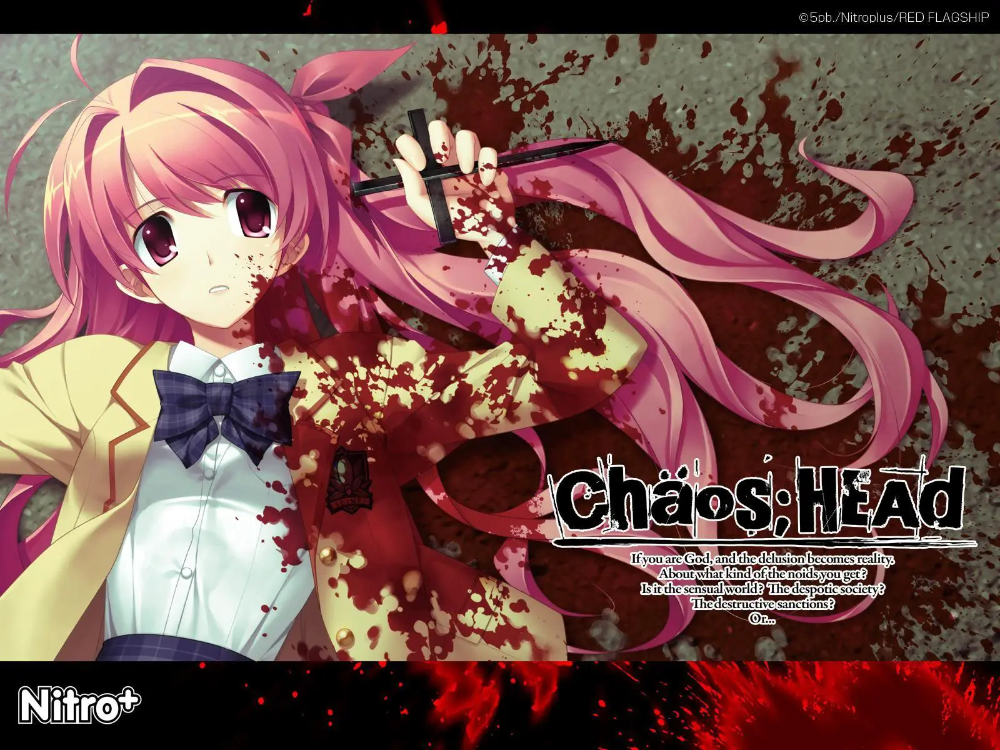
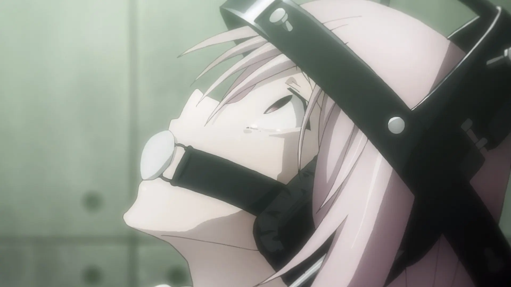
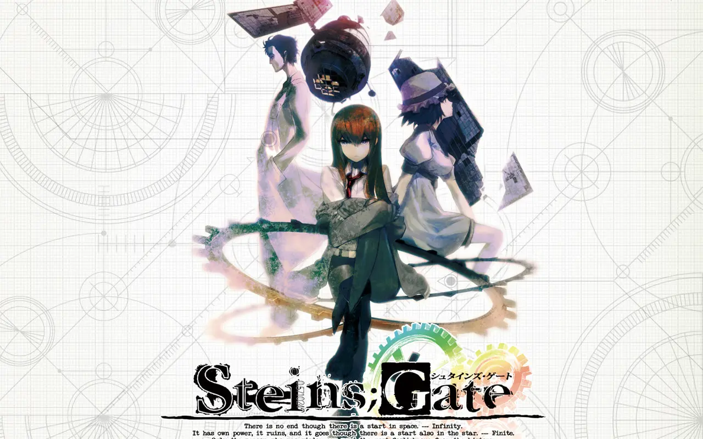
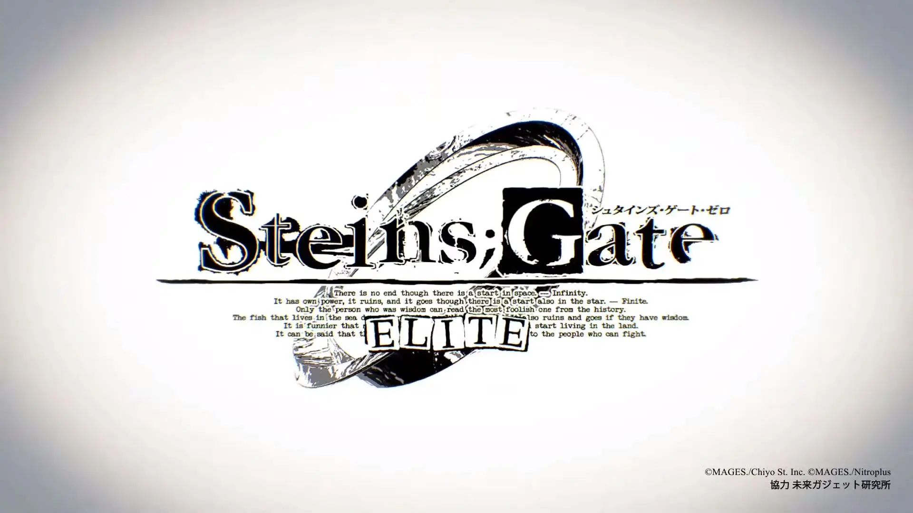
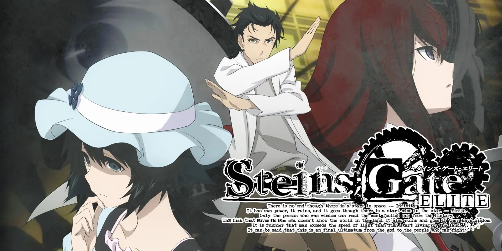
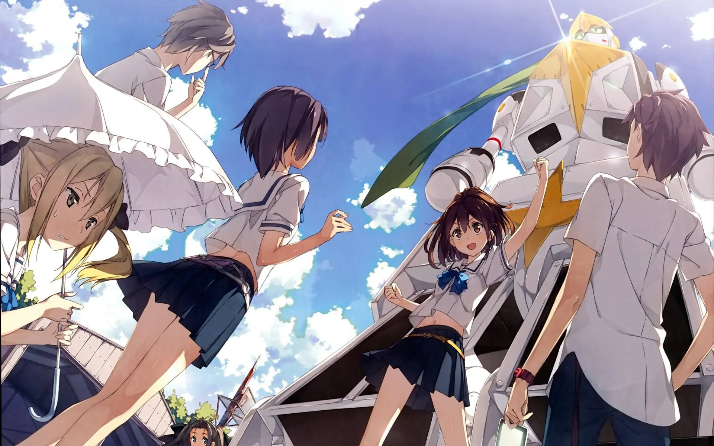
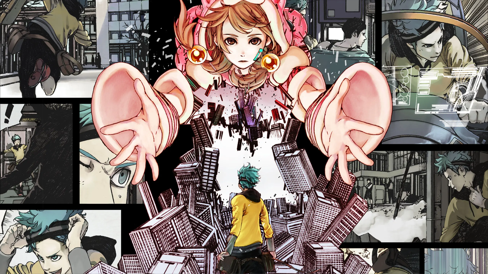

唔…你好啊。
我是站长 MCSeekeri，如果你点进来这篇文章，那么你应该是想要了解科学 ADV 系列作品罢（
那么请坐和放宽，下面我将逐一介绍科学 ADV 系列作品

## 科学 ADV 是什么？

科学 ADV 系列是由 5pb 和 Nitro+ 合作打造的一堆作品的统称，包括《混沌之脑》《命运石之门》《机器人笔记》《混沌之子》《超自然 9 人组》和出了还不如不出的《匿名代码》（

> 5pb 者何人？gal 界全年龄纯爱系代表以至于活不下去的 KID 社传人，主打《MO》是十年连载不衰的“澄空学园”出处所在，代表人物“不老社长”志仓千代丸，游戏剧情走的都是“君子之交淡如水”的路子；
> Nitro+ 者何人？gal 界鬼畜汗臭系翘楚，《沙耶の呗》余音绕梁，新作是“游戏玩人”的《君と彼女と彼女の恋》，核心人物“爱的战士”虚渊玄，出的都是进一步恐怖小说退一步感官拔作的玩意儿。
> 就是这样光明与黑暗、阳光与脚汗的组合。这么两家子合作出的游戏不玩难道还等 key 和 Lilith 合作？
>
> 引用自知乎用户蛏子圣子的[回答](https://www.zhihu.com/question/22290351/answer/28359735)

但实际上科 A 作品中只有命运石之门算是人气高一点点，其他作品基本就无人问津（捂脸
不过科 A 几乎每一部作品都当得起"冷门佳作"的称号，只要对上电波那么这些作品绝对不会让你失望。
如果你懒得看下面的介绍，那就用目录直接跳到下面的"如何入坑"罢（

### 妄想科学 ADV

> [!WARNING]
> **警告**
> 本系列以血腥恐怖猎奇向为主，请心理承受能力较差的玩家慎重考虑。

> [!CAUTION]
> **不要看动画**
> 本系列动画化全部暴死，游戏是唯一正确体验方式

> fun10×int40=Ir2

> 2009 年 9 月起，一系列被称为“新世代的疯狂”的连续杀人事件在涩谷爆发。某一天，在网上聊天的高中二年级学生西条拓巳收到了自称“将军”的人发来的 URL 链接，而点开了链接的他却意外看到疑似预言了下一起连续杀人事件的恐怖图片。此后，神秘的少女们接连出现在了西条拓巳的视线中，围绕涩谷展开的种种阴谋，也开始缓缓浮出水面……
> 拯救这个世界的，只会是英雄吗？

#### Chäos;HEAd

混沌之脑，简称 CH。

系列开山之作，但由于各种原因…不建议游玩此版本。
基本就是个半成品…设定不完整，线路不全，现在这部的资源都不好找了。

> [!NOTE]
> **官方登陆平台**
> PC

#### Chäos;HEAd NoAH

混沌之脑：诺亚，简称 CHN。
是 CH 的补完版本，完善了设定并添加了个人线。出色的奠定了科 A 系列基础，游玩体验一般，结局略显仓促，但确实是一部优秀的作品。
独特的妄想机制很有新意，依靠男主的妄想来决定故事发展，比其他文字冒险游戏的点按钮高端多了（

> [!NOTE]
> **官方登陆平台**
> PC Xbox PSP PS3 PSV iOS Android

#### Chäos;HEAd Love chu☆chu

混沌之脑：恋爱亲亲，简称 CHLCC。
看这不对劲的名字就知道…这是个主打恋爱剧情的官方 FD，为了赚那些只想要恋爱剧情的肥宅的钱（
因为我原本在这里的评价不太客观，修正一下：虽然恋爱剧情是大头但也是个很好的成长故事。
~~其实玩这个可以有效应对被本篇吓到睡不着~~
有贴吧老哥制作的 RenPy 全平台版本。

> [!NOTE]
> **官方登陆平台**
> Xbox PSP PS3 PSV

#### Chäos;Child

混沌之子，简称 CC。

> 六年前的灾难后，舞台重新回到了被复兴重建的涩谷。2015 年 10 月，高中三年级学生宫代拓留注意到了接连发生在涩谷中的诡异事件：神秘死亡的网络主播与离奇死亡的街头歌手。他敏锐地察觉到，这两起事件似乎都与六年前震动涩谷的“某个事件”的日期一致——仿佛“新世代的疯狂”再次袭来。
> 自诩为情报强者的拓留与他的新闻部，开始追逐事件。
> 只有拯救这个世界的，才是英雄吗？

可以说是系列集大成之作，但因为社长放飞自我所以销量暴死（叹
在人物塑造，世界观，剧情反转和悬疑设计方面基本是科 A 天花板。
不过要是指望这部作品拳打 EVER17 脚踢命运石之门是非常不现实的 w
风格较为电波，能接受的认为是神作，不能接受的认为是莫名其妙的作品（摊手
已上架 Steam，有民间汉化 (而且效果非常不错)

> [!NOTE]
> **官方登陆平台**
> PC Xbox PS3 PS4 PSV iOS Android
<iframe src="https://store.steampowered.com/widget/970570/?t=%E5%85%AD%E5%B9%B4%E5%89%8D%E7%9A%84%E7%81%BE%E9%9A%BE%E5%90%8E%EF%BC%8C%E8%88%9E%E5%8F%B0%E9%87%8D%E6%96%B0%E5%9B%9E%E5%88%B0%E4%BA%86%E8%A2%AB%E5%A4%8D%E5%85%B4%E9%87%8D%E5%BB%BA%E7%9A%84%E6%B6%A9%E8%B0%B7%E3%80%822015%20%E5%B9%B4%2010%20%E6%9C%88%EF%BC%8C%E9%AB%98%E4%B8%AD%E4%B8%89%E5%B9%B4%E7%BA%A7%E5%AD%A6%E7%94%9F%E5%AE%AB%E4%BB%A3%E6%8B%93%E7%95%99%E6%B3%A8%E6%84%8F%E5%88%B0%E4%BA%86%E6%8E%A5%E8%BF%9E%E5%8F%91%E7%94%9F%E5%9C%A8%E6%B6%A9%E8%B0%B7%E4%B8%AD%E7%9A%84%E8%AF%A1%E5%BC%82%E4%BA%8B%E4%BB%B6%EF%BC%9A%E7%A5%9E%E7%A7%98%E6%AD%BB%E4%BA%A1%E7%9A%84%E7%BD%91%E7%BB%9C%E4%B8%BB%E6%92%AD%E4%B8%8E%E7%A6%BB%E5%A5%87%E6%AD%BB%E4%BA%A1%E7%9A%84%E8%A1%97%E5%A4%B4%E6%AD%8C%E6%89%8B%E3%80%82%E4%BB%96%E6%95%8F%E9%94%90%E5%9C%B0%E5%AF%9F%E8%A7%89%E5%88%B0%EF%BC%8C%E8%BF%99%E4%B8%A4%E8%B5%B7%E4%BA%8B%E4%BB%B6%E4%BC%BC%E4%B9%8E%E9%83%BD%E4%B8%8E%E5%85%AD%E5%B9%B4%E5%89%8D%E9%9C%87%E5%8A%A8%E6%B6%A9%E8%B0%B7%E7%9A%84%E2%80%9C%E6%9F%90%E4%B8%AA%E4%BA%8B%E4%BB%B6%E2%80%9D%E7%9A%84%E6%97%A5%E6%9C%9F%E4%B8%80%E8%87%B4%E2%80%94%E2%80%94%E4%BB%BF%E4%BD%9B%E2%80%9C%E6%96%B0%E4%B8%96%E4%BB%A3%E7%9A%84%E7%96%AF%E7%8B%82%E2%80%9D%E5%86%8D%E6%AC%A1%E8%A2%AD%E6%9D%A5%E3%80%82%0A%E8%87%AA%E8%AF%A9%E4%B8%BA%E6%83%85%E6%8A%A5%E5%BC%BA%E8%80%85%E7%9A%84%E6%8B%93%E7%95%99%E4%B8%8E%E4%BB%96%E7%9A%84%E6%96%B0%E9%97%BB%E9%83%A8%EF%BC%8C%E5%BC%80%E5%A7%8B%E8%BF%BD%E9%80%90%E4%BA%8B%E4%BB%B6%E3%80%82%0A%E5%8F%AA%E6%9C%89%E6%8B%AF%E6%95%91%E8%BF%99%E4%B8%AA%E4%B8%96%E7%95%8C%E7%9A%84%EF%BC%8C%E6%89%8D%E6%98%AF%E8%8B%B1%E9%9B%84%E5%90%97%EF%BC%9F" frameborder="0" width="646" height="190"></iframe>

#### Chäos;Child Love chu☆chu

混沌之子：恋爱亲亲，简称 CCLCC。
依旧是正统恋爱 FD，但极度不建议游玩。
设定与本篇冲突，看似发糖实则喂屎，志仓的恶意贯穿其中…
为啥要给自己找不痛快呢？

> [!NOTE]
> **官方登陆平台**
> PS4 PSV
总的来说，妄想科学 ADV 是非常「疯狂」的一系列作品，选择了超能力这个略显老套的题材配上猎奇的剧情内核……非常萌新不友好，除非是久经沙场的 Galgame 玩家否则我不推荐去接触。

### 想定科学 ADV

> [!TIP]
> **放心观看**
> 本系列血腥恐怖内容含量极低

> 涩谷崩坏的半年后，舞台来到了 2010 年夏天的秋叶原。中二病大学生冈部伦太郎戏剧性地邂逅了天才科学家少女牧濑红莉栖，他们无意间发现，通过微波炉竟然可以将电子邮件发送回过去，并改变因果。于是以冈部伦太郎为首的未来道具研究所成员们，在好奇心的驱动下开始了深入探究。随着实验不断进行，席卷世界的危机与阴谋也向冈部伦太郎迫近，而他并不知道，这只是他们悲惨命运与无尽抗争的开端……
> 命运石之门，真的存在吗？

#### Steins;Gate

命运石之门，简称 SG，石头门。

已上架 Steam，有官方中文和民间汉化
全科 A 系列最出名的作品，MyAnimeList 排名第 3 的神作，凭借着扎实的设定和精妙的剧情转折斩获无数赞誉。
选择了受众更广的时间穿越题材，并独创世界线收束范围理论 (AF 理论)，给了这部作品巨大的讨论空间。
剧情张弛有……额好罢完全不是，前半部分基本全在慢悠悠的铺垫，[剧透删除] 之后的剧情却迅速推进，结局处~~依靠大部分观众第一次看都一知半解的设定实现~~"欺骗世界"更是让人震撼的头皮发麻…
商业化也极为成功，动画没有像 CH 那样大暴死，而是进一步完善了世界观，拓宽了受众。SG 成功登上神坛。
~~当然就算登神了 SG 还是著名冷门番这是为啥呢~~
另外，志仓为了捞钱又发布了海量的小说漫画广播剧，短片续作设定集。~~让我这种试图做资源整合的人累到头秃~~

> [!WARNING]
> **警告**
> 本作采用手机触发，不是传统 Galgame 的选项触发，很多萌新就因此直奔铃羽线
> [!NOTE]
> **官方登陆平台**
> PC Xbox PSP PS3 PS4 PSV NS iOS Android
<iframe src="https://store.steampowered.com/widget/412830/" frameborder="0" width="646" height="190"></iframe>

#### Steins;Gate:My Darling's Embrace

命运石之门：比翼恋理的爱人，简称比翼。
嗯，官方 FD，恋爱日常。
似乎 SG 太成功让志仓收敛了不少，这部作品纯粹发糖，没有神反转之类。
如果玩 SG0 的时候太胃疼可以靠比翼来缓解一下。
已上架 Steam，有民间汉化。
有贴吧老哥制作的 RenPy 全平台版本。

> [!NOTE]
> **官方登陆平台**
> PC Xbox PSP PS3 PS4 PSV NS
<iframe src="https://store.steampowered.com/widget/970560/" frameborder="0" width="646" height="190"></iframe>

#### Steins;Gate:Linear Bounded Phenogram

命运石之门：线性拘束的树状图，简称树状图。
官方 FD，原创故事，可以看作短篇小合集。
没有像本篇一样使用主角单一视角，而是多人物叙事，完善了本篇略显单薄的人设。
已上架 Steam，有民间汉化。
有贴吧老哥制作的 RenPy 全平台版本。

> [!NOTE]
> **官方登陆平台**
> PC Xbox PS3 PS4 PSV NS

#### Steins;Gate:Variant Space Octet

命运石之门：变移空间的 8Bit，简称 8Bit。
还不错的小外传，全部采用 8Bit 风格，剧情相对独立，与隔壁 CH 有角色上的联动。
总之是部能几个小时通关的休闲作品，值得一玩。

> [!NOTE]
> **官方登陆平台**
> PC

#### Steins;Gate 0

命运石之门 0，简称 SG0。

这可是个好东西……
介绍这部作品必定会剧透本篇，所以我就不介绍了（
就我个人观感而言，0 的质量远超本篇，完善了很多本篇的不足。
已上架 Steam，有官方中文和民间汉化。

> [!NOTE]
> **官方登陆平台**
> PC Xbox PS3 PS4 PSV NS
<iframe src="https://store.steampowered.com/widget/825630/" frameborder="0" width="646" height="190"></iframe>

#### Steins;Gate ELITE

命运石之门：精英，简称精英版。

就是 SG 的冷饭版本，把之前做的动画塞进本篇游戏卖，没啥可说的。
已上架 Steam，有官方中文。

> [!NOTE]
> **官方登陆平台**
> PC Xbox PS4 PSV NS iOS
<iframe src="https://store.steampowered.com/widget/819030/" frameborder="0" width="646" height="190"></iframe>

想定科学 ADV 可以说是整个科 A 系列中最接近传统科幻的作品了，但你要说石头门是软科幻……它建立了极为完善且大部分基于现代物理学的世界线收束理论；你要说石头门是硬科幻……多吃蔬菜生萌妹和 36TiB 压缩成 18Byte 这实在是纯属瞎扯啊……
剧情节奏的设计也不甚合理，不管是 SG 还是 SG0，虽然很多二刷三刷甚至 114514 刷的爱好者对于前半段的悠闲日常津津乐道，但客观来讲前半部分确实太过拖沓，让很多非科幻迷直接弃坑（摊手
但不可否认，石头门后半部分大量剧情爆点和最后的神反转极大拔高了作品层次，出色的人物塑造也能让人更有代入感……罢？
反正石头门是一部人物涵盖常见萌点但出了本子都让人冲不起来的剧情向神作（有端

### 扩张科学 ADV

> 2019 年鹿儿岛县南部，种子岛中央高校的高中三年级学生，热血少女濑乃宫秋穗与她的青梅竹马八汐海翔，正面临着他们所属的社团——机器人部即将被废除的危机。于是为了秋穗“完成巨型机器人”的梦想，二人不得不应对即将来临的废部危机。然而某一天，海翔在他的口袋电脑中无意间发现了一份名为“君岛报告”的 A.R.笔记，更加意外的是，这份报告中居然记录着足以颠覆整个世界的巨大阴谋……
> 青春四溢的阳光，能够穿透遮天蔽日的乌云吗？

#### Robotics;Notes

机器人笔记，简称 RN，萝卜本。

好罢……不是机战的机器人作品……
设定是世界线变动率 1.048596% 的世界线，即 SG 世界线。
与之前所有作品不同，RN 的风格更加主流，属于一般普通高中生拯救世界的故事，轻松愉快的氛围和各种 Otaku 日常事件……
剧情与 SG 相比差了不是一星半点，如果是看完 SG 之后再去看 RN 那么大概率会失望的（
不过 RN 本质上也是一部优秀作品，只是 SG 的光芒太耀眼……
操作上践行了志仓不走寻常路的风格，使用「推噗」触发剧情，说白了和石头门的短信刷好感区别不大……
另外，高达粉建议去看完 0079 再来玩（
顺带一提，本作没有登陆 Steam，没有！
~~不过动画化不错，推荐观看~~

> [!NOTE]
> **官方登陆平台**
> PC Xbox PS3 PS4 PSV NS

#### ROBOTICS;NOTES ELITE

RN 的精英版，没什么可说的。
已上架 Steam。

<iframe src="https://store.steampowered.com/widget/1111380/" frameborder="0" width="646" height="190"></iframe>

#### ROBOTICS;NOTES DaSH

RN 续作，讲述长大了的高中生拯救世界的故事（无端
SG 里的桶子也有登场，毕竟是联动作品嘛。
顺带一提，DaSH 的意思是 Daru·the·Super·Hacker（

> [!NOTE]
> **官方登陆平台**
> PC PS4
<iframe src="https://store.steampowered.com/widget/1111390/" frameborder="0" width="646" height="190"></iframe>

相比前辈，扩张科学 ADV 可以说是最让人看着放心的作品了，不会有惊悚场景和志仓恶意……但也是最惨的系列，被 SG 的光芒掩盖住了，而且小清新的剧情也不怎么能让 SG 的爱好者们满意。
但如果你不是很关心设定啦反转啦，只想开开心心看番，那 RN 出色的剧情水准绝对不会让你失望。

### 超常科学 NVL

#### Occultic;Nine

超自然 9 人组，简称 ON。

> 2016 年，武藏野市。整合了网络上各种超自然现象讨论的博客「轻轻松松破假象」的管理人，高中二年级学生我闻悠太，脑中每天都在盘算该如何靠博客点击量一夜致富。然而某一天，前去拜访桥上教授的悠太却发现教授已经死去。自此，悠太与同样具备某种“特质”的八个人的命运，以奇特的方式渐渐交织在一起。
> 黑魔法、超能力、占卜、异次元世界、催眠术、都市传说这些层出不穷的超自然现象与它们背后的阴谋，似乎隐隐牵扯到了与世界未来相关的危机……
> 这个世界上，真的存在超自然现象吗？

哼啊啊啊啊啊啊啊啊啊啊啊啊啊（怒吼
全科 A 系列除了 SG 我最爱的作品，又是被志仓玩死了……
与其他所有作品不同，这部是先有轻小说后有动画再有游戏。
不得不说，和 SG 贫穷的动画化水平相比，ON 的动画化极为优秀，A-1 社操刀，也没有出现科 A 祖传的慢热毛病……但是动画是真结局之后发布的游戏也是真结局，没啥新内容。
然后动画游戏双双暴死（大悲
游戏至今未发布 PC 版，大约是志仓伤心了吧（
动画和漫画走向的结局不同，所以我个人推荐是都去看，让游戏自生自灭罢（暴怒

> [!NOTE]
> **官方登陆平台**
> Xbox PS4 PSV

#### ANONYMOUS;CODE

匿名代码，简称 AC。

> 2036 年 2 月 6 日，史称「SAD MORNING」的灾难瞬间毁灭了全世界的主要都市，一年后，免受其害的东京都·中野区成为新的舞台。性格直率的三流黑客高冈步论偶然遇见了一位叫作爱咲桃的神秘少女，由于不明原因，她正在被军方追捕。虽然步论试图帮助她逃走，但两人还是很快就被抓获。眼看桃即将被送往梵蒂冈，步论突然发动了「Save & Load」能力……
> ——把神，黑掉吧！

科 A 顶尖作品！志仓生涯极限！SG 联动！独创世界层理论！2036 年的未来世界！黑客们的故事！
好吧，他玩砸了。
大多数开发拖了很久的游戏要么是没做，要么是在重做，还能指望啥呢（
匿码前几章看着挺爽，后面就大翻车，结局也不尽如人意。
但至少看着还挺青春热血的。

> [!NOTE]
> **官方登陆平台**
> PC PS4 NS

## 如何入坑？

简单来讲。

**混沌之脑&混沌之子不是超能力大乱斗**
**命运石之门不是平行世界**
**机器人笔记不是机战作品**
**科 A 不是只有 4 部作品**

好了我们继续。
[科 A 资源站](https://drive.sci-adv.org)
如果你对科 A 一无所知可以先去看 SG 的动画，如果能接受就继续，如果不能……就去看科 A 其他作品（

### 观看顺序问题

这个问题吵了好几年了…这都能吵起来…

我个人的推荐是先去老老实实按顺序看完 SG 本篇动画，然后就随意了（
只要你理解了 SG 基本的世界观设计，那么不同作品的观看顺序完全不重要…得益于世界线收束范围理论，小说基本都是相互独立的，不会出现没看某一本小说导致搞不懂剧情的惨剧发生（擦汗

本站收录的内容大多数都剧透了，所以最好是在完整了解作品之前个人建议不要看本站收录的内容。
资源站也是我搞的项目，欢迎访问…资源可能比你想的要多 w

## 本站特色？

我建立本站的目的……就是为了整合**所有**科 A 相关的小说漫画。
漫画暂且不谈，先讨论小说。
如果我只是简单的把目前所有的科 A 小说放到一起……那有什么意义呢？
已经有人把命运石之门已经汉化的小说做成 epub 电子书了，我如果仅仅只是整理小说……那就只是在重踏覆辙。
我在技术方面可是相当激进的……
所以我会完全无视原文，直接开始批量修改。
毕竟是民间汉化，很多词汇的汉化并不到位…而且 5pb.的官方汉化也没整出「森喜刚」之类的恶心玩意，所以我在这里基本参照官方汉化修订。

统一译名表（暂定）

以下是统一译名表 (无歧义的就不放了)

> 菲莉丝·喵喵
> 真由理
> 真由喜
> 克里斯蒂娜
> 亚雷克斯·雷斯金涅
> 维克托·康多利亚大学
> El·Psy·Kongroo
> Okey-Dokey
> Reading·Steiner

另外，MayQueen 要用 HTML 语法写成`MayQueen·喵2`。

在此向诸位原译者道个歉……我这属于未经授权引用并修改他人作品啊……不过我会好好的写明来源的。

如果还有什么好奇的，那么欢迎访问本站[关于](/about/)页面！
